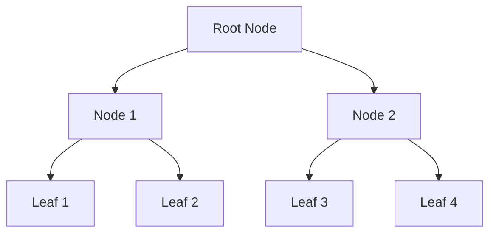
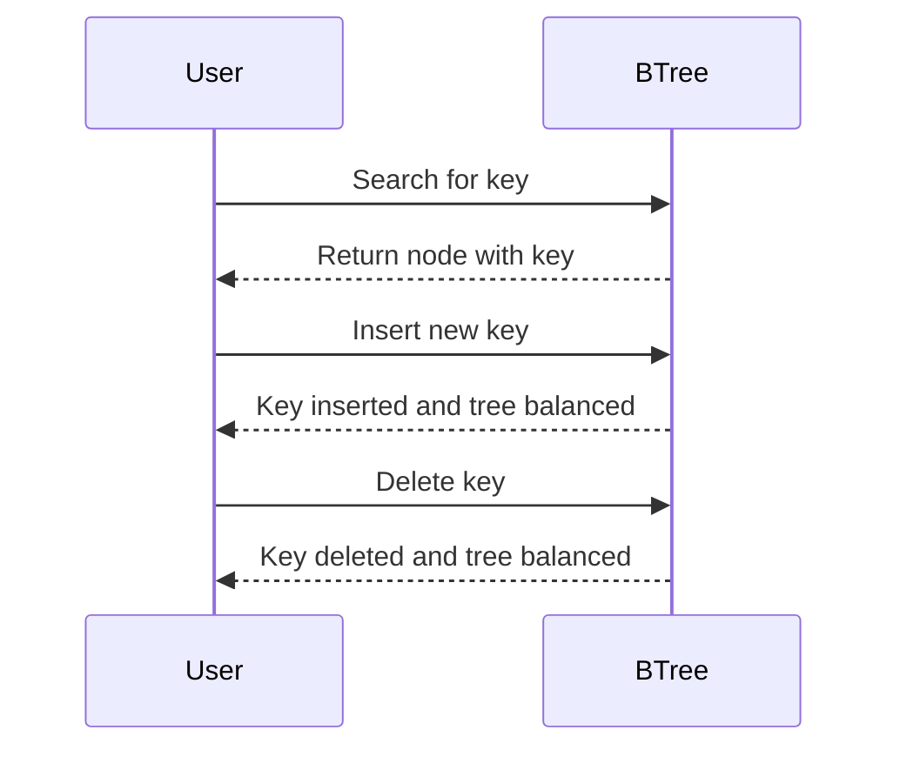

## 7.1.1 B-Tree Indexes

In the realm of SQL and relational databases, B-Tree indexes stand as a cornerstone for efficient data retrieval. As expert software engineers and architects, understanding the structure, functionality, and application of B-Tree indexes is crucial for optimizing database performance. This section delves into the intricacies of B-Tree indexes, providing a comprehensive guide on their implementation and best practices.

### Structure of B-Tree Indexes

B-Tree, short for Balanced Tree, is a self-balancing tree data structure that maintains sorted data and allows searches, sequential access, insertions, and deletions in logarithmic time. The B-Tree structure is particularly suited for databases due to its ability to handle large amounts of data efficiently.

#### Key Characteristics of B-Tree Indexes

- **Balanced Structure**: B-Trees maintain balance by ensuring that all leaf nodes are at the same depth, which guarantees consistent performance for operations.
- **Node Composition**: Each node in a B-Tree contains a number of keys and pointers. The keys act as separators between pointers, directing the search path.
- **Height Efficiency**: The height of a B-Tree is kept low, ensuring that operations such as search, insert, and delete are performed quickly.

#### Visualizing B-Tree Structure

To better understand the B-Tree structure, let's visualize a simple B-Tree with a minimum degree of 2 (also known as a 2-3 tree):



In this diagram, each node can have multiple children, and the tree is balanced, meaning all leaf nodes are at the same level.

### Usage of B-Tree Indexes

B-Tree indexes are the most common type of index used in SQL databases due to their versatility and efficiency. They are particularly effective for:

- **Exact Match Lookups**: Quickly finding a specific row based on a unique key.
- **Range Queries**: Efficiently retrieving a range of values, such as finding all records within a certain date range.
- **Sorted Data Retrieval**: Facilitating ordered data retrieval without additional sorting operations.

### Advantages of B-Tree Indexes

B-Tree indexes offer several advantages that make them the preferred choice for many database applications:

- **Logarithmic Time Complexity**: Operations such as search, insert, and delete are performed in O(log n) time, making them highly efficient even for large datasets.
- **Dynamic Updates**: B-Trees can handle dynamic updates, including insertions and deletions, without significant performance degradation.
- **Space Efficiency**: B-Trees are designed to minimize disk I/O operations, which is crucial for performance in database systems.

### Implementing B-Tree Indexes in SQL

To implement a B-Tree index in SQL, you typically use the `CREATE INDEX` statement. Here's an example of creating a B-Tree index on a table:

```sql
CREATE TABLE employees (
    employee_id INT PRIMARY KEY,
    first_name VARCHAR(50),
    last_name VARCHAR(50),
    hire_date DATE
);

-- Create a B-Tree index on the hire_date column
CREATE INDEX idx_hire_date ON employees(hire_date);
```

In this example, we create a B-Tree index on the `hire_date` column of the `employees` table. This index will optimize queries that filter or sort by the `hire_date`.

### Design Considerations for B-Tree Indexes

When designing B-Tree indexes, consider the following:

- **Column Selection**: Choose columns that are frequently used in WHERE clauses, JOIN conditions, or ORDER BY clauses.
- **Index Maintenance**: Regularly monitor and maintain indexes to ensure they remain efficient. This includes rebuilding or reorganizing indexes as needed.
- **Index Size**: Be mindful of the index size, as large indexes can impact performance. Consider indexing only the necessary columns.

### Differences and Similarities with Other Index Types

B-Tree indexes are often compared with other index types, such as Hash indexes and Bitmap indexes. Here are some key differences:

- **B-Tree vs. Hash Indexes**: B-Tree indexes are suitable for range queries, while Hash indexes are optimized for exact match lookups.
- **B-Tree vs. Bitmap Indexes**: Bitmap indexes are efficient for columns with low cardinality, whereas B-Tree indexes handle high cardinality columns better.

### Try It Yourself

To deepen your understanding of B-Tree indexes, try modifying the example code:

- **Add a new column** to the `employees` table and create a B-Tree index on it.
- **Experiment with queries** that use the index and observe the performance improvements.
- **Drop the index** and compare query performance without it.

### Visualizing B-Tree Operations

Let's visualize the process of searching, inserting, and deleting in a B-Tree:



This sequence diagram illustrates the interaction between a user and a B-Tree during common operations.

### References and Links

For further reading on B-Tree indexes and their implementation, consider the following resources:

- [B-Tree Indexes on Wikipedia](https://en.wikipedia.org/wiki/B-tree)
- [SQL Indexing Tutorial on W3Schools](https://www.w3schools.com/sql/sql_create_index.asp)
- [Database Indexing Best Practices on MDN Web Docs](https://developer.mozilla.org/en-US/docs/Web/SQL/Indexing)

### Knowledge Check

To reinforce your understanding, consider these questions:

- What are the key characteristics of a B-Tree index?
- How does a B-Tree index improve query performance?
- What are the differences between B-Tree and Hash indexes?

### Embrace the Journey

Remember, mastering B-Tree indexes is just one step in optimizing SQL database performance. As you continue to explore and experiment, you'll uncover more advanced techniques and strategies. Stay curious, keep learning, and enjoy the journey!

## Quiz Time!



### What is a key characteristic of B-Tree indexes?

- [x] Balanced structure
- [ ] Unbalanced structure
- [ ] Only supports exact match lookups
- [ ] Inefficient for range queries

> **Explanation:** B-Tree indexes maintain a balanced structure, ensuring consistent performance for operations.

### Which operation is NOT efficiently supported by B-Tree indexes?

- [ ] Exact match lookups
- [ ] Range queries
- [x] Full-text search
- [ ] Sorted data retrieval

> **Explanation:** B-Tree indexes are not optimized for full-text search; they are efficient for exact match lookups, range queries, and sorted data retrieval.

### How do B-Tree indexes handle dynamic updates?

- [x] Efficiently with minimal performance degradation
- [ ] Inefficiently, causing significant performance degradation
- [ ] Only support insertions, not deletions
- [ ] Require manual rebalancing

> **Explanation:** B-Tree indexes efficiently handle dynamic updates, including insertions and deletions, without significant performance degradation.

### What is the time complexity of search operations in a B-Tree?

- [x] O(log n)
- [ ] O(n)
- [ ] O(1)
- [ ] O(n^2)

> **Explanation:** The time complexity of search operations in a B-Tree is O(log n), making them efficient for large datasets.

### Which SQL statement is used to create a B-Tree index?

- [x] CREATE INDEX
- [ ] CREATE TABLE
- [ ] ALTER INDEX
- [ ] DROP INDEX

> **Explanation:** The `CREATE INDEX` statement is used to create a B-Tree index in SQL.

### What is a common use case for B-Tree indexes?

- [x] Range queries
- [ ] Full-text search
- [ ] Storing binary data
- [ ] Managing user sessions

> **Explanation:** B-Tree indexes are commonly used for range queries, allowing efficient retrieval of a range of values.

### How do B-Tree indexes compare to Hash indexes?

- [x] B-Tree indexes are suitable for range queries, while Hash indexes are optimized for exact match lookups.
- [ ] B-Tree indexes are optimized for exact match lookups, while Hash indexes are suitable for range queries.
- [ ] Both are equally efficient for all types of queries.
- [ ] B-Tree indexes are less efficient than Hash indexes for all operations.

> **Explanation:** B-Tree indexes are suitable for range queries, while Hash indexes are optimized for exact match lookups.

### What is a potential disadvantage of large B-Tree indexes?

- [x] Impact on performance due to size
- [ ] Inability to handle dynamic updates
- [ ] Lack of support for exact match lookups
- [ ] Requirement for manual rebalancing

> **Explanation:** Large B-Tree indexes can impact performance due to their size, so it's important to index only necessary columns.

### Which diagram best represents the structure of a B-Tree?

- [x] A balanced tree with nodes and leaf nodes
- [ ] A linear list of nodes
- [ ] A circular linked list
- [ ] A single node with multiple pointers

> **Explanation:** A B-Tree is represented as a balanced tree with nodes and leaf nodes, ensuring efficient data retrieval.

### True or False: B-Tree indexes are the most common type of index used in SQL databases.

- [x] True
- [ ] False

> **Explanation:** True. B-Tree indexes are the most common type of index used in SQL databases due to their versatility and efficiency.


