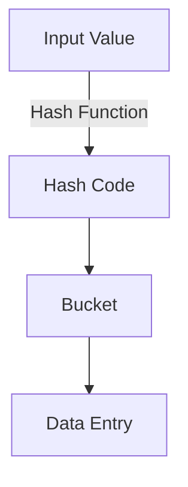

## 7.1.2 Hash Indexes

In the realm of SQL and database management, indexing is a crucial technique for optimizing query performance. Among the various types of indexes, hash indexes stand out for their efficiency in handling specific types of queries. In this section, we will delve into the structure, usage, and limitations of hash indexes, providing expert insights and practical examples to enhance your understanding and application of this powerful indexing strategy.

### Introduction to Hash Indexes

Hash indexes are a type of database index that use a hash table to map keys to their corresponding values. This structure is particularly effective for exact match queries, where the goal is to retrieve a specific record based on a unique key. Unlike other index types, such as B-tree indexes, hash indexes do not maintain any order among the keys, making them unsuitable for range queries.

#### Key Concepts

- **Hash Table**: A data structure that implements an associative array, a structure that can map keys to values. Hash tables use a hash function to compute an index into an array of buckets or slots, from which the desired value can be found.
- **Exact Match Queries**: Queries that search for a specific value, such as `SELECT * FROM table WHERE id = 123`.
- **Range Queries**: Queries that search for a range of values, such as `SELECT * FROM table WHERE id BETWEEN 100 AND 200`.

### Structure of Hash Indexes

Hash indexes are built on the concept of hash tables. When a hash index is created, a hash function is used to convert the indexed column's values into a hash code. This hash code determines the position of the data in the hash table. The hash table consists of an array of buckets, each of which can hold one or more entries.

#### How Hash Indexes Work

1. **Hash Function**: The hash function takes an input (the indexed column value) and returns a fixed-size string of bytes. The output is typically a hash code that determines the bucket where the data will be stored.
2. **Buckets**: Each bucket in the hash table can store one or more entries. If multiple entries hash to the same bucket, a collision occurs, and a collision resolution strategy is employed.
3. **Collision Resolution**: Common strategies include chaining (storing multiple entries in a linked list within the same bucket) and open addressing (finding another open bucket).

```sql
-- Example of creating a hash index in PostgreSQL
CREATE INDEX hash_index_example ON my_table USING HASH (column_name);
```

### Usage of Hash Indexes

Hash indexes are particularly useful for scenarios where exact match queries are frequent. They provide constant time complexity, O(1), for lookups, making them extremely fast for retrieving specific records.

#### When to Use Hash Indexes

- **Exact Match Queries**: Ideal for queries that require retrieving records based on a specific key.
- **High-Volume Read Operations**: Suitable for applications with a high volume of read operations where exact matches are common.
- **Equality Comparisons**: Effective for columns that are frequently used in equality comparisons.

### Limitations of Hash Indexes

While hash indexes offer significant performance benefits for certain types of queries, they also come with limitations that must be considered.

#### Limitations

- **Not Suitable for Range Queries**: Hash indexes do not maintain any order among the keys, making them unsuitable for range queries or queries that require sorting.
- **Collision Handling Overhead**: Collisions can lead to performance degradation if not handled efficiently.
- **Limited Support**: Not all database systems support hash indexes, and their implementation can vary.

### Design Considerations

When implementing hash indexes, it is important to consider the specific requirements of your application and the characteristics of your data.

#### Best Practices

- **Choose the Right Columns**: Use hash indexes for columns that are frequently queried with exact match conditions.
- **Monitor Performance**: Regularly monitor the performance of hash indexes and adjust as necessary to ensure optimal performance.
- **Understand Database Support**: Be aware of the hash index support and limitations of your specific database system.

### Differences and Similarities with Other Index Types

Hash indexes are often compared with B-tree indexes, another common type of index in SQL databases. Understanding the differences and similarities can help you choose the right index type for your needs.

#### Differences

- **Structure**: Hash indexes use a hash table, while B-tree indexes use a balanced tree structure.
- **Query Types**: Hash indexes are optimized for exact match queries, whereas B-tree indexes support both exact match and range queries.
- **Order Maintenance**: B-tree indexes maintain order among keys, while hash indexes do not.

#### Similarities

- **Purpose**: Both hash and B-tree indexes are designed to improve query performance by reducing the amount of data that needs to be scanned.
- **Implementation**: Both types of indexes can be implemented on one or more columns of a table.

### Code Examples

Let's explore some practical examples to illustrate the use of hash indexes in SQL.

#### Creating a Hash Index

```sql
-- Create a hash index on the 'email' column of the 'users' table
CREATE INDEX email_hash_idx ON users USING HASH (email);
```

#### Querying with a Hash Index

```sql
-- Query to find a user by email using the hash index
SELECT * FROM users WHERE email = 'example@example.com';
```

### Visualizing Hash Indexes

To better understand how hash indexes work, let's visualize the process using a Mermaid.js diagram.



**Diagram Description**: This diagram illustrates the process of using a hash function to convert an input value into a hash code, which determines the bucket where the data entry is stored.

### Try It Yourself

Experiment with hash indexes by creating your own examples. Try modifying the hash function or the collision resolution strategy to see how it affects performance.

### References and Links

- [PostgreSQL Documentation on Hash Indexes](https://www.postgresql.org/docs/current/indexes-types.html)
- [MySQL Hash Indexes](https://dev.mysql.com/doc/refman/8.0/en/index-btree-hash.html)
- [SQL Server Index Types](https://docs.microsoft.com/en-us/sql/relational-databases/sql-server-index-design-guide)

### Knowledge Check

- What are hash indexes best suited for?
- Why are hash indexes not suitable for range queries?
- How do hash indexes handle collisions?

### Embrace the Journey

Remember, mastering hash indexes is just one step in optimizing SQL performance. As you continue to explore and experiment, you'll uncover more strategies to enhance your database systems. Keep learning, stay curious, and enjoy the journey!

### Quiz Time!



### What is the primary use case for hash indexes?

- [x] Exact match queries
- [ ] Range queries
- [ ] Sorting data
- [ ] Full-text search

> **Explanation:** Hash indexes are optimized for exact match queries due to their use of hash tables.

### Which of the following is a limitation of hash indexes?

- [x] Not suitable for range queries
- [ ] High memory usage
- [ ] Slow for exact matches
- [ ] Requires sorting

> **Explanation:** Hash indexes do not maintain order among keys, making them unsuitable for range queries.

### How do hash indexes handle collisions?

- [x] Using collision resolution strategies
- [ ] By ignoring duplicates
- [ ] By sorting entries
- [ ] By creating new tables

> **Explanation:** Hash indexes use collision resolution strategies like chaining or open addressing to handle collisions.

### What is a common collision resolution strategy in hash indexes?

- [x] Chaining
- [ ] Sorting
- [ ] Partitioning
- [ ] Indexing

> **Explanation:** Chaining is a common strategy where multiple entries are stored in a linked list within the same bucket.

### Can hash indexes be used for sorting data?

- [ ] Yes
- [x] No

> **Explanation:** Hash indexes do not maintain any order among keys, so they cannot be used for sorting data.

### What is the time complexity for lookups in hash indexes?

- [x] O(1)
- [ ] O(n)
- [ ] O(log n)
- [ ] O(n^2)

> **Explanation:** Hash indexes provide constant time complexity, O(1), for lookups.

### Which SQL command is used to create a hash index in PostgreSQL?

- [x] CREATE INDEX ... USING HASH
- [ ] CREATE HASH INDEX
- [ ] CREATE INDEX ... USING BTREE
- [ ] CREATE HASH TABLE

> **Explanation:** In PostgreSQL, the command `CREATE INDEX ... USING HASH` is used to create a hash index.

### Are hash indexes supported by all database systems?

- [ ] Yes
- [x] No

> **Explanation:** Not all database systems support hash indexes, and their implementation can vary.

### What is the primary structure used in hash indexes?

- [x] Hash table
- [ ] B-tree
- [ ] Linked list
- [ ] Array

> **Explanation:** Hash indexes are based on hash tables, which map keys to values using a hash function.

### True or False: Hash indexes are suitable for high-volume read operations with exact matches.

- [x] True
- [ ] False

> **Explanation:** Hash indexes are ideal for high-volume read operations where exact matches are common due to their efficient lookup performance.




