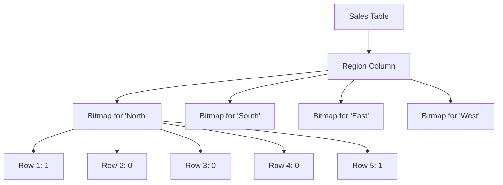

## 7.1.3 Bitmap Indexes

Bitmap indexes are a powerful tool in the arsenal of SQL database optimization techniques, particularly when dealing with large datasets and columns with a limited number of distinct values. In this section, we will delve into the structure, usage, and advantages of bitmap indexes, providing you with the knowledge to leverage them effectively in your database solutions.

### Understanding Bitmap Indexes

#### Structure

Bitmap indexes use bit arrays (bitmaps) to represent the presence or absence of a value in a column. Each distinct value in the column is associated with a bitmap, where each bit in the bitmap corresponds to a row in the table. A bit is set to `1` if the row contains the value, and `0` otherwise. This structure allows for efficient storage and rapid query processing, especially in scenarios involving complex logical operations.

#### Usage

Bitmap indexes are particularly well-suited for columns with a limited number of distinct values, such as gender, status flags, or categorical data. They are often used in data warehousing and decision support systems where read-heavy operations and complex queries are common. The efficiency of bitmap indexes stems from their ability to perform bitwise operations, which are computationally inexpensive and can be executed quickly by the database engine.

#### Advantages

- **Efficient Storage**: Bitmap indexes consume less space compared to traditional B-tree indexes, especially when the indexed column has low cardinality.
- **Fast Querying**: Bitmap indexes enable rapid execution of queries involving AND, OR, and NOT operations, as these can be translated into fast bitwise operations.
- **Scalability**: They are highly scalable and can handle large datasets effectively, making them ideal for data warehousing environments.

### Key Participants

In the context of bitmap indexes, the key participants include:

- **Database Engine**: Responsible for managing the creation, maintenance, and querying of bitmap indexes.
- **Column with Low Cardinality**: The target column for which the bitmap index is created.
- **Query Optimizer**: Utilizes bitmap indexes to enhance query performance by selecting the most efficient execution plan.

### Applicability

Bitmap indexes are applicable in scenarios where:

- The column to be indexed has a low cardinality.
- The database is read-intensive, with complex queries involving multiple conditions.
- The environment is a data warehouse or decision support system where query performance is critical.

### Sample Code Snippet

Let's explore a practical example of creating and using a bitmap index in SQL. Consider a table `sales` with a column `region` that has a limited number of distinct values.

```sql
-- Create a table with sample data
CREATE TABLE sales (
    sale_id INT PRIMARY KEY,
    region VARCHAR(20),
    amount DECIMAL(10, 2)
);

-- Insert sample data
INSERT INTO sales (sale_id, region, amount) VALUES
(1, 'North', 100.00),
(2, 'South', 150.00),
(3, 'East', 200.00),
(4, 'West', 250.00),
(5, 'North', 300.00);

-- Create a bitmap index on the 'region' column
CREATE BITMAP INDEX idx_region ON sales(region);

-- Query using the bitmap index
SELECT region, SUM(amount) AS total_sales
FROM sales
WHERE region IN ('North', 'South')
GROUP BY region;
```

In this example, the bitmap index `idx_region` is created on the `region` column. The query then leverages this index to efficiently calculate the total sales for the specified regions.

### Design Considerations

When considering the use of bitmap indexes, keep the following in mind:

- **Low Cardinality**: Ensure that the column has a limited number of distinct values to maximize the benefits of bitmap indexing.
- **Read-Heavy Workloads**: Bitmap indexes are most effective in environments where read operations dominate.
- **Update Overhead**: Be aware that bitmap indexes can incur overhead during insert, update, and delete operations, as the bitmaps need to be maintained.

### Differences and Similarities

Bitmap indexes are often compared to B-tree indexes. While both serve the purpose of indexing, they differ in their structure and use cases:

- **Bitmap Indexes**: Best for low cardinality columns and read-heavy workloads. They excel in performing bitwise operations for complex queries.
- **B-tree Indexes**: Suitable for high cardinality columns and transactional systems. They provide balanced performance for both read and write operations.

### Visualizing Bitmap Indexes

To better understand how bitmap indexes work, let's visualize the concept using a diagram.



In this diagram, each distinct value in the `region` column is represented by a bitmap. For instance, the bitmap for 'North' indicates that rows 1 and 5 contain this value.

### Try It Yourself

Experiment with the sample code by modifying the `region` values and observing how the bitmap index affects query performance. Try adding more regions or increasing the dataset size to see how bitmap indexes scale with larger data.

### References and Links

For further reading on bitmap indexes and their applications, consider the following resources:

- [Oracle Database Concepts: Bitmap Indexes](https://docs.oracle.com/en/database/oracle/oracle-database/19/cncpt/indexes-and-index-organized-tables.html#GUID-3A9C1B3B-6B6A-4D3B-9E9C-5B3E5F5A3F9C)
- [PostgreSQL Documentation: Index Types](https://www.postgresql.org/docs/current/indexes-types.html)
- [SQL Server Index Design Guide](https://docs.microsoft.com/en-us/sql/relational-databases/sql-server-index-design-guide)

### Knowledge Check

To reinforce your understanding of bitmap indexes, consider the following questions:

- What are the primary advantages of using bitmap indexes?
- In what scenarios are bitmap indexes most effective?
- How do bitmap indexes differ from B-tree indexes?

### Embrace the Journey

Remember, mastering bitmap indexes is just one step in optimizing your SQL database performance. As you continue to explore and experiment with different indexing strategies, you'll gain deeper insights into how to build efficient and scalable database solutions. Keep experimenting, stay curious, and enjoy the journey!

## Quiz Time!



### What is a primary advantage of bitmap indexes?

- [x] Efficient storage for low cardinality columns
- [ ] Suitable for high cardinality columns
- [ ] Ideal for write-heavy workloads
- [ ] Complex maintenance requirements

> **Explanation:** Bitmap indexes are efficient for columns with low cardinality due to their compact storage and fast query execution.

### In which scenario are bitmap indexes most effective?

- [x] Read-heavy environments with complex queries
- [ ] Write-heavy transactional systems
- [ ] Columns with high cardinality
- [ ] Small datasets with frequent updates

> **Explanation:** Bitmap indexes excel in read-heavy environments where complex queries are common, particularly with low cardinality columns.

### How do bitmap indexes differ from B-tree indexes?

- [x] Bitmap indexes use bit arrays; B-tree indexes use balanced trees
- [ ] Bitmap indexes are suitable for high cardinality columns
- [ ] B-tree indexes are ideal for read-heavy workloads
- [ ] Bitmap indexes are faster for write operations

> **Explanation:** Bitmap indexes use bit arrays for low cardinality columns, while B-tree indexes use balanced trees for a broader range of cardinalities.

### What is a potential drawback of bitmap indexes?

- [x] Update overhead due to bitmap maintenance
- [ ] Inefficient for read-heavy workloads
- [ ] High storage requirements for low cardinality columns
- [ ] Limited applicability in data warehousing

> **Explanation:** Bitmap indexes can incur overhead during updates due to the need to maintain bitmaps.

### Which operation is optimized by bitmap indexes?

- [x] Bitwise operations like AND, OR, NOT
- [ ] Arithmetic operations like addition and subtraction
- [ ] String concatenation
- [ ] Sorting large datasets

> **Explanation:** Bitmap indexes are optimized for bitwise operations, making them ideal for complex logical queries.

### What type of data is best suited for bitmap indexing?

- [x] Categorical data with few distinct values
- [ ] Continuous numerical data
- [ ] High cardinality text data
- [ ] Binary large objects (BLOBs)

> **Explanation:** Bitmap indexes are best suited for categorical data with a limited number of distinct values.

### Which database environment benefits most from bitmap indexes?

- [x] Data warehousing and decision support systems
- [ ] Real-time transactional systems
- [ ] Small-scale personal databases
- [ ] High-frequency trading platforms

> **Explanation:** Data warehousing and decision support systems benefit from bitmap indexes due to their read-heavy nature and complex queries.

### What is the role of the query optimizer with bitmap indexes?

- [x] Selects efficient execution plans using bitmap indexes
- [ ] Creates bitmap indexes automatically
- [ ] Converts bitmap indexes to B-tree indexes
- [ ] Disables bitmap indexes during query execution

> **Explanation:** The query optimizer uses bitmap indexes to select the most efficient execution plans for queries.

### True or False: Bitmap indexes are ideal for columns with high cardinality.

- [ ] True
- [x] False

> **Explanation:** Bitmap indexes are not ideal for high cardinality columns; they are best suited for low cardinality columns.

### What is a common use case for bitmap indexes?

- [x] Optimizing queries with multiple conditions on low cardinality columns
- [ ] Storing large binary objects
- [ ] Indexing high cardinality text fields
- [ ] Enhancing write performance in transactional systems

> **Explanation:** Bitmap indexes are commonly used to optimize queries with multiple conditions on low cardinality columns.


