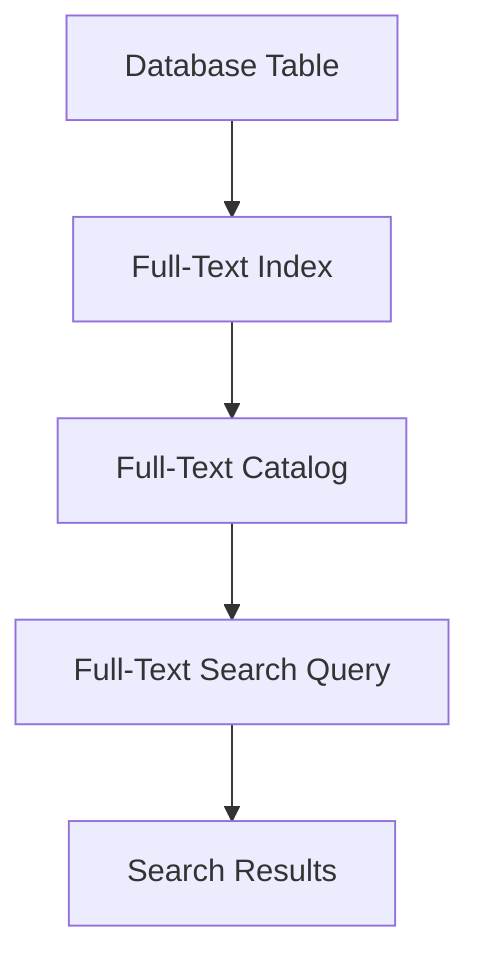

## 7.1.4 Full-Text Indexes

In the realm of SQL databases, efficiently searching through large volumes of text data is a common challenge. Full-Text Indexes are a powerful tool designed to optimize text search operations, enabling complex queries that go beyond simple pattern matching. This section delves into the purpose, features, implementation, and best practices of Full-Text Indexes, providing expert insights for software engineers and architects.

### Purpose of Full-Text Indexes

Full-Text Indexes are specialized database indexes that facilitate fast and efficient text searching. Unlike traditional indexes, which are optimized for exact matches, Full-Text Indexes support complex search queries, including:

- **Stemming**: Identifying the root form of words to match variations (e.g., "running" and "run").
- **Proximity Searches**: Finding words that are near each other within a specified distance.
- **Boolean Searches**: Using logical operators like AND, OR, and NOT to refine search results.
- **Phrase Searches**: Matching exact sequences of words.

These capabilities make Full-Text Indexes indispensable for applications that require robust text search functionality, such as content management systems, e-commerce platforms, and knowledge bases.

### Key Features of Full-Text Indexes

1. **Stemming and Lemmatization**: Full-Text Indexes can reduce words to their base or root form, allowing for more flexible search queries. This feature is crucial for languages with rich morphological variations.

2. **Stopwords and Noise Words**: These indexes can ignore common words (e.g., "the", "is") that do not significantly impact search relevance, improving performance and accuracy.

3. **Language Support**: Full-Text Indexes often support multiple languages, accommodating linguistic nuances and variations.

4. **Ranking and Relevance**: Search results can be ranked based on relevance, using algorithms that consider factors like term frequency and document length.

5. **Proximity and Phrase Searching**: These indexes allow for searching phrases or words within a certain proximity, enhancing the precision of search results.

### Implementing Full-Text Indexes

Implementing Full-Text Indexes involves several steps, including creating the index, configuring search options, and executing queries. Let's explore these steps in detail.

#### Creating a Full-Text Index

To create a Full-Text Index, you must first ensure that your database supports this feature. Most modern SQL databases, such as Microsoft SQL Server, PostgreSQL, and MySQL, offer Full-Text Indexing capabilities.

Here's a basic example of creating a Full-Text Index in SQL Server:

```sql
-- Step 1: Create a Full-Text Catalog
CREATE FULLTEXT CATALOG MyFullTextCatalog AS DEFAULT;

-- Step 2: Create a Full-Text Index on a Table
CREATE FULLTEXT INDEX ON Articles
(
    Content LANGUAGE 1033
)
KEY INDEX PK_Articles ON MyFullTextCatalog;
```

**Explanation**:
- **Full-Text Catalog**: A logical container for Full-Text Indexes.
- **Language**: Specifies the language for word breaking and stemming.
- **Key Index**: A unique index on the table, required for Full-Text Indexing.

#### Configuring Search Options

Once the index is created, you can configure various search options to tailor the search behavior to your application's needs. This includes setting stopwords, defining thesaurus files, and adjusting proximity settings.

#### Executing Full-Text Search Queries

With the Full-Text Index in place, you can execute complex search queries using SQL's Full-Text Search functions. Here's an example of a Full-Text Search query in SQL Server:

```sql
-- Search for articles containing the word "database"
SELECT Title, Content
FROM Articles
WHERE CONTAINS(Content, 'database');

-- Search for articles containing the phrase "database optimization"
SELECT Title, Content
FROM Articles
WHERE CONTAINS(Content, '"database optimization"');

-- Search for articles with words near each other
SELECT Title, Content
FROM Articles
WHERE CONTAINS(Content, 'NEAR((database, optimization), 5)');
```

**Explanation**:
- **CONTAINS**: A function used to perform Full-Text Searches.
- **NEAR**: A keyword used to specify proximity between words.

### Design Considerations

When implementing Full-Text Indexes, consider the following design aspects:

- **Storage Requirements**: Full-Text Indexes can consume significant storage space. Plan your storage capacity accordingly.
- **Index Maintenance**: Regularly update and rebuild indexes to ensure optimal performance, especially after large data modifications.
- **Performance Impact**: While Full-Text Indexes improve search performance, they can impact write operations. Balance indexing needs with application performance requirements.

### Differences and Similarities with Other Index Types

Full-Text Indexes differ from traditional indexes in their ability to handle complex text queries. Unlike B-Tree or Hash Indexes, which are optimized for exact matches, Full-Text Indexes excel in searching unstructured text data. However, they share similarities in terms of maintenance and performance considerations.

### Sample Code Snippet

Let's explore a more comprehensive example that demonstrates creating and using Full-Text Indexes in a practical scenario.

```sql
-- Create a table to store articles
CREATE TABLE Articles (
    ArticleID INT PRIMARY KEY,
    Title NVARCHAR(255),
    Content NVARCHAR(MAX)
);

-- Insert sample data
INSERT INTO Articles (ArticleID, Title, Content)
VALUES
(1, 'Introduction to SQL', 'SQL is a standard language for accessing databases.'),
(2, 'Advanced SQL Techniques', 'Learn about Full-Text Indexes and query optimization.'),
(3, 'Database Design Patterns', 'Explore various design patterns for efficient database management.');

-- Create a Full-Text Catalog
CREATE FULLTEXT CATALOG ArticleCatalog AS DEFAULT;

-- Create a Full-Text Index on the Content column
CREATE FULLTEXT INDEX ON Articles
(
    Content LANGUAGE 1033
)
KEY INDEX PK_Articles ON ArticleCatalog;

-- Perform a Full-Text Search for the word "SQL"
SELECT Title, Content
FROM Articles
WHERE CONTAINS(Content, 'SQL');
```

### Visualizing Full-Text Index Architecture

To better understand the architecture of Full-Text Indexes, let's visualize the components involved in a Full-Text Search operation.



**Description**: This diagram illustrates the flow of a Full-Text Search operation, starting from the database table, through the Full-Text Index and Catalog, to the execution of a search query and retrieval of results.

### Best Practices for Full-Text Indexes

1. **Optimize Indexing Strategy**: Carefully select columns for Full-Text Indexing based on search requirements and data characteristics.
2. **Regular Maintenance**: Schedule regular index updates and rebuilds to maintain performance and accuracy.
3. **Monitor Performance**: Use database performance monitoring tools to track the impact of Full-Text Indexes on query execution times.
4. **Leverage Language Features**: Utilize language-specific features, such as stopwords and thesaurus files, to enhance search relevance.

### Try It Yourself

Experiment with Full-Text Indexes by modifying the sample code to include additional search queries. Try searching for synonyms, using different proximity settings, or incorporating Boolean operators to refine search results.

### References and Links

- [Microsoft SQL Server Full-Text Search](https://docs.microsoft.com/en-us/sql/relational-databases/search/full-text-search)
- [PostgreSQL Full-Text Search](https://www.postgresql.org/docs/current/textsearch.html)
- [MySQL Full-Text Search](https://dev.mysql.com/doc/refman/8.0/en/fulltext-search.html)

### Knowledge Check

- What are the key features of Full-Text Indexes?
- How do Full-Text Indexes differ from traditional indexes?
- What are some best practices for implementing Full-Text Indexes?

### Embrace the Journey

Remember, mastering Full-Text Indexes is a journey. As you explore and experiment with these powerful tools, you'll unlock new possibilities for optimizing text search operations in your SQL databases. Stay curious, keep learning, and enjoy the process!

## Quiz Time!



### What is the primary purpose of Full-Text Indexes?

- [x] Optimizing text search operations
- [ ] Improving numerical data retrieval
- [ ] Enhancing data encryption
- [ ] Managing database transactions

> **Explanation:** Full-Text Indexes are designed to optimize text search operations, allowing for complex queries like stemming and proximity searches.

### Which feature allows Full-Text Indexes to match variations of words?

- [x] Stemming
- [ ] Proximity
- [ ] Boolean logic
- [ ] Phrase searching

> **Explanation:** Stemming reduces words to their base form, enabling Full-Text Indexes to match variations of words.

### What is a Full-Text Catalog?

- [x] A logical container for Full-Text Indexes
- [ ] A type of database table
- [ ] A query optimization tool
- [ ] A data encryption method

> **Explanation:** A Full-Text Catalog is a logical container that holds Full-Text Indexes in a database.

### Which SQL function is used to perform Full-Text Searches?

- [x] CONTAINS
- [ ] SELECT
- [ ] INSERT
- [ ] UPDATE

> **Explanation:** The CONTAINS function is used to perform Full-Text Searches in SQL.

### What is a key consideration when implementing Full-Text Indexes?

- [x] Storage requirements
- [ ] Data encryption
- [ ] User authentication
- [ ] Network latency

> **Explanation:** Full-Text Indexes can consume significant storage space, making storage requirements a key consideration.

### How can Full-Text Indexes impact database performance?

- [x] They improve search performance but can affect write operations.
- [ ] They enhance data encryption.
- [ ] They reduce network latency.
- [ ] They increase user authentication speed.

> **Explanation:** While Full-Text Indexes improve search performance, they can impact write operations due to the additional indexing overhead.

### Which SQL keyword is used for proximity searches in Full-Text Indexes?

- [x] NEAR
- [ ] LIKE
- [ ] BETWEEN
- [ ] IN

> **Explanation:** The NEAR keyword is used in Full-Text Indexes to specify proximity between words in a search query.

### What is the benefit of using stopwords in Full-Text Indexes?

- [x] They improve search relevance by ignoring common words.
- [ ] They enhance data encryption.
- [ ] They increase query execution time.
- [ ] They reduce storage requirements.

> **Explanation:** Stopwords improve search relevance by ignoring common words that do not significantly impact search results.

### Which of the following is a best practice for Full-Text Indexes?

- [x] Regularly update and rebuild indexes
- [ ] Use Full-Text Indexes for numerical data
- [ ] Avoid using language-specific features
- [ ] Ignore performance monitoring

> **Explanation:** Regularly updating and rebuilding Full-Text Indexes is a best practice to maintain performance and accuracy.

### True or False: Full-Text Indexes are suitable for exact match queries.

- [ ] True
- [x] False

> **Explanation:** Full-Text Indexes are optimized for complex text queries, not exact match queries, which are better suited for traditional indexes.




