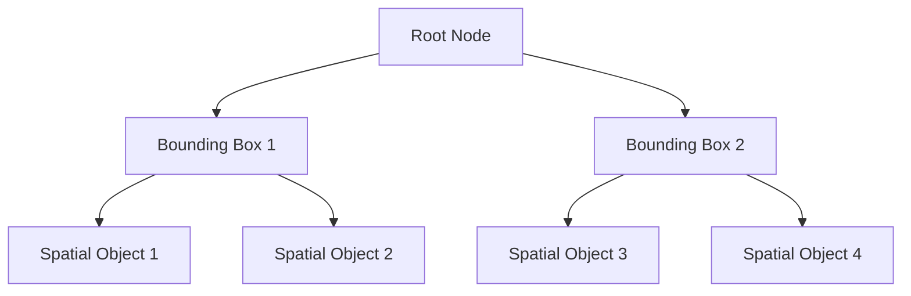
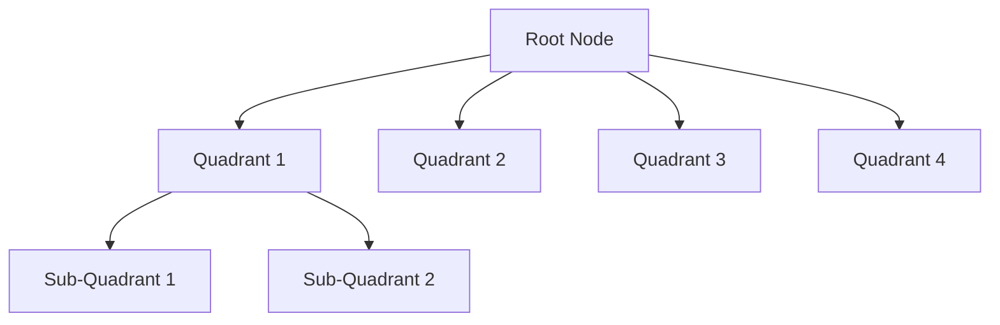
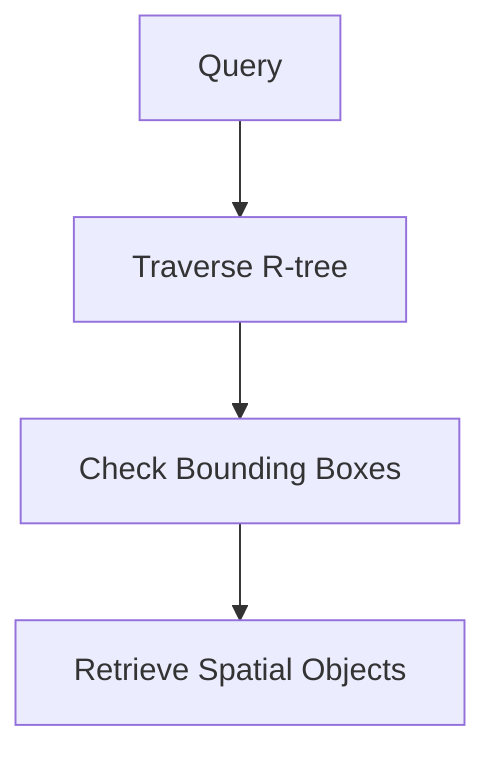

## 7.1.5 Spatial Indexes

Spatial indexes are specialized data structures used to optimize the retrieval of spatial data types, such as points, lines, and polygons, in SQL databases. These indexes are crucial for efficiently executing geospatial queries, which are common in Geographic Information Systems (GIS) and location-based services. In this section, we will delve into the types of spatial indexes, their applications, and how they can be implemented in SQL databases.

### Introduction to Spatial Indexes

Spatial data is inherently complex due to its multi-dimensional nature. Unlike traditional data types, spatial data requires specialized indexing techniques to efficiently manage and query it. Spatial indexes are designed to handle this complexity by organizing spatial data in a way that allows for quick retrieval based on spatial relationships.

#### Key Concepts

- **Geospatial Data**: Data that includes geographical components, such as coordinates, shapes, and distances.
- **Spatial Queries**: Queries that involve spatial relationships, such as proximity, intersection, and containment.
- **Indexing**: The process of creating a data structure that improves the speed of data retrieval operations.

### Types of Spatial Indexes

There are several types of spatial indexes, each with its own strengths and use cases. The most common types are R-trees and Quadtrees.

#### R-trees

R-trees are a popular choice for indexing multi-dimensional data. They are particularly well-suited for spatial data due to their ability to efficiently handle range queries and nearest neighbor searches.

- **Structure**: R-trees are hierarchical, tree-like structures where each node represents a bounding box that contains spatial objects or other nodes.
- **Operations**: Insertion, deletion, and search operations are performed by traversing the tree and updating or querying the bounding boxes.

##### Example: R-tree Structure



**Figure 1**: An example of an R-tree structure, where each node is a bounding box containing spatial objects or other nodes.

#### Quadtrees

Quadtrees are another type of spatial index that is particularly effective for partitioning two-dimensional space. They are commonly used in applications that require spatial partitioning, such as image processing and geographic mapping.

- **Structure**: Quadtrees divide space into four quadrants or regions, recursively subdividing each region until a certain level of granularity is achieved.
- **Operations**: Quadtrees support efficient point location, region queries, and spatial joins.

##### Example: Quadtree Structure



**Figure 2**: An example of a Quadtree structure, where each node represents a quadrant of space, recursively subdivided.

### Applications of Spatial Indexes

Spatial indexes are widely used in various applications that require efficient handling of geospatial data. Some common applications include:

- **Geographic Information Systems (GIS)**: Spatial indexes are essential for managing large datasets of geographic information, enabling fast spatial queries and analysis.
- **Location-Based Services**: Applications that provide services based on user location, such as navigation apps and location-based advertising, rely on spatial indexes for real-time data retrieval.
- **Environmental Monitoring**: Spatial indexes help in efficiently querying and analyzing environmental data, such as weather patterns and pollution levels.

### Implementing Spatial Indexes in SQL

Many modern SQL databases support spatial data types and indexing. Let's explore how to implement spatial indexes in some popular SQL databases.

#### PostgreSQL with PostGIS

PostgreSQL, combined with the PostGIS extension, provides robust support for spatial data and indexing.

```sql
-- Create a table with a spatial column
CREATE TABLE locations (
    id SERIAL PRIMARY KEY,
    name VARCHAR(100),
    geom GEOMETRY(Point, 4326)
);

-- Create a spatial index on the geometry column
CREATE INDEX idx_locations_geom ON locations USING GIST (geom);
```

**Explanation**: In this example, we create a table `locations` with a spatial column `geom` of type `GEOMETRY`. We then create a spatial index using the `GIST` index type, which is suitable for R-tree structures.

#### MySQL with Spatial Extensions

MySQL also supports spatial data types and indexing, although its capabilities are more limited compared to PostgreSQL.

```sql
-- Create a table with a spatial column
CREATE TABLE places (
    id INT AUTO_INCREMENT PRIMARY KEY,
    name VARCHAR(100),
    location POINT NOT NULL,
    SPATIAL INDEX(location)
);
```

**Explanation**: Here, we create a table `places` with a spatial column `location` of type `POINT`. We then create a spatial index on the `location` column.

### Design Considerations

When implementing spatial indexes, consider the following:

- **Data Distribution**: Ensure that your spatial data is evenly distributed to avoid performance bottlenecks.
- **Index Maintenance**: Regularly update and maintain your spatial indexes to ensure optimal performance.
- **Query Optimization**: Use spatial indexes in conjunction with query optimization techniques to improve query performance.

### Differences and Similarities

Spatial indexes, such as R-trees and Quadtrees, are often compared to other indexing techniques like B-trees. While B-trees are effective for one-dimensional data, spatial indexes are specifically designed for multi-dimensional data, making them more suitable for geospatial applications.

### Try It Yourself

To deepen your understanding of spatial indexes, try modifying the code examples provided. Experiment with different spatial data types and queries to see how spatial indexes improve performance.

### Visualizing Spatial Indexes

To better understand how spatial indexes work, let's visualize a simple spatial query using an R-tree.



**Figure 3**: A flowchart illustrating the process of executing a spatial query using an R-tree.

### Knowledge Check

Before moving on, let's review some key concepts:

- What are the main types of spatial indexes?
- How do R-trees and Quadtrees differ in their structure and applications?
- What are some common applications of spatial indexes?

### Embrace the Journey

Remember, mastering spatial indexes is just one step in optimizing geospatial data queries. As you continue to explore SQL design patterns, keep experimenting and applying what you've learned to real-world scenarios.

## Quiz Time!



### What is the primary purpose of spatial indexes?

- [x] To optimize the retrieval of spatial data types
- [ ] To store large amounts of non-spatial data
- [ ] To improve the performance of text-based searches
- [ ] To manage user authentication

> **Explanation:** Spatial indexes are designed to optimize the retrieval of spatial data types, such as points, lines, and polygons.

### Which of the following is a common type of spatial index?

- [x] R-tree
- [ ] B-tree
- [ ] Hash index
- [ ] Bitmap index

> **Explanation:** R-trees are a common type of spatial index used for multi-dimensional data.

### What is a key feature of Quadtrees?

- [x] They divide space into four quadrants
- [ ] They use a hash function for indexing
- [ ] They are used for text-based searches
- [ ] They are a type of bitmap index

> **Explanation:** Quadtrees divide space into four quadrants, making them effective for spatial partitioning.

### In which SQL database can you use the PostGIS extension for spatial indexing?

- [x] PostgreSQL
- [ ] MySQL
- [ ] SQLite
- [ ] Oracle

> **Explanation:** PostGIS is an extension for PostgreSQL that provides support for spatial data and indexing.

### What type of index is suitable for R-tree structures in PostgreSQL?

- [x] GIST
- [ ] BTREE
- [ ] HASH
- [ ] SPATIAL

> **Explanation:** The GIST index type is suitable for R-tree structures in PostgreSQL.

### Which SQL command is used to create a spatial index in MySQL?

- [x] SPATIAL INDEX
- [ ] CREATE INDEX
- [ ] CREATE SPATIAL
- [ ] INDEX SPATIAL

> **Explanation:** The `SPATIAL INDEX` command is used to create a spatial index in MySQL.

### What is a common application of spatial indexes?

- [x] Geographic Information Systems (GIS)
- [ ] Text-based search engines
- [ ] User authentication systems
- [ ] Financial transaction processing

> **Explanation:** Spatial indexes are commonly used in Geographic Information Systems (GIS) for managing geospatial data.

### How do R-trees organize spatial data?

- [x] Using hierarchical bounding boxes
- [ ] Using hash functions
- [ ] Using linear lists
- [ ] Using bitmap arrays

> **Explanation:** R-trees organize spatial data using hierarchical bounding boxes.

### What is a benefit of using spatial indexes?

- [x] Improved performance of spatial queries
- [ ] Reduced database storage requirements
- [ ] Enhanced text search capabilities
- [ ] Simplified user authentication

> **Explanation:** Spatial indexes improve the performance of spatial queries by optimizing data retrieval.

### True or False: Spatial indexes are only used for two-dimensional data.

- [ ] True
- [x] False

> **Explanation:** Spatial indexes can be used for multi-dimensional data, not just two-dimensional data.


