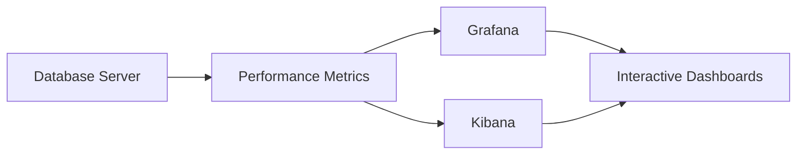

## 7.10 Performance Monitoring Tools and Techniques

In the realm of SQL database management, performance monitoring is a critical aspect that ensures databases operate efficiently and effectively. As databases grow in complexity and size, the need for robust performance monitoring tools and techniques becomes paramount. This section delves into the various tools and techniques available for monitoring SQL performance, focusing on built-in tools, third-party solutions, key performance metrics, and strategies for alerting and reporting.

### Built-in Tools

Most Database Management Systems (DBMS) come equipped with built-in tools that provide essential performance monitoring capabilities. These tools are designed to help database administrators (DBAs) and developers gain insights into the database's operational health and performance.

#### SQL Server Management Studio (SSMS)

SQL Server Management Studio is a comprehensive environment provided by Microsoft for managing SQL Server databases. It includes several features for performance monitoring:

- **Activity Monitor**: Provides a real-time view of SQL Server processes and resource usage. It displays information about active user connections, locks, and expensive queries.
  
- **SQL Server Profiler**: Allows you to capture and analyze SQL Server events. It is useful for identifying slow-running queries and understanding query execution patterns.

- **Dynamic Management Views (DMVs)**: These are system views that provide insights into the internal workings of SQL Server. DMVs can be queried to gather information about query performance, index usage, and system health.

```sql
-- Example of using DMVs to find expensive queries
SELECT TOP 10
    qs.sql_handle,
    qs.execution_count,
    qs.total_worker_time AS CPU_Time,
    qs.total_elapsed_time AS Total_Time,
    SUBSTRING(st.text, (qs.statement_start_offset/2) + 1,
    ((CASE qs.statement_end_offset
        WHEN -1 THEN DATALENGTH(st.text)
        ELSE qs.statement_end_offset END
        - qs.statement_start_offset)/2) + 1) AS query_text
FROM
    sys.dm_exec_query_stats AS qs
CROSS APPLY
    sys.dm_exec_sql_text(qs.sql_handle) AS st
ORDER BY
    qs.total_worker_time DESC;
```

#### Oracle Enterprise Manager

Oracle Enterprise Manager is a powerful tool for managing Oracle databases. It offers a range of performance monitoring features:

- **Performance Hub**: Provides a consolidated view of database performance, including real-time and historical data.

- **Automatic Workload Repository (AWR)**: Collects, processes, and maintains performance statistics for problem detection and tuning.

- **Active Session History (ASH)**: Samples active database sessions to provide insights into session activity and resource usage.

```sql
-- Example of querying AWR for top SQL by CPU usage
SELECT * FROM (
    SELECT
        sql_id,
        plan_hash_value,
        SUM(cpu_time) AS total_cpu_time
    FROM
        dba_hist_sqlstat
    WHERE
        snap_id BETWEEN :start_snap AND :end_snap
    GROUP BY
        sql_id, plan_hash_value
    ORDER BY
        total_cpu_time DESC
) WHERE ROWNUM <= 10;
```

#### PostgreSQL's Built-in Tools

PostgreSQL offers several built-in tools and extensions for performance monitoring:

- **pg_stat_statements**: An extension that tracks execution statistics of all SQL statements executed by a server.

- **pgAdmin**: A web-based interface for managing PostgreSQL databases, which includes performance monitoring features.

- **EXPLAIN and EXPLAIN ANALYZE**: Commands that provide insights into query execution plans and performance.

```sql
-- Example of using pg_stat_statements to find slow queries
SELECT
    query,
    calls,
    total_time,
    mean_time
FROM
    pg_stat_statements
ORDER BY
    total_time DESC
LIMIT 10;
```

### Third-Party Tools

While built-in tools provide a solid foundation for performance monitoring, third-party tools often offer more advanced features and flexibility. These tools can integrate with multiple database systems and provide a unified view of database performance.

#### SolarWinds Database Performance Analyzer

SolarWinds Database Performance Analyzer (DPA) is a comprehensive tool that supports multiple database platforms, including SQL Server, Oracle, and MySQL. It offers:

- **Wait-time analysis**: Identifies bottlenecks by analyzing wait times for queries.
- **Historical data**: Provides insights into performance trends over time.
- **Alerts and reporting**: Customizable alerts and detailed reports for proactive monitoring.

#### Redgate SQL Monitor

Redgate SQL Monitor is designed specifically for SQL Server environments. It provides:

- **Real-time monitoring**: Tracks server performance metrics in real-time.
- **Customizable alerts**: Allows users to set up alerts for specific performance thresholds.
- **Detailed reports**: Generates reports on server health, query performance, and more.

#### New Relic

New Relic is a cloud-based performance monitoring tool that supports a wide range of technologies, including databases. It offers:

- **Application performance monitoring (APM)**: Provides insights into application and database performance.
- **Custom dashboards**: Allows users to create custom dashboards for monitoring specific metrics.
- **Integration with other tools**: Easily integrates with other monitoring and logging tools.

### Key Metrics

Understanding and monitoring key performance metrics is crucial for maintaining optimal database performance. These metrics provide insights into the database's operational health and help identify potential issues before they become critical.

#### Query Response Times

Query response time is a critical metric that measures how long it takes for a query to execute. Monitoring query response times helps identify slow-running queries that may need optimization.

- **Average Response Time**: The average time taken for queries to execute over a specific period.
- **95th Percentile Response Time**: The time within which 95% of queries are completed, providing insights into outliers.

#### CPU and Memory Usage

Monitoring CPU and memory usage is essential for understanding the resource consumption of your database server. High CPU or memory usage can indicate inefficient queries or insufficient hardware resources.

- **CPU Utilization**: The percentage of CPU resources used by the database server.
- **Memory Usage**: The amount of memory consumed by the database processes.

#### I/O Statistics

I/O statistics provide insights into the read and write operations performed by the database. High I/O activity can indicate potential bottlenecks in disk performance.

- **Disk Read/Write Latency**: The time taken to read from or write to disk.
- **I/O Throughput**: The amount of data read from or written to disk over a specific period.

### Alerting and Reporting

Setting up alerting and reporting mechanisms is crucial for proactive performance monitoring. Alerts notify administrators of potential issues, while reports provide insights into performance trends and help with capacity planning.

#### Setting Up Alerts

Alerts can be configured to notify administrators of performance issues based on predefined thresholds. Common alert conditions include:

- **High CPU or Memory Usage**: Alerts when resource usage exceeds a certain threshold.
- **Slow Query Execution**: Alerts when query response times exceed acceptable limits.
- **Disk Space Utilization**: Alerts when disk space usage approaches capacity.

#### Generating Reports

Reports provide a comprehensive view of database performance over time. They can be used for capacity planning, performance tuning, and identifying trends.

- **Performance Reports**: Summarize key performance metrics over a specific period.
- **Trend Analysis Reports**: Identify performance trends and potential issues before they become critical.
- **Capacity Planning Reports**: Help plan for future growth by analyzing resource usage trends.

### Visualizing Performance Data

Visualizing performance data can enhance understanding and facilitate quick decision-making. Tools like Grafana and Kibana can be used to create interactive dashboards that display real-time performance metrics.



### Try It Yourself

To get hands-on experience with performance monitoring, try setting up a monitoring tool like Grafana or Kibana with your database. Experiment with creating custom dashboards and alerts to monitor key performance metrics.

### Knowledge Check

- What are the key performance metrics to monitor in a SQL database?
- How can built-in tools like SQL Server Management Studio help with performance monitoring?
- What are the benefits of using third-party tools for performance monitoring?
- How can alerting and reporting improve database performance management?

### Embrace the Journey

Remember, mastering performance monitoring is an ongoing journey. As you gain experience, you'll develop a deeper understanding of your database's performance characteristics and how to optimize them. Keep experimenting, stay curious, and enjoy the journey!

## Quiz Time!



### What is the primary purpose of performance monitoring tools in SQL databases?

- [x] To ensure databases operate efficiently and effectively
- [ ] To replace database administrators
- [ ] To automate all database tasks
- [ ] To eliminate the need for query optimization

> **Explanation:** Performance monitoring tools help ensure databases operate efficiently by providing insights into performance metrics and identifying potential issues.

### Which built-in tool in SQL Server provides a real-time view of processes and resource usage?

- [x] Activity Monitor
- [ ] SQL Server Profiler
- [ ] Dynamic Management Views
- [ ] Oracle Enterprise Manager

> **Explanation:** Activity Monitor in SQL Server Management Studio provides a real-time view of processes and resource usage.

### What is the role of Dynamic Management Views (DMVs) in SQL Server?

- [x] To provide insights into the internal workings of SQL Server
- [ ] To replace SQL Server Management Studio
- [ ] To automate query optimization
- [ ] To manage user permissions

> **Explanation:** DMVs provide insights into SQL Server's internal workings, helping to gather information about query performance and system health.

### Which third-party tool offers wait-time analysis for identifying bottlenecks?

- [x] SolarWinds Database Performance Analyzer
- [ ] Redgate SQL Monitor
- [ ] New Relic
- [ ] Oracle Enterprise Manager

> **Explanation:** SolarWinds Database Performance Analyzer offers wait-time analysis to identify bottlenecks in database performance.

### What is a critical metric for understanding query performance?

- [x] Query Response Times
- [ ] Disk Space Utilization
- [ ] User Permissions
- [ ] Backup Frequency

> **Explanation:** Query response times are critical for understanding how long queries take to execute and identifying slow-running queries.

### How can alerting improve database performance management?

- [x] By notifying administrators of potential issues based on predefined thresholds
- [ ] By eliminating the need for manual monitoring
- [ ] By automating all database tasks
- [ ] By replacing database administrators

> **Explanation:** Alerts notify administrators of potential issues, allowing for proactive performance management based on predefined thresholds.

### What is the benefit of using visualization tools like Grafana?

- [x] To create interactive dashboards that display real-time performance metrics
- [ ] To automate database backups
- [ ] To replace SQL Server Management Studio
- [ ] To manage user permissions

> **Explanation:** Visualization tools like Grafana create interactive dashboards that display real-time performance metrics, enhancing understanding and decision-making.

### Which metric provides insights into the read and write operations performed by the database?

- [x] I/O Statistics
- [ ] CPU Utilization
- [ ] Memory Usage
- [ ] Query Response Times

> **Explanation:** I/O statistics provide insights into the read and write operations performed by the database, indicating potential bottlenecks in disk performance.

### What is the purpose of generating performance reports?

- [x] To provide a comprehensive view of database performance over time
- [ ] To automate query optimization
- [ ] To replace database administrators
- [ ] To manage user permissions

> **Explanation:** Performance reports provide a comprehensive view of database performance over time, helping with capacity planning and performance tuning.

### True or False: Third-party tools can only be used with SQL Server databases.

- [ ] True
- [x] False

> **Explanation:** Third-party tools often support multiple database platforms, not just SQL Server, providing a unified view of database performance.




