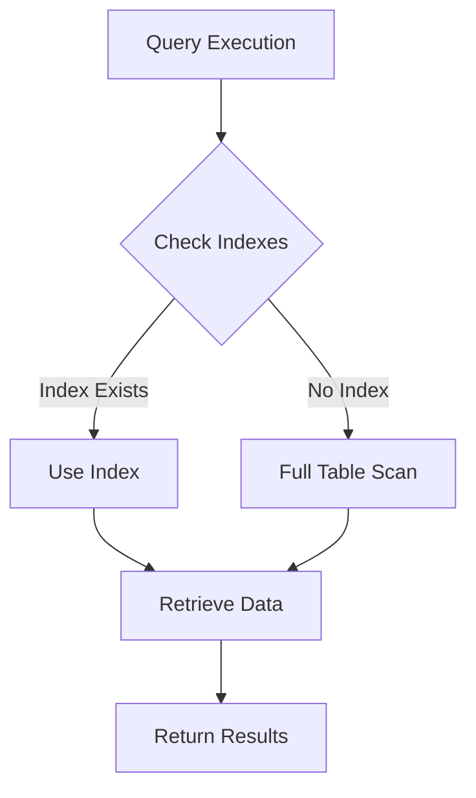

## 7.11 Avoiding Common Performance Anti-Patterns

In the realm of SQL database management, performance is paramount. As databases grow in size and complexity, the risk of falling into performance anti-patterns increases. These anti-patterns can lead to inefficient queries, slow response times, and increased resource consumption. In this section, we will explore some of the most common performance anti-patterns in SQL and provide strategies to avoid them. By understanding and addressing these pitfalls, you can ensure that your database systems remain efficient and scalable.

### Over-Indexing

**Over-indexing** occurs when too many indexes are created on a table. While indexes are crucial for speeding up data retrieval, excessive indexing can lead to increased maintenance overhead and slower write operations.

#### Understanding Indexes

Indexes are data structures that improve the speed of data retrieval operations on a database table at the cost of additional writes and storage space. They are essential for optimizing query performance, especially for large datasets.

#### The Downside of Over-Indexing

- **Increased Maintenance**: Each index must be updated whenever data is inserted, updated, or deleted, leading to increased CPU and I/O usage.
- **Slower Write Operations**: More indexes mean more work for the database during insert, update, and delete operations.
- **Storage Overhead**: Indexes consume additional disk space, which can be significant for large tables.

#### Best Practices to Avoid Over-Indexing

1. **Analyze Query Patterns**: Identify the most frequent and performance-critical queries. Create indexes that support these queries.
2. **Use Composite Indexes**: Instead of creating multiple single-column indexes, consider using composite indexes that cover multiple columns used together in queries.
3. **Regularly Review Index Usage**: Use database tools to analyze index usage and remove unused or redundant indexes.
4. **Balance Read and Write Performance**: Consider the trade-off between read and write performance when designing indexes.

#### Code Example: Creating an Efficient Index

```sql
-- Suppose we have a table 'orders' with columns 'order_id', 'customer_id', 'order_date', and 'status'.
-- Instead of creating separate indexes on 'customer_id' and 'order_date', create a composite index.

CREATE INDEX idx_customer_order_date ON orders (customer_id, order_date);

-- This index will efficiently support queries that filter by both customer_id and order_date.
```

### Improper Data Types

Choosing the wrong data types for columns can lead to inefficient storage and performance issues. It's crucial to select data types that match the nature and size of the data.

#### Common Mistakes with Data Types

- **Using Larger Data Types**: Selecting data types that are larger than necessary can waste storage space and reduce performance.
- **Incompatible Data Types**: Using data types that require conversion can slow down query execution.
- **Ignoring Precision and Scale**: For numeric data, not specifying precision and scale can lead to rounding errors and inefficient storage.

#### Best Practices for Data Types

1. **Choose the Smallest Suitable Type**: Use the smallest data type that can accommodate your data. For example, use `TINYINT` instead of `INT` for small integer values.
2. **Avoid Implicit Conversions**: Ensure that data types are compatible to avoid implicit conversions during query execution.
3. **Specify Precision and Scale**: For decimal numbers, always specify the precision and scale to ensure accurate storage and calculations.

#### Code Example: Choosing Appropriate Data Types

```sql
-- Suppose we have a table 'products' with columns 'product_id', 'price', and 'quantity'.
-- Choose appropriate data types for each column.

CREATE TABLE products (
    product_id INT UNSIGNED AUTO_INCREMENT PRIMARY KEY,
    price DECIMAL(10, 2), -- Specify precision and scale for currency values
    quantity SMALLINT UNSIGNED -- Use SMALLINT for small integer values
);
```

### Ignoring Execution Plans

Execution plans provide insight into how a database executes a query. Ignoring these plans can lead to suboptimal query performance.

#### Understanding Execution Plans

An execution plan is a detailed map of how a query will be executed by the database engine. It includes information about the order of operations, index usage, join methods, and more.

#### The Importance of Analyzing Execution Plans

- **Identify Bottlenecks**: Execution plans can reveal inefficient operations, such as full table scans or unnecessary joins.
- **Optimize Index Usage**: Plans show whether indexes are being used effectively or if additional indexes are needed.
- **Improve Query Performance**: By understanding the execution plan, you can rewrite queries to improve performance.

#### Best Practices for Execution Plans

1. **Regularly Analyze Execution Plans**: Use tools like `EXPLAIN` in MySQL or `EXPLAIN PLAN` in Oracle to analyze query execution plans.
2. **Look for Full Table Scans**: Identify queries that perform full table scans and optimize them with appropriate indexes.
3. **Optimize Join Operations**: Ensure that join operations are using indexes and are executed in the most efficient order.

#### Code Example: Analyzing an Execution Plan

```sql
-- Use the EXPLAIN keyword to analyze the execution plan of a query.

EXPLAIN SELECT * FROM orders WHERE customer_id = 123 AND order_date > '2024-01-01';

-- Review the output to ensure that indexes are being used and that there are no full table scans.
```

### Not Archiving Old Data

Keeping obsolete or rarely accessed data in the main database tables can slow down queries and increase storage costs.

#### The Impact of Not Archiving

- **Slower Query Performance**: Large tables with outdated data can lead to slower query execution times.
- **Increased Storage Costs**: Storing unnecessary data increases storage requirements and costs.
- **Complex Data Management**: Managing large datasets with obsolete data can complicate maintenance and backups.

#### Best Practices for Data Archiving

1. **Implement Data Retention Policies**: Define policies for how long data should be retained in the main database.
2. **Use Archival Tables**: Move old or infrequently accessed data to separate archival tables or databases.
3. **Automate Archiving Processes**: Use scheduled jobs or scripts to automate the archiving of old data.

#### Code Example: Archiving Old Data

```sql
-- Suppose we have a table 'logs' that stores application logs.
-- Archive logs older than one year to an 'archived_logs' table.

INSERT INTO archived_logs SELECT * FROM logs WHERE log_date < NOW() - INTERVAL 1 YEAR;
DELETE FROM logs WHERE log_date < NOW() - INTERVAL 1 YEAR;

-- This process moves old logs to an archival table and removes them from the main table.
```

### Visualizing SQL Performance Anti-Patterns

To better understand the impact of these anti-patterns, let's visualize the process of query execution and the role of indexes using Mermaid.js diagrams.



**Diagram Description**: This flowchart illustrates the query execution process. If an index exists, the query uses it to retrieve data efficiently. Without an index, a full table scan is performed, which is less efficient.

### Try It Yourself

Experiment with the code examples provided in this section. Try creating different indexes, analyzing execution plans, and archiving old data. Modify the examples to suit your database schema and observe the impact on performance.

### Knowledge Check

- What are the potential downsides of over-indexing a database table?
- How can improper data types affect query performance?
- Why is it important to analyze execution plans regularly?
- What are the benefits of archiving old data?

### Embrace the Journey

Remember, optimizing SQL performance is an ongoing process. As your database evolves, continue to monitor and refine your queries and indexing strategies. Stay curious, keep experimenting, and enjoy the journey of mastering SQL performance optimization!

## Quiz Time!



### What is a common consequence of over-indexing a table?

- [x] Increased maintenance overhead
- [ ] Faster write operations
- [ ] Reduced storage requirements
- [ ] Improved query performance

> **Explanation:** Over-indexing can lead to increased maintenance overhead due to the need to update multiple indexes during write operations.

### Which practice helps avoid improper data types?

- [x] Choosing the smallest suitable type
- [ ] Using the largest data type available
- [ ] Ignoring precision and scale
- [ ] Allowing implicit conversions

> **Explanation:** Choosing the smallest suitable type ensures efficient storage and performance, while avoiding implicit conversions.

### What tool can be used to analyze SQL execution plans?

- [x] EXPLAIN
- [ ] SELECT
- [ ] INSERT
- [ ] DELETE

> **Explanation:** The `EXPLAIN` keyword is used to analyze SQL execution plans and understand how queries are executed.

### Why is it important to archive old data?

- [x] To improve query performance
- [ ] To increase storage costs
- [ ] To complicate data management
- [ ] To slow down queries

> **Explanation:** Archiving old data can improve query performance by reducing the size of the main database tables.

### What is a benefit of using composite indexes?

- [x] They cover multiple columns used together in queries
- [ ] They increase storage requirements
- [ ] They slow down write operations
- [ ] They are less efficient than single-column indexes

> **Explanation:** Composite indexes cover multiple columns, making them efficient for queries that filter by those columns together.

### What is the impact of ignoring execution plans?

- [x] Suboptimal query performance
- [ ] Improved query performance
- [ ] Reduced maintenance overhead
- [ ] Faster write operations

> **Explanation:** Ignoring execution plans can lead to suboptimal query performance due to inefficient operations.

### How can you automate the archiving of old data?

- [x] Use scheduled jobs or scripts
- [ ] Manually delete old data
- [ ] Increase storage space
- [ ] Ignore data retention policies

> **Explanation:** Automating the archiving process with scheduled jobs or scripts ensures that old data is regularly moved to archival storage.

### What is a downside of using larger data types than necessary?

- [x] Wasted storage space
- [ ] Improved query performance
- [ ] Faster write operations
- [ ] Reduced maintenance overhead

> **Explanation:** Using larger data types than necessary can waste storage space and reduce performance.

### Which of the following is a best practice for index usage?

- [x] Regularly review index usage
- [ ] Create as many indexes as possible
- [ ] Ignore query patterns
- [ ] Avoid using composite indexes

> **Explanation:** Regularly reviewing index usage helps identify unused or redundant indexes, optimizing performance.

### True or False: Full table scans are always more efficient than using indexes.

- [ ] True
- [x] False

> **Explanation:** Full table scans are generally less efficient than using indexes, especially for large datasets.


