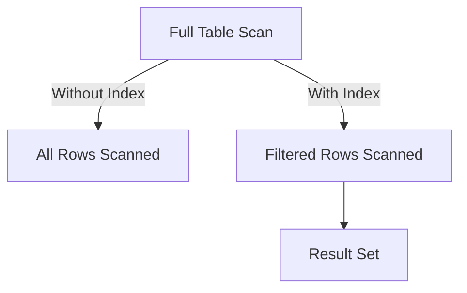
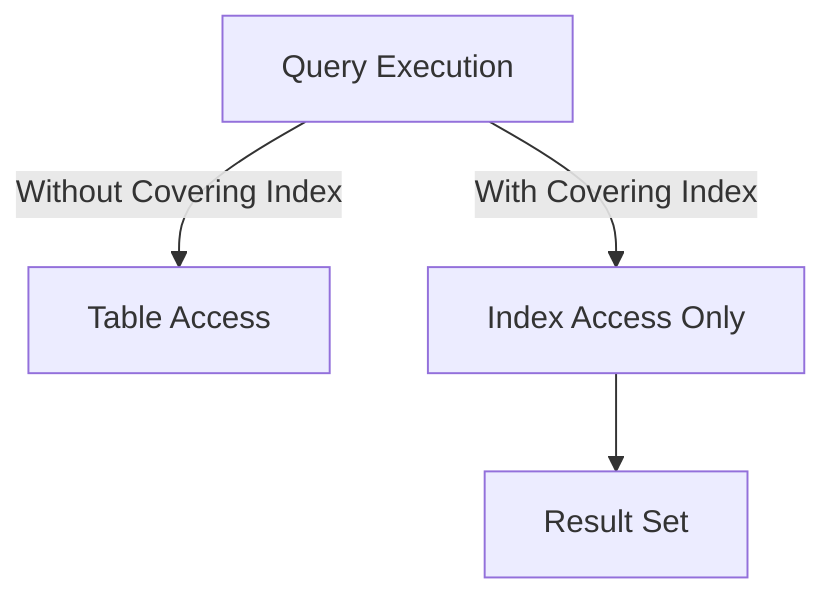
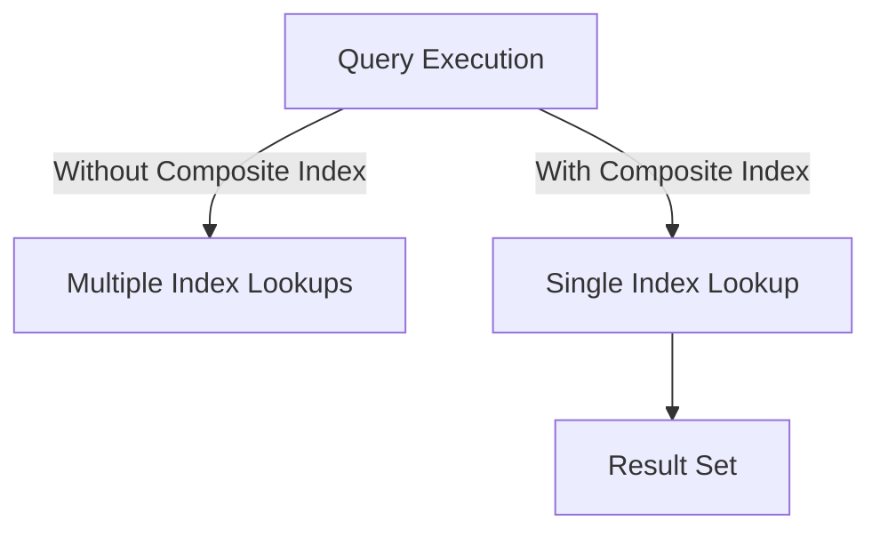

## 7.2 Index Design Strategies

In the realm of SQL databases, indexes are pivotal for optimizing query performance. They serve as a mechanism to quickly locate data without scanning every row in a table, much like an index in a book helps you find information without reading every page. However, designing effective indexes requires a strategic approach to balance the benefits of faster reads with the potential overhead on write operations. In this section, we will delve into various index design strategies, including selective indexing, covering indexes, and composite indexes, while also discussing key considerations to ensure optimal performance.

### Selective Indexing

**Selective indexing** involves creating indexes on columns that are frequently used in `WHERE`, `JOIN`, and `ORDER BY` clauses. The goal is to enhance query performance by reducing the amount of data the database engine needs to scan.

#### Key Concepts

- **Selectivity**: The selectivity of an index refers to how well it distinguishes between different rows. High selectivity means the index can effectively narrow down the search to a small subset of rows.
- **Cardinality**: This is the number of unique values in a column. High cardinality columns (e.g., primary keys) are often good candidates for indexing.

#### Example

Consider a table `employees` with columns `employee_id`, `first_name`, `last_name`, and `department_id`. If queries frequently filter by `department_id`, creating an index on this column can significantly improve performance.

```sql
CREATE INDEX idx_department_id ON employees(department_id);
```

In this example, the index `idx_department_id` allows the database to quickly locate employees within a specific department without scanning the entire table.

#### Visualizing Index Selectivity



*Diagram: The impact of selective indexing on query performance, reducing the number of rows scanned.*

### Covering Indexes

A **covering index** is an index that includes all the columns a query needs, allowing the database to retrieve the data directly from the index without accessing the table. This can lead to substantial performance gains, especially for read-heavy operations.

#### Key Concepts

- **Index-Only Scan**: When a query can be satisfied entirely by an index, avoiding the need to access the table data.
- **Included Columns**: Additional columns that are not part of the index key but are stored in the index to cover queries.

#### Example

Suppose we have a query that selects `first_name` and `last_name` from the `employees` table where `department_id` is a specific value. A covering index can be created as follows:

```sql
CREATE INDEX idx_covering ON employees(department_id) INCLUDE (first_name, last_name);
```

This index allows the query to be executed without accessing the table, as all required data is available in the index itself.

#### Visualizing Covering Indexes



*Diagram: The efficiency of covering indexes in eliminating the need for table access.*

### Composite Indexes

**Composite indexes** are indexes on multiple columns. They are particularly useful for queries that filter or sort on multiple columns, as they can improve performance by reducing the number of index lookups.

#### Key Concepts

- **Column Order**: The order of columns in a composite index matters. It should reflect the order in which columns are used in queries.
- **Prefixing**: Queries can benefit from a composite index if they use a leftmost prefix of the indexed columns.

#### Example

Consider a query that filters employees by `department_id` and sorts by `last_name`. A composite index can be created as follows:

```sql
CREATE INDEX idx_composite ON employees(department_id, last_name);
```

This index is optimized for queries that filter by `department_id` and sort by `last_name`.

#### Visualizing Composite Indexes



*Diagram: The advantage of composite indexes in reducing the number of index lookups.*

### Considerations for Index Design

While indexes can significantly enhance read performance, they also introduce overhead on write operations, such as `INSERT`, `UPDATE`, and `DELETE`. Therefore, it's crucial to balance the benefits of indexing with the potential impact on write performance.

#### Key Considerations

- **Maintenance Overhead**: Indexes require maintenance, which can slow down write operations. Regularly review and optimize indexes to ensure they remain efficient.
- **Storage Costs**: Indexes consume additional disk space. Consider the trade-off between performance gains and storage costs.
- **Query Patterns**: Analyze query patterns to identify which columns are frequently used in filters and sorts, and design indexes accordingly.

#### Example

To illustrate the trade-offs, consider a scenario where a table has frequent updates. Creating too many indexes can degrade performance due to the overhead of maintaining them.

```sql
-- Example of an index that might be unnecessary if updates are frequent
CREATE INDEX idx_high_maintenance ON employees(last_name, first_name);
```

In this case, it's important to evaluate whether the performance gains from the index outweigh the maintenance costs.

### Try It Yourself

Experiment with the following code examples to understand the impact of different index strategies:

1. **Modify the column order** in a composite index and observe the effect on query performance.
2. **Add and remove included columns** in a covering index to see how it affects query execution plans.
3. **Create and drop indexes** on a test table to measure the impact on read and write operations.

### Knowledge Check

- Explain the difference between selective indexing and covering indexes.
- Describe a scenario where a composite index would be beneficial.
- Discuss the trade-offs involved in maintaining multiple indexes on a table.

### Conclusion

Index design is a critical aspect of SQL database optimization. By understanding and applying selective indexing, covering indexes, and composite indexes, we can significantly enhance query performance while balancing the overhead on write operations. Remember, this is just the beginning. As you progress, you'll build more complex and efficient database solutions. Keep experimenting, stay curious, and enjoy the journey!

## Quiz Time!



### What is the primary benefit of selective indexing?

- [x] Reducing the amount of data scanned in queries
- [ ] Increasing the storage space used by the database
- [ ] Enhancing the speed of write operations
- [ ] Simplifying the database schema

> **Explanation:** Selective indexing reduces the amount of data scanned in queries by creating indexes on frequently used columns, improving query performance.

### What is a covering index?

- [x] An index that includes all columns required by a query
- [ ] An index that covers multiple tables
- [ ] An index that is used for backup purposes
- [ ] An index that is automatically created by the database

> **Explanation:** A covering index includes all columns required by a query, allowing the database to retrieve data directly from the index without accessing the table.

### How does the order of columns in a composite index affect query performance?

- [x] It determines the efficiency of the index for specific queries
- [ ] It has no impact on query performance
- [ ] It only affects the storage space used by the index
- [ ] It determines the order of data retrieval

> **Explanation:** The order of columns in a composite index affects query performance by determining how efficiently the index can be used for specific queries.

### What is a potential downside of having too many indexes on a table?

- [x] Increased maintenance overhead on write operations
- [ ] Decreased read performance
- [ ] Reduced storage space
- [ ] Simplified query execution plans

> **Explanation:** Having too many indexes can increase maintenance overhead on write operations, as each index must be updated with every data modification.

### Which of the following is a key consideration when designing indexes?

- [x] Query patterns and usage frequency
- [ ] The color of the database interface
- [ ] The number of users accessing the database
- [ ] The operating system used by the database server

> **Explanation:** Query patterns and usage frequency are key considerations when designing indexes, as they help identify which columns to index for optimal performance.

### What is the purpose of included columns in a covering index?

- [x] To store additional columns in the index for query coverage
- [ ] To reduce the size of the index
- [ ] To increase the complexity of the index
- [ ] To improve the aesthetics of the database schema

> **Explanation:** Included columns in a covering index store additional columns in the index to cover queries, allowing for index-only scans.

### What is the impact of high cardinality on index selectivity?

- [x] High cardinality improves index selectivity
- [ ] High cardinality reduces index selectivity
- [ ] High cardinality has no impact on index selectivity
- [ ] High cardinality increases the storage space used by the index

> **Explanation:** High cardinality improves index selectivity by providing a greater number of unique values, allowing the index to effectively narrow down search results.

### What is an index-only scan?

- [x] A query execution that retrieves data directly from the index
- [ ] A scan that accesses both the index and the table
- [ ] A scan that is performed only during database backups
- [ ] A scan that is used for security purposes

> **Explanation:** An index-only scan is a query execution that retrieves data directly from the index, avoiding the need to access the table.

### What is a potential benefit of composite indexes?

- [x] Reducing the number of index lookups for multi-column queries
- [ ] Increasing the number of index lookups for single-column queries
- [ ] Simplifying the database schema
- [ ] Enhancing the speed of write operations

> **Explanation:** Composite indexes can reduce the number of index lookups for multi-column queries by indexing multiple columns together.

### True or False: Indexes always improve database performance.

- [ ] True
- [x] False

> **Explanation:** False. While indexes can improve read performance, they can also introduce overhead on write operations and consume additional storage space, so they must be used judiciously.


