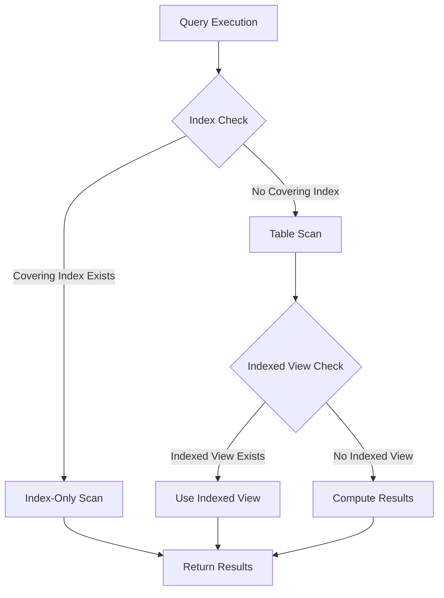

## 7.3 Covering Indexes and Indexed Views

In the realm of SQL database optimization, covering indexes and indexed views stand out as powerful tools for enhancing query performance. Understanding and effectively implementing these concepts can significantly reduce query execution time and resource consumption. In this section, we will delve into the intricacies of covering indexes and indexed views, exploring their definitions, benefits, and practical applications.

### Covering Indexes

#### Definition

A covering index is an index that contains all the columns required by a query, allowing the database engine to retrieve the data directly from the index without accessing the underlying table. This results in an index-only scan, which is typically faster than scanning the table itself.

#### Benefits

- **Performance Improvement**: By eliminating the need to access the table, covering indexes can significantly reduce I/O operations, leading to faster query execution.
- **Reduced Disk I/O**: Since the data is retrieved directly from the index, the number of disk reads is minimized.
- **Efficient Use of Resources**: Covering indexes can lead to better utilization of CPU and memory resources, as less data needs to be processed.

#### Creating a Covering Index

To create a covering index, you need to include all the columns that a query requires in the index. Consider the following SQL query:

```sql
SELECT OrderID, OrderDate, CustomerID
FROM Orders
WHERE CustomerID = 12345;
```

To optimize this query with a covering index, you would create an index that includes all the columns used in the query:

```sql
CREATE INDEX idx_covering_orders
ON Orders (CustomerID, OrderID, OrderDate);
```

#### Key Considerations

- **Index Size**: Covering indexes can become large, especially if they include many columns. It's essential to balance the performance benefits with the storage overhead.
- **Maintenance Overhead**: As with any index, covering indexes require maintenance during data modifications (INSERT, UPDATE, DELETE operations).
- **Selectivity**: The effectiveness of a covering index depends on the selectivity of the indexed columns. High selectivity leads to better performance gains.

#### Example: Covering Index in Action

Let's consider a scenario where we have a table `Sales` with the following columns: `SaleID`, `ProductID`, `SaleDate`, `Quantity`, and `TotalAmount`. We frequently run a query to retrieve sales data for a specific product:

```sql
SELECT SaleDate, Quantity, TotalAmount
FROM Sales
WHERE ProductID = 101;
```

To optimize this query, we can create a covering index:

```sql
CREATE INDEX idx_covering_sales
ON Sales (ProductID, SaleDate, Quantity, TotalAmount);
```

This index allows the query to be executed without accessing the `Sales` table, resulting in faster performance.

### Indexed Views

#### Purpose

Indexed views, also known as materialized views, store the result of a view in a physical table. This can improve performance for complex queries that involve multiple joins and aggregations.

#### Advantages

- **Improved Query Performance**: By storing precomputed results, indexed views can significantly reduce the time required to execute complex queries.
- **Reduced Computation**: Queries that access indexed views do not need to recompute results, leading to faster execution.
- **Consistency**: Indexed views ensure that the data is consistent with the underlying tables, as they are automatically updated when the base tables change.

#### Creating an Indexed View

To create an indexed view, you must first define a view and then create a unique clustered index on it. Consider the following example:

```sql
CREATE VIEW vw_SalesSummary
WITH SCHEMABINDING AS
SELECT ProductID, SUM(Quantity) AS TotalQuantity, SUM(TotalAmount) AS TotalSales
FROM dbo.Sales
GROUP BY ProductID;

CREATE UNIQUE CLUSTERED INDEX idx_sales_summary
ON vw_SalesSummary (ProductID);
```

#### Key Considerations

- **Maintenance Overhead**: Indexed views require additional maintenance during data modifications, as the view must be updated to reflect changes in the base tables.
- **Storage Requirements**: Storing the results of a view in a physical table requires additional storage space.
- **Schema Binding**: Indexed views must be created with the `SCHEMABINDING` option, which prevents changes to the underlying tables that would affect the view.

#### Example: Indexed View in Action

Suppose we have a `Sales` table and frequently run a query to get the total sales for each product:

```sql
SELECT ProductID, SUM(TotalAmount) AS TotalSales
FROM Sales
GROUP BY ProductID;
```

By creating an indexed view, we can optimize this query:

```sql
CREATE VIEW vw_ProductSales
WITH SCHEMABINDING AS
SELECT ProductID, SUM(TotalAmount) AS TotalSales
FROM dbo.Sales
GROUP BY ProductID;

CREATE UNIQUE CLUSTERED INDEX idx_product_sales
ON vw_ProductSales (ProductID);
```

This indexed view allows the query to execute quickly, as the results are precomputed and stored.

### Visualizing Indexing Concepts

To better understand the relationship between covering indexes, indexed views, and query execution, let's visualize these concepts using a flowchart.



**Diagram Description**: This flowchart illustrates the decision-making process during query execution. If a covering index exists, an index-only scan is performed. If not, the query checks for an indexed view. If an indexed view exists, it is used; otherwise, the results are computed from the base tables.

### Design Considerations

- **When to Use Covering Indexes**: Use covering indexes for queries that frequently access the same set of columns. They are particularly beneficial for read-heavy workloads.
- **When to Use Indexed Views**: Use indexed views for complex queries involving multiple joins and aggregations. They are ideal for scenarios where query performance is critical, and data modifications are infrequent.
- **Balancing Performance and Maintenance**: Both covering indexes and indexed views offer performance benefits but come with maintenance overhead. It's crucial to evaluate the trade-offs based on your specific use case.

### Differences and Similarities

- **Similarities**: Both covering indexes and indexed views aim to improve query performance by reducing the need to access base tables.
- **Differences**: Covering indexes are part of the indexing strategy, focusing on including all necessary columns in the index. Indexed views, on the other hand, store the result of a view in a physical table, providing precomputed results for complex queries.

### Try It Yourself

To solidify your understanding of covering indexes and indexed views, try modifying the code examples provided. Experiment with different queries and observe how the performance changes with and without these optimizations. Consider the following challenges:

- Create a covering index for a query that retrieves data from multiple columns.
- Design an indexed view for a complex query involving joins and aggregations.
- Measure the performance impact of these optimizations using execution plans.

### References and Links

- [SQL Server Index Design Guide](https://docs.microsoft.com/en-us/sql/relational-databases/sql-server-index-design-guide)
- [Indexed Views in SQL Server](https://docs.microsoft.com/en-us/sql/relational-databases/views/indexed-views)
- [Understanding Covering Indexes](https://www.sqlshack.com/understanding-covering-indexes-in-sql-server/)

### Knowledge Check

- What is a covering index, and how does it improve query performance?
- How do indexed views differ from regular views?
- What are the key considerations when creating a covering index?
- How does schema binding affect indexed views?
- What are the trade-offs between using covering indexes and indexed views?

### Embrace the Journey

Remember, mastering SQL indexing is a journey. As you explore covering indexes and indexed views, you'll gain insights into optimizing query performance and enhancing database efficiency. Keep experimenting, stay curious, and enjoy the process of becoming an expert in SQL design patterns.

## Quiz Time!



### What is the primary benefit of a covering index?

- [x] It allows the query to be executed without accessing the base table.
- [ ] It reduces the need for schema binding.
- [ ] It automatically updates the base table.
- [ ] It decreases the size of the database.

> **Explanation:** A covering index contains all the columns needed by a query, allowing it to be executed without accessing the base table, thus improving performance.

### How does an indexed view improve query performance?

- [x] By storing precomputed results in a physical table.
- [ ] By automatically updating the base tables.
- [ ] By reducing the number of columns in a query.
- [ ] By eliminating the need for indexes.

> **Explanation:** An indexed view stores the result of a view in a physical table, reducing the computation required for complex queries.

### What is a key consideration when creating a covering index?

- [x] Balancing performance benefits with storage overhead.
- [ ] Ensuring the index is non-clustered.
- [ ] Avoiding the use of primary keys.
- [ ] Reducing the number of columns in the index.

> **Explanation:** Covering indexes can become large, so it's essential to balance the performance benefits with the storage overhead.

### What is required to create an indexed view?

- [x] A unique clustered index on the view.
- [ ] A non-clustered index on the base table.
- [ ] A foreign key constraint.
- [ ] A primary key on the view.

> **Explanation:** To create an indexed view, you must define a view and create a unique clustered index on it.

### What is the effect of schema binding on indexed views?

- [x] It prevents changes to the underlying tables that would affect the view.
- [ ] It allows automatic updates to the base tables.
- [ ] It reduces the storage requirements for the view.
- [ ] It eliminates the need for indexes.

> **Explanation:** Schema binding ensures that the structure of the underlying tables cannot be changed in a way that would affect the indexed view.

### When should you use a covering index?

- [x] For queries that frequently access the same set of columns.
- [ ] For queries that involve multiple joins and aggregations.
- [ ] For queries that require schema binding.
- [ ] For queries that need to update the base table.

> **Explanation:** Covering indexes are beneficial for queries that frequently access the same set of columns, as they improve performance by reducing table access.

### What is a trade-off of using indexed views?

- [x] Increased maintenance overhead during data modifications.
- [ ] Reduced query performance for simple queries.
- [ ] Decreased storage requirements.
- [ ] Automatic updates to the base tables.

> **Explanation:** Indexed views require additional maintenance during data modifications, as the view must be updated to reflect changes in the base tables.

### How do covering indexes and indexed views differ?

- [x] Covering indexes include all necessary columns in the index, while indexed views store precomputed results.
- [ ] Covering indexes store precomputed results, while indexed views include all necessary columns.
- [ ] Both are used to reduce the number of columns in a query.
- [ ] Both require schema binding.

> **Explanation:** Covering indexes focus on including all necessary columns in the index, while indexed views store the result of a view in a physical table.

### What is the primary purpose of an indexed view?

- [x] To improve performance for complex queries.
- [ ] To reduce the number of columns in a query.
- [ ] To automatically update the base tables.
- [ ] To eliminate the need for indexes.

> **Explanation:** Indexed views improve performance for complex queries by storing precomputed results.

### True or False: Covering indexes eliminate the need for table access in all queries.

- [x] True
- [ ] False

> **Explanation:** Covering indexes contain all the columns needed by a query, allowing it to be executed without accessing the base table.




