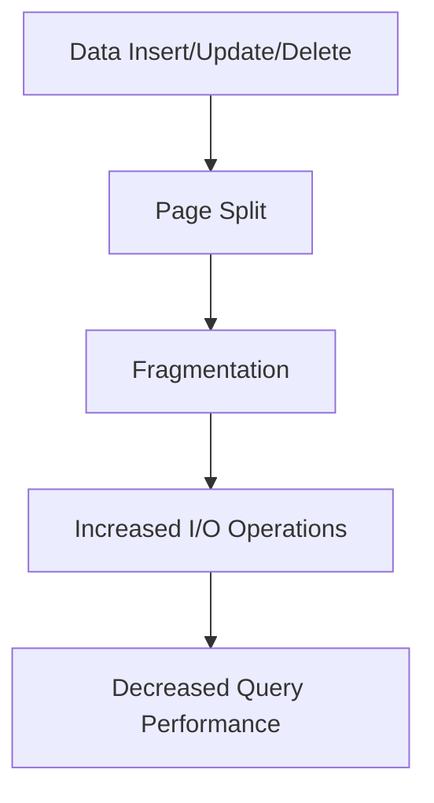

## 7.4 Index Maintenance and Fragmentation

In the realm of SQL databases, indexes play a pivotal role in enhancing query performance. However, like any other database component, indexes require regular maintenance to ensure they function optimally. This section delves into the concepts of index maintenance and fragmentation, offering expert insights into how to manage and optimize indexes effectively.

### Understanding Index Fragmentation

**Fragmentation** occurs when the logical order of pages in an index does not match the physical order on disk. This misalignment can lead to inefficient data retrieval, as the database engine must perform additional I/O operations to access scattered data.

#### Causes of Fragmentation

- **Frequent Inserts, Updates, and Deletes**: These operations can cause pages to split, leading to fragmentation. When a page splits, half of its data is moved to a new page, creating gaps in the index structure.
- **Page Splits**: Occur when a page becomes full, and new data must be inserted. This results in the creation of a new page, disrupting the order.
- **Variable-Length Data Types**: Columns with variable-length data types can contribute to fragmentation as their size changes over time.

#### Impact of Fragmentation

- **Decreased Query Performance**: Fragmented indexes lead to increased I/O operations, slowing down query execution.
- **Increased Storage Requirements**: Fragmentation can cause indexes to consume more disk space than necessary.
- **Higher CPU Usage**: The database engine may require more CPU resources to process fragmented indexes.

### Identifying Fragmentation

To manage fragmentation effectively, it's crucial to identify its presence and extent. SQL databases provide tools and commands to assess fragmentation levels.

#### SQL Server Example

```sql
-- Query to check index fragmentation in SQL Server
SELECT 
    dbschemas.[name] AS 'Schema',
    dbtables.[name] AS 'Table',
    dbindexes.[name] AS 'Index',
    indexstats.avg_fragmentation_in_percent
FROM 
    sys.dm_db_index_physical_stats(DB_ID(), NULL, NULL, NULL, 'LIMITED') AS indexstats
    INNER JOIN sys.tables dbtables ON indexstats.object_id = dbtables.object_id
    INNER JOIN sys.schemas dbschemas ON dbtables.schema_id = dbschemas.schema_id
    INNER JOIN sys.indexes AS dbindexes ON indexstats.object_id = dbindexes.object_id
    AND indexstats.index_id = dbindexes.index_id
WHERE 
    indexstats.avg_fragmentation_in_percent > 10
ORDER BY 
    indexstats.avg_fragmentation_in_percent DESC;
```

> **Explanation**: This query retrieves the average fragmentation percentage for each index in the database, helping identify those that require maintenance.

### Strategies for Index Maintenance

Effective index maintenance involves choosing the right strategy based on the level of fragmentation and the database's availability requirements.

#### Rebuilding Indexes

Rebuilding an index creates a new index structure, eliminating fragmentation. This process can be performed online or offline.

- **Online Rebuild**: Allows concurrent data access during the rebuild process, minimizing downtime.
- **Offline Rebuild**: Requires exclusive access to the index, resulting in downtime but often completes faster than online rebuilds.

```sql
-- Rebuild an index in SQL Server
ALTER INDEX [IndexName] ON [TableName]
REBUILD WITH (ONLINE = ON);
```

> **Explanation**: This command rebuilds the specified index online, allowing continued access to the table during the operation.

#### Reorganizing Indexes

Reorganizing is a less intensive operation that defragments the leaf level of an index. It is suitable for indexes with low to moderate fragmentation.

```sql
-- Reorganize an index in SQL Server
ALTER INDEX [IndexName] ON [TableName]
REORGANIZE;
```

> **Explanation**: This command reorganizes the specified index, reducing fragmentation without requiring exclusive access.

### Automated Maintenance

Automating index maintenance tasks ensures regular optimization without manual intervention. SQL Server provides tools like Maintenance Plans and SQL Server Agent Jobs to schedule these tasks.

#### Creating a Maintenance Plan

1. **Open SQL Server Management Studio (SSMS)**.
2. **Navigate to Management > Maintenance Plans**.
3. **Create a New Maintenance Plan**.
4. **Add Tasks**: Include tasks for rebuilding and reorganizing indexes.
5. **Schedule the Plan**: Set a regular schedule for executing the plan.

### Visualizing Index Fragmentation

To better understand how fragmentation affects index performance, let's visualize the process using a Mermaid.js diagram.



> **Diagram Explanation**: This flowchart illustrates how data modifications lead to page splits, resulting in fragmentation and ultimately affecting query performance.

### Best Practices for Index Maintenance

- **Regular Monitoring**: Continuously monitor index fragmentation levels and adjust maintenance schedules as needed.
- **Choose the Right Method**: Decide between rebuilding and reorganizing based on fragmentation levels and system availability requirements.
- **Automate Tasks**: Use automated tools to schedule regular index maintenance, reducing manual workload.
- **Consider System Resources**: Ensure sufficient system resources are available during maintenance operations to avoid performance degradation.

### Try It Yourself

Experiment with the provided SQL commands by modifying index names and tables to suit your database environment. Observe the impact of rebuilding and reorganizing indexes on query performance.

### References and Further Reading

- [Microsoft Docs: Index Maintenance](https://docs.microsoft.com/en-us/sql/relational-databases/indexes/indexes-overview-database-engine)
- [SQL Server Index Fragmentation](https://www.sqlshack.com/sql-server-index-fragmentation-overview/)
- [Index Maintenance Best Practices](https://www.red-gate.com/simple-talk/sql/performance/sql-server-index-fragmentation/)

### Knowledge Check

- **What causes index fragmentation?**
- **How does fragmentation impact query performance?**
- **What are the differences between rebuilding and reorganizing indexes?**
- **How can you automate index maintenance tasks?**

### Embrace the Journey

Remember, mastering index maintenance is a continuous process. As you gain experience, you'll develop a deeper understanding of how to optimize indexes for peak performance. Keep exploring, stay curious, and enjoy the journey!

## Quiz Time!



### What is the primary cause of index fragmentation?

- [x] Frequent inserts, updates, and deletes
- [ ] Lack of primary keys
- [ ] Using fixed-length data types
- [ ] High CPU usage

> **Explanation:** Index fragmentation is primarily caused by frequent inserts, updates, and deletes, which lead to page splits and disordered data.

### Which operation is less intensive for defragmenting indexes?

- [ ] Rebuilding
- [x] Reorganizing
- [ ] Dropping
- [ ] Backing up

> **Explanation:** Reorganizing is a less intensive operation compared to rebuilding, as it only defragments the leaf level of an index.

### What is the advantage of online index rebuilds?

- [x] Allows concurrent data access
- [ ] Requires less disk space
- [ ] Faster than offline rebuilds
- [ ] No CPU usage

> **Explanation:** Online index rebuilds allow concurrent data access, minimizing downtime during the operation.

### How can you automate index maintenance tasks in SQL Server?

- [ ] Use manual scripts
- [x] Create Maintenance Plans
- [ ] Disable indexes
- [ ] Increase CPU resources

> **Explanation:** SQL Server provides Maintenance Plans to automate index maintenance tasks, reducing the need for manual intervention.

### What tool can you use to check index fragmentation in SQL Server?

- [x] sys.dm_db_index_physical_stats
- [ ] sys.indexes
- [ ] sys.tables
- [ ] sys.schemas

> **Explanation:** The `sys.dm_db_index_physical_stats` function is used to check index fragmentation levels in SQL Server.

### What impact does index fragmentation have on storage requirements?

- [x] Increases storage requirements
- [ ] Decreases storage requirements
- [ ] No impact on storage
- [ ] Reduces disk space

> **Explanation:** Fragmentation can cause indexes to consume more disk space than necessary, increasing storage requirements.

### Which SQL command is used to rebuild an index online?

- [x] ALTER INDEX REBUILD WITH (ONLINE = ON)
- [ ] ALTER INDEX REORGANIZE
- [ ] CREATE INDEX
- [ ] DROP INDEX

> **Explanation:** The `ALTER INDEX REBUILD WITH (ONLINE = ON)` command is used to rebuild an index online in SQL Server.

### What is the effect of page splits on index performance?

- [x] Decreased query performance
- [ ] Improved query performance
- [ ] No effect on performance
- [ ] Reduces CPU usage

> **Explanation:** Page splits lead to fragmentation, which decreases query performance due to increased I/O operations.

### What is a key benefit of automating index maintenance?

- [x] Reduces manual workload
- [ ] Eliminates the need for indexes
- [ ] Increases CPU usage
- [ ] Decreases data integrity

> **Explanation:** Automating index maintenance reduces the manual workload required to keep indexes optimized.

### True or False: Reorganizing an index requires exclusive access to the index.

- [ ] True
- [x] False

> **Explanation:** Reorganizing an index does not require exclusive access, making it suitable for low to moderate fragmentation levels.




