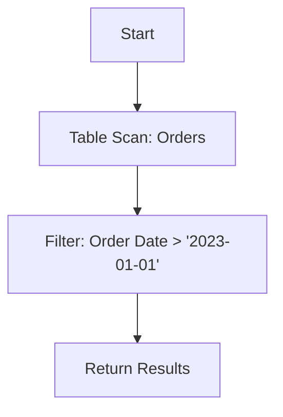

## 7.5 Query Execution Plans and Analysis

In the realm of SQL and database management, understanding how queries are executed is crucial for optimizing performance. Query execution plans provide a window into the internal workings of the database engine, offering insights into how queries are processed and where potential inefficiencies lie. In this section, we will explore the purpose and components of execution plans, delve into tools for analysis, and discuss strategies for optimizing queries.

### Execution Plans: Visualizing Query Processing

#### Purpose of Execution Plans

Execution plans serve as a roadmap for how a database engine executes a query. They reveal the sequence of operations performed, the methods used to access data, and the flow of data through the system. By examining execution plans, developers and database administrators can identify bottlenecks, understand the cost of different operations, and make informed decisions to enhance query performance.

#### Components of Execution Plans

Execution plans consist of several key components that provide detailed information about query execution:

- **Operators**: These are the building blocks of execution plans, representing actions such as table scans, joins, and aggregations. Each operator performs a specific task in the query execution process.

- **Costs**: Execution plans include estimated costs for each operation, which help in understanding the resource consumption of different parts of the query. Costs are typically expressed in terms of CPU and I/O usage.

- **Estimated vs. Actual Rows**: Execution plans often display both estimated and actual row counts for operations. Discrepancies between these values can indicate issues with statistics or query optimization.

#### Visualizing Execution Plans

Execution plans can be visualized in various formats, including text-based representations and graphical diagrams. Text-based plans provide a detailed breakdown of operations, while graphical plans offer a more intuitive view of the query execution flow.

```sql
-- Example of a text-based execution plan using EXPLAIN
EXPLAIN SELECT * FROM orders WHERE order_date > '2023-01-01';
```

### Analysis Tools: Unveiling Query Execution

To analyze execution plans effectively, several tools and commands are available across different database systems. These tools help in generating and interpreting execution plans, allowing for a deeper understanding of query performance.

#### Using EXPLAIN and SHOW PLAN

The `EXPLAIN` command is a powerful tool for generating execution plans in many SQL databases. It provides a detailed breakdown of how a query will be executed, including the order of operations and the methods used to access data.

```sql
-- Using EXPLAIN to analyze a query
EXPLAIN SELECT customer_id, SUM(amount) FROM orders GROUP BY customer_id;
```

In some databases, the `SHOW PLAN` command or similar tools are used to display execution plans. These commands often provide additional details, such as the execution time and resource usage.

#### Graphical Tools for Execution Plan Analysis

Many database management systems offer graphical tools for analyzing execution plans. These tools provide a visual representation of the query execution process, making it easier to identify complex operations and potential bottlenecks.

- **SQL Server Management Studio (SSMS)**: Offers a graphical execution plan viewer that highlights costly operations and suggests optimizations.

- **pgAdmin**: Provides a graphical interface for PostgreSQL, allowing users to visualize and analyze execution plans.

- **MySQL Workbench**: Includes an execution plan viewer that displays the query execution flow and highlights areas for improvement.

### Optimizing Queries: Identifying Bottlenecks

Once execution plans are generated and analyzed, the next step is to optimize queries by addressing identified bottlenecks and inefficiencies. Here are some strategies for optimizing SQL queries:

#### Identifying Inefficient Operations

Execution plans can reveal inefficient operations, such as full table scans or costly joins. By examining these operations, developers can identify areas where optimization is needed.

- **Full Table Scans**: These occur when the database engine reads an entire table to retrieve results. Consider adding indexes to reduce the need for full table scans.

- **Costly Joins**: Joins can be resource-intensive, especially when involving large tables. Analyze join conditions and consider using indexes to improve performance.

#### Improving Index Usage

Indexes play a crucial role in query optimization by allowing the database engine to access data more efficiently. Execution plans can highlight whether indexes are being used effectively.

- **Index Selection**: Ensure that the right indexes are in place for frequently queried columns. Use composite indexes for queries involving multiple columns.

- **Index Maintenance**: Regularly update and maintain indexes to ensure optimal performance. Consider rebuilding or reorganizing fragmented indexes.

#### Optimizing Query Structure

The structure of a query can significantly impact its performance. Execution plans can help identify areas where query structure can be improved.

- **Subqueries and CTEs**: Consider using Common Table Expressions (CTEs) to simplify complex queries and improve readability.

- **Query Rewriting**: Rewrite queries to eliminate unnecessary operations or simplify complex logic. Use set-based operations instead of row-by-row processing.

### Visualizing Query Execution with Mermaid.js

To better understand the flow of query execution, we can use Mermaid.js to create a visual representation of an execution plan. Below is an example of a simple execution plan diagram:



This diagram illustrates a basic execution plan for a query that scans the `orders` table, applies a filter on the `order_date` column, and returns the results.

### Try It Yourself: Experimenting with Execution Plans

To deepen your understanding of execution plans, try experimenting with different queries and analyzing their execution plans. Here are some suggestions:

- Modify the query structure and observe how the execution plan changes.
- Add or remove indexes and analyze the impact on query performance.
- Experiment with different join types and observe their effect on execution plans.

### References and Further Reading

For more information on query execution plans and optimization, consider exploring the following resources:

- [SQL Server Execution Plans](https://docs.microsoft.com/en-us/sql/relational-databases/performance/execution-plans)
- [PostgreSQL EXPLAIN Documentation](https://www.postgresql.org/docs/current/sql-explain.html)
- [MySQL EXPLAIN Documentation](https://dev.mysql.com/doc/refman/8.0/en/explain.html)

### Knowledge Check

Before moving on, take a moment to reflect on what you've learned about query execution plans and analysis. Consider the following questions:

- How do execution plans help in optimizing SQL queries?
- What are some common tools for generating and analyzing execution plans?
- How can indexes be used to improve query performance?

### Embrace the Journey

Remember, mastering query execution plans and analysis is a journey. As you continue to explore and experiment, you'll gain deeper insights into the inner workings of SQL databases. Keep refining your skills, stay curious, and enjoy the process of optimizing your queries for peak performance!

## Quiz Time!



### What is the primary purpose of an execution plan?

- [x] To visualize how the database engine processes queries
- [ ] To generate SQL code
- [ ] To create database schemas
- [ ] To manage user permissions

> **Explanation:** Execution plans provide a roadmap for how a database engine executes a query, revealing the sequence of operations performed.

### Which component of an execution plan represents actions such as table scans and joins?

- [x] Operators
- [ ] Costs
- [ ] Estimated rows
- [ ] Actual rows

> **Explanation:** Operators are the building blocks of execution plans, representing actions like table scans and joins.

### What command is commonly used to generate execution plans in SQL databases?

- [x] EXPLAIN
- [ ] SELECT
- [ ] INSERT
- [ ] DELETE

> **Explanation:** The EXPLAIN command is used to generate execution plans in many SQL databases.

### How can indexes improve query performance?

- [x] By allowing the database engine to access data more efficiently
- [ ] By increasing the size of the database
- [ ] By slowing down query execution
- [ ] By removing duplicate data

> **Explanation:** Indexes improve query performance by allowing the database engine to access data more efficiently.

### What is a common issue that execution plans can help identify?

- [x] Full table scans
- [ ] Data redundancy
- [ ] Schema design flaws
- [ ] User authentication problems

> **Explanation:** Execution plans can reveal inefficient operations like full table scans, which can be optimized.

### Which tool provides a graphical interface for analyzing execution plans in PostgreSQL?

- [x] pgAdmin
- [ ] MySQL Workbench
- [ ] SQL Server Management Studio
- [ ] Oracle SQL Developer

> **Explanation:** pgAdmin provides a graphical interface for analyzing execution plans in PostgreSQL.

### What is a key benefit of using Common Table Expressions (CTEs) in query optimization?

- [x] Simplifying complex queries and improving readability
- [ ] Increasing query execution time
- [ ] Reducing database size
- [ ] Enhancing data security

> **Explanation:** CTEs simplify complex queries and improve readability, aiding in query optimization.

### What does a discrepancy between estimated and actual rows in an execution plan indicate?

- [x] Issues with statistics or query optimization
- [ ] A syntax error in the query
- [ ] A missing index
- [ ] A security vulnerability

> **Explanation:** Discrepancies between estimated and actual rows can indicate issues with statistics or query optimization.

### How can query rewriting help in optimization?

- [x] By eliminating unnecessary operations or simplifying complex logic
- [ ] By adding more operations to the query
- [ ] By increasing the number of joins
- [ ] By duplicating data

> **Explanation:** Query rewriting can help optimize queries by eliminating unnecessary operations or simplifying complex logic.

### True or False: Execution plans are only useful for complex queries.

- [ ] True
- [x] False

> **Explanation:** Execution plans are useful for both simple and complex queries, providing insights into query execution and optimization opportunities.


