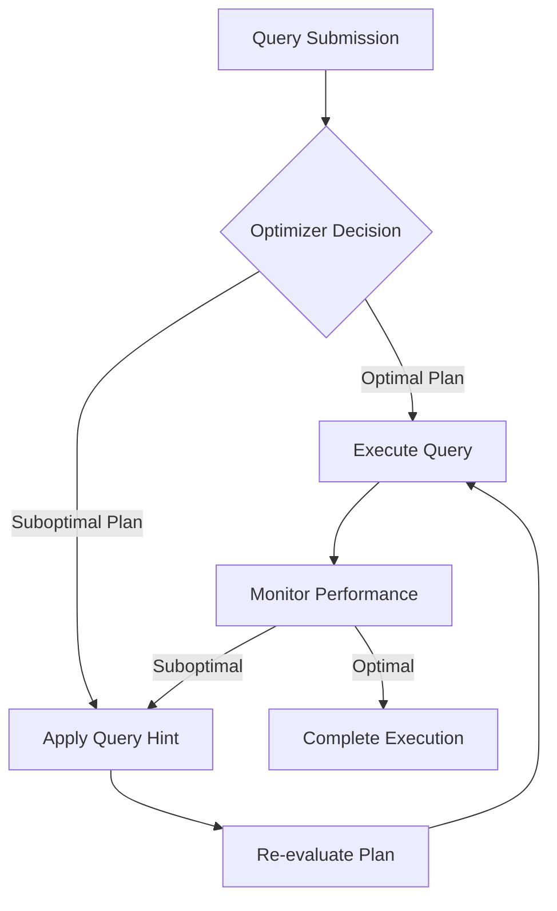

## 7.6 Query Hints and Execution Plan Control

In the realm of SQL performance optimization, understanding how to guide the query optimizer can be a game-changer. Query hints and execution plan control are powerful tools that allow you to influence the behavior of the SQL query optimizer, ensuring that your queries run as efficiently as possible. In this section, we will delve into the purpose of query hints, explore various examples, discuss when and how to use them, and highlight the potential risks involved. We will also cover execution plan control, providing insights into how you can manage and optimize execution plans for better performance.

### Understanding Query Hints

#### Purpose of Query Hints

Query hints are directives that you can provide to the SQL query optimizer to influence its decision-making process. The optimizer is responsible for determining the most efficient way to execute a query, considering factors such as available indexes, join methods, and data distribution. However, there are situations where the optimizer may not choose the optimal plan due to complex query structures or outdated statistics. In such cases, query hints can be used to guide the optimizer towards a more efficient execution plan.

#### Examples of Query Hints

1. **Index Hints**: Force the optimizer to use a specific index.
   ```sql
   SELECT * FROM Employees WITH (INDEX(EmployeeIndex))
   WHERE Department = 'Sales';
   ```
   *Comment*: This hint forces the use of `EmployeeIndex` for the query.

2. **Join Hints**: Specify the join method to be used.
   ```sql
   SELECT * FROM Orders o
   INNER LOOP JOIN Customers c ON o.CustomerID = c.CustomerID;
   ```
   *Comment*: This hint forces the use of a loop join.

3. **Force Order**: Maintain the order of joins as specified in the query.
   ```sql
   SELECT * FROM TableA a
   INNER JOIN TableB b ON a.ID = b.ID
   OPTION (FORCE ORDER);
   ```
   *Comment*: This hint forces the optimizer to join `TableA` and `TableB` in the order specified.

4. **Max Degree of Parallelism (MAXDOP)**: Control the number of processors used for parallel plan execution.
   ```sql
   SELECT * FROM LargeTable
   OPTION (MAXDOP 1);
   ```
   *Comment*: This hint restricts the query to use only one processor.

### When to Use Query Hints

Query hints should be used judiciously and typically as a last resort. Here are some scenarios where query hints might be beneficial:

- **Suboptimal Execution Plans**: When the optimizer consistently chooses a suboptimal plan due to outdated statistics or complex query structures.
- **Specific Performance Requirements**: When you have specific performance requirements that the default execution plan does not meet.
- **Testing and Troubleshooting**: During testing or troubleshooting to determine the impact of different execution strategies.

### Risks of Using Query Hints

While query hints can be powerful, they come with certain risks:

- **Outdated Hints**: As the database schema evolves, hints may become outdated and lead to suboptimal performance.
- **Overriding Optimizer Intelligence**: The optimizer is designed to adapt to changes in data distribution and system resources. Overriding its decisions can lead to inefficiencies.
- **Maintenance Overhead**: Hints add complexity to query maintenance and can make the codebase harder to manage.

### Execution Plan Control

Execution plans are the blueprints that the SQL Server uses to execute queries. Understanding and controlling execution plans is crucial for optimizing query performance.

#### Viewing Execution Plans

Execution plans can be viewed in various formats:

- **Graphical Execution Plan**: Provides a visual representation of the execution plan.
- **Textual Execution Plan**: Displays the execution plan in a text format.
- **XML Execution Plan**: Offers a detailed XML representation of the execution plan.

#### Analyzing Execution Plans

When analyzing execution plans, focus on the following key elements:

- **Index Usage**: Check if the appropriate indexes are being used.
- **Join Types**: Analyze the join methods used (e.g., nested loop, hash join).
- **Data Access Methods**: Determine how data is being accessed (e.g., table scan, index seek).

#### Controlling Execution Plans

1. **Plan Guides**: Use plan guides to influence the execution plan without modifying the query.
   ```sql
   EXEC sp_create_plan_guide
   @name = N'Guide1',
   @stmt = N'SELECT * FROM Sales WHERE Region = ''West''',
   @type = N'SQL',
   @module_or_batch = NULL,
   @params = NULL,
   @hints = N'OPTION (HASH JOIN)';
   ```
   *Comment*: This plan guide forces the use of a hash join for the specified query.

2. **Plan Freezing**: Use plan freezing to lock in a specific execution plan.
   ```sql
   ALTER DATABASE CURRENT SET QUERY_STORE = ON;
   ```
   *Comment*: Enables the Query Store feature to capture and freeze execution plans.

3. **Query Store**: Utilize the Query Store feature to monitor and manage execution plans over time.

### Visualizing Execution Plan Control

To better understand the flow of execution plan control, let's visualize the process using a flowchart.



*Caption*: This flowchart illustrates the decision-making process in execution plan control, highlighting the role of query hints in optimizing performance.

### Try It Yourself

Experiment with the following code examples to see the impact of query hints on execution plans. Try modifying the hints and observe the changes in performance.

```sql
-- Example 1: Using an Index Hint
SELECT * FROM Products WITH (INDEX(ProductIndex))
WHERE Category = 'Electronics';

-- Example 2: Forcing a Loop Join
SELECT * FROM Sales s
INNER LOOP JOIN Customers c ON s.CustomerID = c.CustomerID;

-- Example 3: Restricting Parallelism
SELECT * FROM Transactions
OPTION (MAXDOP 1);
```

### Knowledge Check

- **What are query hints, and why are they used?**
- **When should query hints be avoided?**
- **How can execution plans be controlled without modifying the query?**

### Key Takeaways

- Query hints are powerful tools for influencing the SQL query optimizer.
- Use query hints sparingly and only when necessary.
- Execution plans provide insights into query performance and can be controlled through various methods.

### References and Further Reading

- [Microsoft Docs: Query Hints](https://docs.microsoft.com/en-us/sql/t-sql/queries/hints-transact-sql-query)
- [SQL Server Execution Plans](https://www.red-gate.com/simple-talk/sql/performance/execution-plan-basics/)
- [Query Store in SQL Server](https://docs.microsoft.com/en-us/sql/relational-databases/performance/monitoring-performance-by-using-the-query-store)

### Embrace the Journey

Remember, mastering query hints and execution plan control is a journey. As you gain experience, you'll develop a deeper understanding of how to optimize SQL performance effectively. Keep experimenting, stay curious, and enjoy the process!

## Quiz Time!



### What is the primary purpose of query hints?

- [x] To provide directives to the query optimizer
- [ ] To replace the query optimizer
- [ ] To automatically update indexes
- [ ] To execute queries faster without optimization

> **Explanation:** Query hints are used to provide specific directives to the query optimizer to influence its decision-making process.

### When should query hints be used?

- [x] As a last resort when the optimizer chooses suboptimal plans
- [ ] As the first option for all queries
- [ ] Only for SELECT statements
- [ ] Only for INSERT statements

> **Explanation:** Query hints should be used as a last resort when the optimizer consistently chooses suboptimal plans.

### What is a potential risk of using query hints?

- [x] They may become outdated with schema changes
- [ ] They automatically update with schema changes
- [ ] They improve performance without any risks
- [ ] They are always the best option

> **Explanation:** Query hints may become outdated with schema changes, leading to suboptimal performance.

### Which of the following is a type of query hint?

- [x] Index Hint
- [ ] Data Hint
- [ ] Schema Hint
- [ ] Table Hint

> **Explanation:** Index Hint is a type of query hint used to force the optimizer to use a specific index.

### How can execution plans be controlled without modifying the query?

- [x] Using Plan Guides
- [ ] Using Data Hints
- [ ] Using Schema Changes
- [ ] Using Table Modifications

> **Explanation:** Plan Guides can be used to influence execution plans without modifying the query.

### What is the role of the Query Store feature?

- [x] To monitor and manage execution plans over time
- [ ] To automatically optimize all queries
- [ ] To replace the query optimizer
- [ ] To execute queries without plans

> **Explanation:** The Query Store feature is used to monitor and manage execution plans over time.

### What is the benefit of using the MAXDOP query hint?

- [x] It controls the number of processors used for parallel plan execution
- [ ] It increases the number of processors used for all queries
- [ ] It decreases the number of processors used for all queries
- [ ] It automatically optimizes the query

> **Explanation:** The MAXDOP query hint controls the number of processors used for parallel plan execution.

### Which join method can be forced using a query hint?

- [x] Loop Join
- [ ] Data Join
- [ ] Schema Join
- [ ] Table Join

> **Explanation:** A Loop Join can be forced using a query hint.

### What is a graphical execution plan?

- [x] A visual representation of the execution plan
- [ ] A text representation of the execution plan
- [ ] An XML representation of the execution plan
- [ ] A binary representation of the execution plan

> **Explanation:** A graphical execution plan provides a visual representation of the execution plan.

### True or False: Query hints should be used frequently for all queries.

- [ ] True
- [x] False

> **Explanation:** Query hints should be used sparingly and typically as a last resort when the optimizer chooses suboptimal plans.


