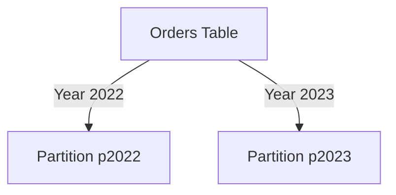
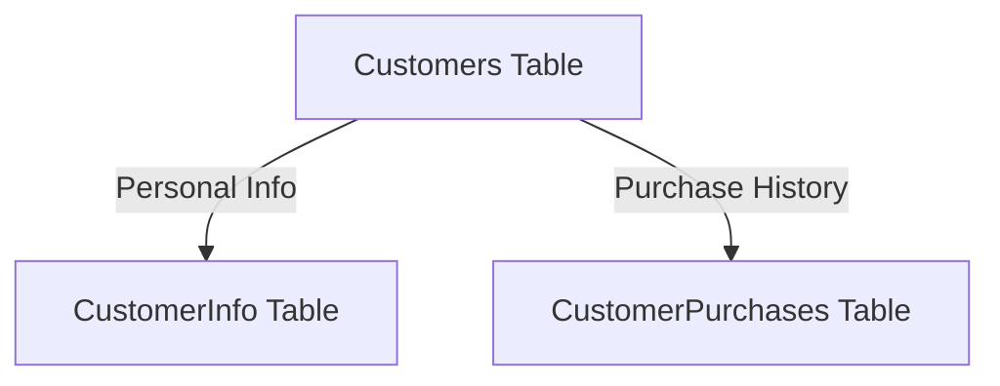
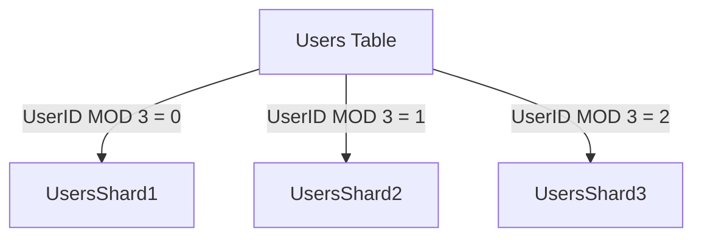

## 7.7 Partitioning and Sharding Data

In the realm of SQL databases, managing large volumes of data efficiently is crucial for maintaining performance and scalability. Two powerful techniques that address these challenges are **partitioning** and **sharding**. These methods allow databases to handle large datasets by dividing them into smaller, more manageable pieces, thereby improving performance and simplifying maintenance. In this section, we will delve into the concepts of partitioning and sharding, explore their types and benefits, and provide practical examples to illustrate their implementation.

### Partitioning

Partitioning is a database design pattern that involves dividing a large table into smaller, more manageable pieces, known as partitions. This can significantly enhance query performance and ease maintenance tasks. Let's explore the different types of partitioning and their benefits.

#### Purpose of Partitioning

The primary purpose of partitioning is to improve database performance and manageability. By breaking down a large table into smaller partitions, you can:

- **Enhance Query Performance**: Queries can be executed more efficiently by scanning only the relevant partitions instead of the entire table.
- **Simplify Maintenance**: Maintenance tasks such as backups, restores, and index rebuilding can be performed on individual partitions, reducing downtime and resource usage.
- **Improve Data Management**: Partitioning allows for better data organization, making it easier to manage data lifecycle policies, such as archiving or purging old data.

#### Types of Partitioning

Partitioning can be categorized into two main types: horizontal partitioning and vertical partitioning.

##### Horizontal Partitioning

Horizontal partitioning, also known as row-based partitioning, involves dividing a table into smaller tables, each containing a subset of the rows. This is typically done based on a partition key, such as a date or a range of values.

**Example**: Consider a sales database with a large `Orders` table. You can partition this table by year, creating separate partitions for each year's data.

```sql
-- Create a partitioned table
CREATE TABLE Orders (
    OrderID INT,
    OrderDate DATE,
    CustomerID INT,
    Amount DECIMAL(10, 2)
)
PARTITION BY RANGE (YEAR(OrderDate)) (
    PARTITION p2022 VALUES LESS THAN (2023),
    PARTITION p2023 VALUES LESS THAN (2024)
);
```

In this example, the `Orders` table is partitioned by year, with separate partitions for orders from 2022 and 2023.

##### Vertical Partitioning

Vertical partitioning involves splitting a table into smaller tables, each containing a subset of the columns. This is useful when certain columns are accessed more frequently than others.

**Example**: Consider a `Customers` table with columns for personal information and purchase history. You can partition this table vertically to separate frequently accessed columns from less frequently accessed ones.

```sql
-- Create vertically partitioned tables
CREATE TABLE CustomerInfo (
    CustomerID INT PRIMARY KEY,
    FirstName VARCHAR(50),
    LastName VARCHAR(50),
    Email VARCHAR(100)
);

CREATE TABLE CustomerPurchases (
    CustomerID INT,
    PurchaseDate DATE,
    Amount DECIMAL(10, 2),
    FOREIGN KEY (CustomerID) REFERENCES CustomerInfo(CustomerID)
);
```

In this example, the `CustomerInfo` table contains personal information, while the `CustomerPurchases` table contains purchase history.

#### Benefits of Partitioning

Partitioning offers several benefits, including:

- **Improved Query Performance**: By scanning only relevant partitions, queries can be executed more quickly.
- **Efficient Maintenance**: Maintenance tasks can be performed on individual partitions, reducing downtime and resource usage.
- **Enhanced Data Management**: Partitioning allows for better organization and management of data lifecycle policies.

### Sharding

Sharding is a technique used to distribute data across multiple servers, or shards, to improve scalability and performance. It is particularly useful for handling large datasets and high-traffic applications.

#### Concept of Sharding

Sharding involves dividing a database into smaller, more manageable pieces, known as shards. Each shard is hosted on a separate server, allowing for parallel processing and improved performance.

**Example**: Consider a social media application with a large `Users` table. You can shard this table based on user ID, distributing users across multiple servers.

```sql
-- Pseudocode for sharding users
IF userID MOD 3 = 0 THEN
    INSERT INTO UsersShard1 VALUES (...);
ELSE IF userID MOD 3 = 1 THEN
    INSERT INTO UsersShard2 VALUES (...);
ELSE
    INSERT INTO UsersShard3 VALUES (...);
```

In this example, users are distributed across three shards based on their user ID.

#### Challenges of Sharding

While sharding offers significant benefits, it also introduces challenges, including:

- **Complexity in Querying**: Queries that span multiple shards can be complex and require additional logic to aggregate results.
- **Consistency Maintenance**: Ensuring data consistency across shards can be challenging, especially in distributed systems.
- **Increased Operational Overhead**: Managing multiple shards requires additional resources and infrastructure.

#### Sharding Strategies

There are several strategies for implementing sharding, including:

- **Range-Based Sharding**: Data is divided into shards based on a range of values, such as date ranges or numerical ranges.
- **Hash-Based Sharding**: Data is distributed across shards using a hash function, which evenly distributes data based on a hash key.
- **Geographic Sharding**: Data is divided into shards based on geographic location, which can improve performance for location-based queries.

### Visualizing Partitioning and Sharding

To better understand the concepts of partitioning and sharding, let's visualize them using Mermaid.js diagrams.

#### Horizontal Partitioning



*Figure 1: Horizontal Partitioning of an Orders Table by Year*

#### Vertical Partitioning



*Figure 2: Vertical Partitioning of a Customers Table*

#### Sharding



*Figure 3: Sharding of a Users Table Across Three Shards*

### Design Considerations

When implementing partitioning and sharding, consider the following:

- **Data Access Patterns**: Analyze how data is accessed to determine the most appropriate partitioning or sharding strategy.
- **Scalability Requirements**: Consider future growth and scalability needs when designing partitioning and sharding solutions.
- **Consistency and Availability**: Balance the need for data consistency with the availability and performance requirements of your application.

### Differences and Similarities

While partitioning and sharding both involve dividing data into smaller pieces, they differ in scope and implementation:

- **Partitioning** is typically applied within a single database instance, while **sharding** involves distributing data across multiple servers.
- **Partitioning** is often used to improve query performance and manageability, while **sharding** is used to enhance scalability and handle large datasets.

### Try It Yourself

To gain hands-on experience with partitioning and sharding, try the following exercises:

1. **Implement Horizontal Partitioning**: Create a partitioned table in your database and experiment with querying different partitions.
2. **Experiment with Vertical Partitioning**: Split a table into two smaller tables and observe the impact on query performance.
3. **Simulate Sharding**: Use a hash function to distribute data across multiple tables and practice querying data from multiple shards.

### References and Links

For further reading on partitioning and sharding, consider the following resources:

- [PostgreSQL Partitioning](https://www.postgresql.org/docs/current/ddl-partitioning.html)
- [MySQL Partitioning](https://dev.mysql.com/doc/refman/8.0/en/partitioning.html)
- [Sharding in MongoDB](https://docs.mongodb.com/manual/sharding/)

### Knowledge Check

To reinforce your understanding of partitioning and sharding, consider the following questions:

1. What are the main benefits of partitioning a database table?
2. How does horizontal partitioning differ from vertical partitioning?
3. What are the challenges associated with sharding?
4. How can you determine the most appropriate sharding strategy for your application?

### Embrace the Journey

Remember, mastering partitioning and sharding is an ongoing journey. As you experiment with these techniques, you'll gain valuable insights into optimizing database performance and scalability. Keep exploring, stay curious, and enjoy the process!

## Quiz Time!



### What is the primary purpose of partitioning a database table?

- [x] To improve query performance and manageability
- [ ] To increase data redundancy
- [ ] To enhance data security
- [ ] To simplify data modeling

> **Explanation:** Partitioning is primarily used to improve query performance and manageability by dividing a large table into smaller, more manageable pieces.

### Which type of partitioning involves dividing a table into smaller tables based on rows?

- [x] Horizontal Partitioning
- [ ] Vertical Partitioning
- [ ] Range Partitioning
- [ ] Hash Partitioning

> **Explanation:** Horizontal partitioning involves dividing a table into smaller tables, each containing a subset of the rows.

### What is a key challenge associated with sharding?

- [x] Complexity in querying and maintaining consistency
- [ ] Increased data redundancy
- [ ] Simplified data modeling
- [ ] Enhanced data security

> **Explanation:** Sharding introduces complexity in querying and maintaining consistency across multiple shards.

### Which sharding strategy uses a hash function to distribute data?

- [x] Hash-Based Sharding
- [ ] Range-Based Sharding
- [ ] Geographic Sharding
- [ ] Vertical Sharding

> **Explanation:** Hash-based sharding uses a hash function to evenly distribute data across shards.

### What is the difference between partitioning and sharding?

- [x] Partitioning is within a single database instance, while sharding is across multiple servers.
- [ ] Partitioning is for data security, while sharding is for data redundancy.
- [ ] Partitioning is for data modeling, while sharding is for data consistency.
- [ ] Partitioning is for data redundancy, while sharding is for data security.

> **Explanation:** Partitioning is typically applied within a single database instance, while sharding involves distributing data across multiple servers.

### Which partitioning type is useful for separating frequently accessed columns from less frequently accessed ones?

- [x] Vertical Partitioning
- [ ] Horizontal Partitioning
- [ ] Range Partitioning
- [ ] Hash Partitioning

> **Explanation:** Vertical partitioning involves splitting a table into smaller tables, each containing a subset of the columns, which is useful for separating frequently accessed columns.

### What is a benefit of using partitioning in a database?

- [x] Improved query performance
- [ ] Increased data redundancy
- [ ] Enhanced data security
- [ ] Simplified data modeling

> **Explanation:** Partitioning improves query performance by allowing queries to scan only the relevant partitions.

### Which sharding strategy divides data based on geographic location?

- [x] Geographic Sharding
- [ ] Hash-Based Sharding
- [ ] Range-Based Sharding
- [ ] Vertical Sharding

> **Explanation:** Geographic sharding divides data into shards based on geographic location, which can improve performance for location-based queries.

### What should be considered when implementing partitioning and sharding?

- [x] Data access patterns and scalability requirements
- [ ] Data redundancy and security
- [ ] Data modeling and consistency
- [ ] Data redundancy and modeling

> **Explanation:** When implementing partitioning and sharding, consider data access patterns and scalability requirements.

### True or False: Sharding is typically used to improve query performance within a single database instance.

- [ ] True
- [x] False

> **Explanation:** Sharding is used to enhance scalability and handle large datasets by distributing data across multiple servers, not just within a single database instance.


