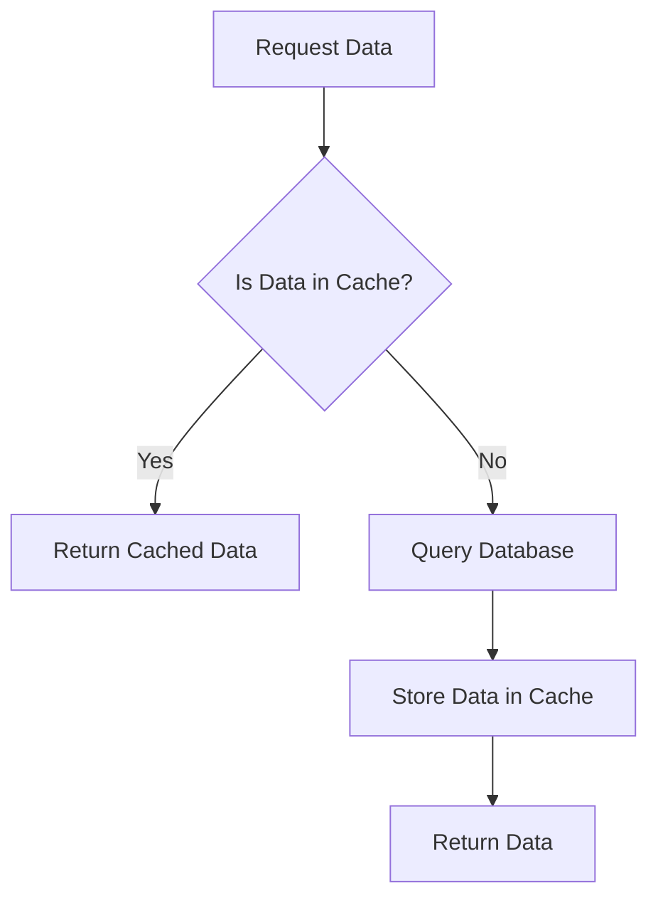

## 7.8 Using Caching Mechanisms

In the realm of database management, caching mechanisms play a pivotal role in enhancing performance by reducing the load on databases and improving response times for frequently accessed data. In this section, we will delve into the purpose of caching, explore various techniques such as in-memory caching and application-level caching, and discuss strategies for cache invalidation to ensure data freshness.

### Purpose of Caching

Caching is a technique used to store copies of data in a temporary storage location, or cache, so that future requests for that data can be served faster. The primary purpose of caching is to reduce the load on the database by minimizing the number of direct database queries, thereby enhancing the overall performance of the system.

### Techniques for Caching

#### In-Memory Caching

In-memory caching involves storing data in the main memory (RAM) of a server, allowing for rapid data retrieval. This technique is particularly effective for read-heavy workloads where the same data is accessed frequently. Two popular tools for in-memory caching are Redis and Memcached.

##### Redis

Redis is an open-source, in-memory data structure store that can be used as a database, cache, and message broker. It supports various data structures such as strings, hashes, lists, sets, and more.

```sql
-- Example of using Redis for caching
-- Assume we have a function to get data from the database
function getDataFromDatabase(query) {
    // Simulate database access
    return "Database Result";
}

// Function to get data with caching
function getDataWithCache(query) {
    // Check if data is in Redis cache
    let cachedData = redis.get(query);
    if (cachedData) {
        return cachedData; // Return cached data
    } else {
        let data = getDataFromDatabase(query);
        redis.set(query, data); // Store data in cache
        return data;
    }
}
```

##### Memcached

Memcached is another high-performance, distributed memory object caching system. It is designed to speed up dynamic web applications by alleviating database load.

```sql
-- Example of using Memcached for caching
-- Assume we have a function to get data from the database
function getDataFromDatabase(query) {
    // Simulate database access
    return "Database Result";
}

// Function to get data with caching
function getDataWithCache(query) {
    // Check if data is in Memcached
    let cachedData = memcached.get(query);
    if (cachedData) {
        return cachedData; // Return cached data
    } else {
        let data = getDataFromDatabase(query);
        memcached.set(query, data); // Store data in cache
        return data;
    }
}
```

#### Application-Level Caching

Application-level caching involves implementing caching mechanisms within the application layer. This approach allows developers to control caching logic and strategies directly within the application code.

```sql
-- Example of application-level caching in a web application
let cache = {}; // Simple in-memory cache object

function getData(query) {
    if (cache[query]) {
        return cache[query]; // Return cached data
    } else {
        let data = getDataFromDatabase(query);
        cache[query] = data; // Store data in cache
        return data;
    }
}
```

### Cache Invalidation Strategies

Cache invalidation is the process of removing or updating stale data in the cache to ensure that the cache remains consistent with the underlying database. Effective cache invalidation strategies are crucial for maintaining data accuracy.

#### Time-Based Invalidation

Time-based invalidation involves setting a time-to-live (TTL) for cached data, after which the data is automatically removed from the cache.

```sql
-- Example of time-based invalidation using Redis
redis.setex(query, ttl, data); // Set data with TTL
```

#### Event-Based Invalidation

Event-based invalidation involves updating or removing cached data in response to specific events, such as data updates or deletions in the database.

```sql
-- Example of event-based invalidation
function updateData(query, newData) {
    updateDatabase(query, newData); // Update database
    redis.del(query); // Invalidate cache
}
```

#### Manual Invalidation

Manual invalidation requires explicit actions by developers to remove or update cached data. This approach is useful for complex scenarios where automatic invalidation is not feasible.

```sql
-- Example of manual invalidation
function invalidateCache(query) {
    redis.del(query); // Manually remove data from cache
}
```

### Visualizing Caching Mechanisms

To better understand caching mechanisms, let's visualize the process using a flowchart.



**Figure 1: Caching Mechanism Flowchart**

This flowchart illustrates the decision-making process involved in caching. When a data request is made, the system first checks if the data is available in the cache. If it is, the cached data is returned. If not, the system queries the database, stores the retrieved data in the cache, and then returns the data.

### Design Considerations

When implementing caching mechanisms, consider the following:

- **Data Volatility**: Frequently changing data may not benefit from caching due to the overhead of cache invalidation.
- **Cache Size**: Ensure that the cache size is sufficient to store frequently accessed data without consuming excessive memory.
- **Consistency**: Implement strategies to maintain consistency between the cache and the database.
- **Security**: Protect cached data from unauthorized access, especially when caching sensitive information.

### Differences and Similarities

Caching mechanisms can be confused with other performance optimization techniques such as indexing. While both aim to improve performance, caching reduces database load by storing data in memory, whereas indexing improves query performance by organizing data for faster retrieval.

### Try It Yourself

Experiment with the caching examples provided by modifying the cache size, TTL values, or implementing different invalidation strategies. Observe how these changes impact the performance and consistency of your application.

### Knowledge Check

- What is the primary purpose of caching?
- How does in-memory caching differ from application-level caching?
- What are some common tools used for in-memory caching?
- Why is cache invalidation important?
- Describe a scenario where manual cache invalidation would be necessary.

### Embrace the Journey

Remember, mastering caching mechanisms is a journey. As you continue to explore and implement these techniques, you'll gain a deeper understanding of how to optimize database performance effectively. Keep experimenting, stay curious, and enjoy the process!

## Quiz Time!



### What is the primary purpose of caching in database systems?

- [x] To reduce database load and improve response times
- [ ] To increase database storage capacity
- [ ] To enhance database security
- [ ] To simplify database queries

> **Explanation:** Caching is primarily used to reduce the load on databases and improve response times by storing frequently accessed data in a temporary storage location.

### Which of the following is a popular tool for in-memory caching?

- [x] Redis
- [ ] MySQL
- [ ] PostgreSQL
- [ ] SQLite

> **Explanation:** Redis is a popular in-memory data structure store used for caching, among other purposes.

### What is a key difference between in-memory caching and application-level caching?

- [x] In-memory caching stores data in RAM, while application-level caching is implemented within the application code.
- [ ] In-memory caching is slower than application-level caching.
- [ ] Application-level caching requires a separate server.
- [ ] In-memory caching is only used for write-heavy workloads.

> **Explanation:** In-memory caching stores data in RAM for rapid access, whereas application-level caching involves implementing caching logic within the application code.

### What is cache invalidation?

- [x] The process of removing or updating stale data in the cache
- [ ] The process of increasing cache size
- [ ] The process of encrypting cached data
- [ ] The process of backing up cached data

> **Explanation:** Cache invalidation ensures that the cache remains consistent with the underlying database by removing or updating stale data.

### Which cache invalidation strategy involves setting a time-to-live (TTL) for cached data?

- [x] Time-Based Invalidation
- [ ] Event-Based Invalidation
- [ ] Manual Invalidation
- [ ] Automatic Invalidation

> **Explanation:** Time-based invalidation involves setting a TTL for cached data, after which the data is automatically removed from the cache.

### Why is cache size an important consideration in caching mechanisms?

- [x] To ensure sufficient storage for frequently accessed data without consuming excessive memory
- [ ] To increase the speed of database queries
- [ ] To enhance data security
- [ ] To simplify application code

> **Explanation:** Cache size is important to ensure that there is enough storage for frequently accessed data while avoiding excessive memory consumption.

### What is a potential drawback of caching frequently changing data?

- [x] The overhead of cache invalidation may outweigh the benefits
- [ ] The data may become more secure
- [ ] The data may become less accessible
- [ ] The cache may become more efficient

> **Explanation:** Frequently changing data may not benefit from caching due to the overhead of constantly invalidating and updating the cache.

### How can cached data be protected from unauthorized access?

- [x] By implementing security measures such as encryption and access controls
- [ ] By increasing the cache size
- [ ] By using a slower caching mechanism
- [ ] By storing the cache on a separate server

> **Explanation:** Implementing security measures such as encryption and access controls can help protect cached data from unauthorized access.

### What is a common misconception about caching mechanisms?

- [x] That caching mechanisms are the same as indexing
- [ ] That caching mechanisms improve security
- [ ] That caching mechanisms simplify database design
- [ ] That caching mechanisms are only useful for write-heavy workloads

> **Explanation:** Caching mechanisms are often confused with indexing, but they serve different purposes. Caching reduces database load by storing data in memory, while indexing organizes data for faster retrieval.

### True or False: Caching mechanisms can be used to store sensitive information without any security concerns.

- [ ] True
- [x] False

> **Explanation:** Caching mechanisms can store sensitive information, but security concerns must be addressed, such as implementing encryption and access controls to protect the data.


