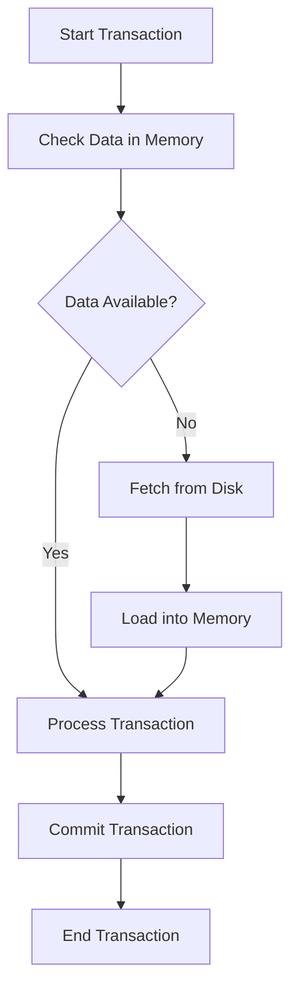

## 7.9 In-Memory Tables and OLTP

In the realm of SQL databases, achieving high performance and efficiency is paramount, especially for systems that demand rapid transaction processing. In-memory tables and Online Transaction Processing (OLTP) systems are pivotal in meeting these demands. This section delves into the intricacies of in-memory databases, their features, use cases, and optimization strategies, providing expert software engineers and architects with the knowledge to harness their full potential.

### Understanding In-Memory Databases

**In-Memory Databases** are designed to store data primarily in the main memory (RAM) rather than on disk storage. This architecture significantly reduces data retrieval times, making it ideal for applications requiring high-speed data access and processing.

#### Key Features of In-Memory Databases

1. **Speed and Performance**: By eliminating the need to access disk storage, in-memory databases can perform read and write operations at lightning speed, which is crucial for real-time applications.

2. **Data Persistence**: While data is stored in memory, modern in-memory databases offer mechanisms to ensure data durability, such as periodic snapshots and transaction logging.

3. **Scalability**: In-memory databases can scale horizontally by distributing data across multiple nodes, allowing them to handle large volumes of transactions efficiently.

4. **Concurrency Control**: Advanced concurrency control mechanisms ensure that multiple transactions can be processed simultaneously without data inconsistency.

5. **Simplified Architecture**: The architecture of in-memory databases is often simpler than traditional databases, reducing the overhead associated with disk I/O operations.

#### Use Cases for In-Memory Databases

- **High-Throughput Transactional Systems**: Applications such as financial trading platforms, online gaming, and e-commerce sites benefit from the rapid transaction processing capabilities of in-memory databases.
- **Real-Time Analytics**: In-memory databases are ideal for applications that require real-time data analysis, such as fraud detection and personalized recommendations.
- **Caching Solutions**: They can be used as a caching layer to store frequently accessed data, reducing the load on primary databases.

### Online Transaction Processing (OLTP)

**OLTP** systems are designed to manage transaction-oriented applications, typically for data entry and retrieval transaction processing. They are characterized by a large number of short online transactions (INSERT, UPDATE, DELETE).

#### Characteristics of OLTP Systems

1. **Atomicity**: Ensures that each transaction is treated as a single unit, which either completes entirely or not at all.

2. **Consistency**: Guarantees that a transaction brings the database from one valid state to another, maintaining data integrity.

3. **Isolation**: Ensures that transactions are processed independently, without interference from other transactions.

4. **Durability**: Once a transaction is committed, it remains so, even in the event of a system failure.

#### OLTP vs. OLAP

While OLTP focuses on transaction processing, Online Analytical Processing (OLAP) is designed for complex queries and data analysis. OLTP systems prioritize speed and efficiency for transactional workloads, whereas OLAP systems are optimized for read-heavy operations and data aggregation.

### Optimization Strategies for In-Memory Tables and OLTP

To fully leverage the benefits of in-memory tables and OLTP systems, it is essential to implement optimization strategies that enhance performance, manage concurrency, and ensure data durability.

#### Durability Options

1. **Transaction Logging**: Implement transaction logs to record changes, ensuring that data can be recovered in case of a failure.

2. **Snapshotting**: Periodically create snapshots of the in-memory data to provide a fallback point for recovery.

3. **Hybrid Storage**: Use a combination of in-memory and disk-based storage to balance speed and durability, storing critical data in memory and less frequently accessed data on disk.

#### Concurrency Control

1. **Optimistic Concurrency Control**: Assume that multiple transactions can complete without affecting each other and check for conflicts before committing.

2. **Pessimistic Concurrency Control**: Lock data resources when a transaction is being processed to prevent conflicts, suitable for environments with high contention.

3. **Multiversion Concurrency Control (MVCC)**: Maintain multiple versions of data to allow concurrent transactions to read and write without locking, enhancing performance in read-heavy environments.

#### Performance Tuning

1. **Indexing**: Use in-memory indexes to speed up data retrieval operations. Ensure that indexes are optimized for the specific query patterns of your application.

2. **Query Optimization**: Analyze and optimize SQL queries to reduce execution time and resource consumption.

3. **Load Balancing**: Distribute the workload across multiple nodes to prevent bottlenecks and ensure even resource utilization.

4. **Memory Management**: Monitor and manage memory usage to prevent overflow and ensure that critical data remains in memory.

### Code Examples

Let's explore some practical code examples to illustrate the use of in-memory tables and OLTP optimization techniques.

#### Creating In-Memory Tables

```sql
-- Create an in-memory table in SQL Server
CREATE TABLE InMemoryTable (
    ID INT PRIMARY KEY NONCLUSTERED HASH WITH (BUCKET_COUNT = 1000000),
    Name NVARCHAR(100),
    Quantity INT
) WITH (MEMORY_OPTIMIZED = ON, DURABILITY = SCHEMA_AND_DATA);
```

> **Explanation**: This SQL Server example demonstrates creating an in-memory table with a nonclustered hash index for the primary key. The `MEMORY_OPTIMIZED` option enables in-memory storage, and `DURABILITY = SCHEMA_AND_DATA` ensures data persistence.

#### Implementing Concurrency Control

```sql
-- Example of optimistic concurrency control
BEGIN TRANSACTION;

-- Attempt to update a record
UPDATE InMemoryTable
SET Quantity = Quantity - 1
WHERE ID = 1;

-- Check for conflicts
IF @@ROWCOUNT = 0
BEGIN
    -- Handle conflict (e.g., retry or abort)
    ROLLBACK TRANSACTION;
    PRINT 'Conflict detected, transaction aborted.';
END
ELSE
BEGIN
    COMMIT TRANSACTION;
    PRINT 'Transaction committed successfully.';
END
```

> **Explanation**: This example illustrates optimistic concurrency control by checking the `@@ROWCOUNT` system variable to detect conflicts before committing the transaction.

### Visualizing In-Memory Tables and OLTP

To better understand the architecture and workflow of in-memory tables and OLTP systems, let's visualize the process using a Mermaid.js diagram.



> **Diagram Description**: This flowchart illustrates the typical workflow of an OLTP system using in-memory tables. Transactions start by checking data availability in memory, processing if available, or fetching from disk if not. Once processed, the transaction is committed and completed.

### Try It Yourself

Experiment with the provided code examples by modifying the table schema, adjusting concurrency control mechanisms, or implementing additional optimization techniques. Consider creating a test environment to observe the impact of these changes on performance and concurrency.

### References and Links

- [Microsoft SQL Server In-Memory OLTP Documentation](https://docs.microsoft.com/en-us/sql/relational-databases/in-memory-oltp/)
- [Oracle In-Memory Database Overview](https://www.oracle.com/database/in-memory/)
- [PostgreSQL In-Memory Database Solutions](https://www.postgresql.org/docs/current/memory.html)

### Knowledge Check

- What are the key features of in-memory databases?
- How do OLTP systems differ from OLAP systems?
- What are the benefits of using optimistic concurrency control?
- How can you ensure data durability in in-memory databases?

### Embrace the Journey

Remember, mastering in-memory tables and OLTP systems is a journey. As you experiment and optimize, you'll gain insights into creating high-performance, scalable database solutions. Stay curious, keep learning, and enjoy the process!

## Quiz Time!



### What is a primary advantage of in-memory databases?

- [x] Faster data access
- [ ] Reduced storage costs
- [ ] Simplified data modeling
- [ ] Enhanced security

> **Explanation:** In-memory databases store data in RAM, significantly reducing data access times compared to disk-based storage.

### Which of the following is a characteristic of OLTP systems?

- [x] High transaction throughput
- [ ] Complex analytical queries
- [ ] Data warehousing
- [ ] Batch processing

> **Explanation:** OLTP systems are designed for high transaction throughput, handling numerous short transactions efficiently.

### What is the purpose of transaction logging in in-memory databases?

- [x] To ensure data durability
- [ ] To improve query performance
- [ ] To reduce memory usage
- [ ] To simplify data modeling

> **Explanation:** Transaction logging records changes to ensure data can be recovered in case of a failure, enhancing durability.

### How does optimistic concurrency control handle conflicts?

- [x] By checking for conflicts before committing
- [ ] By locking resources during transactions
- [ ] By aborting all conflicting transactions
- [ ] By using multiple versions of data

> **Explanation:** Optimistic concurrency control checks for conflicts before committing, allowing transactions to proceed without locking.

### What is a benefit of using multiversion concurrency control (MVCC)?

- [x] Allows concurrent reads and writes
- [ ] Reduces memory usage
- [ ] Simplifies transaction management
- [ ] Enhances security

> **Explanation:** MVCC allows concurrent reads and writes by maintaining multiple versions of data, improving performance in read-heavy environments.

### Which SQL command is used to create an in-memory table in SQL Server?

- [x] CREATE TABLE
- [ ] CREATE MEMORY TABLE
- [ ] CREATE IN-MEMORY TABLE
- [ ] CREATE TEMP TABLE

> **Explanation:** The `CREATE TABLE` command is used with specific options to create an in-memory table in SQL Server.

### What is the role of indexing in in-memory databases?

- [x] To speed up data retrieval operations
- [ ] To reduce memory usage
- [ ] To simplify data modeling
- [ ] To enhance security

> **Explanation:** Indexing helps speed up data retrieval operations by providing efficient access paths to data.

### How can you balance speed and durability in in-memory databases?

- [x] By using hybrid storage
- [ ] By reducing memory usage
- [ ] By simplifying data modeling
- [ ] By enhancing security

> **Explanation:** Hybrid storage combines in-memory and disk-based storage to balance speed and durability, storing critical data in memory and less frequently accessed data on disk.

### What is a common use case for in-memory databases?

- [x] High-throughput transactional systems
- [ ] Long-term data archiving
- [ ] Batch processing
- [ ] Complex data modeling

> **Explanation:** In-memory databases are ideal for high-throughput transactional systems that require rapid transaction processing.

### True or False: OLTP systems are optimized for read-heavy operations.

- [ ] True
- [x] False

> **Explanation:** OLTP systems are optimized for transaction processing, handling numerous short transactions efficiently, rather than read-heavy operations.




