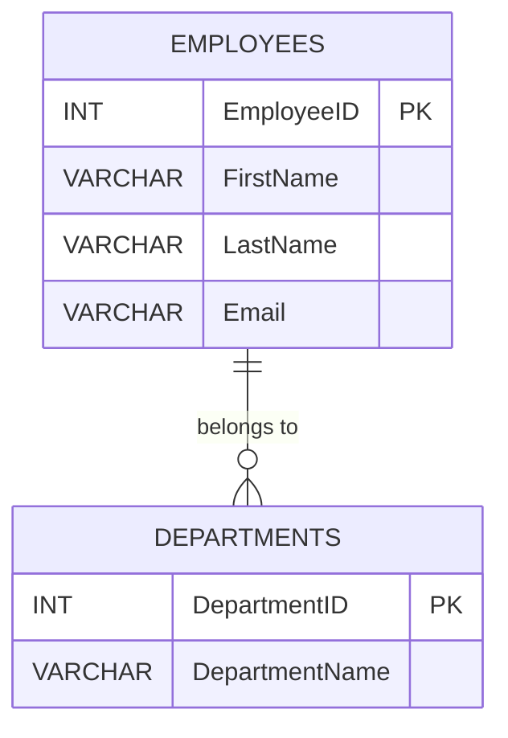

## 8.1.1 Primary Key Constraints

In the realm of relational databases, ensuring data integrity is paramount. One of the foundational elements that uphold this integrity is the **Primary Key Constraint**. This constraint plays a crucial role in uniquely identifying each record within a table, thereby preventing duplicate entries and maintaining the consistency of data. In this section, we will delve into the intricacies of primary key constraints, exploring their purpose, implementation, properties, and best practices.

### Purpose of Primary Key Constraints

The primary key constraint serves a fundamental purpose: to uniquely identify each record in a table. This uniqueness is essential for various database operations, including:

- **Data Retrieval**: Efficiently locating and retrieving specific records.
- **Data Integrity**: Ensuring that each record is distinct and identifiable.
- **Referential Integrity**: Establishing relationships between tables through foreign keys.

### Implementation of Primary Key Constraints

Implementing a primary key constraint involves defining one or more columns in a table as the primary key. This can be achieved during table creation or by altering an existing table. Let's explore both approaches with examples.

#### Creating a Table with a Primary Key

When creating a new table, you can specify the primary key constraint directly in the table definition. Here's an example:

```sql
CREATE TABLE Employees (
    EmployeeID INT PRIMARY KEY,
    FirstName VARCHAR(50),
    LastName VARCHAR(50),
    Email VARCHAR(100)
);
```

In this example, the `EmployeeID` column is designated as the primary key, ensuring that each employee has a unique identifier.

#### Adding a Primary Key to an Existing Table

If you need to add a primary key constraint to an existing table, you can use the `ALTER TABLE` statement:

```sql
ALTER TABLE Employees
ADD CONSTRAINT PK_EmployeeID PRIMARY KEY (EmployeeID);
```

This command adds a primary key constraint named `PK_EmployeeID` to the `EmployeeID` column of the `Employees` table.

### Properties of Primary Key Constraints

Primary key constraints have several key properties that are essential for maintaining data integrity:

- **Uniqueness**: Each value in the primary key column(s) must be unique across the table.
- **Non-nullability**: Primary key columns cannot contain NULL values, ensuring that every record is identifiable.
- **Immutability**: Once set, the primary key value should not change, as it serves as the record's unique identifier.

### Composite Primary Keys

In some cases, a single column may not be sufficient to uniquely identify a record. In such scenarios, a composite primary key, consisting of multiple columns, can be used. Here's an example:

```sql
CREATE TABLE OrderDetails (
    OrderID INT,
    ProductID INT,
    Quantity INT,
    PRIMARY KEY (OrderID, ProductID)
);
```

In this table, the combination of `OrderID` and `ProductID` serves as the primary key, ensuring that each product in an order is uniquely identified.

### Visualizing Primary Key Constraints

To better understand the role of primary key constraints, let's visualize their function in a database schema.



In this diagram, the `EmployeeID` in the `EMPLOYEES` table and `DepartmentID` in the `DEPARTMENTS` table are primary keys, ensuring unique identification of records in their respective tables.

### Key Participants in Primary Key Constraints

- **Database Designer**: Responsible for defining the primary key during the database design phase.
- **Database Administrator (DBA)**: Ensures that primary key constraints are enforced and maintained.
- **Application Developer**: Utilizes primary keys for efficient data retrieval and manipulation.

### Applicability of Primary Key Constraints

Primary key constraints are applicable in virtually all relational database scenarios where data integrity and uniqueness are required. They are particularly useful in:

- **Transactional Systems**: Ensuring each transaction is uniquely identifiable.
- **Data Warehousing**: Maintaining unique records in large datasets.
- **E-commerce Platforms**: Uniquely identifying products, orders, and customers.

### Sample Code Snippet

Let's consider a practical example of using primary key constraints in a database schema for an e-commerce platform:

```sql
CREATE TABLE Customers (
    CustomerID INT PRIMARY KEY,
    FirstName VARCHAR(50),
    LastName VARCHAR(50),
    Email VARCHAR(100) UNIQUE
);

CREATE TABLE Orders (
    OrderID INT PRIMARY KEY,
    CustomerID INT,
    OrderDate DATE,
    FOREIGN KEY (CustomerID) REFERENCES Customers(CustomerID)
);
```

In this schema, `CustomerID` and `OrderID` are primary keys, ensuring unique identification of customers and orders, respectively.

### Design Considerations

When designing primary key constraints, consider the following:

- **Column Selection**: Choose columns that naturally provide uniqueness, such as IDs or codes.
- **Data Type**: Use appropriate data types that support uniqueness and are efficient for indexing.
- **Composite Keys**: Use composite keys when a single column is insufficient for uniqueness.

### Differences and Similarities with Other Constraints

Primary key constraints are often compared with unique constraints. While both ensure uniqueness, primary keys also enforce non-nullability and are used for establishing relationships through foreign keys.

### Best Practices for Primary Key Constraints

- **Use Surrogate Keys**: Consider using surrogate keys (e.g., auto-incremented integers) for simplicity and efficiency.
- **Avoid Natural Keys**: Natural keys (e.g., Social Security Numbers) may change over time and are not ideal for primary keys.
- **Index Primary Keys**: Ensure primary keys are indexed for optimal performance.

### Try It Yourself

Experiment with primary key constraints by creating a new table with a composite primary key. Modify the table structure and observe how the constraints enforce data integrity.

```sql
CREATE TABLE Inventory (
    ProductID INT,
    WarehouseID INT,
    StockLevel INT,
    PRIMARY KEY (ProductID, WarehouseID)
);
```

Try inserting duplicate records and observe the constraint enforcement.

### References and Links

- [W3Schools SQL Primary Key](https://www.w3schools.com/sql/sql_primarykey.asp)
- [MDN Web Docs: SQL Constraints](https://developer.mozilla.org/en-US/docs/Web/SQL/Constraints)

### Knowledge Check

- What is the primary purpose of a primary key constraint?
- How does a composite primary key differ from a single-column primary key?
- Why is non-nullability an essential property of primary keys?

### Embrace the Journey

Remember, mastering primary key constraints is just the beginning. As you progress, you'll explore more complex constraints and design patterns that enhance data integrity and performance. Keep experimenting, stay curious, and enjoy the journey!

## Quiz Time!



### What is the primary purpose of a primary key constraint?

- [x] To uniquely identify each record in a table.
- [ ] To allow duplicate records in a table.
- [ ] To enforce data types in a table.
- [ ] To manage user permissions in a table.

> **Explanation:** The primary purpose of a primary key constraint is to uniquely identify each record in a table, ensuring data integrity.

### Which property is NOT associated with primary key constraints?

- [ ] Uniqueness
- [ ] Non-nullability
- [x] Allowing NULL values
- [ ] Immutability

> **Explanation:** Primary key constraints do not allow NULL values; they ensure uniqueness and non-nullability.

### How can you define a composite primary key in SQL?

- [x] By specifying multiple columns in the PRIMARY KEY clause.
- [ ] By using a single column with a UNIQUE constraint.
- [ ] By combining a primary key with a foreign key.
- [ ] By using the CHECK constraint.

> **Explanation:** A composite primary key is defined by specifying multiple columns in the PRIMARY KEY clause.

### What is a surrogate key?

- [x] An artificial key used to uniquely identify records.
- [ ] A natural key derived from existing data.
- [ ] A key used for foreign key relationships.
- [ ] A key that allows duplicate values.

> **Explanation:** A surrogate key is an artificial key, often an auto-incremented integer, used to uniquely identify records.

### Which of the following is a best practice for primary key constraints?

- [x] Use surrogate keys for simplicity.
- [ ] Use natural keys that may change over time.
- [ ] Allow NULL values in primary key columns.
- [ ] Avoid indexing primary key columns.

> **Explanation:** Using surrogate keys is a best practice for simplicity and efficiency, while natural keys may change over time.

### What happens if you try to insert a duplicate value into a primary key column?

- [x] The database will reject the insertion.
- [ ] The database will allow the insertion.
- [ ] The database will convert the duplicate to NULL.
- [ ] The database will create a new primary key automatically.

> **Explanation:** The database will reject the insertion of duplicate values in a primary key column to maintain uniqueness.

### Can a primary key be used to establish relationships between tables?

- [x] Yes, through foreign key constraints.
- [ ] No, primary keys are only for uniqueness.
- [ ] Yes, but only in composite keys.
- [ ] No, primary keys cannot be referenced.

> **Explanation:** Primary keys can be used to establish relationships between tables through foreign key constraints.

### What is the difference between a primary key and a unique constraint?

- [x] A primary key also enforces non-nullability.
- [ ] A unique constraint allows NULL values.
- [ ] A primary key can be duplicated.
- [ ] A unique constraint is used for foreign keys.

> **Explanation:** A primary key enforces both uniqueness and non-nullability, while a unique constraint allows NULL values.

### Why might you avoid using natural keys as primary keys?

- [x] They may change over time.
- [ ] They are always unique.
- [ ] They are easy to index.
- [ ] They are efficient for large datasets.

> **Explanation:** Natural keys may change over time, making them less ideal for primary keys.

### True or False: A primary key can consist of multiple columns.

- [x] True
- [ ] False

> **Explanation:** A primary key can consist of multiple columns, forming a composite primary key.


