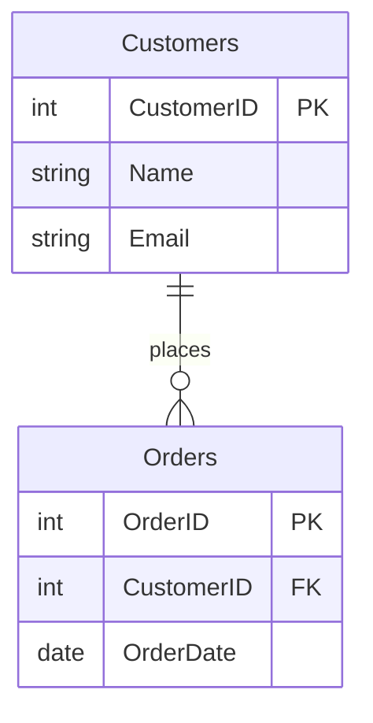

## 8.1.2 Foreign Key Constraints

Foreign key constraints are a fundamental aspect of relational database design, ensuring that relationships between tables remain consistent and valid. By enforcing referential integrity, foreign keys prevent orphaned records and maintain the logical connections between related data. In this section, we will explore the purpose, behavior, and implementation of foreign key constraints, along with best practices and potential pitfalls.

### Purpose of Foreign Key Constraints

The primary purpose of foreign key constraints is to maintain referential integrity between tables in a relational database. Referential integrity ensures that a foreign key value in one table corresponds to a primary key value in another table. This relationship is crucial for maintaining the logical consistency of the data.

#### Key Concepts

- **Referential Integrity**: Ensures that relationships between tables are consistent. A foreign key in one table must match a primary key in another table.
- **Parent and Child Tables**: The table containing the primary key is referred to as the parent table, while the table containing the foreign key is the child table.

### Behavior of Foreign Key Constraints

Foreign key constraints can enforce various behaviors when changes occur in the parent table. These behaviors include cascading actions and restricting actions, which dictate how updates and deletions are handled.

#### Cascading Actions

Cascading actions automatically propagate changes from the parent table to the child table. This feature is useful for maintaining consistency across related tables.

- **ON DELETE CASCADE**: When a row in the parent table is deleted, all corresponding rows in the child table are also deleted.
- **ON UPDATE CASCADE**: When a primary key value in the parent table is updated, all corresponding foreign key values in the child table are updated.

#### Restricting Actions

Restricting actions prevent changes that would violate referential integrity. These actions ensure that no orphaned records are created in the child table.

- **ON DELETE RESTRICT**: Prevents the deletion of a row in the parent table if there are corresponding rows in the child table.
- **ON UPDATE RESTRICT**: Prevents the update of a primary key value in the parent table if there are corresponding foreign key values in the child table.

### Implementing Foreign Key Constraints

Implementing foreign key constraints involves defining relationships between tables and specifying the desired behavior for updates and deletions. Let's explore how to create foreign key constraints using SQL.

#### Creating Foreign Key Constraints

To create a foreign key constraint, use the `FOREIGN KEY` keyword in the `CREATE TABLE` or `ALTER TABLE` statement. Specify the column(s) in the child table that reference the primary key column(s) in the parent table.

```sql
CREATE TABLE Orders (
    OrderID INT PRIMARY KEY,
    CustomerID INT,
    OrderDate DATE,
    FOREIGN KEY (CustomerID) REFERENCES Customers(CustomerID)
);
```

In this example, the `Orders` table contains a foreign key constraint on the `CustomerID` column, referencing the `CustomerID` column in the `Customers` table.

#### Specifying Cascading and Restricting Actions

When defining foreign key constraints, you can specify cascading or restricting actions using the `ON DELETE` and `ON UPDATE` clauses.

```sql
CREATE TABLE Orders (
    OrderID INT PRIMARY KEY,
    CustomerID INT,
    OrderDate DATE,
    FOREIGN KEY (CustomerID) REFERENCES Customers(CustomerID)
    ON DELETE CASCADE
    ON UPDATE CASCADE
);
```

This example demonstrates the use of cascading actions, where deletions and updates in the `Customers` table are automatically propagated to the `Orders` table.

### Best Practices for Foreign Key Constraints

Implementing foreign key constraints effectively requires careful consideration of database design and application requirements. Here are some best practices to follow:

1. **Define Foreign Keys Early**: Establish foreign key constraints during the initial design phase to ensure data integrity from the start.

2. **Use Descriptive Naming Conventions**: Name foreign key constraints clearly to indicate the relationship between tables. This practice aids in database maintenance and troubleshooting.

3. **Consider Performance Implications**: Foreign key constraints can impact performance, especially in large databases. Evaluate the trade-offs between data integrity and performance.

4. **Test Cascading Actions**: Before deploying cascading actions in a production environment, thoroughly test their behavior to avoid unintended data loss.

5. **Document Relationships**: Maintain comprehensive documentation of table relationships and foreign key constraints to facilitate collaboration and future development.

### Visualizing Foreign Key Relationships

To better understand foreign key relationships, let's visualize the connection between the `Customers` and `Orders` tables using a Mermaid.js diagram.



This diagram illustrates the one-to-many relationship between the `Customers` and `Orders` tables, with `CustomerID` serving as the foreign key in the `Orders` table.

### Common Pitfalls and Solutions

While foreign key constraints are powerful tools for maintaining data integrity, they can also introduce challenges. Here are some common pitfalls and solutions:

- **Circular References**: Avoid circular references between tables, as they can lead to complex dependency chains and hinder database operations.

- **Performance Overhead**: In high-transaction environments, foreign key constraints can introduce performance overhead. Consider denormalization or indexing strategies to mitigate this impact.

- **Complex Cascading Actions**: Cascading actions can lead to unintended data modifications. Carefully evaluate the necessity of cascading actions and test their behavior thoroughly.

### Differences and Similarities with Other Constraints

Foreign key constraints are often compared to other types of constraints, such as primary keys and unique constraints. Understanding their differences and similarities is crucial for effective database design.

- **Primary Key vs. Foreign Key**: A primary key uniquely identifies each row in a table, while a foreign key establishes a relationship between tables.

- **Unique Constraint vs. Foreign Key**: A unique constraint ensures that all values in a column are distinct, whereas a foreign key enforces referential integrity between tables.

### Try It Yourself

Experiment with foreign key constraints by creating your own tables and defining relationships. Modify the cascading actions and observe their effects on related tables. This hands-on approach will deepen your understanding of foreign key constraints and their impact on database design.

### References and Further Reading

- [W3Schools: SQL Foreign Key](https://www.w3schools.com/sql/sql_foreignkey.asp)
- [MDN Web Docs: SQL Foreign Key Constraints](https://developer.mozilla.org/en-US/docs/Web/SQL/Foreign_key_constraints)
- [SQL Server Documentation: Foreign Key Constraints](https://docs.microsoft.com/en-us/sql/relational-databases/tables/primary-and-foreign-key-constraints)

### Knowledge Check

To reinforce your understanding of foreign key constraints, consider the following questions:

1. What is the primary purpose of a foreign key constraint?
2. How do cascading actions differ from restricting actions?
3. What are some best practices for implementing foreign key constraints?
4. How can foreign key constraints impact database performance?
5. What are the differences between a primary key and a foreign key?

### Embrace the Journey

Remember, mastering foreign key constraints is just one step in your journey to becoming an expert in SQL database design. As you continue to explore and experiment, you'll gain a deeper understanding of how to build robust and scalable database solutions. Keep learning, stay curious, and enjoy the process!

## Quiz Time!



### What is the primary purpose of a foreign key constraint?

- [x] To maintain referential integrity between tables
- [ ] To ensure all values in a column are unique
- [ ] To enforce data type constraints
- [ ] To optimize query performance

> **Explanation:** The primary purpose of a foreign key constraint is to maintain referential integrity between tables, ensuring that foreign key values correspond to primary key values in related tables.

### Which action automatically deletes corresponding rows in the child table when a row in the parent table is deleted?

- [x] ON DELETE CASCADE
- [ ] ON DELETE RESTRICT
- [ ] ON UPDATE CASCADE
- [ ] ON UPDATE RESTRICT

> **Explanation:** The ON DELETE CASCADE action automatically deletes corresponding rows in the child table when a row in the parent table is deleted.

### What is a common pitfall when using foreign key constraints?

- [x] Circular references
- [ ] Unique constraints
- [ ] Data type mismatches
- [ ] Index fragmentation

> **Explanation:** Circular references can create complex dependency chains and hinder database operations, making them a common pitfall when using foreign key constraints.

### How can foreign key constraints impact database performance?

- [x] They can introduce performance overhead in high-transaction environments
- [ ] They always improve query performance
- [ ] They reduce the need for indexing
- [ ] They eliminate the need for normalization

> **Explanation:** Foreign key constraints can introduce performance overhead in high-transaction environments due to the additional checks required to maintain referential integrity.

### What is the difference between a primary key and a foreign key?

- [x] A primary key uniquely identifies each row in a table, while a foreign key establishes a relationship between tables
- [ ] A primary key is used for indexing, while a foreign key is used for sorting
- [ ] A primary key is optional, while a foreign key is mandatory
- [ ] A primary key is always numeric, while a foreign key is always alphanumeric

> **Explanation:** A primary key uniquely identifies each row in a table, while a foreign key establishes a relationship between tables by referencing a primary key in another table.

### Which clause is used to specify cascading actions in a foreign key constraint?

- [x] ON DELETE
- [ ] ON INSERT
- [ ] ON SELECT
- [ ] ON MERGE

> **Explanation:** The ON DELETE clause is used to specify cascading actions in a foreign key constraint, such as ON DELETE CASCADE.

### What is a best practice for naming foreign key constraints?

- [x] Use descriptive naming conventions to indicate the relationship between tables
- [ ] Use random alphanumeric strings for uniqueness
- [ ] Use the same name for all foreign key constraints
- [ ] Avoid naming foreign key constraints

> **Explanation:** Using descriptive naming conventions for foreign key constraints helps indicate the relationship between tables, aiding in database maintenance and troubleshooting.

### Which action prevents the deletion of a row in the parent table if there are corresponding rows in the child table?

- [x] ON DELETE RESTRICT
- [ ] ON DELETE CASCADE
- [ ] ON UPDATE CASCADE
- [ ] ON UPDATE RESTRICT

> **Explanation:** The ON DELETE RESTRICT action prevents the deletion of a row in the parent table if there are corresponding rows in the child table, maintaining referential integrity.

### What should be considered when implementing foreign key constraints in large databases?

- [x] Performance implications
- [ ] Data type mismatches
- [ ] Index fragmentation
- [ ] Table partitioning

> **Explanation:** When implementing foreign key constraints in large databases, it's important to consider performance implications, as they can introduce overhead in high-transaction environments.

### True or False: Foreign key constraints can be defined using the ALTER TABLE statement.

- [x] True
- [ ] False

> **Explanation:** Foreign key constraints can be defined using the ALTER TABLE statement, allowing you to add constraints to existing tables.




