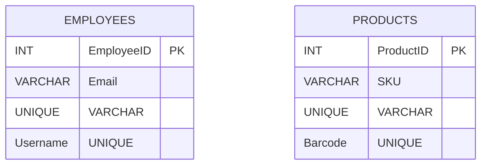

## 8.1.3 Unique Constraints

In the realm of SQL and database management, maintaining data integrity is paramount. One of the fundamental tools at our disposal to ensure this integrity is the **Unique Constraint**. This constraint plays a crucial role in enforcing uniqueness across columns within a table, thereby preventing duplicate entries and maintaining the quality of data. In this section, we will delve into the concept of unique constraints, their implementation, differences from primary keys, and best practices for their use.

### Purpose of Unique Constraints

The primary purpose of a unique constraint is to ensure that all values in a specified column or a combination of columns are distinct across the table. This is essential in scenarios where duplicate data could lead to inconsistencies or errors in data processing and analysis. Unique constraints are particularly useful in maintaining the integrity of data that serves as identifiers or keys in a database.

### Differences from Primary Keys

While both unique constraints and primary keys enforce uniqueness, there are key differences between the two:

- **Primary Keys**: A primary key uniquely identifies each record in a table. It does not allow NULL values and is limited to one per table.
- **Unique Constraints**: Unique constraints can be applied to any column or combination of columns. Unlike primary keys, they allow for one NULL value (though this behavior can vary depending on the DBMS). Multiple unique constraints can be defined on a table.

### Implementing Unique Constraints

Implementing unique constraints in SQL is straightforward. They can be defined at the time of table creation or added to an existing table. Let's explore both scenarios with examples.

#### Creating Unique Constraints During Table Creation

When creating a table, you can define a unique constraint on one or more columns using the `UNIQUE` keyword. Here's an example:

```sql
CREATE TABLE Employees (
    EmployeeID INT PRIMARY KEY,
    Email VARCHAR(255) UNIQUE,
    Username VARCHAR(50),
    CONSTRAINT UC_Username UNIQUE (Username)
);
```

In this example, the `Email` column is constrained to have unique values, ensuring no two employees can share the same email address. Additionally, a unique constraint named `UC_Username` is applied to the `Username` column.

#### Adding Unique Constraints to an Existing Table

To add a unique constraint to an existing table, use the `ALTER TABLE` statement. Here's how you can do it:

```sql
ALTER TABLE Employees
ADD CONSTRAINT UC_PhoneNumber UNIQUE (PhoneNumber);
```

This command adds a unique constraint named `UC_PhoneNumber` to the `PhoneNumber` column of the `Employees` table.

### Key Participants in Unique Constraints

- **Database Administrators (DBAs)**: Responsible for defining and managing unique constraints to ensure data integrity.
- **Developers**: Implement unique constraints in their database schemas to prevent duplicate data entries.
- **Data Analysts**: Rely on unique constraints to ensure the accuracy and reliability of data for analysis.

### Applicability of Unique Constraints

Unique constraints are applicable in various scenarios, including:

- **User Authentication**: Ensuring unique usernames or email addresses for user accounts.
- **Inventory Management**: Preventing duplicate entries of product SKUs or serial numbers.
- **Financial Systems**: Maintaining unique transaction IDs or account numbers.

### Sample Code Snippet

Let's consider a scenario where we need to ensure that each product in an inventory system has a unique SKU and barcode:

```sql
CREATE TABLE Products (
    ProductID INT PRIMARY KEY,
    SKU VARCHAR(50) UNIQUE,
    Barcode VARCHAR(50),
    CONSTRAINT UC_Barcode UNIQUE (Barcode)
);
```

In this example, both the `SKU` and `Barcode` columns are constrained to have unique values, ensuring no two products can share the same SKU or barcode.

### Design Considerations

When implementing unique constraints, consider the following:

- **Performance Impact**: Unique constraints can impact performance, especially on large tables. Ensure proper indexing to mitigate this.
- **NULL Values**: Understand how your DBMS handles NULL values in unique constraints. Some allow multiple NULLs, while others do not.
- **Composite Unique Constraints**: Use composite unique constraints for columns that together must be unique, such as `FirstName` and `LastName`.

### Differences and Similarities with Other Constraints

Unique constraints are often compared with primary keys and foreign keys. Here's a brief overview:

- **Primary Keys**: Enforce uniqueness and non-nullability. Limited to one per table.
- **Foreign Keys**: Ensure referential integrity by linking tables. Do not enforce uniqueness.
- **Unique Constraints**: Enforce uniqueness but allow NULLs. Multiple can be defined per table.

### Visualizing Unique Constraints

To better understand how unique constraints work, let's visualize their role in a database schema using a Mermaid.js diagram:



This diagram illustrates the `EMPLOYEES` and `PRODUCTS` tables, highlighting the unique constraints on the `Email`, `Username`, `SKU`, and `Barcode` columns.

### Best Practices for Using Unique Constraints

- **Plan Ahead**: Define unique constraints during the initial design phase to avoid costly schema changes later.
- **Use Descriptive Names**: Name your constraints clearly to indicate their purpose, such as `UC_Email` or `UC_Username`.
- **Monitor Performance**: Regularly assess the performance impact of unique constraints on large tables.
- **Test Thoroughly**: Ensure that your application logic handles constraint violations gracefully.

### Try It Yourself

To deepen your understanding of unique constraints, try modifying the code examples provided. Experiment with adding unique constraints to different columns and observe how they affect data insertion and updates. Consider scenarios where composite unique constraints might be necessary.

### References and Further Reading

- [SQL Constraints - W3Schools](https://www.w3schools.com/sql/sql_constraints.asp)
- [Unique Constraints - Oracle Documentation](https://docs.oracle.com/en/database/oracle/oracle-database/19/sqlrf/CREATE-TABLE.html#GUID-2F8D8B8A-4B2B-4F7E-8B7B-2B3B3B3B3B3B)
- [Unique Constraints - PostgreSQL Documentation](https://www.postgresql.org/docs/current/ddl-constraints.html)

### Knowledge Check

- What is the primary purpose of a unique constraint?
- How do unique constraints differ from primary keys?
- Can a unique constraint be applied to multiple columns?
- What are some common use cases for unique constraints?

### Embrace the Journey

Remember, mastering unique constraints is just one step in your journey to becoming an expert in SQL design patterns. As you progress, you'll encounter more complex scenarios where these constraints play a crucial role. Keep experimenting, stay curious, and enjoy the journey!

## Quiz Time!



### What is the primary purpose of a unique constraint?

- [x] To ensure all values in a column or group of columns are unique
- [ ] To enforce referential integrity between tables
- [ ] To allow multiple NULL values in a column
- [ ] To define the primary key of a table

> **Explanation:** The primary purpose of a unique constraint is to ensure that all values in a specified column or combination of columns are distinct across the table.

### How does a unique constraint differ from a primary key?

- [x] A unique constraint allows one NULL value, while a primary key does not
- [ ] A unique constraint enforces referential integrity, while a primary key does not
- [ ] A unique constraint is limited to one per table, while a primary key is not
- [ ] A unique constraint can only be applied to numeric columns

> **Explanation:** A unique constraint allows one NULL value (DBMS dependent), whereas a primary key does not allow NULLs and is limited to one per table.

### Can a unique constraint be applied to multiple columns?

- [x] Yes, it can be applied to a combination of columns
- [ ] No, it can only be applied to a single column
- [ ] Yes, but only if the columns are of the same data type
- [ ] No, it is not possible to apply a unique constraint to multiple columns

> **Explanation:** A unique constraint can be applied to a combination of columns, ensuring that the combination of values is unique across the table.

### What is a common use case for unique constraints?

- [x] Ensuring unique email addresses in a user database
- [ ] Enforcing referential integrity between tables
- [ ] Allowing multiple NULL values in a column
- [ ] Defining the primary key of a table

> **Explanation:** Unique constraints are commonly used to ensure unique identifiers, such as email addresses, in a database.

### Which of the following is true about unique constraints?

- [x] They can be defined on multiple columns in a table
- [ ] They enforce referential integrity
- [ ] They do not allow NULL values
- [ ] They are limited to one per table

> **Explanation:** Unique constraints can be defined on multiple columns in a table, allowing for composite uniqueness.

### What is the impact of unique constraints on database performance?

- [x] They can impact performance, especially on large tables
- [ ] They have no impact on performance
- [ ] They improve performance by reducing data redundancy
- [ ] They only impact performance when applied to numeric columns

> **Explanation:** Unique constraints can impact performance, particularly on large tables, due to the overhead of maintaining uniqueness.

### How can you add a unique constraint to an existing table?

- [x] Use the `ALTER TABLE` statement with the `ADD CONSTRAINT` clause
- [ ] Use the `CREATE TABLE` statement with the `UNIQUE` keyword
- [ ] Use the `DROP TABLE` statement with the `UNIQUE` keyword
- [ ] Use the `INSERT INTO` statement with the `UNIQUE` keyword

> **Explanation:** To add a unique constraint to an existing table, use the `ALTER TABLE` statement with the `ADD CONSTRAINT` clause.

### What should be considered when implementing unique constraints?

- [x] Performance impact and handling of NULL values
- [ ] Only the data type of the column
- [ ] The number of rows in the table
- [ ] The order of columns in the table

> **Explanation:** When implementing unique constraints, consider the performance impact and how your DBMS handles NULL values.

### Which SQL statement is used to define a unique constraint during table creation?

- [x] `CREATE TABLE` with the `UNIQUE` keyword
- [ ] `ALTER TABLE` with the `ADD CONSTRAINT` clause
- [ ] `INSERT INTO` with the `UNIQUE` keyword
- [ ] `DROP TABLE` with the `UNIQUE` keyword

> **Explanation:** The `CREATE TABLE` statement with the `UNIQUE` keyword is used to define a unique constraint during table creation.

### True or False: Unique constraints can be used to enforce referential integrity.

- [ ] True
- [x] False

> **Explanation:** Unique constraints do not enforce referential integrity; they ensure uniqueness of values in a column or combination of columns.


