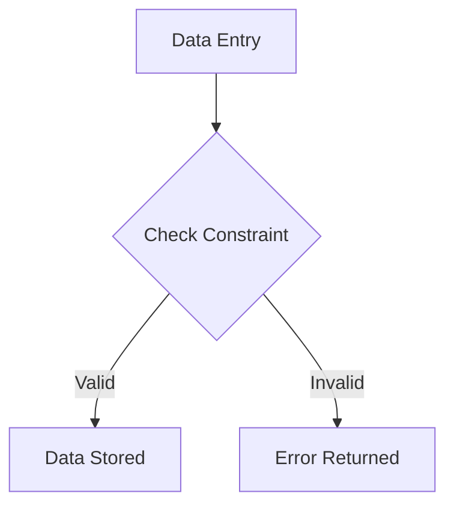

## 8.1.4 Check Constraints

In the realm of SQL and relational databases, maintaining data integrity is paramount. One of the essential tools at our disposal for enforcing domain integrity is the **Check Constraint**. This article delves into the intricacies of Check Constraints, providing expert insights into their implementation, optimization, and troubleshooting.

### Understanding Check Constraints

**Check Constraints** are a type of constraint used in SQL to enforce domain integrity by restricting the values that can be stored in a column. They ensure that the data entered into a table meets specific criteria, which can be defined using logical expressions. By doing so, they help maintain the accuracy and reliability of the data within a database.

#### Purpose of Check Constraints

- **Enforce Domain Integrity**: Ensure that data adheres to predefined rules, such as ranges or specific patterns.
- **Prevent Invalid Data Entry**: Block data that does not meet the specified criteria from being inserted or updated.
- **Implement Business Rules**: Enforce complex business logic directly within the database schema.

### Key Concepts and Terminology

Before diving into examples and best practices, let's clarify some key concepts related to Check Constraints:

- **Domain Integrity**: Refers to the validity of data within a particular domain, ensuring that only permissible values are stored.
- **Logical Expressions**: Conditions defined within a Check Constraint that must evaluate to true for the data to be accepted.
- **Column-Level vs. Table-Level Constraints**: Check Constraints can be applied to individual columns or across multiple columns within a table.

### Implementing Check Constraints

Let's explore how to implement Check Constraints in SQL, using practical examples to illustrate their application.

#### Basic Syntax

The basic syntax for defining a Check Constraint is as follows:

```sql
CREATE TABLE table_name (
    column_name data_type,
    ...
    CONSTRAINT constraint_name CHECK (condition)
);
```

- `table_name`: The name of the table where the constraint is applied.
- `column_name`: The name of the column being constrained.
- `data_type`: The data type of the column.
- `constraint_name`: A unique name for the constraint.
- `condition`: The logical expression that defines the constraint.

#### Example: Enforcing a Range

Consider a scenario where we want to ensure that the `age` column in a `users` table only contains values between 18 and 65:

```sql
CREATE TABLE users (
    user_id INT PRIMARY KEY,
    name VARCHAR(100),
    age INT,
    CONSTRAINT chk_age CHECK (age >= 18 AND age <= 65)
);
```

In this example, the Check Constraint `chk_age` ensures that only ages within the specified range are allowed.

#### Example: Enforcing Specific Patterns

Check Constraints can also enforce specific patterns, such as ensuring that a `phone_number` column follows a particular format:

```sql
CREATE TABLE contacts (
    contact_id INT PRIMARY KEY,
    name VARCHAR(100),
    phone_number VARCHAR(15),
    CONSTRAINT chk_phone_number CHECK (phone_number LIKE '[0-9][0-9][0-9]-[0-9][0-9][0-9]-[0-9][0-9][0-9][0-9]')
);
```

Here, the constraint `chk_phone_number` ensures that phone numbers follow the pattern `XXX-XXX-XXXX`.

### Advanced Usage and Considerations

While basic Check Constraints are straightforward, there are advanced considerations and techniques to optimize their use.

#### Table-Level Check Constraints

Table-level Check Constraints allow for more complex conditions involving multiple columns. For example, ensuring that the `start_date` is always before the `end_date` in an `events` table:

```sql
CREATE TABLE events (
    event_id INT PRIMARY KEY,
    event_name VARCHAR(100),
    start_date DATE,
    end_date DATE,
    CONSTRAINT chk_dates CHECK (start_date < end_date)
);
```

#### Handling NULL Values

By default, Check Constraints do not enforce conditions on `NULL` values, as `NULL` represents an unknown value. This behavior can be leveraged or adjusted based on specific requirements.

#### Performance Considerations

While Check Constraints are powerful, they can impact performance, especially in large tables or complex conditions. It's crucial to balance data integrity with performance needs.

### Visualizing Check Constraints

To better understand how Check Constraints operate within a database, let's visualize their role using a Mermaid.js diagram.



**Diagram Description**: This flowchart illustrates the process of data entry in a table with a Check Constraint. Data is evaluated against the constraint, and only valid data is stored, while invalid data triggers an error.

### Best Practices for Check Constraints

To effectively use Check Constraints, consider the following best practices:

- **Define Clear and Concise Conditions**: Ensure that conditions are easy to understand and maintain.
- **Use Descriptive Constraint Names**: Name constraints meaningfully to reflect their purpose.
- **Test Constraints Thoroughly**: Validate constraints with various data inputs to ensure they work as intended.
- **Monitor Performance**: Regularly assess the impact of constraints on database performance and optimize as needed.

### Common Pitfalls and Troubleshooting

While Check Constraints are invaluable, they can present challenges. Here are some common pitfalls and how to address them:

- **Complex Conditions**: Overly complex conditions can be difficult to maintain and may impact performance. Simplify where possible.
- **Unexpected NULL Behavior**: Be aware of how `NULL` values interact with constraints and adjust conditions accordingly.
- **Constraint Violations**: When a constraint violation occurs, review the condition and the data to identify the issue.

### Try It Yourself

To deepen your understanding of Check Constraints, try modifying the examples provided:

1. **Experiment with Different Ranges**: Change the age range in the `users` table and observe the behavior.
2. **Create a New Pattern**: Define a new pattern for the `phone_number` column and test various inputs.
3. **Combine Multiple Conditions**: Implement a table-level constraint that involves multiple columns and test its effectiveness.

### Further Reading and Resources

For more information on Check Constraints and related topics, consider the following resources:

- [SQL Constraints - W3Schools](https://www.w3schools.com/sql/sql_constraints.asp)
- [SQL Server Check Constraints - Microsoft Docs](https://docs.microsoft.com/en-us/sql/relational-databases/tables/create-check-constraints)
- [Oracle Check Constraints - Oracle Docs](https://docs.oracle.com/en/database/oracle/oracle-database/19/sqlrf/CREATE-TABLE.html#GUID-8F5A0E7A-6D8D-4E3C-8B2B-5F5A5E5E5E5E)

### Summary

Check Constraints are a vital component of SQL database design, providing a robust mechanism for enforcing data integrity and validation. By understanding their implementation, optimization, and potential pitfalls, you can harness their power to maintain high-quality, reliable databases.

## Quiz Time!



### What is the primary purpose of a Check Constraint in SQL?

- [x] To enforce domain integrity by restricting allowed values
- [ ] To improve query performance
- [ ] To manage database transactions
- [ ] To create database indexes

> **Explanation:** Check Constraints are used to enforce domain integrity by restricting the values that can be stored in a column based on specific conditions.

### Which of the following is a valid use case for a Check Constraint?

- [x] Enforcing a range of values for a column
- [ ] Creating a foreign key relationship
- [ ] Defining a primary key
- [ ] Setting default values for a column

> **Explanation:** Check Constraints are used to enforce specific conditions, such as a range of values, on a column.

### How do Check Constraints handle NULL values by default?

- [x] They do not enforce conditions on NULL values
- [ ] They treat NULL values as invalid
- [ ] They convert NULL values to default values
- [ ] They raise an error for NULL values

> **Explanation:** By default, Check Constraints do not enforce conditions on NULL values, as NULL represents an unknown value.

### What is a potential drawback of using complex Check Constraints?

- [x] They can impact database performance
- [ ] They cannot be used with primary keys
- [ ] They are not supported by all SQL dialects
- [ ] They automatically enforce foreign key relationships

> **Explanation:** Complex Check Constraints can impact database performance, especially in large tables or with intricate conditions.

### Which SQL statement is used to define a Check Constraint?

- [x] CREATE TABLE
- [ ] ALTER TABLE
- [ ] INSERT INTO
- [ ] SELECT

> **Explanation:** Check Constraints are typically defined within a CREATE TABLE statement.

### What happens when data violates a Check Constraint?

- [x] An error is returned, and the data is not stored
- [ ] The data is stored with a warning
- [ ] The data is automatically corrected
- [ ] The constraint is ignored

> **Explanation:** When data violates a Check Constraint, an error is returned, and the data is not stored.

### Can Check Constraints be applied to multiple columns?

- [x] Yes, using table-level constraints
- [ ] No, they are limited to single columns
- [ ] Only in certain SQL dialects
- [ ] Only with foreign key relationships

> **Explanation:** Check Constraints can be applied to multiple columns using table-level constraints.

### What is a best practice when naming Check Constraints?

- [x] Use descriptive names that reflect their purpose
- [ ] Use generic names for simplicity
- [ ] Avoid naming constraints
- [ ] Use random names to avoid conflicts

> **Explanation:** Using descriptive names for Check Constraints helps reflect their purpose and aids in maintenance.

### How can you test the effectiveness of a Check Constraint?

- [x] Validate constraints with various data inputs
- [ ] Assume they work as intended
- [ ] Only test with valid data
- [ ] Rely on database documentation

> **Explanation:** Testing constraints with various data inputs ensures they work as intended and catch potential issues.

### True or False: Check Constraints can be used to enforce foreign key relationships.

- [ ] True
- [x] False

> **Explanation:** Check Constraints are not used to enforce foreign key relationships; they are used to enforce specific conditions on column values.



Remember, mastering Check Constraints is just one step in building robust and reliable SQL databases. Keep exploring, experimenting, and enhancing your skills to become an expert in SQL design patterns.
