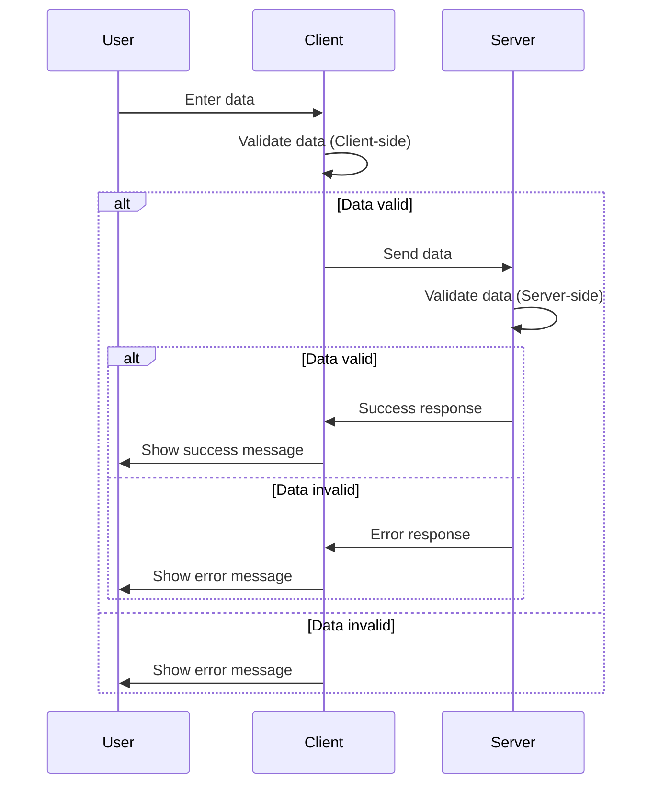

## 8.2 Data Validation Techniques

Data validation is a critical aspect of database management, ensuring that the data stored in a database is accurate, consistent, and reliable. In this section, we will explore various data validation techniques that can be employed in SQL to maintain data integrity. We will cover the use of column defaults, validation rules, and the importance of both client-side and server-side validation.

### Column Defaults

Column defaults are a simple yet powerful tool for ensuring that a column in a database table has a predefined value when no value is provided during data insertion. This technique helps maintain data consistency and can prevent errors that arise from missing data.

#### Implementing Column Defaults

To implement column defaults in SQL, you can use the `DEFAULT` keyword when defining a table. Here's an example:

```sql
CREATE TABLE employees (
    employee_id INT PRIMARY KEY,
    first_name VARCHAR(50),
    last_name VARCHAR(50),
    hire_date DATE DEFAULT CURRENT_DATE,
    status VARCHAR(10) DEFAULT 'active'
);
```

In this example, the `hire_date` column is set to default to the current date, and the `status` column defaults to 'active'. This ensures that if no value is provided for these columns during an insert operation, the default values will be used.

#### Benefits of Column Defaults

- **Consistency**: Ensures that all records have a value for the specified columns.
- **Simplicity**: Reduces the need for additional logic in application code to handle missing values.
- **Efficiency**: Minimizes the risk of errors due to missing data.

### Validation Rules

Validation rules are constraints or checks applied to data to ensure it meets certain criteria before being accepted into the database. These rules can be implemented using various SQL features such as constraints, triggers, and stored procedures.

#### Types of Validation Rules

1. **Constraints**: Constraints are rules applied at the database level to enforce data integrity. Common constraints include `NOT NULL`, `UNIQUE`, `CHECK`, `FOREIGN KEY`, and `PRIMARY KEY`.

   - **NOT NULL Constraint**: Ensures that a column cannot have a NULL value.
   - **UNIQUE Constraint**: Ensures that all values in a column are unique.
   - **CHECK Constraint**: Allows you to specify a condition that each row must satisfy.

   Example of a `CHECK` constraint:

   ```sql
   CREATE TABLE products (
       product_id INT PRIMARY KEY,
       product_name VARCHAR(100),
       price DECIMAL(10, 2) CHECK (price > 0)
   );
   ```

   In this example, the `CHECK` constraint ensures that the `price` of a product must be greater than zero.

2. **Triggers**: Triggers are special types of stored procedures that automatically execute in response to certain events on a table, such as `INSERT`, `UPDATE`, or `DELETE`. They can be used to enforce complex validation rules.

   Example of a trigger for validation:

   ```sql
   CREATE TRIGGER validate_order_quantity
   BEFORE INSERT ON orders
   FOR EACH ROW
   BEGIN
       IF NEW.quantity <= 0 THEN
           SIGNAL SQLSTATE '45000'
           SET MESSAGE_TEXT = 'Quantity must be greater than zero';
       END IF;
   END;
   ```

   This trigger ensures that the `quantity` of an order is greater than zero before the order is inserted into the `orders` table.

3. **Stored Procedures**: Stored procedures can encapsulate complex validation logic that may involve multiple tables or require conditional logic.

   Example of a stored procedure for validation:

   ```sql
   CREATE PROCEDURE validate_customer_email(IN email VARCHAR(255))
   BEGIN
       DECLARE email_count INT;
       SELECT COUNT(*) INTO email_count FROM customers WHERE email = email;
       IF email_count > 0 THEN
           SIGNAL SQLSTATE '45000'
           SET MESSAGE_TEXT = 'Email already exists';
       END IF;
   END;
   ```

   This stored procedure checks if an email already exists in the `customers` table and raises an error if it does.

### Client-Side vs. Server-Side Validation

Data validation can occur at multiple layers of an application, primarily on the client side and server side. Each has its advantages and plays a crucial role in ensuring data integrity.

#### Client-Side Validation

Client-side validation occurs in the user's browser before data is sent to the server. It provides immediate feedback to users and can prevent unnecessary server requests.

- **Advantages**:
  - **Immediate Feedback**: Users receive instant validation messages, improving the user experience.
  - **Reduced Server Load**: By catching errors early, fewer invalid requests reach the server.

- **Disadvantages**:
  - **Security**: Client-side validation can be bypassed, so it should never be the sole validation mechanism.

Example of client-side validation using HTML5:

```html
<form id="registrationForm">
    <input type="email" name="email" required>
    <input type="password" name="password" minlength="8" required>
    <button type="submit">Register</button>
</form>
```

In this example, the `required` and `minlength` attributes provide basic client-side validation.

#### Server-Side Validation

Server-side validation occurs on the server after data is submitted. It is essential for ensuring data integrity and security.

- **Advantages**:
  - **Security**: Ensures that all data is validated, regardless of client-side manipulations.
  - **Complex Validation**: Can handle more complex validation logic that may involve database queries.

- **Disadvantages**:
  - **Latency**: Users may experience a delay in receiving validation feedback.

Example of server-side validation in SQL:

```sql
CREATE PROCEDURE register_user(IN email VARCHAR(255), IN password VARCHAR(255))
BEGIN
    DECLARE email_count INT;
    SELECT COUNT(*) INTO email_count FROM users WHERE email = email;
    IF email_count > 0 THEN
        SIGNAL SQLSTATE '45000'
        SET MESSAGE_TEXT = 'Email already registered';
    END IF;

    IF LENGTH(password) < 8 THEN
        SIGNAL SQLSTATE '45000'
        SET MESSAGE_TEXT = 'Password must be at least 8 characters long';
    END IF;

    INSERT INTO users (email, password) VALUES (email, password);
END;
```

This stored procedure validates the email and password before inserting a new user into the `users` table.

### Visualizing Data Validation Workflow

To better understand the flow of data validation, let's visualize the process using a sequence diagram. This diagram illustrates the interaction between client-side and server-side validation.



This diagram shows how data is validated at both the client and server levels, ensuring comprehensive data integrity.

### Try It Yourself

Experiment with the code examples provided in this section. Try modifying the constraints, triggers, and stored procedures to handle different validation scenarios. For instance, you can:

- Add a `CHECK` constraint to ensure a product's name is not empty.
- Modify the trigger to validate a different condition, such as checking if an order date is in the future.
- Extend the stored procedure to include additional validation logic, such as checking for a valid email format.

### References and Links

- [W3Schools SQL Constraints](https://www.w3schools.com/sql/sql_constraints.asp)
- [MDN Web Docs: Client-side form validation](https://developer.mozilla.org/en-US/docs/Learn/Forms/Form_validation)
- [SQL Server Triggers](https://docs.microsoft.com/en-us/sql/relational-databases/triggers/triggers-database-engine)

### Knowledge Check

To reinforce your understanding of data validation techniques, consider the following questions:

1. What are the benefits of using column defaults in SQL?
2. How do constraints help in data validation?
3. What is the difference between client-side and server-side validation?
4. Why is server-side validation essential for security?
5. How can triggers be used to enforce validation rules?

### Embrace the Journey

Remember, mastering data validation techniques is a journey. As you continue to explore and implement these techniques, you'll gain a deeper understanding of how to maintain data integrity and build robust database systems. Keep experimenting, stay curious, and enjoy the process!

## Quiz Time!



### What is the primary purpose of column defaults in SQL?

- [x] To provide a predefined value when no value is provided
- [ ] To enforce unique values in a column
- [ ] To prevent NULL values in a column
- [ ] To automatically update a column value

> **Explanation:** Column defaults provide a predefined value for a column when no value is provided during data insertion.

### Which SQL constraint ensures that a column cannot have a NULL value?

- [ ] UNIQUE
- [x] NOT NULL
- [ ] CHECK
- [ ] PRIMARY KEY

> **Explanation:** The NOT NULL constraint ensures that a column cannot have a NULL value.

### What is a key advantage of client-side validation?

- [x] Provides immediate feedback to users
- [ ] Ensures data integrity on the server
- [ ] Handles complex validation logic
- [ ] Prevents all invalid data from reaching the server

> **Explanation:** Client-side validation provides immediate feedback to users, enhancing the user experience.

### Why is server-side validation essential?

- [x] It ensures data integrity and security
- [ ] It provides immediate feedback to users
- [ ] It reduces server load
- [ ] It can be easily bypassed

> **Explanation:** Server-side validation is essential for ensuring data integrity and security, as it cannot be bypassed like client-side validation.

### How can triggers be used in data validation?

- [x] By automatically executing validation logic in response to data changes
- [ ] By providing default values for columns
- [ ] By enforcing unique values in a column
- [ ] By preventing NULL values in a column

> **Explanation:** Triggers can automatically execute validation logic in response to data changes, ensuring data integrity.

### What is a disadvantage of client-side validation?

- [x] It can be bypassed
- [ ] It provides immediate feedback
- [ ] It reduces server load
- [ ] It handles complex validation logic

> **Explanation:** Client-side validation can be bypassed, so it should not be the sole validation mechanism.

### Which SQL feature allows you to specify a condition that each row must satisfy?

- [ ] UNIQUE
- [ ] NOT NULL
- [x] CHECK
- [ ] PRIMARY KEY

> **Explanation:** The CHECK constraint allows you to specify a condition that each row must satisfy.

### What is the role of stored procedures in data validation?

- [x] To encapsulate complex validation logic
- [ ] To provide default values for columns
- [ ] To enforce unique values in a column
- [ ] To prevent NULL values in a column

> **Explanation:** Stored procedures can encapsulate complex validation logic that may involve multiple tables or require conditional logic.

### Which validation method is essential for security?

- [ ] Client-side validation
- [x] Server-side validation
- [ ] Column defaults
- [ ] CHECK constraints

> **Explanation:** Server-side validation is essential for security, as it cannot be bypassed like client-side validation.

### True or False: Client-side validation is sufficient for ensuring data integrity.

- [ ] True
- [x] False

> **Explanation:** Client-side validation is not sufficient for ensuring data integrity, as it can be bypassed. Server-side validation is also necessary.




