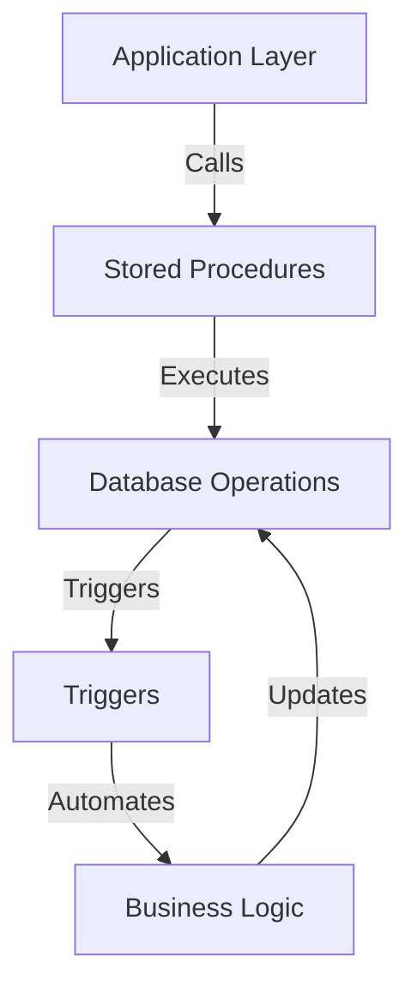

## 8.3 Business Logic Implementation in the Database

In the realm of database design, implementing business logic within the database itself is a strategy that has been both lauded and criticized. This section delves into the methods of embedding business logic in SQL databases, focusing on stored procedures and triggers. We will explore the advantages and disadvantages of this approach, provide practical examples, and discuss when it is appropriate to use these techniques.

### Introduction to Business Logic in Databases

Business logic refers to the rules and operations that define how data can be created, stored, and changed within a system. Implementing business logic in the database layer can offer several benefits, such as improved performance and centralized control. However, it also presents challenges, particularly in maintaining a clear separation between the application and data layers.

### Stored Procedures: Encapsulating Business Logic

Stored procedures are precompiled collections of SQL statements stored in the database. They allow developers to encapsulate complex business logic and execute it on the server side, reducing the need for repetitive SQL code in the application layer.

#### Key Benefits of Stored Procedures

1. **Performance Optimization**: Since stored procedures are precompiled, they can execute faster than dynamic SQL queries.
2. **Centralized Logic**: Business rules are centralized within the database, ensuring consistency across different applications accessing the data.
3. **Security**: Stored procedures can help protect against SQL injection attacks by parameterizing inputs.
4. **Reduced Network Traffic**: By executing logic on the server, stored procedures minimize the amount of data transferred between the client and server.

#### Sample Code Snippet: Creating a Stored Procedure

```sql
-- Creating a stored procedure to calculate total sales for a given customer
CREATE PROCEDURE CalculateTotalSales
    @CustomerID INT,
    @TotalSales DECIMAL(18, 2) OUTPUT
AS
BEGIN
    SELECT @TotalSales = SUM(OrderTotal)
    FROM Orders
    WHERE CustomerID = @CustomerID;
END;
```

In this example, the stored procedure `CalculateTotalSales` calculates the total sales for a specific customer by summing the `OrderTotal` from the `Orders` table.

#### Design Considerations for Stored Procedures

- **Maintainability**: Ensure that stored procedures are well-documented and modular to facilitate maintenance and updates.
- **Version Control**: Implement a version control system for stored procedures to track changes and manage deployments.
- **Testing**: Thoroughly test stored procedures to ensure they handle all edge cases and perform efficiently under load.

### Triggers: Automating Responses to Data Changes

Triggers are special types of stored procedures that automatically execute in response to specific events on a table, such as `INSERT`, `UPDATE`, or `DELETE`. They are useful for enforcing business rules and maintaining data integrity.

#### Key Benefits of Triggers

1. **Automation**: Triggers automate responses to data changes, reducing the need for manual intervention.
2. **Consistency**: They ensure that business rules are consistently applied across all data modifications.
3. **Audit and Logging**: Triggers can be used to log changes and maintain audit trails for compliance purposes.

#### Sample Code Snippet: Creating a Trigger

```sql
-- Creating a trigger to log changes to the Orders table
CREATE TRIGGER LogOrderChanges
ON Orders
AFTER INSERT, UPDATE, DELETE
AS
BEGIN
    INSERT INTO OrderAudit (OrderID, ChangeType, ChangeDate)
    SELECT 
        CASE 
            WHEN EXISTS (SELECT * FROM inserted) AND EXISTS (SELECT * FROM deleted) THEN 'UPDATE'
            WHEN EXISTS (SELECT * FROM inserted) THEN 'INSERT'
            ELSE 'DELETE'
        END,
        GETDATE()
    FROM inserted
    FULL OUTER JOIN deleted ON inserted.OrderID = deleted.OrderID;
END;
```

This trigger, `LogOrderChanges`, logs every change made to the `Orders` table into an `OrderAudit` table, capturing the type of change and the date it occurred.

#### Design Considerations for Triggers

- **Performance Impact**: Triggers can introduce performance overhead, especially if they perform complex operations. Optimize trigger logic to minimize impact.
- **Debugging**: Triggers can be difficult to debug. Use logging and error handling to aid in troubleshooting.
- **Complexity**: Avoid overly complex triggers that can become difficult to maintain and understand.

### Pros and Cons of Implementing Business Logic in the Database

#### Pros

- **Centralized Logic**: Centralizing business logic in the database ensures consistency and reduces duplication across applications.
- **Performance Benefits**: Executing logic on the server can improve performance by reducing network latency and leveraging database optimizations.
- **Security**: Stored procedures and triggers can enhance security by controlling access to data and preventing SQL injection.

#### Cons

- **Mixing Logic Layers**: Embedding business logic in the database can blur the lines between the application and data layers, complicating architecture.
- **Scalability Concerns**: As business logic grows, maintaining and scaling stored procedures and triggers can become challenging.
- **Vendor Lock-In**: Relying heavily on database-specific features can lead to vendor lock-in, making it difficult to switch database systems.

### Visualizing Business Logic Implementation

To better understand how business logic can be implemented in the database, let's visualize the interaction between stored procedures, triggers, and the application layer.



**Diagram Description**: This flowchart illustrates the interaction between the application layer, stored procedures, and triggers. The application layer calls stored procedures, which execute database operations. Triggers automate business logic in response to these operations, ensuring data integrity and consistency.

### Best Practices for Business Logic Implementation

1. **Balance Logic Distribution**: Carefully consider which business logic should reside in the database and which should remain in the application layer.
2. **Use Transactions**: Ensure that stored procedures and triggers are part of transactions to maintain data integrity.
3. **Monitor Performance**: Regularly monitor the performance of stored procedures and triggers to identify and address bottlenecks.
4. **Document Logic**: Maintain comprehensive documentation for all business logic implemented in the database to aid future development and troubleshooting.

### Try It Yourself

Experiment with the provided code examples by modifying the stored procedure to include additional business logic, such as applying discounts or calculating taxes. Similarly, enhance the trigger to log additional information, such as the user who made the change or the previous values of updated fields.

### References and Further Reading

- [Microsoft Docs: Stored Procedures](https://docs.microsoft.com/en-us/sql/relational-databases/stored-procedures/stored-procedures-database-engine)
- [Oracle Docs: Triggers](https://docs.oracle.com/en/database/oracle/oracle-database/19/adfns/triggers.html)
- [PostgreSQL: Triggers](https://www.postgresql.org/docs/current/sql-createtrigger.html)

### Knowledge Check

- What are the primary benefits of using stored procedures for business logic?
- How do triggers differ from stored procedures in terms of functionality and use cases?
- What are some potential downsides of implementing business logic in the database?

### Embrace the Journey

Remember, implementing business logic in the database is just one approach to managing data integrity and consistency. As you explore these techniques, consider the specific needs of your application and the trade-offs involved. Keep experimenting, stay curious, and enjoy the journey of mastering SQL design patterns!

## Quiz Time!



### What is a primary benefit of using stored procedures in SQL databases?

- [x] Centralized logic for consistency
- [ ] Increased network traffic
- [ ] Reduced security
- [ ] Decreased performance

> **Explanation:** Stored procedures centralize business logic within the database, ensuring consistency across applications.

### How do triggers differ from stored procedures?

- [x] Triggers automatically execute in response to events
- [ ] Triggers are manually executed
- [ ] Triggers are used for data retrieval only
- [ ] Triggers cannot modify data

> **Explanation:** Triggers are designed to automatically execute in response to specific events on a table, such as `INSERT`, `UPDATE`, or `DELETE`.

### What is a potential downside of implementing business logic in the database?

- [x] Mixing application logic with data layer
- [ ] Improved scalability
- [ ] Enhanced security
- [ ] Increased network latency

> **Explanation:** Implementing business logic in the database can blur the lines between application and data layers, complicating architecture.

### Which of the following is NOT a benefit of using stored procedures?

- [ ] Performance optimization
- [ ] Centralized logic
- [x] Increased network traffic
- [ ] Security enhancement

> **Explanation:** Stored procedures reduce network traffic by executing logic on the server side.

### What is a common use case for triggers?

- [x] Automating responses to data changes
- [ ] Data retrieval
- [ ] User authentication
- [ ] Network configuration

> **Explanation:** Triggers are commonly used to automate responses to data changes, such as logging or enforcing business rules.

### What should be considered when designing stored procedures?

- [x] Maintainability and documentation
- [ ] Ignoring version control
- [ ] Avoiding testing
- [ ] Increasing complexity

> **Explanation:** Stored procedures should be well-documented and modular to facilitate maintenance and updates.

### What is a key benefit of using triggers?

- [x] Automation of business rules
- [ ] Manual data entry
- [ ] Increased complexity
- [ ] Reduced consistency

> **Explanation:** Triggers automate the enforcement of business rules, ensuring consistency across data modifications.

### What is a potential performance impact of triggers?

- [x] Performance overhead
- [ ] Increased speed
- [ ] Reduced complexity
- [ ] Enhanced scalability

> **Explanation:** Triggers can introduce performance overhead, especially if they perform complex operations.

### How can stored procedures enhance security?

- [x] By parameterizing inputs to prevent SQL injection
- [ ] By increasing network traffic
- [ ] By reducing data integrity
- [ ] By complicating logic

> **Explanation:** Stored procedures can enhance security by parameterizing inputs, which helps prevent SQL injection attacks.

### True or False: Triggers can be used to maintain audit trails for compliance purposes.

- [x] True
- [ ] False

> **Explanation:** Triggers can be used to log changes and maintain audit trails, which is useful for compliance and tracking data modifications.


