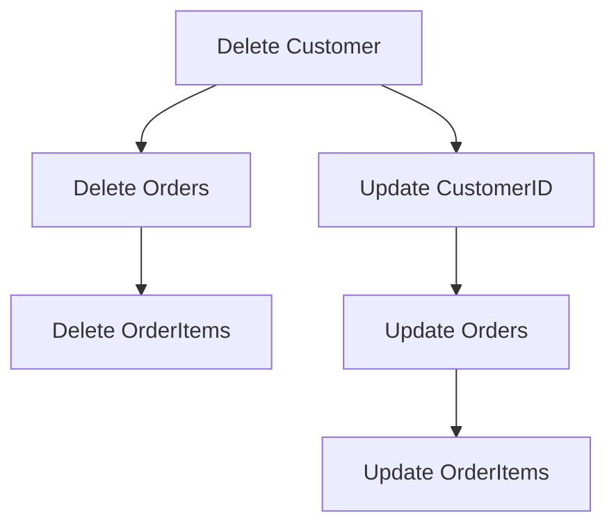

## 8.4 Cascading Updates and Deletes

In the realm of relational databases, maintaining data integrity is paramount. One of the critical aspects of ensuring this integrity is managing the relationships between tables, especially when it comes to parent-child relationships. Cascading updates and deletes are powerful features in SQL that help automate the maintenance of these relationships. In this section, we will delve into the concepts of cascading updates and deletes, explore their use cases, and provide guidance on their implementation and potential pitfalls.

### Understanding Cascading Updates and Deletes

Cascading updates and deletes are mechanisms provided by SQL to automatically propagate changes from a parent table to its related child tables. This is particularly useful in scenarios where tables are linked by foreign key constraints, ensuring that changes in the parent table do not lead to orphaned records or data inconsistencies in the child tables.

#### ON DELETE CASCADE

The `ON DELETE CASCADE` option is used to automatically delete child records when a parent record is deleted. This ensures that there are no orphaned records in the child table, maintaining referential integrity.

**Example:**

Consider a database with two tables: `Orders` and `OrderItems`. The `OrderItems` table has a foreign key reference to the `Orders` table. When an order is deleted, all associated order items should also be deleted.

```sql
CREATE TABLE Orders (
    OrderID INT PRIMARY KEY,
    OrderDate DATE
);

CREATE TABLE OrderItems (
    ItemID INT PRIMARY KEY,
    OrderID INT,
    ProductName VARCHAR(100),
    FOREIGN KEY (OrderID) REFERENCES Orders(OrderID) ON DELETE CASCADE
);
```

In this example, if an order is deleted from the `Orders` table, all corresponding entries in the `OrderItems` table will be automatically removed.

#### ON UPDATE CASCADE

The `ON UPDATE CASCADE` option is used to automatically update child records when a parent record is updated. This is useful when the primary key of a parent table is modified, ensuring that all related child records reflect the change.

**Example:**

Continuing with the `Orders` and `OrderItems` example, suppose the `OrderID` in the `Orders` table is updated. The `ON UPDATE CASCADE` option ensures that the `OrderID` in the `OrderItems` table is also updated.

```sql
CREATE TABLE Orders (
    OrderID INT PRIMARY KEY,
    OrderDate DATE
);

CREATE TABLE OrderItems (
    ItemID INT PRIMARY KEY,
    OrderID INT,
    ProductName VARCHAR(100),
    FOREIGN KEY (OrderID) REFERENCES Orders(OrderID) ON UPDATE CASCADE
);
```

### Use Cases for Cascading Updates and Deletes

Cascading updates and deletes are particularly useful in scenarios where:

- **Maintaining Data Integrity**: Ensuring that changes in parent records are consistently reflected in child records, preventing orphaned records.
- **Simplifying Database Management**: Automating the propagation of changes reduces the need for manual intervention and complex application logic.
- **Enforcing Business Rules**: Automatically maintaining relationships between tables according to business rules.

### Caution: Understanding the Impact

While cascading updates and deletes offer significant advantages, they must be used with caution to prevent unintended data loss or corruption. Here are some considerations:

- **Unintended Data Loss**: Cascading deletes can lead to the removal of large amounts of data if not carefully managed. Always ensure that the cascading behavior aligns with business requirements.
- **Performance Implications**: Cascading operations can impact performance, especially in large databases with complex relationships. It's important to test and optimize these operations.
- **Complexity in Debugging**: Automated cascades can make it harder to trace the source of data changes, complicating debugging efforts.

### Implementing Cascading Updates and Deletes

To implement cascading updates and deletes, you need to define foreign key constraints with the appropriate cascading options. Here’s a step-by-step guide:

1. **Identify Relationships**: Determine the parent-child relationships in your database schema.
2. **Define Foreign Keys**: Use the `FOREIGN KEY` constraint to establish relationships between tables.
3. **Specify Cascading Options**: Use `ON DELETE CASCADE` and/or `ON UPDATE CASCADE` to define the desired cascading behavior.

**Example Implementation:**

Let's consider a more complex example with three tables: `Customers`, `Orders`, and `OrderItems`.

```sql
CREATE TABLE Customers (
    CustomerID INT PRIMARY KEY,
    CustomerName VARCHAR(100)
);

CREATE TABLE Orders (
    OrderID INT PRIMARY KEY,
    CustomerID INT,
    OrderDate DATE,
    FOREIGN KEY (CustomerID) REFERENCES Customers(CustomerID) ON DELETE CASCADE
);

CREATE TABLE OrderItems (
    ItemID INT PRIMARY KEY,
    OrderID INT,
    ProductName VARCHAR(100),
    FOREIGN KEY (OrderID) REFERENCES Orders(OrderID) ON DELETE CASCADE
);
```

In this setup, deleting a customer will automatically delete all their orders and the associated order items.

### Visualizing Cascading Operations

To better understand how cascading updates and deletes work, let's visualize the process using a flowchart.



**Description:** This flowchart illustrates the cascading delete and update operations. Deleting a customer triggers the deletion of related orders and order items. Similarly, updating a customer's ID propagates the change to related orders and order items.

### Design Considerations

When implementing cascading updates and deletes, consider the following:

- **Business Logic Alignment**: Ensure that cascading operations align with business rules and logic.
- **Testing and Validation**: Thoroughly test cascading operations to validate their behavior and impact.
- **Documentation**: Document cascading relationships and their intended behavior for future reference and maintenance.

### Differences and Similarities with Other Patterns

Cascading updates and deletes are often compared with other data integrity patterns, such as:

- **Triggers**: While triggers can also automate data changes, they offer more flexibility and complexity than cascading options. However, they can be harder to manage and debug.
- **Application-Level Logic**: Implementing cascading behavior in application code provides more control but increases complexity and potential for errors.

### Try It Yourself

To gain hands-on experience with cascading updates and deletes, try modifying the code examples provided. Experiment with different cascading options and observe their impact on related tables. Consider scenarios where cascading behavior might lead to unintended consequences and how you might mitigate them.

### References and Further Reading

- [SQL FOREIGN KEY Constraint](https://www.w3schools.com/sql/sql_foreignkey.asp) - W3Schools
- [Managing Data Integrity with Cascading Actions](https://docs.microsoft.com/en-us/sql/relational-databases/tables/managing-data-integrity-with-cascading-actions) - Microsoft Docs
- [Understanding Cascading Deletes and Updates](https://www.sqlshack.com/understanding-cascading-deletes-and-updates-in-sql-server/) - SQL Shack

### Knowledge Check

Before we conclude, let's reinforce what we've learned with a few questions and exercises.

1. **What are the primary benefits of using cascading updates and deletes?**
2. **How can cascading deletes lead to unintended data loss?**
3. **What are some performance considerations when using cascading operations?**
4. **How do cascading updates differ from application-level logic?**

### Embrace the Journey

Remember, mastering cascading updates and deletes is just one step in your journey to becoming an expert in SQL design patterns. As you continue to explore and experiment, you'll gain a deeper understanding of how to maintain data integrity and optimize database performance. Keep pushing the boundaries, stay curious, and enjoy the journey!

## Quiz Time!



### What is the primary purpose of cascading deletes?

- [x] To automatically delete child records when a parent record is deleted
- [ ] To update child records when a parent record is updated
- [ ] To prevent data loss in child tables
- [ ] To enforce unique constraints on child records

> **Explanation:** Cascading deletes automatically remove child records when a parent record is deleted, maintaining referential integrity.

### Which SQL clause is used to define cascading updates?

- [ ] ON DELETE CASCADE
- [x] ON UPDATE CASCADE
- [ ] ON CASCADE UPDATE
- [ ] ON UPDATE DELETE

> **Explanation:** The `ON UPDATE CASCADE` clause is used to define cascading updates, ensuring changes in parent records are reflected in child records.

### What is a potential risk of using cascading deletes?

- [x] Unintended data loss
- [ ] Improved performance
- [ ] Increased data redundancy
- [ ] Enhanced data security

> **Explanation:** Cascading deletes can lead to unintended data loss if not carefully managed, as they automatically remove related child records.

### How can cascading updates impact database performance?

- [x] They can increase the load on the database during updates
- [ ] They always improve query performance
- [ ] They reduce the need for indexes
- [ ] They eliminate the need for foreign keys

> **Explanation:** Cascading updates can increase the load on the database during updates, especially in large databases with complex relationships.

### What is a key difference between cascading updates and application-level logic?

- [x] Cascading updates are managed by the database, while application-level logic is managed by the application
- [ ] Cascading updates require more code than application-level logic
- [ ] Application-level logic is faster than cascading updates
- [ ] Cascading updates are less reliable than application-level logic

> **Explanation:** Cascading updates are managed by the database, providing automation, while application-level logic requires manual implementation in the application code.

### Which of the following is a valid use case for cascading updates?

- [x] Propagating changes in a primary key to related foreign keys
- [ ] Automatically generating unique identifiers
- [ ] Enforcing data validation rules
- [ ] Preventing unauthorized access to data

> **Explanation:** Cascading updates are used to propagate changes in a primary key to related foreign keys, ensuring data consistency.

### How can you prevent unintended data loss with cascading deletes?

- [x] Carefully design and test cascading relationships
- [ ] Avoid using foreign keys
- [ ] Use application-level logic instead
- [ ] Disable cascading deletes

> **Explanation:** Carefully designing and testing cascading relationships helps prevent unintended data loss by ensuring that cascading behavior aligns with business requirements.

### What is the role of foreign keys in cascading operations?

- [x] They define the relationships between parent and child tables
- [ ] They enforce unique constraints on child records
- [ ] They improve query performance
- [ ] They prevent data redundancy

> **Explanation:** Foreign keys define the relationships between parent and child tables, enabling cascading operations to maintain referential integrity.

### Which of the following is NOT a benefit of using cascading updates and deletes?

- [ ] Simplifying database management
- [ ] Maintaining data integrity
- [ ] Automating data propagation
- [x] Increasing data redundancy

> **Explanation:** Cascading updates and deletes simplify database management, maintain data integrity, and automate data propagation, but they do not increase data redundancy.

### True or False: Cascading updates and deletes can be implemented without foreign keys.

- [ ] True
- [x] False

> **Explanation:** Cascading updates and deletes rely on foreign keys to define the relationships between parent and child tables, making them essential for implementation.


