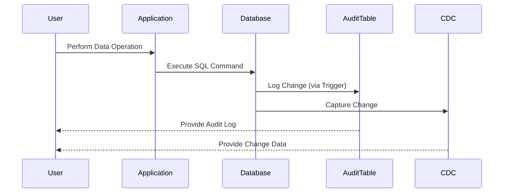

## 8.5 Auditing and Change Tracking

In the realm of database management, ensuring data integrity and maintaining a comprehensive history of changes are paramount. Auditing and change tracking are essential practices that help organizations comply with regulations, debug issues, and perform historical data analysis. In this section, we will delve into the mechanisms of auditing and change tracking, focusing on audit tables, triggers, and Change Data Capture (CDC).

### Introduction to Auditing and Change Tracking

Auditing and change tracking are processes used to monitor and record changes to data within a database. These processes are crucial for:

- **Compliance**: Many industries require strict adherence to regulations that mandate data auditing.
- **Debugging**: Understanding the history of data changes can help identify the root cause of issues.
- **Historical Analysis**: Analyzing past data changes can provide insights into trends and patterns.

### Audit Tables

Audit tables are specialized tables used to store historical data changes. They provide a detailed record of every modification made to the data, including who made the change and when it occurred.

#### Design Pattern Name: Audit Tables

- **Category**: Data Integrity and Validation
- **Intent**: To maintain a historical record of data changes for compliance, debugging, and analysis.

#### Key Participants

- **Audit Table**: A separate table that mirrors the structure of the original table, with additional columns for metadata such as timestamp, user, and operation type.
- **Source Table**: The original table whose changes are being tracked.

#### Applicability

- Use audit tables when you need a detailed history of data changes.
- Ideal for applications requiring compliance with data retention regulations.

#### Sample Code Snippet

```sql
-- Create an audit table for the 'employees' table
CREATE TABLE employees_audit (
    audit_id INT PRIMARY KEY AUTO_INCREMENT,
    employee_id INT,
    name VARCHAR(100),
    position VARCHAR(100),
    salary DECIMAL(10, 2),
    operation_type VARCHAR(10),
    changed_by VARCHAR(100),
    changed_at TIMESTAMP DEFAULT CURRENT_TIMESTAMP
);

-- Example trigger to populate the audit table
CREATE TRIGGER after_employee_update
AFTER UPDATE ON employees
FOR EACH ROW
BEGIN
    INSERT INTO employees_audit (employee_id, name, position, salary, operation_type, changed_by)
    VALUES (OLD.employee_id, OLD.name, OLD.position, OLD.salary, 'UPDATE', USER());
END;
```

In this example, the `employees_audit` table is used to store changes made to the `employees` table. The trigger `after_employee_update` captures updates and logs them in the audit table.

### Triggers for Auditing

Triggers are database objects that automatically execute a specified set of SQL statements in response to certain events on a particular table or view. They are instrumental in implementing auditing mechanisms.

#### Design Pattern Name: Triggers for Auditing

- **Category**: Data Integrity and Validation
- **Intent**: To automate the process of capturing data changes and recording them in audit tables.

#### Key Participants

- **Trigger**: A database object that defines the conditions under which the auditing logic is executed.
- **Audit Table**: The table where the audit records are stored.

#### Applicability

- Use triggers when you need to automate the auditing process without modifying application logic.
- Suitable for capturing real-time changes to data.

#### Sample Code Snippet

```sql
-- Create a trigger for auditing insert operations
CREATE TRIGGER after_employee_insert
AFTER INSERT ON employees
FOR EACH ROW
BEGIN
    INSERT INTO employees_audit (employee_id, name, position, salary, operation_type, changed_by)
    VALUES (NEW.employee_id, NEW.name, NEW.position, NEW.salary, 'INSERT', USER());
END;

-- Create a trigger for auditing delete operations
CREATE TRIGGER after_employee_delete
AFTER DELETE ON employees
FOR EACH ROW
BEGIN
    INSERT INTO employees_audit (employee_id, name, position, salary, operation_type, changed_by)
    VALUES (OLD.employee_id, OLD.name, OLD.position, OLD.salary, 'DELETE', USER());
END;
```

These triggers capture insert and delete operations on the `employees` table, ensuring that all changes are logged in the `employees_audit` table.

### Change Data Capture (CDC)

Change Data Capture (CDC) is a set of technologies used to identify and capture changes made to data in a database. CDC is often implemented using DBMS features that efficiently track changes without the need for custom triggers or audit tables.

#### Design Pattern Name: Change Data Capture (CDC)

- **Category**: Data Integrity and Validation
- **Intent**: To efficiently track and capture data changes using built-in DBMS features.

#### Key Participants

- **CDC Mechanism**: The DBMS feature or tool that captures data changes.
- **Source Table**: The table whose changes are being tracked.

#### Applicability

- Use CDC when you need a scalable and efficient way to track data changes.
- Ideal for large-scale applications where performance is a concern.

#### Sample Code Snippet

```sql
-- Enable CDC on the 'employees' table (SQL Server example)
EXEC sys.sp_cdc_enable_table
    @source_schema = 'dbo',
    @source_name = 'employees',
    @role_name = NULL;

-- Query the CDC change table
SELECT * FROM cdc.dbo_employees_CT;
```

In this example, CDC is enabled on the `employees` table in SQL Server, and changes can be queried from the CDC change table.

### Applications of Auditing and Change Tracking

Auditing and change tracking have numerous applications across different domains:

- **Compliance**: Ensuring adherence to regulations such as GDPR, HIPAA, and SOX.
- **Debugging**: Identifying the source of data anomalies and errors.
- **Historical Analysis**: Analyzing trends and patterns in data changes over time.

### Design Considerations

When implementing auditing and change tracking, consider the following:

- **Performance**: Triggers and audit tables can impact performance. Optimize queries and consider using CDC for high-performance needs.
- **Storage**: Audit tables can grow large. Implement archiving strategies to manage storage.
- **Security**: Ensure that audit data is protected and access is restricted to authorized users.

### Differences and Similarities

- **Audit Tables vs. CDC**: Audit tables provide detailed historical records, while CDC offers efficient change tracking with minimal performance impact.
- **Triggers vs. CDC**: Triggers are customizable and can capture complex logic, whereas CDC is a built-in feature that simplifies change tracking.

### Visualizing Auditing and Change Tracking

To better understand the flow of auditing and change tracking, let's visualize the process using a sequence diagram.



**Diagram Description**: This sequence diagram illustrates the flow of data changes from the user through the application to the database. Changes are logged in the audit table via triggers and captured by CDC for efficient tracking.

### Try It Yourself

Experiment with the provided code examples by:

- Modifying the structure of the audit table to include additional metadata.
- Creating triggers for other operations, such as updates on different tables.
- Enabling CDC on additional tables and querying the change data.

### References and Links

- [Microsoft Docs: Change Data Capture](https://docs.microsoft.com/en-us/sql/relational-databases/track-changes/about-change-data-capture-sql-server)
- [Oracle Database Documentation: Triggers](https://docs.oracle.com/en/database/oracle/oracle-database/19/adfns/triggers.html)
- [PostgreSQL Documentation: Triggers](https://www.postgresql.org/docs/current/sql-createtrigger.html)

### Knowledge Check

- What are the key differences between audit tables and CDC?
- How do triggers facilitate auditing in SQL databases?
- What are some common applications of auditing and change tracking?

### Embrace the Journey

Remember, mastering auditing and change tracking is a journey. As you progress, you'll gain deeper insights into data integrity and compliance. Keep experimenting, stay curious, and enjoy the process!

## Quiz Time!



### What is the primary purpose of audit tables in SQL databases?

- [x] To maintain a historical record of data changes
- [ ] To improve query performance
- [ ] To store temporary data
- [ ] To manage user access

> **Explanation:** Audit tables are used to maintain a historical record of data changes for compliance, debugging, and analysis.

### Which SQL object is used to automate the process of capturing data changes?

- [x] Trigger
- [ ] View
- [ ] Index
- [ ] Stored Procedure

> **Explanation:** Triggers are used to automate the process of capturing data changes and recording them in audit tables.

### What is Change Data Capture (CDC) primarily used for?

- [x] Efficiently tracking and capturing data changes
- [ ] Improving database security
- [ ] Enhancing data visualization
- [ ] Managing database connections

> **Explanation:** CDC is used to efficiently track and capture data changes using built-in DBMS features.

### Which of the following is a key participant in the audit table design pattern?

- [x] Audit Table
- [ ] Index
- [ ] View
- [ ] Function

> **Explanation:** The audit table is a key participant in the audit table design pattern, used to store historical data changes.

### What is a common application of auditing and change tracking?

- [x] Compliance
- [ ] Data encryption
- [ ] Load balancing
- [ ] Network monitoring

> **Explanation:** Auditing and change tracking are commonly used for compliance with regulations.

### How can triggers impact database performance?

- [x] They can impact performance if not optimized
- [ ] They always improve performance
- [ ] They have no impact on performance
- [ ] They only affect performance during backups

> **Explanation:** Triggers can impact performance if not optimized, as they execute additional logic during data operations.

### What is a key difference between audit tables and CDC?

- [x] Audit tables provide detailed records, while CDC offers efficient tracking
- [ ] CDC provides detailed records, while audit tables offer efficient tracking
- [ ] Both provide the same level of detail and efficiency
- [ ] Neither provides detailed records

> **Explanation:** Audit tables provide detailed historical records, while CDC offers efficient change tracking with minimal performance impact.

### Which DBMS feature is used to enable CDC in SQL Server?

- [x] sys.sp_cdc_enable_table
- [ ] sys.sp_enable_audit
- [ ] sys.sp_create_trigger
- [ ] sys.sp_create_index

> **Explanation:** The `sys.sp_cdc_enable_table` procedure is used to enable CDC on a table in SQL Server.

### What should be considered when implementing auditing and change tracking?

- [x] Performance, storage, and security
- [ ] Only performance
- [ ] Only storage
- [ ] Only security

> **Explanation:** When implementing auditing and change tracking, consider performance, storage, and security.

### True or False: Triggers can be used to capture complex logic during data changes.

- [x] True
- [ ] False

> **Explanation:** Triggers can be used to capture complex logic during data changes, making them versatile for auditing purposes.


