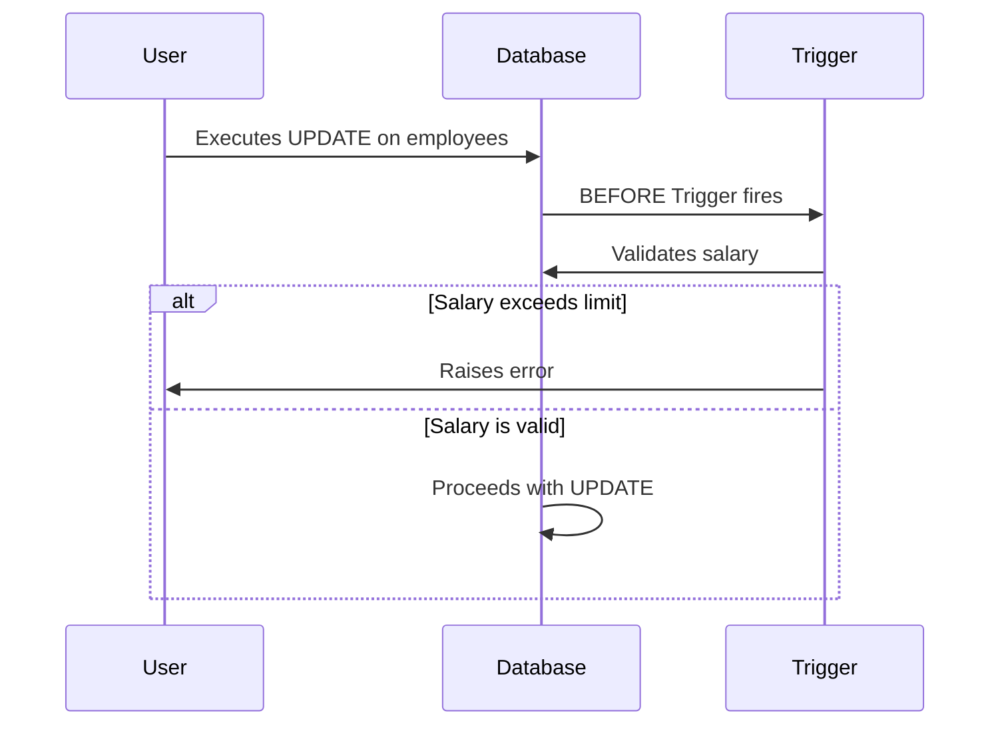

## 8.6 Triggers for Data Integrity

In the realm of SQL databases, maintaining data integrity is paramount. Triggers are a powerful tool that can help enforce data integrity rules, automate system tasks, and ensure consistency across your database. In this section, we will delve into the types of triggers, their use cases, performance considerations, and how to effectively implement them in your SQL database systems.

### Understanding SQL Triggers

**Triggers** are special types of stored procedures that automatically execute or "fire" when a specified event occurs in the database. These events can be data modifications such as `INSERT`, `UPDATE`, or `DELETE` operations. Triggers can be used to enforce business rules, validate data, and maintain audit trails, among other tasks.

#### Types of Triggers

1. **BEFORE Triggers**: These triggers execute before the triggering event. They are often used to validate or modify data before it is committed to the database.

2. **AFTER Triggers**: These triggers execute after the triggering event. They are typically used for logging changes or enforcing complex constraints that require the data to be committed first.

3. **INSTEAD OF Triggers**: These triggers replace the triggering event with a custom operation. They are commonly used on views to allow `INSERT`, `UPDATE`, or `DELETE` operations that the view itself does not directly support.

### Use Cases for Triggers

Triggers can be employed in various scenarios to enhance data integrity and automate processes:

- **Enforcing Complex Constraints**: Use triggers to enforce business rules that cannot be implemented using standard SQL constraints. For example, ensuring that a `salary` column does not exceed a certain percentage of the `budget`.

- **Logging Changes**: Implement triggers to automatically log changes to critical data, creating an audit trail that can be used for compliance and troubleshooting.

- **Derived Values**: Calculate and store computed data, such as updating a `total_price` column whenever the `quantity` or `unit_price` changes in an order line item.

### Implementing Triggers

Let's explore how to implement these triggers with practical examples.

#### BEFORE Trigger Example

Suppose we have a table `employees` and we want to ensure that no employee's salary exceeds a certain limit before an update occurs.

```sql
CREATE TRIGGER check_salary_before_update
BEFORE UPDATE ON employees
FOR EACH ROW
BEGIN
    IF NEW.salary > 100000 THEN
        SIGNAL SQLSTATE '45000'
        SET MESSAGE_TEXT = 'Salary exceeds the allowed limit';
    END IF;
END;
```

**Explanation**: This trigger checks if the new salary exceeds $100,000 before allowing the update. If it does, an error is raised, preventing the update.

#### AFTER Trigger Example

Consider a scenario where we need to log every deletion from the `orders` table.

```sql
CREATE TRIGGER log_order_deletion
AFTER DELETE ON orders
FOR EACH ROW
BEGIN
    INSERT INTO order_deletions_log(order_id, deleted_at)
    VALUES (OLD.order_id, NOW());
END;
```

**Explanation**: This trigger logs the `order_id` and the timestamp of deletion into the `order_deletions_log` table after an order is deleted.

#### INSTEAD OF Trigger Example

Let's say we have a view `active_customers` that does not support direct updates. We can use an `INSTEAD OF` trigger to handle updates.

```sql
CREATE TRIGGER update_active_customers
INSTEAD OF UPDATE ON active_customers
FOR EACH ROW
BEGIN
    UPDATE customers
    SET status = NEW.status
    WHERE customer_id = OLD.customer_id;
END;
```

**Explanation**: This trigger intercepts updates to the `active_customers` view and applies them to the underlying `customers` table.

### Performance Considerations

While triggers are powerful, they can introduce performance overhead if not used judiciously. Here are some considerations:

- **Execution Time**: Triggers add to the execution time of the triggering statement. Complex logic in triggers can significantly slow down data operations.

- **Debugging Complexity**: Triggers can make debugging more challenging, as they introduce implicit behavior that may not be immediately apparent.

- **Cascading Effects**: Triggers can cause cascading effects, where one trigger activates another, leading to unintended consequences.

### Visualizing Trigger Execution Flow

To better understand how triggers operate, let's visualize the execution flow of a trigger using a sequence diagram.



**Diagram Explanation**: This sequence diagram illustrates the flow of a `BEFORE` trigger. The trigger checks the salary before the update proceeds. If the salary exceeds the limit, an error is raised, preventing the update.

### Best Practices for Using Triggers

- **Keep Logic Simple**: Avoid complex logic within triggers to minimize performance impact and maintain readability.

- **Document Trigger Behavior**: Clearly document the purpose and behavior of each trigger to aid in maintenance and debugging.

- **Test Thoroughly**: Ensure that triggers are thoroughly tested to prevent unexpected behavior in production environments.

- **Monitor Performance**: Regularly monitor the performance impact of triggers and optimize or refactor as necessary.

### Try It Yourself

Experiment with the provided examples by modifying the conditions or actions within the triggers. For instance, try changing the salary limit in the `BEFORE` trigger example or add additional logging details in the `AFTER` trigger example.

### Further Reading

For more information on SQL triggers and best practices, consider exploring the following resources:

- [SQL Triggers - W3Schools](https://www.w3schools.com/sql/sql_triggers.asp)
- [Triggers in SQL - MDN Web Docs](https://developer.mozilla.org/en-US/docs/Web/SQL/Triggers)

### Knowledge Check

Let's reinforce what we've learned with a few questions and exercises.

## Quiz Time!



### What is a primary use case for BEFORE triggers?

- [x] Validating data before it is committed
- [ ] Logging changes after they occur
- [ ] Replacing the triggering event
- [ ] Calculating derived values after an update

> **Explanation:** BEFORE triggers are used to validate or modify data before it is committed to the database.

### Which type of trigger is best suited for logging changes?

- [ ] BEFORE
- [x] AFTER
- [ ] INSTEAD OF
- [ ] DURING

> **Explanation:** AFTER triggers are ideal for logging changes because they execute after the data modification has occurred.

### What is the main advantage of using INSTEAD OF triggers?

- [x] Allowing operations on views that do not support direct modifications
- [ ] Validating data before it is committed
- [ ] Logging changes after they occur
- [ ] Enforcing complex constraints

> **Explanation:** INSTEAD OF triggers are used to handle operations on views that do not support direct modifications.

### What is a potential downside of using triggers?

- [x] They can introduce performance overhead
- [ ] They simplify debugging
- [ ] They always improve performance
- [ ] They are easy to document

> **Explanation:** Triggers can introduce performance overhead due to the additional processing they require.

### How can triggers affect debugging?

- [x] They introduce implicit behavior that can complicate debugging
- [ ] They make debugging easier by providing clear logs
- [ ] They have no effect on debugging
- [ ] They simplify debugging by reducing code complexity

> **Explanation:** Triggers introduce implicit behavior, which can make debugging more challenging.

### What should be avoided in trigger logic?

- [x] Complex logic that impacts performance
- [ ] Simple validation checks
- [ ] Logging operations
- [ ] Data modifications

> **Explanation:** Complex logic in triggers can negatively impact performance and should be avoided.

### What is a common use case for AFTER triggers?

- [ ] Validating data before it is committed
- [x] Logging changes after they occur
- [ ] Replacing the triggering event
- [ ] Calculating derived values before an update

> **Explanation:** AFTER triggers are commonly used for logging changes after they occur.

### What is a key consideration when using triggers?

- [x] Monitoring their performance impact
- [ ] Ensuring they are complex
- [ ] Avoiding documentation
- [ ] Using them for all data operations

> **Explanation:** It's important to monitor the performance impact of triggers to ensure they do not degrade system performance.

### True or False: Triggers can cause cascading effects.

- [x] True
- [ ] False

> **Explanation:** Triggers can cause cascading effects, where one trigger activates another, leading to unintended consequences.

### What is a recommended practice for maintaining triggers?

- [x] Documenting their behavior and purpose
- [ ] Avoiding testing
- [ ] Using them without monitoring
- [ ] Keeping them undocumented

> **Explanation:** Documenting the behavior and purpose of triggers is a recommended practice for maintenance and debugging.



Remember, mastering triggers is just one step in ensuring robust data integrity in your SQL databases. Keep exploring and experimenting to enhance your skills and understanding. Happy coding!
