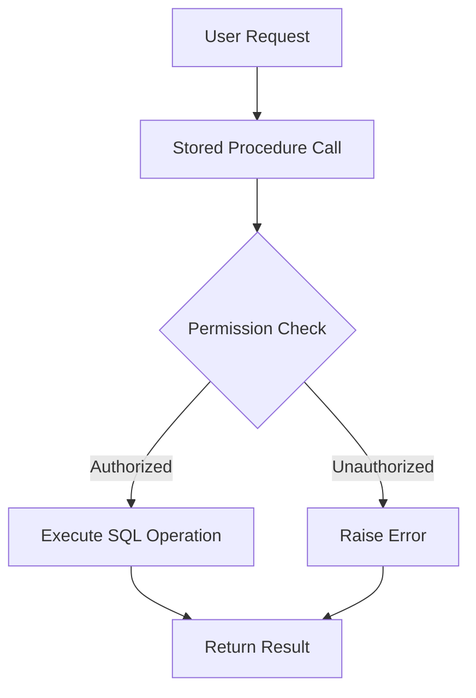

## 8.7 Using Stored Procedures for Data Access Control

In the realm of SQL and database management, stored procedures play a pivotal role in enhancing data access control. They serve as a robust mechanism for encapsulating business logic, enforcing security policies, and ensuring data integrity. This section delves into the intricacies of using stored procedures for data access control, highlighting their benefits, implementation strategies, and best practices.

### Understanding Stored Procedures

Stored procedures are precompiled collections of SQL statements stored within the database. They allow developers to encapsulate complex operations, making them reusable and efficient. By using stored procedures, we can abstract the underlying database schema, providing a controlled interface for data access and manipulation.

#### Key Characteristics of Stored Procedures

- **Encapsulation**: Stored procedures encapsulate SQL logic, hiding the complexity and details of the database schema from the end user.
- **Reusability**: Once defined, stored procedures can be reused across different applications and modules.
- **Performance**: As stored procedures are precompiled, they often execute faster than ad-hoc queries.
- **Security**: They provide a layer of security by restricting direct access to the database tables.

### Encapsulation: Hiding Direct Access to Tables

Encapsulation is a fundamental principle in software design, and stored procedures embody this principle by hiding direct access to database tables. By doing so, they provide a controlled environment for data operations, ensuring that only authorized procedures can interact with the data.

#### Benefits of Encapsulation

1. **Abstraction**: Users interact with the database through a defined interface, without needing to understand the underlying schema.
2. **Consistency**: Stored procedures enforce consistent data access patterns, reducing the risk of errors and inconsistencies.
3. **Security**: By restricting direct table access, stored procedures mitigate the risk of unauthorized data manipulation.

#### Example: Encapsulation with Stored Procedures

Consider a scenario where we need to manage employee records. Instead of allowing direct access to the `Employees` table, we can create stored procedures for specific operations:

```sql
-- Stored procedure to add a new employee
CREATE PROCEDURE AddEmployee
    @FirstName NVARCHAR(50),
    @LastName NVARCHAR(50),
    @Position NVARCHAR(50),
    @Salary DECIMAL(10, 2)
AS
BEGIN
    INSERT INTO Employees (FirstName, LastName, Position, Salary)
    VALUES (@FirstName, @LastName, @Position, @Salary);
END
```

In this example, the `AddEmployee` procedure encapsulates the logic for adding a new employee, ensuring that the operation is performed consistently and securely.

### Implementing Security Policies

Stored procedures are instrumental in implementing security policies within the database. By embedding permission checks and validation logic within procedures, we can enforce strict access controls and ensure data integrity.

#### Security Policies in Stored Procedures

- **Role-Based Access Control (RBAC)**: Define procedures that check user roles and permissions before executing sensitive operations.
- **Data Validation**: Implement validation logic within procedures to ensure data integrity and prevent invalid data entry.
- **Audit Trails**: Use stored procedures to log changes and maintain audit trails for critical operations.

#### Example: Security Policies with Stored Procedures

Let's enhance our previous example by adding a security check to ensure that only authorized users can add employees:

```sql
-- Stored procedure with security check
CREATE PROCEDURE SecureAddEmployee
    @UserID INT,
    @FirstName NVARCHAR(50),
    @LastName NVARCHAR(50),
    @Position NVARCHAR(50),
    @Salary DECIMAL(10, 2)
AS
BEGIN
    -- Check if the user has permission to add employees
    IF EXISTS (SELECT 1 FROM UserPermissions WHERE UserID = @UserID AND CanAddEmployee = 1)
    BEGIN
        INSERT INTO Employees (FirstName, LastName, Position, Salary)
        VALUES (@FirstName, @LastName, @Position, @Salary);
    END
    ELSE
    BEGIN
        RAISERROR('Unauthorized access', 16, 1);
    END
END
```

In this example, the `SecureAddEmployee` procedure checks the `UserPermissions` table to verify if the user has the necessary permissions before proceeding with the operation.

### Benefits of Using Stored Procedures for Data Access Control

Stored procedures offer numerous benefits when it comes to data access control, making them an essential tool for database administrators and developers.

#### Preventing SQL Injection

One of the most significant advantages of stored procedures is their ability to prevent SQL injection attacks. By parameterizing queries and avoiding dynamic SQL, stored procedures reduce the risk of malicious code execution.

#### Enforcing Consistent Data Access Patterns

Stored procedures enforce consistent data access patterns, ensuring that all operations adhere to predefined rules and logic. This consistency is crucial for maintaining data integrity and reliability.

#### Centralized Business Logic

By centralizing business logic within stored procedures, we can ensure that all applications accessing the database follow the same rules and processes. This centralization simplifies maintenance and reduces the risk of errors.

### Design Considerations

When designing stored procedures for data access control, consider the following best practices:

- **Parameterization**: Always use parameters to pass data to stored procedures, avoiding dynamic SQL to prevent injection attacks.
- **Error Handling**: Implement robust error handling within procedures to manage exceptions and ensure graceful failure.
- **Version Control**: Use version control systems to manage changes to stored procedures, ensuring traceability and rollback capabilities.
- **Testing**: Thoroughly test stored procedures to validate their functionality and performance under different scenarios.

### Differences and Similarities with Other Patterns

Stored procedures are often compared with other data access patterns, such as views and functions. While they share similarities, each has distinct characteristics:

- **Views**: Unlike stored procedures, views are virtual tables that provide a read-only interface to the data. They do not encapsulate logic or support parameterization.
- **Functions**: Functions are similar to stored procedures but are typically used for computations and return values. They cannot perform data modification operations.

### Try It Yourself

To gain hands-on experience with stored procedures, try modifying the examples provided:

1. **Add Logging**: Enhance the `SecureAddEmployee` procedure to log each operation in an `AuditLog` table.
2. **Implement Role-Based Access**: Modify the procedure to check for specific roles, such as `Admin` or `Manager`, before allowing data modifications.

### Visualizing Stored Procedure Workflow

To better understand the workflow of stored procedures, consider the following diagram:



**Diagram Description**: This flowchart illustrates the workflow of a stored procedure. It begins with a user request, followed by a stored procedure call. The procedure performs a permission check, and based on the result, either executes the SQL operation or raises an error. The final step is returning the result to the user.

### References and Links

For further reading on stored procedures and data access control, consider the following resources:

- [Microsoft Docs: Stored Procedures](https://docs.microsoft.com/en-us/sql/relational-databases/stored-procedures/stored-procedures-database-engine)
- [W3Schools: SQL Stored Procedures](https://www.w3schools.com/sql/sql_stored_procedures.asp)
- [OWASP: SQL Injection Prevention Cheat Sheet](https://cheatsheetseries.owasp.org/cheatsheets/SQL_Injection_Prevention_Cheat_Sheet.html)

### Knowledge Check

To reinforce your understanding of stored procedures for data access control, consider the following questions:

1. What are the primary benefits of using stored procedures for data access control?
2. How do stored procedures prevent SQL injection attacks?
3. What are the differences between stored procedures and functions?

### Embrace the Journey

Remember, mastering stored procedures is just one step in your journey to becoming an expert in SQL design patterns. As you continue to explore and experiment, you'll uncover new techniques and strategies for building secure and efficient database solutions. Keep pushing the boundaries, stay curious, and enjoy the journey!

## Quiz Time!



### What is a primary benefit of using stored procedures for data access control?

- [x] Encapsulation of business logic
- [ ] Direct access to database tables
- [ ] Increased complexity
- [ ] Reduced performance

> **Explanation:** Stored procedures encapsulate business logic, providing a controlled interface for data access and manipulation.

### How do stored procedures help prevent SQL injection attacks?

- [x] By using parameterized queries
- [ ] By allowing dynamic SQL
- [ ] By providing direct table access
- [ ] By increasing query complexity

> **Explanation:** Stored procedures use parameterized queries, which prevent SQL injection by separating SQL code from data input.

### What is the difference between stored procedures and views?

- [x] Stored procedures encapsulate logic; views provide a read-only interface
- [ ] Views encapsulate logic; stored procedures provide a read-only interface
- [ ] Both encapsulate logic
- [ ] Both provide a read-only interface

> **Explanation:** Stored procedures encapsulate logic and can perform data modifications, while views provide a read-only interface to the data.

### Which of the following is NOT a characteristic of stored procedures?

- [ ] Encapsulation
- [ ] Reusability
- [x] Direct table access
- [ ] Performance optimization

> **Explanation:** Stored procedures do not allow direct table access; they encapsulate SQL logic to provide a controlled interface.

### What should be avoided in stored procedures to prevent SQL injection?

- [x] Dynamic SQL
- [ ] Parameterized queries
- [ ] Error handling
- [ ] Permission checks

> **Explanation:** Dynamic SQL should be avoided in stored procedures to prevent SQL injection attacks.

### How can stored procedures enforce security policies?

- [x] By embedding permission checks
- [ ] By allowing unrestricted access
- [ ] By using dynamic SQL
- [ ] By bypassing validation

> **Explanation:** Stored procedures can enforce security policies by embedding permission checks and validation logic.

### What is a common use case for stored procedures?

- [x] Centralizing business logic
- [ ] Directly accessing tables
- [ ] Increasing query complexity
- [ ] Reducing performance

> **Explanation:** Stored procedures are commonly used to centralize business logic, ensuring consistent data access patterns.

### Which of the following is a best practice for designing stored procedures?

- [x] Parameterization
- [ ] Using dynamic SQL
- [ ] Avoiding error handling
- [ ] Allowing direct table access

> **Explanation:** Parameterization is a best practice for designing stored procedures, as it prevents SQL injection and ensures secure data handling.

### What is the role of error handling in stored procedures?

- [x] To manage exceptions and ensure graceful failure
- [ ] To increase query complexity
- [ ] To bypass validation
- [ ] To allow unrestricted access

> **Explanation:** Error handling in stored procedures manages exceptions and ensures graceful failure, maintaining data integrity.

### True or False: Stored procedures can perform data modification operations.

- [x] True
- [ ] False

> **Explanation:** Stored procedures can perform data modification operations, unlike functions, which are typically used for computations and return values.


