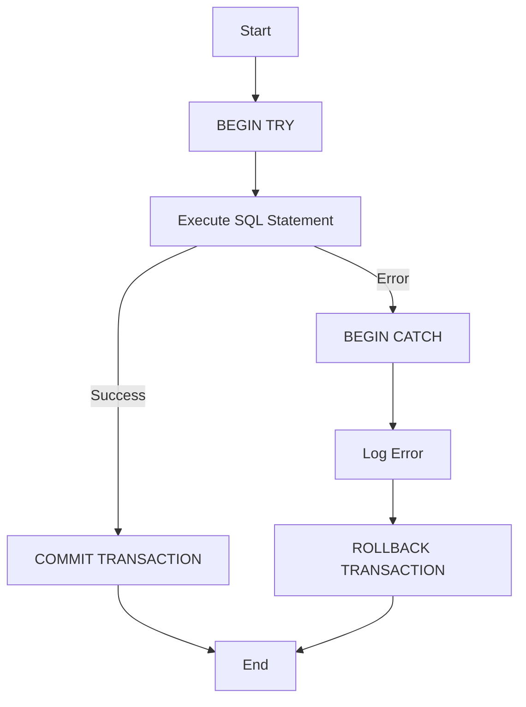

## 8.8 Handling Exceptions and Errors

In the realm of SQL development, handling exceptions and errors effectively is crucial for maintaining data integrity and ensuring seamless application performance. As expert software engineers and architects, mastering these techniques allows us to build robust and resilient database systems. In this section, we will delve into the intricacies of SQL exception handling, exploring key concepts such as TRY...CATCH blocks, RAISERROR, THROW, transaction control, and logging.

### Understanding SQL Exceptions and Errors

Before we dive into specific techniques, let's clarify the difference between exceptions and errors in SQL. An **error** is an unexpected condition that occurs during the execution of a SQL statement, such as a syntax error or a constraint violation. An **exception** is a specific type of error that can be caught and handled within the SQL code, allowing for graceful recovery or alternative actions.

### TRY...CATCH Blocks: Managing Exceptions in Procedural Code

The TRY...CATCH construct in SQL is a powerful mechanism for handling exceptions. It allows us to define a block of code to be executed (TRY block) and a separate block to handle any exceptions that occur (CATCH block). This structure provides a way to manage errors gracefully and maintain control over the flow of execution.

#### Implementing TRY...CATCH Blocks

Let's explore how to implement TRY...CATCH blocks in SQL:

```sql
BEGIN TRY
    -- Attempt to execute a SQL statement
    INSERT INTO Employees (EmployeeID, FirstName, LastName)
    VALUES (1, 'John', 'Doe');
END TRY
BEGIN CATCH
    -- Handle the error
    DECLARE @ErrorMessage NVARCHAR(4000);
    DECLARE @ErrorSeverity INT;
    DECLARE @ErrorState INT;

    SELECT 
        @ErrorMessage = ERROR_MESSAGE(),
        @ErrorSeverity = ERROR_SEVERITY(),
        @ErrorState = ERROR_STATE();

    -- Log the error or take corrective action
    PRINT 'Error occurred: ' + @ErrorMessage;
END CATCH;
```

In this example, the TRY block attempts to insert a record into the `Employees` table. If an error occurs, the CATCH block captures the error details using the `ERROR_MESSAGE()`, `ERROR_SEVERITY()`, and `ERROR_STATE()` functions, allowing us to log the error or take corrective action.

#### Key Points to Remember

- **Scope**: The TRY...CATCH block can be used within stored procedures, triggers, and batches.
- **Nested TRY...CATCH**: You can nest TRY...CATCH blocks to handle errors at different levels of granularity.
- **Transaction Control**: Ensure that transactions are properly managed within TRY...CATCH blocks to maintain data integrity.

### RAISERROR and THROW: Generating Custom Error Messages

While TRY...CATCH blocks help manage exceptions, the RAISERROR and THROW statements allow us to generate custom error messages, providing more context and control over error handling.

#### Using RAISERROR

The RAISERROR statement is used to generate an error message with a specified severity and state. This can be useful for signaling application-specific errors or warnings.

```sql
RAISERROR ('Custom error message', 16, 1);
```

In this example, RAISERROR generates a custom error message with a severity level of 16 and a state of 1. The severity level determines the type of error, with levels 11-16 typically used for user-defined errors.

#### Using THROW

The THROW statement, introduced in SQL Server 2012, provides a more modern approach to generating errors. It is simpler to use and integrates seamlessly with TRY...CATCH blocks.

```sql
BEGIN TRY
    -- Code that might cause an error
    DECLARE @Value INT = 0;
    SELECT 1 / @Value; -- This will cause a divide-by-zero error
END TRY
BEGIN CATCH
    -- Rethrow the error
    THROW;
END CATCH;
```

In this example, the THROW statement is used within the CATCH block to rethrow the original error, preserving the error number, severity, and state.

#### Choosing Between RAISERROR and THROW

- **RAISERROR**: Offers more flexibility in formatting error messages and specifying severity levels.
- **THROW**: Simpler syntax and better integration with TRY...CATCH blocks, but lacks some of the formatting options of RAISERROR.

### Transaction Control: Rolling Back Transactions Upon Errors

Transactions are a fundamental aspect of SQL databases, ensuring atomicity, consistency, isolation, and durability (ACID properties). When an error occurs within a transaction, it is crucial to roll back the transaction to maintain data integrity.

#### Implementing Transaction Control

Let's explore how to manage transactions within TRY...CATCH blocks:

```sql
BEGIN TRY
    BEGIN TRANSACTION;

    -- Perform multiple operations
    UPDATE Accounts SET Balance = Balance - 100 WHERE AccountID = 1;
    UPDATE Accounts SET Balance = Balance + 100 WHERE AccountID = 2;

    -- Commit the transaction
    COMMIT TRANSACTION;
END TRY
BEGIN CATCH
    -- Rollback the transaction in case of an error
    IF @@TRANCOUNT > 0
        ROLLBACK TRANSACTION;

    -- Log the error
    PRINT 'Transaction failed: ' + ERROR_MESSAGE();
END CATCH;
```

In this example, we start a transaction and perform multiple operations. If an error occurs, the CATCH block rolls back the transaction, ensuring that no partial updates are applied.

#### Best Practices for Transaction Control

- **Check Transaction Count**: Use `@@TRANCOUNT` to determine if a transaction is active before rolling back.
- **Consistent Error Handling**: Ensure that all error handling logic is consistent across transactions to avoid data inconsistencies.
- **Avoid Long Transactions**: Keep transactions as short as possible to minimize locking and improve performance.

### Logging: Recording Errors for Analysis and Troubleshooting

Logging is an essential aspect of error handling, providing a record of errors for analysis and troubleshooting. By capturing detailed error information, we can diagnose issues more effectively and improve system reliability.

#### Implementing Error Logging

Let's explore how to implement error logging in SQL:

```sql
CREATE TABLE ErrorLog (
    ErrorID INT IDENTITY(1,1) PRIMARY KEY,
    ErrorMessage NVARCHAR(4000),
    ErrorSeverity INT,
    ErrorState INT,
    ErrorTime DATETIME DEFAULT GETDATE()
);

BEGIN TRY
    -- Code that might cause an error
    DECLARE @Value INT = 0;
    SELECT 1 / @Value; -- This will cause a divide-by-zero error
END TRY
BEGIN CATCH
    -- Log the error
    INSERT INTO ErrorLog (ErrorMessage, ErrorSeverity, ErrorState)
    VALUES (ERROR_MESSAGE(), ERROR_SEVERITY(), ERROR_STATE());
END CATCH;
```

In this example, we create an `ErrorLog` table to store error details. When an error occurs, the CATCH block inserts the error information into the log, providing a record for future analysis.

#### Best Practices for Error Logging

- **Capture Detailed Information**: Include error message, severity, state, and timestamp in the log.
- **Automate Log Management**: Implement automated processes to archive or purge old logs to maintain performance.
- **Integrate with Monitoring Tools**: Use monitoring tools to analyze logs and generate alerts for critical errors.

### Visualizing SQL Error Handling

To better understand the flow of error handling in SQL, let's visualize the process using a flowchart:



**Figure 1: SQL Error Handling Flowchart** - This flowchart illustrates the process of handling errors in SQL using TRY...CATCH blocks, transaction control, and logging.

### Try It Yourself

Now that we've explored the concepts of SQL exception and error handling, let's encourage you to experiment with the code examples provided. Try modifying the examples to handle different types of errors, customize error messages, or implement additional logging features. By experimenting with these techniques, you'll gain a deeper understanding of how to build robust and resilient SQL applications.

### References and Further Reading

- [Microsoft Docs: TRY...CATCH (Transact-SQL)](https://docs.microsoft.com/en-us/sql/t-sql/language-elements/try-catch-transact-sql)
- [SQL Server RAISERROR Statement](https://docs.microsoft.com/en-us/sql/t-sql/language-elements/raiserror-transact-sql)
- [SQL Server THROW Statement](https://docs.microsoft.com/en-us/sql/t-sql/language-elements/throw-transact-sql)

### Knowledge Check

To reinforce your understanding of SQL exception and error handling, consider the following questions:

- What is the difference between an error and an exception in SQL?
- How can TRY...CATCH blocks be used to manage exceptions in SQL?
- What are the key differences between RAISERROR and THROW?
- Why is transaction control important when handling errors in SQL?
- How can logging be used to improve error analysis and troubleshooting?

### Embrace the Journey

Remember, mastering SQL exception and error handling is an ongoing journey. As you continue to build and optimize database systems, keep experimenting, stay curious, and enjoy the process of learning and improving your skills.

## Quiz Time!



### What is the primary purpose of a TRY...CATCH block in SQL?

- [x] To manage exceptions and handle errors gracefully
- [ ] To optimize query performance
- [ ] To enforce data integrity constraints
- [ ] To define user roles and permissions

> **Explanation:** TRY...CATCH blocks are used to manage exceptions and handle errors gracefully in SQL.

### Which statement is used to generate custom error messages in SQL?

- [ ] SELECT
- [ ] INSERT
- [x] RAISERROR
- [ ] UPDATE

> **Explanation:** RAISERROR is used to generate custom error messages in SQL.

### What is the key difference between RAISERROR and THROW?

- [x] RAISERROR offers more flexibility in formatting error messages
- [ ] THROW allows for more complex error handling
- [ ] RAISERROR is only available in SQL Server 2012 and later
- [ ] THROW is used for logging errors

> **Explanation:** RAISERROR offers more flexibility in formatting error messages, while THROW has a simpler syntax.

### Why is transaction control important in error handling?

- [x] To maintain data integrity by rolling back transactions upon errors
- [ ] To improve query execution speed
- [ ] To enforce user access control
- [ ] To generate error messages

> **Explanation:** Transaction control is important to maintain data integrity by rolling back transactions upon errors.

### What should be included in an error log for effective analysis?

- [x] Error message, severity, state, and timestamp
- [ ] User roles and permissions
- [ ] Query execution time
- [ ] Database schema details

> **Explanation:** An error log should include error message, severity, state, and timestamp for effective analysis.

### How can you determine if a transaction is active before rolling back?

- [x] Use @@TRANCOUNT
- [ ] Use ERROR_SEVERITY()
- [ ] Use RAISERROR
- [ ] Use THROW

> **Explanation:** @@TRANCOUNT is used to determine if a transaction is active before rolling back.

### What is a best practice for managing error logs?

- [x] Automate log management to archive or purge old logs
- [ ] Store logs in the same table as user data
- [ ] Use SELECT * to retrieve log entries
- [ ] Avoid capturing detailed error information

> **Explanation:** Automating log management to archive or purge old logs is a best practice for managing error logs.

### Which tool can be used to analyze error logs and generate alerts?

- [x] Monitoring tools
- [ ] RAISERROR
- [ ] THROW
- [ ] SELECT

> **Explanation:** Monitoring tools can be used to analyze error logs and generate alerts.

### What is the recommended severity level range for user-defined errors in RAISERROR?

- [x] 11-16
- [ ] 1-5
- [ ] 17-20
- [ ] 21-25

> **Explanation:** The recommended severity level range for user-defined errors in RAISERROR is 11-16.

### True or False: THROW can be used to rethrow the original error in a CATCH block.

- [x] True
- [ ] False

> **Explanation:** THROW can be used to rethrow the original error in a CATCH block, preserving the error details.




