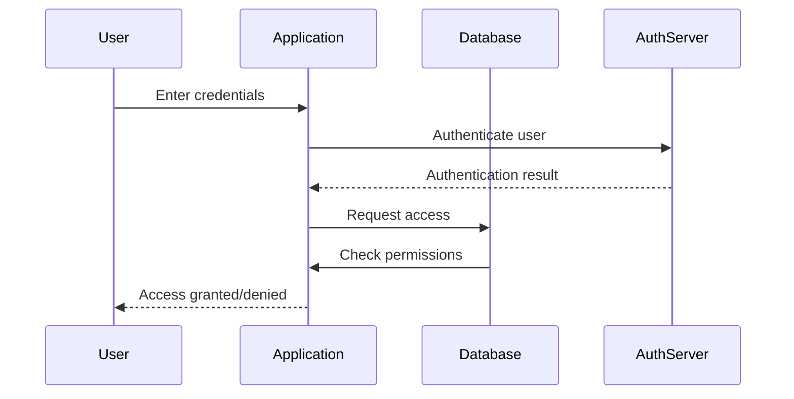

## 9.1 Authentication and Authorization Mechanisms

In the realm of SQL databases, ensuring secure access to data is paramount. Authentication and authorization are two critical components of database security that work hand-in-hand to protect sensitive information. In this section, we will delve into the mechanisms, best practices, and design patterns for implementing robust authentication and authorization in SQL environments.

### Understanding Authentication and Authorization

Before we dive into the specifics, let's clarify the distinction between authentication and authorization:

- **Authentication** is the process of verifying the identity of a user or system. It answers the question, "Who are you?"
- **Authorization** determines what an authenticated user or system is allowed to do. It answers the question, "What are you allowed to do?"

Both processes are essential for maintaining the security and integrity of a database system.

### Authentication Mechanisms

Authentication is the first line of defense in securing a database. It ensures that only legitimate users can access the system. Here are some common authentication methods used in SQL databases:

#### 1. Username/Password Authentication

This is the most basic form of authentication, where users provide a username and password to gain access.

- **Best Practices**:
  - **Strong Password Policies**: Enforce complex password requirements, including a mix of uppercase and lowercase letters, numbers, and special characters.
  - **Password Expiration**: Require users to change passwords regularly.
  - **Account Lockout**: Implement account lockout mechanisms after a certain number of failed login attempts to prevent brute force attacks.

#### 2. Integrated Security

Integrated security, also known as Windows Authentication, uses the operating system's authentication mechanisms. This method is commonly used in environments where SQL Server is integrated with Windows.

- **Advantages**:
  - **Single Sign-On (SSO)**: Users can access the database without entering credentials again if they are already logged into the network.
  - **Centralized Management**: User accounts and permissions are managed centrally through Active Directory.

#### 3. Certificate-Based Authentication

Certificate-based authentication uses digital certificates to verify the identity of users or systems. This method is more secure than username/password authentication as it relies on cryptographic techniques.

- **Implementation**:
  - **SSL/TLS**: Use Secure Sockets Layer (SSL) or Transport Layer Security (TLS) to encrypt connections and authenticate clients using certificates.
  - **Client Certificates**: Require clients to present a valid certificate issued by a trusted Certificate Authority (CA).

#### 4. Multi-Factor Authentication (MFA)

MFA adds an extra layer of security by requiring users to provide two or more verification factors. This could be something they know (password), something they have (smartphone), or something they are (fingerprint).

- **Benefits**:
  - **Enhanced Security**: Reduces the risk of unauthorized access even if passwords are compromised.
  - **User-Friendly**: Modern MFA solutions offer user-friendly options like push notifications or biometric authentication.

### Authorization Mechanisms

Once a user is authenticated, authorization mechanisms determine what actions they can perform within the database. Effective authorization is crucial for enforcing security policies and protecting sensitive data.

#### 1. Defining Permissions

Permissions in SQL databases are typically defined at the object level (e.g., tables, views, stored procedures). Permissions can be granted to individual users or roles.

- **Granting Rights**:
  - **GRANT Statement**: Use the GRANT statement to assign specific permissions to users or roles.
  - **REVOKE Statement**: Use the REVOKE statement to remove permissions.

```sql
-- Grant SELECT permission on the Employees table to the SalesRole
GRANT SELECT ON Employees TO SalesRole;

-- Revoke INSERT permission on the Employees table from the SalesRole
REVOKE INSERT ON Employees FROM SalesRole;
```

#### 2. Role-Based Access Control (RBAC)

RBAC is a widely used authorization model that assigns permissions to roles rather than individual users. Users are then assigned to roles based on their job functions.

- **Advantages**:
  - **Simplified Management**: Reduces the complexity of managing individual user permissions.
  - **Scalability**: Easily accommodate changes in user roles or responsibilities.

#### 3. Principle of Least Privilege

The principle of least privilege dictates that users should be granted only the permissions necessary to perform their job functions. This minimizes the potential damage from accidental or malicious actions.

- **Implementation**:
  - **Regular Audits**: Conduct regular audits of user permissions to ensure compliance with the principle of least privilege.
  - **Temporary Privileges**: Grant temporary privileges for specific tasks and revoke them once the task is completed.

### Design Patterns for Authentication and Authorization

Implementing authentication and authorization in SQL databases involves several design patterns that enhance security and maintainability.

#### 1. Centralized Authentication

Centralized authentication involves using a single authentication source for multiple applications or databases. This pattern simplifies user management and enhances security.

- **Implementation**:
  - **LDAP/Active Directory**: Use LDAP or Active Directory for centralized user authentication.
  - **OAuth/OpenID Connect**: Implement OAuth or OpenID Connect for web-based applications.

#### 2. Attribute-Based Access Control (ABAC)

ABAC is an advanced authorization model that evaluates access requests based on attributes of the user, resource, and environment.

- **Example**:
  - **Attributes**: User role, resource type, time of access.
  - **Policy**: Define policies that specify which attributes are required for access.

#### 3. Context-Aware Access Control

Context-aware access control considers the context of an access request, such as the user's location or device, to make authorization decisions.

- **Use Cases**:
  - **Geolocation**: Restrict access based on the user's geographic location.
  - **Device Type**: Allow access only from trusted devices.

### Code Examples

Let's explore some code examples to illustrate the concepts discussed.

#### Example 1: Implementing Role-Based Access Control

```sql
-- Create a role for sales users
CREATE ROLE SalesRole;

-- Grant SELECT permission on the Orders table to the SalesRole
GRANT SELECT ON Orders TO SalesRole;

-- Add a user to the SalesRole
EXEC sp_addrolemember 'SalesRole', 'JohnDoe';
```

#### Example 2: Using Certificates for Authentication

```sql
-- Create a certificate for client authentication
CREATE CERTIFICATE ClientCert
    WITH SUBJECT = 'Client Certificate';

-- Bind the certificate to a login
CREATE LOGIN ClientLogin
    FROM CERTIFICATE ClientCert;
```

### Visualizing Authentication and Authorization

To better understand the flow of authentication and authorization, let's visualize the process using a sequence diagram.



### Best Practices for Secure Authentication and Authorization

- **Use Strong Encryption**: Encrypt sensitive data, such as passwords and certificates, using strong encryption algorithms.
- **Regularly Update Software**: Keep database software and authentication libraries up to date to protect against vulnerabilities.
- **Implement Logging and Monitoring**: Log authentication and authorization events and monitor them for suspicious activity.
- **Educate Users**: Train users on security best practices, such as recognizing phishing attempts and using strong passwords.

### Try It Yourself

Experiment with the code examples provided in this section. Try modifying the permissions or roles to see how they affect access control. Consider implementing multi-factor authentication in your environment to enhance security.

### Knowledge Check

- What is the difference between authentication and authorization?
- How does role-based access control simplify permission management?
- What are the benefits of using multi-factor authentication?

### Embrace the Journey

Remember, mastering authentication and authorization is a continuous journey. As you implement these mechanisms, you'll gain a deeper understanding of how to secure your SQL databases effectively. Keep exploring, stay vigilant, and enjoy the process of building secure systems.

## Quiz Time!



### What is the primary purpose of authentication in SQL databases?

- [x] To verify the identity of a user or system
- [ ] To determine what actions a user can perform
- [ ] To encrypt data in transit
- [ ] To manage database backups

> **Explanation:** Authentication is the process of verifying the identity of a user or system, ensuring that only legitimate users can access the database.

### Which authentication method uses the operating system's authentication mechanisms?

- [ ] Username/Password Authentication
- [x] Integrated Security
- [ ] Certificate-Based Authentication
- [ ] Multi-Factor Authentication

> **Explanation:** Integrated Security, also known as Windows Authentication, uses the operating system's authentication mechanisms.

### What is the principle of least privilege?

- [ ] Granting all permissions to all users
- [x] Granting only necessary permissions to users
- [ ] Using multi-factor authentication
- [ ] Encrypting all database connections

> **Explanation:** The principle of least privilege dictates that users should be granted only the permissions necessary to perform their job functions.

### Which SQL statement is used to assign specific permissions to users or roles?

- [ ] REVOKE
- [x] GRANT
- [ ] SELECT
- [ ] INSERT

> **Explanation:** The GRANT statement is used to assign specific permissions to users or roles in SQL databases.

### What is a benefit of using role-based access control (RBAC)?

- [x] Simplified management of user permissions
- [ ] Increased complexity in permission management
- [ ] Requires individual user permissions
- [ ] Eliminates the need for authentication

> **Explanation:** Role-based access control (RBAC) simplifies the management of user permissions by assigning permissions to roles rather than individual users.

### What is the advantage of using multi-factor authentication (MFA)?

- [x] Enhanced security by requiring multiple verification factors
- [ ] Simplifies the login process
- [ ] Eliminates the need for passwords
- [ ] Reduces the number of user accounts

> **Explanation:** Multi-factor authentication (MFA) enhances security by requiring users to provide two or more verification factors, reducing the risk of unauthorized access.

### Which of the following is an example of a context-aware access control factor?

- [x] User's geographic location
- [ ] User's password
- [ ] User's email address
- [ ] User's phone number

> **Explanation:** Context-aware access control considers factors such as the user's geographic location to make authorization decisions.

### What is the purpose of using certificates in authentication?

- [ ] To simplify password management
- [x] To verify the identity of users or systems using cryptographic techniques
- [ ] To manage database backups
- [ ] To encrypt data at rest

> **Explanation:** Certificates are used in authentication to verify the identity of users or systems using cryptographic techniques, providing a more secure method than passwords.

### Which diagramming tool is used in this guide to visualize authentication and authorization processes?

- [ ] UML
- [ ] Visio
- [x] Mermaid.js
- [ ] Lucidchart

> **Explanation:** Mermaid.js is used in this guide to create diagrams that visualize authentication and authorization processes.

### True or False: Authorization determines what actions an authenticated user can perform.

- [x] True
- [ ] False

> **Explanation:** Authorization determines what actions an authenticated user or system is allowed to perform within the database.


