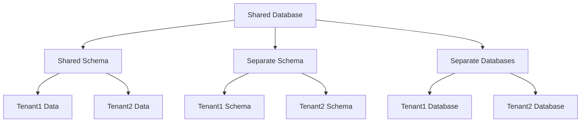

## 9.10 Secure Multi-Tenancy Implementations

In today's digital landscape, multi-tenancy is a critical architectural pattern that allows multiple tenants to share a single instance of a software application while maintaining data isolation and security. This section delves into the secure implementation of multi-tenancy in SQL databases, focusing on isolation strategies, encryption, access control, and monitoring.

### Understanding Multi-Tenancy

**Multi-Tenancy** is a software architecture where a single instance of a software application serves multiple customers, known as tenants. Each tenant's data is isolated and remains invisible to other tenants. The primary goal is to maximize resource utilization while ensuring data security and privacy.

#### Key Concepts

- **Tenant**: A customer or a group of users sharing common access with specific privileges to the software instance.
- **Isolation**: Ensuring that one tenant's data is not accessible to another tenant.
- **Scalability**: The ability to serve an increasing number of tenants without degrading performance.
- **Customization**: Allowing tenants to customize their experience without affecting others.

### Isolation Strategies

Isolation is paramount in multi-tenancy to prevent data leakage between tenants. There are several strategies to achieve this:

#### 1. Shared Database, Shared Schema

In this approach, all tenants share the same database and schema. Tenant data is distinguished using a `TenantID` column in each table.

**Advantages**:
- Cost-effective as it requires fewer resources.
- Simplified management and maintenance.

**Disadvantages**:
- Complex queries due to the need to filter by `TenantID`.
- Increased risk of data leakage if queries are not properly secured.

**Code Example**:

```sql
-- Example of a shared schema with TenantID
CREATE TABLE Orders (
    OrderID INT PRIMARY KEY,
    TenantID INT,
    ProductName VARCHAR(255),
    Quantity INT,
    OrderDate DATE
);

-- Query to retrieve orders for a specific tenant
SELECT * FROM Orders WHERE TenantID = 1;
```

#### 2. Shared Database, Separate Schema

Each tenant has its own schema within a shared database. This provides better isolation than the shared schema approach.

**Advantages**:
- Improved data isolation.
- Easier to manage tenant-specific customizations.

**Disadvantages**:
- More complex to manage as the number of tenants grows.
- Potentially higher resource usage.

**Code Example**:

```sql
-- Creating a schema for each tenant
CREATE SCHEMA Tenant1;
CREATE TABLE Tenant1.Orders (
    OrderID INT PRIMARY KEY,
    ProductName VARCHAR(255),
    Quantity INT,
    OrderDate DATE
);

-- Query to retrieve orders for Tenant1
SELECT * FROM Tenant1.Orders;
```

#### 3. Separate Databases

Each tenant has its own database, providing the highest level of isolation.

**Advantages**:
- Maximum data isolation.
- Simplified backup and restore processes.

**Disadvantages**:
- Higher resource usage.
- More complex to manage at scale.

**Code Example**:

```sql
-- Creating a separate database for each tenant
CREATE DATABASE Tenant1DB;
USE Tenant1DB;
CREATE TABLE Orders (
    OrderID INT PRIMARY KEY,
    ProductName VARCHAR(255),
    Quantity INT,
    OrderDate DATE
);

-- Query to retrieve orders for Tenant1
SELECT * FROM Orders;
```

### Encryption

Encryption is a crucial component of secure multi-tenancy, ensuring that tenant data is protected both at rest and in transit.

#### Data at Rest Encryption

Encrypt data stored in the database to protect it from unauthorized access.

**Implementation**:

- Use database-level encryption features such as Transparent Data Encryption (TDE) in SQL Server or Oracle.
- Encrypt sensitive columns using functions like `AES_ENCRYPT()` in MySQL.

**Code Example**:

```sql
-- Encrypting a column in MySQL
INSERT INTO Orders (OrderID, TenantID, ProductName, Quantity, OrderDate)
VALUES (1, 1, AES_ENCRYPT('Laptop', 'encryption_key'), 5, '2024-11-17');

-- Decrypting the column
SELECT OrderID, TenantID, AES_DECRYPT(ProductName, 'encryption_key') AS ProductName, Quantity, OrderDate
FROM Orders;
```

#### Data in Transit Encryption

Use SSL/TLS to encrypt data transmitted between the application and the database.

**Implementation**:

- Configure the database server to require SSL connections.
- Use client libraries that support SSL/TLS encryption.

### Access Control

Implementing strict access control mechanisms is essential to ensure that only authorized users can access tenant data.

#### Authentication

Verify the identity of users before granting access.

**Implementation**:

- Use strong password policies and multi-factor authentication (MFA).
- Integrate with identity providers (e.g., OAuth, SAML) for centralized authentication.

#### Authorization

Determine what resources a user can access based on their role and permissions.

**Implementation**:

- Implement Role-Based Access Control (RBAC) to manage user permissions.
- Use database roles and permissions to enforce access control at the database level.

**Code Example**:

```sql
-- Creating a role and granting permissions
CREATE ROLE TenantAdmin;
GRANT SELECT, INSERT, UPDATE ON Orders TO TenantAdmin;

-- Assigning the role to a user
GRANT TenantAdmin TO 'tenant_user'@'localhost';
```

### Monitoring

Continuous monitoring is vital to detect and respond to suspicious activities that may compromise tenant data.

#### Logging

Record all access and modification events to create an audit trail.

**Implementation**:

- Enable database auditing features to log queries and changes.
- Use third-party tools to aggregate and analyze logs.

#### Anomaly Detection

Identify unusual patterns that may indicate a security breach.

**Implementation**:

- Use machine learning models to detect anomalies in access patterns.
- Set up alerts for unusual activities, such as access from unknown IP addresses.

### Visualizing Secure Multi-Tenancy

To better understand the architecture of secure multi-tenancy, let's visualize the different isolation strategies using Mermaid.js diagrams.



**Diagram Description**: This diagram illustrates the three main isolation strategies for multi-tenancy: shared schema, separate schema, and separate databases. Each strategy provides different levels of data isolation and resource usage.

### Design Considerations

When implementing secure multi-tenancy, consider the following:

- **Scalability**: Choose an isolation strategy that can scale with the number of tenants.
- **Performance**: Ensure that the chosen strategy does not degrade performance as the number of tenants increases.
- **Compliance**: Adhere to data protection regulations such as GDPR and HIPAA.
- **Cost**: Balance the cost of resources with the level of isolation and security required.

### Differences and Similarities

Secure multi-tenancy implementations can be confused with other patterns such as single-tenancy or hybrid tenancy. Here's how they differ:

- **Single-Tenancy**: Each tenant has a dedicated instance of the application and database, providing maximum isolation but at a higher cost.
- **Hybrid Tenancy**: Combines elements of both multi-tenancy and single-tenancy, allowing for shared resources while providing dedicated instances for specific tenants.

### Try It Yourself

Experiment with the code examples provided by:

- Modifying the `TenantID` in the shared schema example to see how it affects data retrieval.
- Creating additional schemas or databases for new tenants and observing the impact on isolation and resource usage.
- Implementing encryption for additional columns and testing the performance impact.

### References and Links

- [SQL Server Transparent Data Encryption (TDE)](https://docs.microsoft.com/en-us/sql/relational-databases/security/encryption/transparent-data-encryption?view=sql-server-ver15)
- [MySQL AES Encryption Functions](https://dev.mysql.com/doc/refman/8.0/en/encryption-functions.html)
- [OAuth 2.0](https://oauth.net/2/)
- [Role-Based Access Control (RBAC)](https://en.wikipedia.org/wiki/Role-based_access_control)

### Knowledge Check

- What are the key differences between shared schema and separate schema isolation strategies?
- How does encryption enhance the security of multi-tenancy implementations?
- What role does access control play in securing tenant data?

### Embrace the Journey

Remember, implementing secure multi-tenancy is a journey. As you progress, you'll refine your strategies and adapt to new challenges. Keep experimenting, stay curious, and enjoy the journey!

## Quiz Time!



### What is the primary goal of multi-tenancy?

- [x] To maximize resource utilization while ensuring data security and privacy.
- [ ] To provide each tenant with a dedicated instance of the application.
- [ ] To minimize the cost of database resources.
- [ ] To allow tenants to access each other's data.

> **Explanation:** Multi-tenancy aims to maximize resource utilization while ensuring data security and privacy by sharing a single instance of a software application among multiple tenants.

### Which isolation strategy provides the highest level of data isolation?

- [ ] Shared Database, Shared Schema
- [ ] Shared Database, Separate Schema
- [x] Separate Databases
- [ ] Hybrid Tenancy

> **Explanation:** Separate Databases provide the highest level of data isolation by giving each tenant their own database.

### What is the purpose of the `TenantID` column in a shared schema approach?

- [x] To distinguish tenant data within shared tables.
- [ ] To encrypt tenant data.
- [ ] To provide access control for tenant data.
- [ ] To monitor tenant activities.

> **Explanation:** The `TenantID` column is used to distinguish tenant data within shared tables in a shared schema approach.

### How does data at rest encryption protect tenant data?

- [x] By encrypting data stored in the database to prevent unauthorized access.
- [ ] By encrypting data during transmission between the application and the database.
- [ ] By using SSL/TLS for secure connections.
- [ ] By implementing role-based access control.

> **Explanation:** Data at rest encryption protects tenant data by encrypting it while stored in the database, preventing unauthorized access.

### What is the role of SSL/TLS in secure multi-tenancy?

- [x] To encrypt data transmitted between the application and the database.
- [ ] To encrypt data stored in the database.
- [ ] To manage user permissions.
- [ ] To log access and modification events.

> **Explanation:** SSL/TLS encrypts data transmitted between the application and the database, ensuring secure data in transit.

### Which access control mechanism is used to manage user permissions based on roles?

- [ ] Multi-Factor Authentication (MFA)
- [x] Role-Based Access Control (RBAC)
- [ ] OAuth
- [ ] SAML

> **Explanation:** Role-Based Access Control (RBAC) is used to manage user permissions based on roles.

### What is the purpose of continuous monitoring in secure multi-tenancy?

- [x] To detect and respond to suspicious activities that may compromise tenant data.
- [ ] To encrypt tenant data.
- [ ] To provide access control for tenant data.
- [ ] To distinguish tenant data within shared tables.

> **Explanation:** Continuous monitoring is used to detect and respond to suspicious activities that may compromise tenant data.

### How can anomaly detection enhance security in multi-tenancy?

- [x] By identifying unusual patterns that may indicate a security breach.
- [ ] By encrypting data stored in the database.
- [ ] By using SSL/TLS for secure connections.
- [ ] By managing user permissions based on roles.

> **Explanation:** Anomaly detection enhances security by identifying unusual patterns that may indicate a security breach.

### What is the main disadvantage of the shared schema isolation strategy?

- [x] Increased risk of data leakage if queries are not properly secured.
- [ ] Higher resource usage.
- [ ] More complex to manage at scale.
- [ ] Simplified management and maintenance.

> **Explanation:** The main disadvantage of the shared schema isolation strategy is the increased risk of data leakage if queries are not properly secured.

### True or False: Hybrid tenancy combines elements of both multi-tenancy and single-tenancy.

- [x] True
- [ ] False

> **Explanation:** Hybrid tenancy combines elements of both multi-tenancy and single-tenancy, allowing for shared resources while providing dedicated instances for specific tenants.


