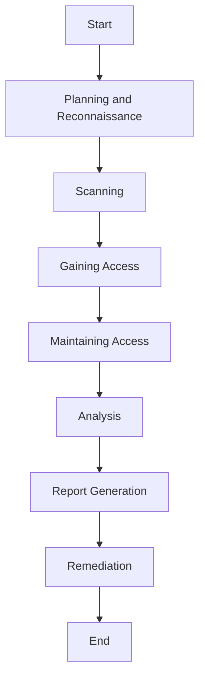

## 9.11 Security Testing and Vulnerability Assessments

In the realm of SQL database development, ensuring the security of your data is paramount. As expert software engineers and architects, we must be vigilant in identifying and mitigating vulnerabilities that could compromise our systems. This section delves into the essential practices of security testing and vulnerability assessments, focusing on penetration testing, static code analysis, and dynamic analysis. We will explore these concepts in detail, providing you with the knowledge and tools necessary to fortify your SQL databases against potential threats.

### Understanding Security Testing and Vulnerability Assessments

Security testing is a critical process that involves evaluating the security of a system by identifying vulnerabilities and weaknesses. Vulnerability assessments are systematic reviews of security weaknesses in an information system. They evaluate if the system is susceptible to any known vulnerabilities, assign severity levels to those vulnerabilities, and recommend remediation or mitigation, if and whenever needed.

#### Key Objectives of Security Testing

1. **Identify Vulnerabilities**: Discover potential security weaknesses in the system.
2. **Assess Impact**: Evaluate the potential impact of identified vulnerabilities.
3. **Prioritize Risks**: Rank vulnerabilities based on their severity and potential impact.
4. **Recommend Solutions**: Provide actionable recommendations to mitigate identified risks.

### Penetration Testing

Penetration testing, often referred to as "pen testing," is a simulated cyber attack against your computer system to check for exploitable vulnerabilities. In the context of SQL databases, penetration testing involves simulating attacks to identify vulnerabilities that could be exploited by malicious actors.

#### Steps in Penetration Testing

1. **Planning and Reconnaissance**: Define the scope and objectives of the test, gather intelligence (e.g., network and domain names, mail servers).
2. **Scanning**: Understand how the target application will respond to various intrusion attempts. This involves static and dynamic analysis.
3. **Gaining Access**: Use web application attacks, such as SQL injection, to uncover a target's vulnerabilities.
4. **Maintaining Access**: Try to exploit the vulnerability to understand the potential damage it can cause.
5. **Analysis**: Compile the results into a report detailing the vulnerabilities found, data accessed, and the time the tester was able to remain in the system undetected.

#### Example of SQL Injection Penetration Test

```sql
-- Example of a vulnerable SQL query
SELECT * FROM users WHERE username = 'admin' AND password = 'password';

-- SQL Injection attempt
SELECT * FROM users WHERE username = 'admin' --' AND password = 'password';
```

In this example, the attacker comments out the password check, potentially gaining unauthorized access.

### Static Code Analysis

Static code analysis involves examining the source code of an application to identify security vulnerabilities without executing the code. This method helps in identifying potential security flaws early in the development process.

#### Benefits of Static Code Analysis

- **Early Detection**: Identify vulnerabilities during the development phase.
- **Automated Tools**: Use tools like SonarQube, Checkmarx, or Fortify to automate the analysis.
- **Comprehensive Coverage**: Analyze the entire codebase for potential security issues.

#### Example of Static Code Analysis Tool Output

```plaintext
Issue: SQL Injection
File: user_authentication.sql
Line: 23
Description: User input is directly concatenated into a SQL query.
Recommendation: Use parameterized queries to prevent SQL injection.
```

### Dynamic Analysis

Dynamic analysis involves testing an application in a runtime environment. This approach allows testers to identify vulnerabilities that may not be apparent through static analysis alone.

#### Key Aspects of Dynamic Analysis

- **Real-World Testing**: Evaluate the application in its operational environment.
- **Behavioral Analysis**: Observe how the application behaves under various conditions.
- **Interactive Testing**: Use tools like OWASP ZAP or Burp Suite to simulate attacks and monitor responses.

#### Example of Dynamic Analysis

```plaintext
Test: SQL Injection
Tool: OWASP ZAP
Result: Vulnerability found in login form
Description: The login form is susceptible to SQL injection attacks.
Recommendation: Implement input validation and parameterized queries.
```

### Remediation Strategies

Once vulnerabilities are identified through penetration testing, static code analysis, or dynamic analysis, it is crucial to address these issues promptly. Remediation involves implementing changes to eliminate or mitigate the identified vulnerabilities.

#### Common Remediation Techniques

1. **Input Validation**: Ensure that all user inputs are validated and sanitized.
2. **Parameterized Queries**: Use parameterized queries to prevent SQL injection.
3. **Access Controls**: Implement robust access control mechanisms to restrict unauthorized access.
4. **Regular Updates**: Keep software and libraries up to date to protect against known vulnerabilities.
5. **Security Patches**: Apply security patches as soon as they are released.

### Visualizing the Security Testing Process

To better understand the security testing process, let's visualize the workflow using a Mermaid.js flowchart.



**Figure 1**: This flowchart illustrates the steps involved in a typical penetration testing process, from planning to remediation.

### Try It Yourself

To gain hands-on experience with security testing, try the following exercises:

1. **Set Up a Test Environment**: Create a sandbox environment with a sample SQL database.
2. **Conduct a Penetration Test**: Use tools like SQLMap to simulate SQL injection attacks.
3. **Perform Static Code Analysis**: Analyze your SQL scripts using a static analysis tool.
4. **Execute Dynamic Analysis**: Test your application in a runtime environment using OWASP ZAP.

### References and Further Reading

- [OWASP Testing Guide](https://owasp.org/www-project-web-security-testing-guide/)
- [SQL Injection Prevention Cheat Sheet](https://cheatsheetseries.owasp.org/cheatsheets/SQL_Injection_Prevention_Cheat_Sheet.html)
- [Static Code Analysis Tools](https://www.sonarqube.org/)
- [Dynamic Analysis Tools](https://portswigger.net/burp)

### Knowledge Check

- What are the key objectives of security testing?
- How does penetration testing differ from static code analysis?
- What are some common remediation techniques for SQL vulnerabilities?

### Embrace the Journey

Remember, security testing is an ongoing process. As you continue to develop and maintain SQL databases, stay vigilant and proactive in identifying and addressing vulnerabilities. Keep experimenting, stay curious, and enjoy the journey of mastering SQL security.

## Quiz Time!



### What is the primary goal of penetration testing?

- [x] To simulate attacks and identify vulnerabilities
- [ ] To execute code in a runtime environment
- [ ] To automate code analysis
- [ ] To compile code into machine language

> **Explanation:** Penetration testing aims to simulate attacks to identify vulnerabilities in a system.

### Which tool is commonly used for static code analysis?

- [x] SonarQube
- [ ] OWASP ZAP
- [ ] Burp Suite
- [ ] SQLMap

> **Explanation:** SonarQube is a popular tool for static code analysis, helping identify vulnerabilities in the source code.

### What is a key benefit of dynamic analysis?

- [x] It tests applications in a runtime environment
- [ ] It compiles code into machine language
- [ ] It automates code analysis
- [ ] It simulates attacks

> **Explanation:** Dynamic analysis tests applications in a runtime environment, allowing for real-world evaluation.

### What is a common remediation technique for SQL injection?

- [x] Use parameterized queries
- [ ] Compile code into machine language
- [ ] Automate code analysis
- [ ] Simulate attacks

> **Explanation:** Parameterized queries help prevent SQL injection by separating SQL logic from user input.

### What is the first step in the penetration testing process?

- [x] Planning and Reconnaissance
- [ ] Scanning
- [ ] Gaining Access
- [ ] Analysis

> **Explanation:** Planning and reconnaissance involve defining the scope and objectives of the test.

### Which tool is used for dynamic analysis?

- [x] OWASP ZAP
- [ ] SonarQube
- [ ] Checkmarx
- [ ] SQLMap

> **Explanation:** OWASP ZAP is a tool used for dynamic analysis, testing applications in a runtime environment.

### What is the purpose of static code analysis?

- [x] To identify vulnerabilities in the source code
- [ ] To simulate attacks
- [ ] To test applications in a runtime environment
- [ ] To compile code into machine language

> **Explanation:** Static code analysis identifies vulnerabilities in the source code without executing it.

### What is a key aspect of dynamic analysis?

- [x] Behavioral Analysis
- [ ] Code Compilation
- [ ] Automated Code Review
- [ ] Simulated Attacks

> **Explanation:** Dynamic analysis involves observing how an application behaves under various conditions.

### What is a common vulnerability found during penetration testing?

- [x] SQL Injection
- [ ] Code Compilation Errors
- [ ] Automated Code Review Issues
- [ ] Machine Language Bugs

> **Explanation:** SQL injection is a common vulnerability identified during penetration testing.

### True or False: Remediation involves implementing changes to eliminate vulnerabilities.

- [x] True
- [ ] False

> **Explanation:** Remediation involves making changes to eliminate or mitigate identified vulnerabilities.




