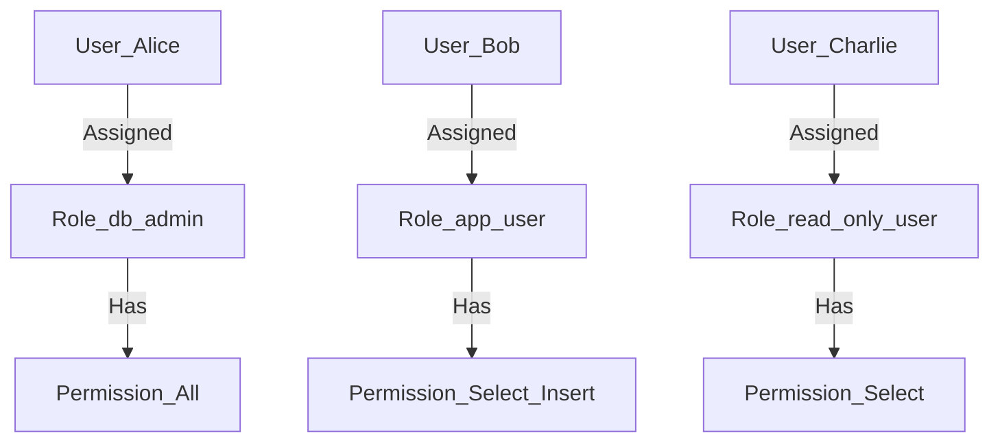

## 9.2 Role-Based Access Control (RBAC)

Role-Based Access Control (RBAC) is a critical design pattern in SQL that allows for the efficient management of user permissions by assigning roles to users rather than granting permissions directly. This approach not only simplifies the administration of permissions but also enhances the security of database systems by ensuring that users have access only to the resources necessary for their roles. In this section, we will delve into the concepts, implementation, and best practices of RBAC in SQL.

### Understanding Role-Based Access Control (RBAC)

RBAC is a method of regulating access to computer or network resources based on the roles of individual users within an organization. In the context of SQL databases, RBAC involves defining roles that encapsulate a set of permissions and then assigning these roles to users. This abstraction layer between users and permissions allows for more manageable and scalable security policies.

#### Key Concepts

- **Roles**: A role is a collection of permissions that can be assigned to users. Roles can be predefined by the database management system (DBMS) or custom-defined to meet specific application needs.
- **Permissions**: These are the rights to perform certain actions on database objects, such as SELECT, INSERT, UPDATE, DELETE, etc.
- **Users**: Individuals or entities that interact with the database. In RBAC, users are assigned roles rather than individual permissions.

#### Benefits of RBAC

- **Simplified Permission Management**: By grouping permissions into roles, administrators can easily manage access rights by assigning or revoking roles rather than dealing with individual permissions.
- **Enhanced Security**: RBAC reduces the risk of privilege escalation and unauthorized access by ensuring that users have only the permissions necessary for their roles.
- **Scalability**: As organizations grow, RBAC allows for the easy addition of new users and roles without the need for extensive reconfiguration of permissions.

### Implementing RBAC in SQL

Implementing RBAC in SQL involves several steps, including defining roles, assigning permissions to roles, and associating users with roles. Let's explore these steps in detail.

#### Step 1: Define Roles

The first step in implementing RBAC is to define the roles that will be used within the database. These roles should reflect the various job functions or responsibilities within the organization.

```sql
-- Create a role for database administrators
CREATE ROLE db_admin;

-- Create a role for application users
CREATE ROLE app_user;

-- Create a role for read-only users
CREATE ROLE read_only_user;
```

#### Step 2: Assign Permissions to Roles

Once roles are defined, the next step is to assign the appropriate permissions to each role. This involves granting the necessary rights to perform specific actions on database objects.

```sql
-- Grant all privileges to the db_admin role
GRANT ALL PRIVILEGES ON DATABASE my_database TO db_admin;

-- Grant select and insert privileges to the app_user role
GRANT SELECT, INSERT ON ALL TABLES IN SCHEMA public TO app_user;

-- Grant select privilege to the read_only_user role
GRANT SELECT ON ALL TABLES IN SCHEMA public TO read_only_user;
```

#### Step 3: Assign Roles to Users

The final step is to assign the defined roles to users. This step links users to the permissions encapsulated by the roles.

```sql
-- Assign the db_admin role to a user
GRANT db_admin TO alice;

-- Assign the app_user role to a user
GRANT app_user TO bob;

-- Assign the read_only_user role to a user
GRANT read_only_user TO charlie;
```

### Advanced RBAC Concepts

While the basic implementation of RBAC is straightforward, there are several advanced concepts and techniques that can enhance the effectiveness of RBAC in SQL.

#### Role Hierarchies

Role hierarchies allow roles to inherit permissions from other roles. This can simplify the management of complex permission structures by allowing roles to be organized in a hierarchical manner.

```sql
-- Create a role hierarchy
CREATE ROLE senior_admin;
GRANT db_admin TO senior_admin;
```

In this example, the `senior_admin` role inherits all the permissions of the `db_admin` role.

#### Dynamic Role Assignment

Dynamic role assignment involves assigning roles to users based on certain conditions or attributes, such as time of day, location, or device type. This can be implemented using stored procedures or application logic.

#### Role-Based Auditing

Role-based auditing involves tracking and logging actions performed by users based on their roles. This can help in monitoring compliance and detecting unauthorized access.

### Best Practices for RBAC Implementation

Implementing RBAC effectively requires adherence to certain best practices to ensure security and manageability.

- **Principle of Least Privilege**: Assign users the minimum level of access necessary to perform their job functions.
- **Regular Role Reviews**: Periodically review roles and permissions to ensure they align with current organizational needs and security policies.
- **Separation of Duties**: Ensure that critical tasks are divided among multiple roles to prevent conflicts of interest and reduce the risk of fraud.
- **Role Naming Conventions**: Use clear and consistent naming conventions for roles to facilitate understanding and management.

### Visualizing RBAC

To better understand the structure and flow of RBAC, let's visualize the relationships between users, roles, and permissions using a Mermaid.js diagram.



**Diagram Description**: This diagram illustrates the assignment of roles to users and the permissions associated with each role. Users Alice, Bob, and Charlie are assigned the roles `db_admin`, `app_user`, and `read_only_user`, respectively, each with its own set of permissions.

### Try It Yourself

To reinforce your understanding of RBAC, try modifying the code examples provided. For instance, create additional roles and assign them to new users. Experiment with different permission sets and observe how they affect user access.

### References and Further Reading

- [Role-Based Access Control (RBAC) - NIST](https://csrc.nist.gov/Projects/Role-Based-Access-Control)
- [SQL GRANT Statement - W3Schools](https://www.w3schools.com/sql/sql_grant.asp)
- [Database Security - MDN Web Docs](https://developer.mozilla.org/en-US/docs/Web/Security/Database_security)

### Knowledge Check

- What are the key benefits of using RBAC in SQL?
- How does role inheritance simplify permission management?
- What are some best practices for implementing RBAC?

### Embrace the Journey

Remember, mastering RBAC is a journey that enhances your ability to manage database security effectively. As you continue to explore and implement RBAC, you'll find new ways to optimize and secure your database systems. Keep experimenting, stay curious, and enjoy the journey!

## Quiz Time!



### What is the primary purpose of Role-Based Access Control (RBAC)?

- [x] To simplify permission management by assigning permissions to roles rather than individual users.
- [ ] To provide direct access to database tables for all users.
- [ ] To eliminate the need for user authentication.
- [ ] To allow unrestricted access to all database resources.

> **Explanation:** RBAC simplifies permission management by assigning permissions to roles, which are then assigned to users, rather than granting permissions directly to individual users.

### Which SQL command is used to create a new role?

- [x] CREATE ROLE
- [ ] CREATE USER
- [ ] GRANT ROLE
- [ ] ASSIGN ROLE

> **Explanation:** The `CREATE ROLE` command is used to define a new role in SQL.

### How can roles inherit permissions from other roles?

- [x] By creating role hierarchies
- [ ] By assigning permissions directly to users
- [ ] By using the SELECT statement
- [ ] By creating duplicate roles

> **Explanation:** Role hierarchies allow roles to inherit permissions from other roles, simplifying permission management.

### What is a key benefit of using role hierarchies in RBAC?

- [x] Simplifies the management of complex permission structures
- [ ] Increases the number of permissions required
- [ ] Eliminates the need for user authentication
- [ ] Allows for unrestricted access to all database resources

> **Explanation:** Role hierarchies simplify the management of complex permission structures by allowing roles to inherit permissions from other roles.

### Which of the following is a best practice for RBAC implementation?

- [x] Principle of Least Privilege
- [ ] Assigning all permissions to every user
- [ ] Using random role names
- [ ] Granting all users admin access

> **Explanation:** The Principle of Least Privilege is a best practice that involves assigning users the minimum level of access necessary to perform their job functions.

### What is the purpose of role-based auditing?

- [x] To track and log actions performed by users based on their roles
- [ ] To eliminate the need for user authentication
- [ ] To provide unrestricted access to all database resources
- [ ] To simplify permission management

> **Explanation:** Role-based auditing involves tracking and logging actions performed by users based on their roles, helping in monitoring compliance and detecting unauthorized access.

### Which command is used to assign a role to a user?

- [x] GRANT
- [ ] CREATE
- [ ] REVOKE
- [ ] DELETE

> **Explanation:** The `GRANT` command is used to assign a role to a user in SQL.

### What is a potential risk of not regularly reviewing roles and permissions?

- [x] Misalignment with current organizational needs and security policies
- [ ] Increased efficiency in permission management
- [ ] Enhanced security
- [ ] Simplified user management

> **Explanation:** Not regularly reviewing roles and permissions can lead to misalignment with current organizational needs and security policies, potentially compromising security.

### True or False: Dynamic role assignment can be implemented using stored procedures.

- [x] True
- [ ] False

> **Explanation:** Dynamic role assignment can be implemented using stored procedures or application logic to assign roles based on certain conditions or attributes.

### What is the benefit of using clear and consistent naming conventions for roles?

- [x] Facilitates understanding and management
- [ ] Increases complexity
- [ ] Eliminates the need for user authentication
- [ ] Provides unrestricted access to all database resources

> **Explanation:** Using clear and consistent naming conventions for roles facilitates understanding and management of roles and permissions.


