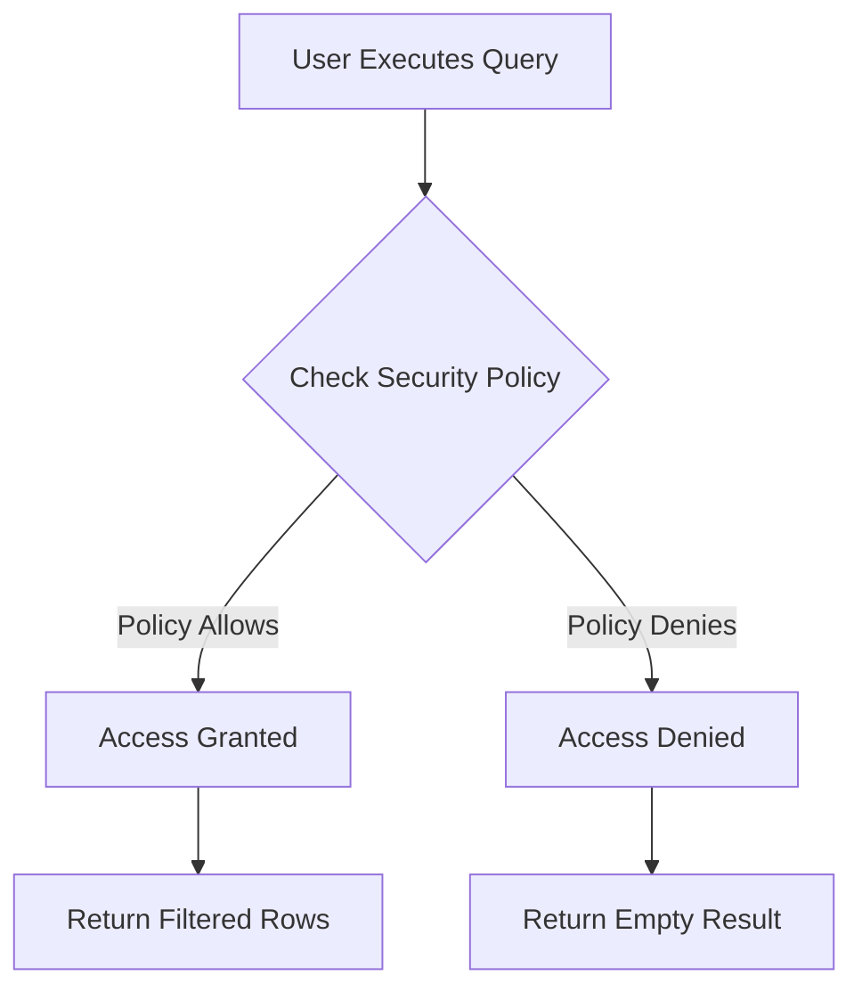

## 9.3 Row-Level Security

In the realm of database security, controlling access to data is paramount. Row-Level Security (RLS) is a sophisticated mechanism that allows database administrators to restrict access to rows in a table based on the characteristics of the user executing a query. This section will delve into the purpose, implementation, and use cases of Row-Level Security, providing expert software engineers and architects with the knowledge to enhance data access control in their SQL databases.

### Purpose of Row-Level Security

The primary purpose of Row-Level Security is to ensure that users can only access the data they are authorized to see. This is particularly crucial in environments where sensitive information is stored, such as financial, healthcare, or multi-tenant applications. By implementing RLS, organizations can enforce data privacy and compliance requirements, reducing the risk of unauthorized data exposure.

### Implementation of Row-Level Security

Implementing Row-Level Security involves two main components: defining security policies and binding these policies to tables or views. Let's explore each of these components in detail.

#### Security Policies

Security policies are the heart of Row-Level Security. They define the rules or predicates that determine which rows a user can access. These predicates are typically based on user attributes, such as their role, department, or specific user ID.

**Example: Defining a Security Policy**

Consider a scenario where we have a table named `Orders` and we want to restrict access so that sales representatives can only view orders they are responsible for. We can define a security policy as follows:

```sql
CREATE SECURITY POLICY SalesRepPolicy
ADD FILTER PREDICATE dbo.fn_securitypredicate(SalesRepID)
ON dbo.Orders;
```

In this example, `fn_securitypredicate` is a user-defined function that returns a Boolean value indicating whether a row should be visible to the current user. The function might look like this:

```sql
CREATE FUNCTION dbo.fn_securitypredicate(@SalesRepID AS INT)
RETURNS TABLE
WITH SCHEMABINDING
AS
RETURN SELECT 1 AS result
WHERE @SalesRepID = USER_ID();
```

This function checks if the `SalesRepID` of the order matches the ID of the current user, allowing access only to relevant rows.

#### Bindings

Once a security policy is defined, it needs to be associated with a table or view. This association is known as binding. The binding process ensures that the security policy is enforced whenever the table or view is accessed.

**Example: Binding a Security Policy**

Continuing with our previous example, we bind the `SalesRepPolicy` to the `Orders` table:

```sql
ALTER TABLE dbo.Orders
WITH (SECURITY_POLICY = SalesRepPolicy);
```

This binding ensures that the `SalesRepPolicy` is applied to all queries against the `Orders` table, automatically filtering rows based on the defined predicate.

### Use Cases for Row-Level Security

Row-Level Security is particularly useful in scenarios where data access needs to be restricted at a granular level. Here are some common use cases:

#### Multi-Tenant Databases

In multi-tenant applications, multiple customers (tenants) share the same database schema. RLS can be used to ensure that each tenant can only access their own data, providing a secure and isolated environment.

**Example: Multi-Tenant Security Policy**

Suppose we have a `Customers` table with a `TenantID` column. We can define a security policy to restrict access based on the tenant:

```sql
CREATE SECURITY POLICY TenantPolicy
ADD FILTER PREDICATE dbo.fn_tenantpredicate(TenantID)
ON dbo.Customers;
```

The `fn_tenantpredicate` function would check if the `TenantID` matches the ID of the current tenant, ensuring data isolation.

#### Data Partitioning by User

In organizations where data is partitioned by user roles or departments, RLS can enforce access control based on these partitions. For example, a company might want to restrict access to financial data based on department.

**Example: Department-Based Security Policy**

Consider a `FinancialData` table with a `DepartmentID` column. We can define a security policy to restrict access based on department:

```sql
CREATE SECURITY POLICY DepartmentPolicy
ADD FILTER PREDICATE dbo.fn_departmentpredicate(DepartmentID)
ON dbo.FinancialData;
```

The `fn_departmentpredicate` function would verify if the `DepartmentID` matches the department of the current user, ensuring appropriate access control.

### Visualizing Row-Level Security

To better understand how Row-Level Security works, let's visualize the process using a flowchart.



**Figure 1: Row-Level Security Process Flow**

In this flowchart, when a user executes a query, the security policy is checked. If the policy allows access, the user is granted access to the filtered rows. If the policy denies access, the user receives an empty result.

### Design Considerations

When implementing Row-Level Security, there are several design considerations to keep in mind:

- **Performance Impact**: RLS can introduce performance overhead, especially in large tables with complex predicates. It's important to test and optimize the performance of security policies.
- **Complexity**: Managing multiple security policies can become complex, particularly in large organizations with diverse access requirements. It's crucial to maintain clear documentation and governance.
- **Compatibility**: Not all database systems support RLS natively. Ensure that your database platform supports RLS or consider alternative approaches if necessary.

### Differences and Similarities

Row-Level Security is often compared to other access control mechanisms, such as column-level security and view-based security. While all these mechanisms aim to restrict data access, they operate at different levels:

- **Row-Level Security**: Restricts access to specific rows based on user attributes.
- **Column-Level Security**: Restricts access to specific columns, often used to hide sensitive information.
- **View-Based Security**: Uses views to present a filtered subset of data to users.

Each mechanism has its strengths and weaknesses, and the choice depends on the specific requirements of your application.

### Try It Yourself

To gain hands-on experience with Row-Level Security, try modifying the code examples provided in this section. Experiment with different predicates and test the impact on data access. Consider creating a sample database with multiple tables and implementing RLS to restrict access based on various criteria.

### References and Links

For further reading on Row-Level Security and related topics, consider exploring the following resources:

- [Microsoft Docs: Row-Level Security](https://docs.microsoft.com/en-us/sql/relational-databases/security/row-level-security)
- [PostgreSQL Documentation: Row Security Policies](https://www.postgresql.org/docs/current/ddl-rowsecurity.html)
- [Oracle Database Security Guide](https://docs.oracle.com/en/database/oracle/oracle-database/19/dbseg/index.html)

### Knowledge Check

To reinforce your understanding of Row-Level Security, consider the following questions:

1. What is the primary purpose of Row-Level Security?
2. How do security policies and bindings work together in RLS?
3. What are some common use cases for Row-Level Security?
4. How does Row-Level Security differ from column-level security?
5. What are some design considerations when implementing RLS?

### Embrace the Journey

Remember, mastering Row-Level Security is just one step in enhancing your database security skills. As you continue to explore SQL design patterns, you'll discover new ways to optimize and secure your database solutions. Keep experimenting, stay curious, and enjoy the journey!

## Quiz Time!



### What is the primary purpose of Row-Level Security?

- [x] To restrict data access at the row level
- [ ] To encrypt data in transit
- [ ] To optimize query performance
- [ ] To manage database backups

> **Explanation:** Row-Level Security is designed to restrict access to specific rows in a table based on user attributes, ensuring that users only see the data they are authorized to access.

### Which component defines the rules for Row-Level Security?

- [x] Security Policies
- [ ] Indexes
- [ ] Views
- [ ] Triggers

> **Explanation:** Security policies define the predicates that determine which rows a user can access, forming the core of Row-Level Security.

### What is the role of bindings in Row-Level Security?

- [x] To associate security policies with tables or views
- [ ] To encrypt data at rest
- [ ] To create database indexes
- [ ] To manage user roles

> **Explanation:** Bindings associate security policies with specific tables or views, ensuring that the policies are enforced during data access.

### In a multi-tenant database, what does Row-Level Security help achieve?

- [x] Data isolation for each tenant
- [ ] Faster query execution
- [ ] Automatic data backup
- [ ] Schema migration

> **Explanation:** Row-Level Security ensures that each tenant can only access their own data, providing a secure and isolated environment in multi-tenant databases.

### How does Row-Level Security differ from column-level security?

- [x] RLS restricts access to rows, while column-level security restricts access to columns
- [ ] RLS encrypts data, while column-level security does not
- [ ] RLS is faster than column-level security
- [ ] RLS is only available in cloud databases

> **Explanation:** Row-Level Security restricts access to specific rows based on user attributes, whereas column-level security restricts access to specific columns, often used to hide sensitive information.

### What is a potential performance impact of implementing Row-Level Security?

- [x] Increased query execution time
- [ ] Reduced data storage requirements
- [ ] Faster data retrieval
- [ ] Automatic data indexing

> **Explanation:** Implementing Row-Level Security can introduce performance overhead, especially in large tables with complex predicates, potentially increasing query execution time.

### Which SQL function is used to define a security predicate in Row-Level Security?

- [x] User-defined function
- [ ] Aggregate function
- [ ] Window function
- [ ] System function

> **Explanation:** A user-defined function is typically used to define the security predicate in Row-Level Security, returning a Boolean value to determine row visibility.

### What is a common use case for Row-Level Security?

- [x] Multi-tenant databases
- [ ] Data encryption
- [ ] Query optimization
- [ ] Schema migration

> **Explanation:** Row-Level Security is commonly used in multi-tenant databases to ensure that each tenant can only access their own data, providing data isolation.

### Which of the following is NOT a design consideration for Row-Level Security?

- [ ] Performance impact
- [ ] Complexity
- [ ] Compatibility
- [x] Data encryption

> **Explanation:** While performance impact, complexity, and compatibility are important design considerations for Row-Level Security, data encryption is not directly related to RLS implementation.

### True or False: Row-Level Security can be used to restrict access to specific columns in a table.

- [ ] True
- [x] False

> **Explanation:** Row-Level Security restricts access to specific rows based on user attributes, not columns. Column-level security is used to restrict access to specific columns.




