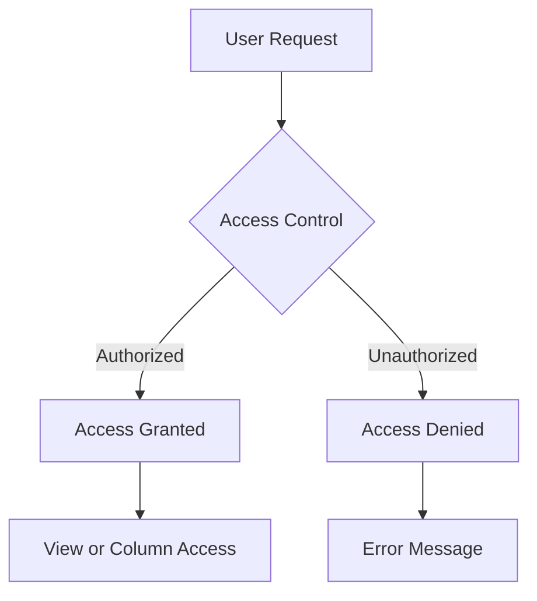

## 9.4 Column-Level Security

In today's data-driven world, safeguarding sensitive information is paramount. Column-Level Security (CLS) is a crucial design pattern in SQL databases that allows for fine-grained access control by restricting access to specific columns within a table. This section delves into the purpose, techniques, and applications of Column-Level Security, providing expert insights and practical examples to help you implement this pattern effectively.

### Purpose of Column-Level Security

The primary purpose of Column-Level Security is to protect sensitive data by ensuring that only authorized users can access specific columns within a table. This is particularly important for safeguarding Personally Identifiable Information (PII), financial data, and other confidential information. By implementing CLS, organizations can:

- **Enhance Data Privacy**: Limit exposure of sensitive data to unauthorized users.
- **Comply with Regulations**: Meet legal and regulatory requirements such as GDPR, HIPAA, and PCI DSS.
- **Reduce Risk**: Minimize the potential for data breaches and unauthorized data access.

### Techniques for Implementing Column-Level Security

There are several techniques for implementing Column-Level Security in SQL databases. The most common methods include using privileges and views. Let's explore each technique in detail.

#### Privileges

Privileges in SQL are permissions granted to users or roles to perform specific actions on database objects. By granting select permissions on specific columns, you can control which users have access to sensitive data.

**Example: Granting Column-Level Privileges**

```sql
-- Create a user
CREATE USER data_analyst IDENTIFIED BY 'securepassword';

-- Grant select permission on specific columns
GRANT SELECT (first_name, last_name, email) ON employees TO data_analyst;
```

In this example, the `data_analyst` user is granted select permissions only on the `first_name`, `last_name`, and `email` columns of the `employees` table. This ensures that the user cannot access other sensitive columns, such as `social_security_number` or `salary`.

#### Views

Views are virtual tables that provide a way to present data from one or more tables in a specific format. By creating views that expose only the allowed columns, you can effectively implement Column-Level Security.

**Example: Using Views for Column-Level Security**

```sql
-- Create a view that exposes only specific columns
CREATE VIEW employee_public_info AS
SELECT first_name, last_name, email
FROM employees;

-- Grant select permission on the view
GRANT SELECT ON employee_public_info TO data_analyst;
```

In this example, the `employee_public_info` view is created to expose only the `first_name`, `last_name`, and `email` columns from the `employees` table. The `data_analyst` user is granted select permission on this view, ensuring they can only access the specified columns.

### Applications of Column-Level Security

Column-Level Security is widely used in various applications to protect sensitive data. Some common use cases include:

- **Protecting PII**: Restricting access to columns containing personal information such as names, addresses, and social security numbers.
- **Financial Data Security**: Limiting access to financial information such as salaries, bank account numbers, and credit card details.
- **Healthcare Data Protection**: Ensuring that only authorized personnel can access sensitive health information.

### Design Considerations

When implementing Column-Level Security, consider the following design considerations:

- **Performance Impact**: Be aware that using views and complex privilege configurations may impact query performance. Test and optimize your implementation to ensure it meets performance requirements.
- **Maintenance Overhead**: Managing column-level permissions and views can increase administrative overhead. Use automation tools and scripts to streamline maintenance tasks.
- **Compatibility**: Ensure that your implementation is compatible with your database management system (DBMS) and any third-party applications that interact with your database.

### Differences and Similarities with Other Patterns

Column-Level Security is often compared to Row-Level Security (RLS), another access control pattern. While both patterns aim to restrict data access, they operate at different levels:

- **Column-Level Security**: Restricts access to specific columns within a table.
- **Row-Level Security**: Restricts access to specific rows within a table based on user-defined criteria.

Both patterns can be used together to provide comprehensive data protection, ensuring that users can only access the data they are authorized to see.

### Visualizing Column-Level Security

To better understand how Column-Level Security works, let's visualize the process using a Mermaid.js diagram.



**Diagram Description**: This diagram illustrates the process of Column-Level Security. When a user requests access to a column, the access control mechanism checks their permissions. If authorized, access is granted to the view or specific columns. If unauthorized, an error message is returned.

### Try It Yourself

To gain hands-on experience with Column-Level Security, try modifying the code examples provided. Experiment with different column permissions and view configurations to see how they affect data access. Consider creating a new user with different permissions and observe the results.

### References and Links

For further reading on Column-Level Security and related topics, consider the following resources:

- [SQL Server Column-Level Security](https://docs.microsoft.com/en-us/sql/relational-databases/security/permissions-column-level-security)
- [Oracle Database Security Guide](https://docs.oracle.com/en/database/oracle/oracle-database/19/dbseg/index.html)
- [PostgreSQL Security Features](https://www.postgresql.org/docs/current/security.html)

### Knowledge Check

To reinforce your understanding of Column-Level Security, consider the following questions:

- What are the primary purposes of implementing Column-Level Security?
- How do privileges and views differ in their approach to Column-Level Security?
- What are some common applications of Column-Level Security in real-world scenarios?

### Embrace the Journey

Remember, mastering Column-Level Security is just one step in your journey to becoming an expert in SQL design patterns. As you continue to explore and implement these patterns, you'll gain valuable insights and skills that will enhance your ability to build secure and efficient database solutions. Keep experimenting, stay curious, and enjoy the journey!

## Quiz Time!



### What is the primary purpose of Column-Level Security?

- [x] To restrict access to specific columns within a table
- [ ] To restrict access to specific rows within a table
- [ ] To enhance database performance
- [ ] To simplify database administration

> **Explanation:** Column-Level Security is designed to restrict access to specific columns within a table, protecting sensitive data.

### Which SQL feature can be used to implement Column-Level Security by exposing only allowed columns?

- [x] Views
- [ ] Triggers
- [ ] Indexes
- [ ] Stored Procedures

> **Explanation:** Views can be used to create a virtual table that exposes only the allowed columns, effectively implementing Column-Level Security.

### What is a common application of Column-Level Security?

- [x] Protecting Personally Identifiable Information (PII)
- [ ] Enhancing query performance
- [ ] Simplifying database schema design
- [ ] Automating database backups

> **Explanation:** Column-Level Security is commonly used to protect sensitive data such as Personally Identifiable Information (PII).

### How can privileges be used to implement Column-Level Security?

- [x] By granting select permissions on specific columns
- [ ] By creating indexes on specific columns
- [ ] By using triggers to monitor access
- [ ] By encrypting specific columns

> **Explanation:** Privileges can be used to grant select permissions on specific columns, controlling access to sensitive data.

### What is a potential drawback of using views for Column-Level Security?

- [x] Performance impact
- [ ] Increased data redundancy
- [ ] Lack of flexibility
- [ ] Difficulty in creating views

> **Explanation:** Using views for Column-Level Security can impact performance, especially if the views are complex.

### Which of the following is NOT a benefit of Column-Level Security?

- [ ] Enhancing data privacy
- [ ] Complying with regulations
- [ ] Reducing risk of data breaches
- [x] Improving database indexing

> **Explanation:** Column-Level Security focuses on access control and does not directly improve database indexing.

### What is a key difference between Column-Level Security and Row-Level Security?

- [x] Column-Level Security restricts access to specific columns, while Row-Level Security restricts access to specific rows.
- [ ] Column-Level Security is easier to implement than Row-Level Security.
- [ ] Column-Level Security is more secure than Row-Level Security.
- [ ] Column-Level Security is only applicable to financial data.

> **Explanation:** Column-Level Security restricts access to specific columns, whereas Row-Level Security restricts access to specific rows.

### Which SQL command is used to create a view for Column-Level Security?

- [x] CREATE VIEW
- [ ] CREATE INDEX
- [ ] CREATE TRIGGER
- [ ] CREATE PROCEDURE

> **Explanation:** The CREATE VIEW command is used to create a view that can expose only specific columns for Column-Level Security.

### What should be considered when implementing Column-Level Security?

- [x] Performance impact and maintenance overhead
- [ ] Data redundancy and schema complexity
- [ ] Backup frequency and storage capacity
- [ ] Encryption methods and key management

> **Explanation:** When implementing Column-Level Security, consider the performance impact and maintenance overhead.

### True or False: Column-Level Security can be used to comply with data protection regulations.

- [x] True
- [ ] False

> **Explanation:** True. Column-Level Security helps organizations comply with data protection regulations by restricting access to sensitive data.




