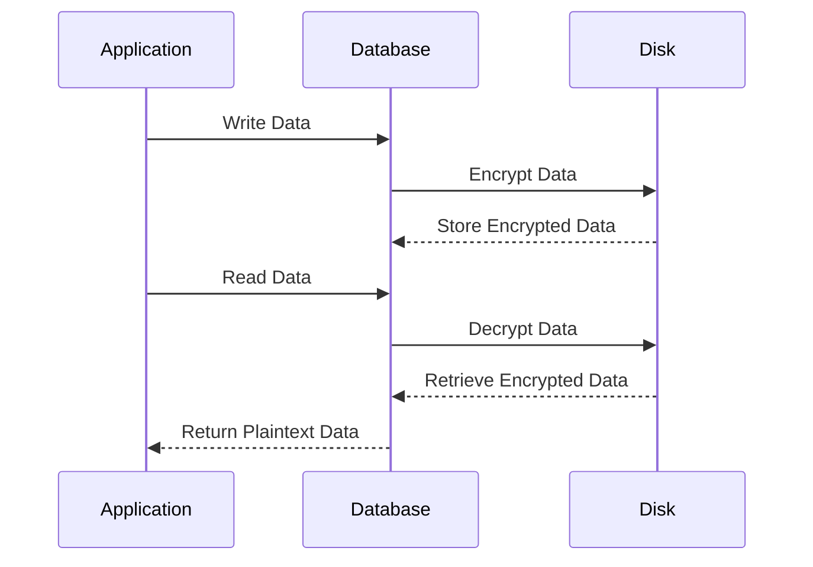

## 9.5.1 Data at Rest Encryption

In today's data-driven world, ensuring the security of sensitive information stored in databases is paramount. Data at Rest Encryption (DARE) is a critical component of a comprehensive data security strategy, protecting data stored on disk from unauthorized access and breaches. This section delves into the intricacies of Data at Rest Encryption, focusing on Transparent Data Encryption (TDE), Cell-Level Encryption, and Key Management.

### Understanding Data at Rest Encryption

Data at Rest refers to inactive data stored physically in any digital form (e.g., databases, data warehouses). Encrypting this data ensures that even if unauthorized parties gain access to the storage media, they cannot read the data without the appropriate decryption keys.

#### Key Concepts

- **Encryption**: The process of converting plaintext into ciphertext using an algorithm and an encryption key.
- **Decryption**: The reverse process of converting ciphertext back to plaintext using a decryption key.
- **Encryption Key**: A piece of information that determines the output of the encryption algorithm.

### Transparent Data Encryption (TDE)

Transparent Data Encryption (TDE) is a popular method for encrypting database files at the storage level. It encrypts the entire database, including backups, without requiring changes to the application layer.

#### How TDE Works

TDE encrypts the data files at the page level. The encryption and decryption processes are transparent to the application, meaning that the application does not need to be aware of the encryption. This is achieved by encrypting the data as it is written to disk and decrypting it as it is read into memory.

#### Key Participants

- **Database Engine**: Manages the encryption and decryption processes.
- **Encryption Keys**: Includes the Database Encryption Key (DEK) and the Master Key.

#### Implementing TDE

Let's explore how to implement TDE in SQL Server, a widely used relational database management system.

```sql
-- Step 1: Create a Master Key
CREATE MASTER KEY ENCRYPTION BY PASSWORD = 'YourStrongPassword';

-- Step 2: Create a Certificate
CREATE CERTIFICATE MyTDECert WITH SUBJECT = 'TDE Certificate';

-- Step 3: Create a Database Encryption Key
USE YourDatabase;
CREATE DATABASE ENCRYPTION KEY
WITH ALGORITHM = AES_256
ENCRYPTION BY SERVER CERTIFICATE MyTDECert;

-- Step 4: Enable TDE
ALTER DATABASE YourDatabase
SET ENCRYPTION ON;
```

> **Note**: The above SQL commands demonstrate enabling TDE on a SQL Server database. Ensure that you replace placeholders like `YourStrongPassword` and `YourDatabase` with actual values.

#### Design Considerations

- **Performance Impact**: TDE can introduce a performance overhead due to the encryption and decryption processes.
- **Backup Encryption**: TDE automatically encrypts database backups, ensuring data security even when backups are stored offsite.
- **Key Management**: Proper management of encryption keys is crucial to prevent unauthorized access.

### Cell-Level Encryption

Cell-Level Encryption allows for encrypting specific columns within a database table. This approach provides more granular control over which data is encrypted, making it suitable for protecting sensitive information like credit card numbers or social security numbers.

#### How Cell-Level Encryption Works

Cell-Level Encryption involves encrypting data at the column level using functions provided by the database management system. This method requires changes to the application logic to handle encryption and decryption.

#### Implementing Cell-Level Encryption

Here's an example of implementing Cell-Level Encryption in SQL Server:

```sql
-- Step 1: Create a Symmetric Key
CREATE SYMMETRIC KEY MySymmetricKey
WITH ALGORITHM = AES_256
ENCRYPTION BY PASSWORD = 'AnotherStrongPassword';

-- Step 2: Encrypt Data
OPEN SYMMETRIC KEY MySymmetricKey
DECRYPTION BY PASSWORD = 'AnotherStrongPassword';

UPDATE Customers
SET EncryptedCreditCard = EncryptByKey(Key_GUID('MySymmetricKey'), CreditCardNumber);

CLOSE SYMMETRIC KEY MySymmetricKey;

-- Step 3: Decrypt Data
OPEN SYMMETRIC KEY MySymmetricKey
DECRYPTION BY PASSWORD = 'AnotherStrongPassword';

SELECT CustomerID, 
       CONVERT(varchar, DecryptByKey(EncryptedCreditCard)) AS CreditCardNumber
FROM Customers;

CLOSE SYMMETRIC KEY MySymmetricKey;
```

> **Note**: The example above demonstrates encrypting and decrypting a credit card number in a `Customers` table. Adjust the table and column names as needed.

#### Design Considerations

- **Granularity**: Provides fine-grained control over which data is encrypted.
- **Application Changes**: Requires modifications to application logic to handle encryption and decryption.
- **Performance**: May impact performance due to the overhead of encrypting and decrypting individual columns.

### Key Management

Effective Key Management is crucial for maintaining the security of encrypted data. It involves the secure storage, rotation, and access control of encryption keys.

#### Key Management Best Practices

- **Secure Storage**: Store encryption keys in a secure location, such as a hardware security module (HSM) or a key management service.
- **Key Rotation**: Regularly rotate encryption keys to minimize the risk of key compromise.
- **Access Control**: Restrict access to encryption keys to authorized personnel only.

#### Implementing Key Management

Many cloud providers offer key management services that simplify the process of managing encryption keys. For example, AWS Key Management Service (KMS) and Azure Key Vault provide secure key storage and management capabilities.

### Visualizing Data at Rest Encryption

To better understand the flow of data encryption and decryption, let's visualize the process using a sequence diagram.



> **Description**: This diagram illustrates the process of encrypting data as it is written to disk and decrypting it as it is read back into the database.

### Try It Yourself

Experiment with the code examples provided in this section. Try encrypting different columns in your database and observe the impact on performance. Consider implementing TDE and Cell-Level Encryption in a test environment to understand their differences and benefits.

### Knowledge Check

- **Question**: What is the primary difference between TDE and Cell-Level Encryption?
- **Challenge**: Implement TDE on a sample database and observe the changes in backup file sizes.

### References and Further Reading

- [Microsoft Docs: Transparent Data Encryption (TDE)](https://docs.microsoft.com/en-us/sql/relational-databases/security/encryption/transparent-data-encryption?view=sql-server-ver15)
- [AWS Key Management Service (KMS)](https://aws.amazon.com/kms/)
- [Azure Key Vault](https://azure.microsoft.com/en-us/services/key-vault/)

### Embrace the Journey

Remember, securing your data is an ongoing process. As you implement encryption techniques, continue to explore new methods and stay informed about the latest security best practices. Keep experimenting, stay curious, and enjoy the journey of mastering SQL security!

## Quiz Time!



### What is the primary purpose of Data at Rest Encryption?

- [x] To protect inactive data stored on disk from unauthorized access
- [ ] To encrypt data during transmission over a network
- [ ] To secure data within application memory
- [ ] To prevent SQL injection attacks

> **Explanation:** Data at Rest Encryption focuses on securing data stored on physical media, ensuring it remains protected even if the storage is compromised.

### Which encryption method encrypts the entire database without requiring application changes?

- [x] Transparent Data Encryption (TDE)
- [ ] Cell-Level Encryption
- [ ] Network Encryption
- [ ] Application-Level Encryption

> **Explanation:** TDE encrypts the entire database at the storage level, making it transparent to applications.

### What is a key consideration when implementing Cell-Level Encryption?

- [x] Modifying application logic to handle encryption and decryption
- [ ] Encrypting the entire database
- [ ] Ensuring network security
- [ ] Using hardware security modules

> **Explanation:** Cell-Level Encryption requires changes to application logic to manage encryption and decryption processes.

### What is a best practice for managing encryption keys?

- [x] Regularly rotate encryption keys
- [ ] Store keys in plaintext files
- [ ] Share keys with all database users
- [ ] Avoid using encryption keys

> **Explanation:** Regular key rotation minimizes the risk of key compromise and enhances security.

### Which service is commonly used for secure key storage and management?

- [x] AWS Key Management Service (KMS)
- [ ] SQL Server Management Studio
- [ ] Apache Kafka
- [ ] GitHub

> **Explanation:** AWS KMS provides secure storage and management of encryption keys.

### What is the performance impact of using TDE?

- [x] It can introduce a performance overhead due to encryption and decryption processes
- [ ] It significantly improves database performance
- [ ] It has no impact on performance
- [ ] It only affects network performance

> **Explanation:** TDE may introduce a performance overhead as it encrypts and decrypts data at the storage level.

### What is the role of a Database Encryption Key (DEK) in TDE?

- [x] It encrypts the data files at the page level
- [ ] It manages user authentication
- [ ] It encrypts network traffic
- [ ] It stores application settings

> **Explanation:** The DEK is used to encrypt and decrypt data files in TDE.

### What is the advantage of Cell-Level Encryption over TDE?

- [x] Provides fine-grained control over which data is encrypted
- [ ] Encrypts the entire database
- [ ] Requires no application changes
- [ ] Automatically encrypts backups

> **Explanation:** Cell-Level Encryption allows for encrypting specific columns, offering more granular control.

### What is a potential drawback of Cell-Level Encryption?

- [x] It may impact performance due to the overhead of encrypting and decrypting individual columns
- [ ] It encrypts the entire database
- [ ] It requires no changes to application logic
- [ ] It automatically encrypts backups

> **Explanation:** The overhead of encrypting and decrypting individual columns can affect performance.

### True or False: TDE automatically encrypts database backups.

- [x] True
- [ ] False

> **Explanation:** TDE encrypts the database at the storage level, including backups, ensuring comprehensive data protection.


