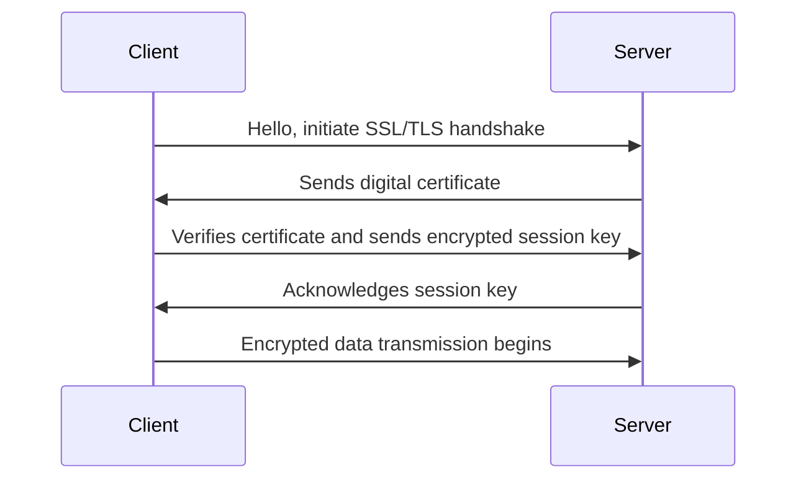
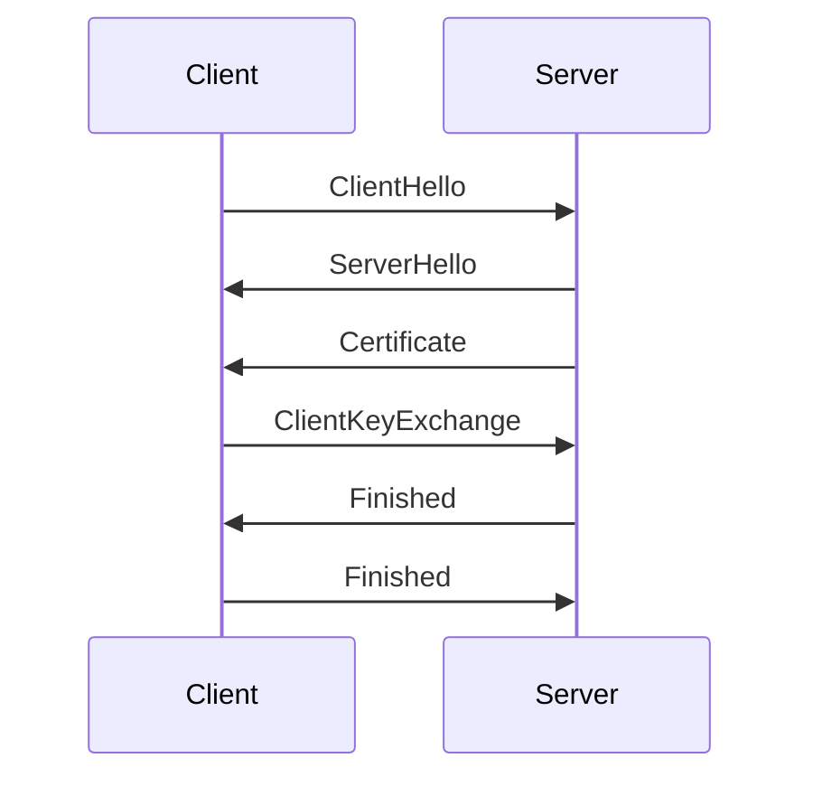

## 9.5.2 Data in Transit Encryption

In today's digital landscape, securing data as it travels across networks is paramount. Data in transit encryption is a critical component of database security, ensuring that sensitive information remains confidential and tamper-proof during transmission. This section delves into the essential protocols, configurations, and best practices for encrypting data in transit, focusing on SQL databases.

### Understanding Data in Transit Encryption

Data in transit refers to any data that is actively moving from one location to another, such as across the internet or through a private network. Encrypting this data is crucial to protect it from interception and unauthorized access. The primary goal of data in transit encryption is to ensure confidentiality, integrity, and authenticity.

#### Key Concepts

- **Confidentiality**: Ensures that data is only accessible to authorized parties.
- **Integrity**: Guarantees that data has not been altered during transit.
- **Authenticity**: Confirms the identity of the communicating parties.

### Protocols for Secure Communication

The most widely used protocols for encrypting data in transit are SSL (Secure Sockets Layer) and TLS (Transport Layer Security). These protocols provide a secure channel over an insecure network, such as the internet.

#### SSL/TLS Overview

SSL and its successor, TLS, are cryptographic protocols designed to provide secure communication over a computer network. They use a combination of asymmetric and symmetric encryption to protect data.

- **Asymmetric Encryption**: Utilizes a pair of keys (public and private) for encryption and decryption.
- **Symmetric Encryption**: Uses a single key for both encryption and decryption, offering faster processing.

#### How SSL/TLS Works

1. **Handshake Process**: Establishes a secure connection between the client and server.
2. **Certificate Exchange**: The server presents a digital certificate to the client to verify its identity.
3. **Session Key Generation**: Both parties agree on a symmetric session key for encrypting data.
4. **Data Transmission**: Encrypted data is exchanged using the session key.



### Configuring Encryption on Database Connections

To secure SQL database connections, it is essential to enable SSL/TLS encryption. This involves configuring both the database server and client applications to support encrypted communication.

#### Steps to Enable SSL/TLS

1. **Generate SSL/TLS Certificates**: Obtain a valid certificate from a trusted Certificate Authority (CA) or create a self-signed certificate for internal use.
2. **Configure the Database Server**: Enable SSL/TLS support on the server and specify the paths to the certificate and key files.
3. **Configure the Database Client**: Ensure the client application is set to use SSL/TLS when connecting to the database.

#### Example: Enabling SSL/TLS in PostgreSQL

```sql
-- Step 1: Configure the server to use SSL
-- Edit the postgresql.conf file
ssl = on
ssl_cert_file = '/path/to/server.crt'
ssl_key_file = '/path/to/server.key'

-- Step 2: Restart the PostgreSQL server
-- Command to restart the server (varies by system)
sudo systemctl restart postgresql

-- Step 3: Configure the client connection
-- Use SSL mode in the connection string
psql "host=mydb.example.com sslmode=require dbname=mydb user=myuser"
```

### Certificate Management

Proper certificate management is crucial to prevent man-in-the-middle (MITM) attacks. Implementing valid certificates ensures that the parties involved in the communication are who they claim to be.

#### Types of Certificates

- **Self-Signed Certificates**: Suitable for internal use but not recommended for public-facing applications due to trust issues.
- **CA-Signed Certificates**: Issued by a trusted Certificate Authority, providing a higher level of trust and security.

#### Best Practices for Certificate Management

- **Regularly Update Certificates**: Certificates have expiration dates and must be renewed periodically.
- **Use Strong Encryption Algorithms**: Ensure that certificates use robust encryption standards, such as RSA 2048-bit or higher.
- **Implement Certificate Pinning**: Bind a specific certificate to a server to prevent MITM attacks.

### Try It Yourself

Experiment with enabling SSL/TLS encryption on a test database. Modify the configuration files to use different encryption algorithms and observe the impact on connection security. Test the connection using both self-signed and CA-signed certificates to understand the differences in trust levels.

### Visualizing SSL/TLS Handshake



### Knowledge Check

- Explain the difference between symmetric and asymmetric encryption.
- Describe the steps involved in the SSL/TLS handshake process.
- What are the advantages of using CA-signed certificates over self-signed certificates?

### References and Links

- [SSL/TLS and HTTPS](https://www.cloudflare.com/learning/ssl/what-is-ssl/)
- [PostgreSQL SSL Support](https://www.postgresql.org/docs/current/ssl-tcp.html)
- [Certificate Management Best Practices](https://www.digicert.com/blog/certificate-management-best-practices)

### Embrace the Journey

Securing data in transit is a vital aspect of database security. By implementing SSL/TLS encryption and managing certificates effectively, we can protect sensitive information from unauthorized access. Remember, this is just the beginning. As you progress, you'll build more secure and robust database systems. Keep experimenting, stay curious, and enjoy the journey!

## Quiz Time!



### What is the primary goal of data in transit encryption?

- [x] To ensure confidentiality, integrity, and authenticity of data
- [ ] To increase data transmission speed
- [ ] To reduce storage requirements
- [ ] To simplify database management

> **Explanation:** Data in transit encryption aims to protect data from unauthorized access and tampering during transmission, ensuring confidentiality, integrity, and authenticity.

### Which protocol is commonly used for encrypting data in transit?

- [x] TLS
- [ ] FTP
- [ ] HTTP
- [ ] SMTP

> **Explanation:** TLS (Transport Layer Security) is a widely used protocol for encrypting data in transit, providing secure communication over networks.

### What is the difference between symmetric and asymmetric encryption?

- [x] Symmetric uses one key; asymmetric uses two keys
- [ ] Symmetric uses two keys; asymmetric uses one key
- [ ] Both use the same number of keys
- [ ] Symmetric is slower than asymmetric

> **Explanation:** Symmetric encryption uses a single key for both encryption and decryption, while asymmetric encryption uses a pair of keys (public and private).

### What is a man-in-the-middle (MITM) attack?

- [x] An attack where the attacker intercepts and alters communication between two parties
- [ ] An attack that targets database storage
- [ ] An attack that exploits software vulnerabilities
- [ ] An attack that involves physical theft of data

> **Explanation:** A MITM attack involves intercepting and potentially altering communication between two parties without their knowledge.

### Why is certificate management important in data in transit encryption?

- [x] To prevent man-in-the-middle attacks
- [ ] To increase data transmission speed
- [ ] To reduce encryption overhead
- [ ] To simplify database queries

> **Explanation:** Proper certificate management ensures that the parties involved in communication are who they claim to be, preventing MITM attacks.

### What is the purpose of the SSL/TLS handshake process?

- [x] To establish a secure connection between client and server
- [ ] To transfer data faster
- [ ] To compress data before transmission
- [ ] To authenticate user credentials

> **Explanation:** The SSL/TLS handshake process establishes a secure connection between the client and server, allowing encrypted data transmission.

### What is certificate pinning?

- [x] Binding a specific certificate to a server to prevent MITM attacks
- [ ] Storing certificates in a database
- [ ] Using multiple certificates for redundancy
- [ ] Encrypting certificates with a password

> **Explanation:** Certificate pinning involves binding a specific certificate to a server, ensuring that only trusted certificates are used, preventing MITM attacks.

### What is the advantage of using CA-signed certificates?

- [x] Higher level of trust and security
- [ ] Faster data transmission
- [ ] Reduced encryption overhead
- [ ] Simplified database management

> **Explanation:** CA-signed certificates are issued by trusted Certificate Authorities, providing a higher level of trust and security compared to self-signed certificates.

### How often should certificates be updated?

- [x] Regularly, before expiration
- [ ] Only when a security breach occurs
- [ ] Once every decade
- [ ] Only when the database is upgraded

> **Explanation:** Certificates should be updated regularly before they expire to maintain security and trust.

### True or False: Self-signed certificates are recommended for public-facing applications.

- [ ] True
- [x] False

> **Explanation:** Self-signed certificates are not recommended for public-facing applications due to trust issues; CA-signed certificates provide better security.


