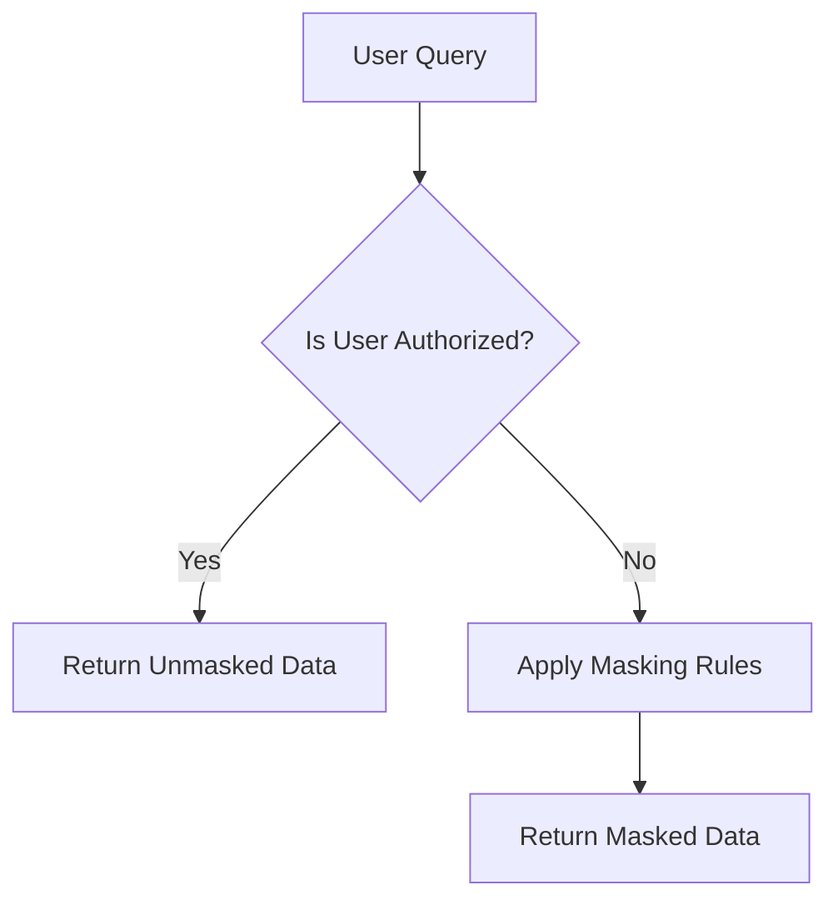

## 9.6 Dynamic Data Masking

Dynamic Data Masking (DDM) is a crucial security feature in SQL databases designed to protect sensitive data from unauthorized access by obscuring it in query results. This technique is particularly valuable in environments where data privacy and security are paramount, such as in healthcare, finance, and e-commerce sectors. In this section, we will delve into the purpose, methods, use cases, and implementation strategies for Dynamic Data Masking, providing expert software engineers and architects with the knowledge needed to effectively secure their databases.

### Purpose of Dynamic Data Masking

The primary purpose of Dynamic Data Masking is to prevent unauthorized users from viewing sensitive information while still allowing them to perform necessary operations on the data. By dynamically altering the data returned by queries, DDM ensures that sensitive information is not exposed to users who do not have the appropriate permissions. This is achieved without altering the actual data stored in the database, thus maintaining data integrity.

### Methods of Dynamic Data Masking

Dynamic Data Masking can be implemented using various methods, each suited to different types of data and security requirements. The two primary methods are:

#### Full Masking

Full Masking involves replacing the entire value of a sensitive data field with a fixed value. This method is useful when the data is highly sensitive and should not be exposed in any form. For example, a Social Security Number (SSN) might be fully masked to display as "XXX-XX-XXXX" for unauthorized users.

#### Partial Masking

Partial Masking allows for a portion of the data to be visible while masking the rest. This is particularly useful for data that needs to be partially visible for operational purposes, such as displaying the last four digits of a credit card number. Partial Masking strikes a balance between usability and security by revealing only the necessary parts of the data.

### Use Cases for Dynamic Data Masking

Dynamic Data Masking is applicable in various scenarios where data privacy and security are critical. Some common use cases include:

- **Production Environments**: Protecting sensitive data in production databases from being exposed to developers, testers, or other users who do not require full access.
- **Customer Support**: Allowing customer support representatives to access customer records without exposing sensitive information such as full credit card numbers or personal identification numbers.
- **Data Sharing**: Sharing datasets with third-party vendors or partners while ensuring that sensitive information is masked to prevent unauthorized access.

### Implementing Dynamic Data Masking

Implementing Dynamic Data Masking involves configuring the database to apply masking rules to specific columns. This can be achieved through SQL commands or using database management tools that support DDM. Let's explore how to implement DDM in a SQL database.

#### Step-by-Step Implementation

1. **Identify Sensitive Data**: Determine which columns contain sensitive information that needs to be masked. This could include columns with personal identification numbers, financial data, or any other sensitive information.

2. **Define Masking Rules**: Specify the masking rules for each column. Decide whether to use full masking or partial masking based on the sensitivity of the data and the requirements of the application.

3. **Apply Masking Rules**: Use SQL commands or database management tools to apply the masking rules to the identified columns. Below is an example of how to apply Dynamic Data Masking using SQL Server:

```sql
-- Create a table with sensitive data
CREATE TABLE Customers (
    CustomerID INT PRIMARY KEY,
    FullName NVARCHAR(100),
    Email NVARCHAR(100) MASKED WITH (FUNCTION = 'email()'),
    Phone NVARCHAR(15) MASKED WITH (FUNCTION = 'partial(0,"XXX-XXX-",4)'),
    CreditCardNumber NVARCHAR(16) MASKED WITH (FUNCTION = 'partial(0,"XXXX-XXXX-XXXX-",4)')
);

-- Insert sample data
INSERT INTO Customers (CustomerID, FullName, Email, Phone, CreditCardNumber)
VALUES (1, 'John Doe', 'john.doe@example.com', '123-456-7890', '1234-5678-9012-3456');

-- Query the table as an unauthorized user
SELECT * FROM Customers;
```

In this example, the `Email` column is masked using an email masking function, while the `Phone` and `CreditCardNumber` columns are partially masked to show only the last four digits.

#### Key Considerations

- **Performance Impact**: Dynamic Data Masking can introduce performance overhead, especially in large databases with complex masking rules. It's important to test the performance impact and optimize the masking logic as needed.
- **Security**: While DDM provides an additional layer of security, it should not be the sole method of protecting sensitive data. Combine DDM with other security measures such as encryption and access controls for comprehensive data protection.
- **Compliance**: Ensure that the implementation of Dynamic Data Masking complies with relevant data protection regulations and standards, such as GDPR or HIPAA.

### Visualizing Dynamic Data Masking

To better understand how Dynamic Data Masking works, let's visualize the process using a flowchart:



**Figure 1: Dynamic Data Masking Process Flowchart**

This flowchart illustrates the decision-making process when a user queries a database with Dynamic Data Masking enabled. If the user is authorized, unmasked data is returned. Otherwise, masking rules are applied, and masked data is returned.

### Try It Yourself

To gain hands-on experience with Dynamic Data Masking, try modifying the code example provided above. Experiment with different masking functions and observe how the query results change for authorized and unauthorized users. Consider creating additional tables and applying masking rules to different types of data to explore the versatility of DDM.

### References and Further Reading

- [Microsoft Docs: Dynamic Data Masking](https://docs.microsoft.com/en-us/sql/relational-databases/security/dynamic-data-masking)
- [Oracle Database Security Guide](https://docs.oracle.com/en/database/oracle/oracle-database/19/dbseg/index.html)
- [GDPR Compliance and Data Masking](https://gdpr.eu/)

### Knowledge Check

- What is the primary purpose of Dynamic Data Masking?
- Describe the difference between full masking and partial masking.
- Provide an example of a use case where Dynamic Data Masking would be beneficial.

### Embrace the Journey

Remember, implementing Dynamic Data Masking is just one step in securing your SQL databases. As you continue to explore security and access control patterns, you'll discover more techniques to enhance data protection. Keep experimenting, stay curious, and enjoy the journey of mastering SQL design patterns!

## Quiz Time!



### What is the primary purpose of Dynamic Data Masking?

- [x] To obscure sensitive data in query results for unauthorized users
- [ ] To encrypt data at rest
- [ ] To improve database performance
- [ ] To backup data regularly

> **Explanation:** Dynamic Data Masking is designed to obscure sensitive data in query results, ensuring unauthorized users cannot view it.

### Which method of Dynamic Data Masking replaces the entire value with a fixed value?

- [x] Full Masking
- [ ] Partial Masking
- [ ] Conditional Masking
- [ ] Role-Based Masking

> **Explanation:** Full Masking involves replacing the entire value of a sensitive data field with a fixed value.

### What is an example of Partial Masking?

- [ ] Replacing a Social Security Number with "XXX-XX-XXXX"
- [x] Showing only the last four digits of a credit card number
- [ ] Encrypting an email address
- [ ] Hiding all characters of a phone number

> **Explanation:** Partial Masking allows for a portion of the data to be visible, such as showing only the last four digits of a credit card number.

### Which of the following is a common use case for Dynamic Data Masking?

- [x] Protecting sensitive data in production environments
- [ ] Encrypting data for storage
- [ ] Improving query performance
- [ ] Automating data backups

> **Explanation:** Dynamic Data Masking is commonly used to protect sensitive data in production environments from unauthorized access.

### What should be considered when implementing Dynamic Data Masking?

- [x] Performance impact
- [x] Security
- [x] Compliance
- [ ] Data redundancy

> **Explanation:** When implementing Dynamic Data Masking, it's important to consider performance impact, security, and compliance with regulations.

### Which SQL command is used to apply masking rules to a column?

- [x] MASKED WITH
- [ ] ENCRYPTED WITH
- [ ] SECURED WITH
- [ ] PROTECTED WITH

> **Explanation:** The `MASKED WITH` command is used to apply masking rules to a column in SQL Server.

### What is the benefit of using Dynamic Data Masking in customer support?

- [x] Allows access to customer records without exposing sensitive information
- [ ] Improves query execution speed
- [ ] Reduces database size
- [ ] Automates customer data updates

> **Explanation:** Dynamic Data Masking allows customer support representatives to access customer records without exposing sensitive information.

### How does Dynamic Data Masking affect the actual data stored in the database?

- [x] It does not alter the actual data stored
- [ ] It encrypts the data
- [ ] It compresses the data
- [ ] It duplicates the data

> **Explanation:** Dynamic Data Masking does not alter the actual data stored in the database; it only affects the data returned in query results.

### What is a potential drawback of Dynamic Data Masking?

- [x] Performance overhead
- [ ] Data loss
- [ ] Increased storage requirements
- [ ] Reduced data integrity

> **Explanation:** Dynamic Data Masking can introduce performance overhead, especially in large databases with complex masking rules.

### Dynamic Data Masking can be the sole method of protecting sensitive data.

- [ ] True
- [x] False

> **Explanation:** While Dynamic Data Masking provides an additional layer of security, it should not be the sole method of protecting sensitive data. It should be combined with other security measures.




