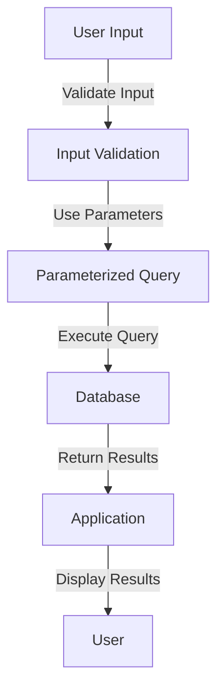

## 9.7 Preventing SQL Injection

SQL injection is a critical security vulnerability that can compromise the integrity, confidentiality, and availability of your database systems. As expert software engineers and architects, understanding and implementing strategies to prevent SQL injection is paramount. In this section, we will explore various techniques to safeguard your SQL databases from injection attacks, including parameterized queries, input validation, the principle of least privilege, and the use of stored procedures.

### Understanding SQL Injection

SQL injection occurs when an attacker is able to manipulate a SQL query by injecting malicious input into an application. This can lead to unauthorized access to data, data corruption, or even complete control over the database server. The root cause of SQL injection vulnerabilities is the improper handling of user input in SQL queries.

#### How SQL Injection Works

To understand how SQL injection works, consider the following example of a vulnerable SQL query:

```sql
-- Vulnerable SQL query
SELECT * FROM users WHERE username = 'admin' AND password = 'password';
```

If the application constructs this query using user input without proper sanitization, an attacker could input the following:

```plaintext
username: admin' OR '1'='1
password: anything
```

The resulting SQL query would be:

```sql
-- SQL injection attack
SELECT * FROM users WHERE username = 'admin' OR '1'='1' AND password = 'anything';
```

The condition `'1'='1'` is always true, allowing the attacker to bypass authentication and gain access to the system.

### Parameterized Queries

One of the most effective ways to prevent SQL injection is by using parameterized queries. Parameterized queries separate SQL code from data, ensuring that user input is treated as data rather than executable code.

#### Implementing Parameterized Queries

Let's see how parameterized queries can be implemented in different programming languages:

**Java Example:**

```java
// Java example using PreparedStatement
String sql = "SELECT * FROM users WHERE username = ? AND password = ?";
try (PreparedStatement pstmt = connection.prepareStatement(sql)) {
    pstmt.setString(1, username);
    pstmt.setString(2, password);
    ResultSet rs = pstmt.executeQuery();
    // Process the result set
}
```

**Python Example:**

```python
import sqlite3

conn = sqlite3.connect('example.db')
cursor = conn.cursor()

sql = "SELECT * FROM users WHERE username = ? AND password = ?"
cursor.execute(sql, (username, password))
rows = cursor.fetchall()
```

**C# Example:**

```csharp
// C# example using SqlCommand with parameters
string sql = "SELECT * FROM users WHERE username = @username AND password = @password";
using (SqlCommand cmd = new SqlCommand(sql, connection)) {
    cmd.Parameters.AddWithValue("@username", username);
    cmd.Parameters.AddWithValue("@password", password);
    SqlDataReader reader = cmd.ExecuteReader();
    // Process the reader
}
```

### Input Validation

Input validation is another crucial technique for preventing SQL injection. By validating and sanitizing user inputs, you can ensure that only expected and safe data is processed by your application.

#### Best Practices for Input Validation

- **Whitelist Validation**: Define a set of acceptable input values and reject anything that doesn't match.
- **Data Type Checks**: Ensure that inputs conform to expected data types (e.g., integers, strings).
- **Length Checks**: Limit the length of input data to prevent buffer overflow attacks.
- **Regular Expressions**: Use regex patterns to validate complex input formats, such as email addresses or phone numbers.

### Principle of Least Privilege

The principle of least privilege involves granting users the minimum level of access necessary to perform their tasks. This reduces the potential damage from SQL injection attacks by limiting what an attacker can do if they gain access to the database.

#### Implementing Least Privilege

- **Role-Based Access Control (RBAC)**: Assign roles to users and grant permissions based on their roles.
- **Limit Database User Privileges**: Create separate database users for different application components, each with specific permissions.
- **Regularly Review Permissions**: Periodically audit and update user permissions to ensure they align with current requirements.

### Stored Procedures

Stored procedures are precompiled SQL code that can be executed by the database server. By encapsulating SQL queries within stored procedures, you can prevent SQL injection by controlling how queries are constructed and executed.

#### Benefits of Using Stored Procedures

- **Encapsulation**: Encapsulate complex queries and business logic within the database, reducing the risk of SQL injection.
- **Performance**: Stored procedures are precompiled, which can improve performance by reducing query parsing time.
- **Security**: Limit direct access to tables and enforce security policies through stored procedures.

#### Example of a Stored Procedure

Here's an example of a stored procedure to authenticate a user:

```sql
-- SQL Server example of a stored procedure
CREATE PROCEDURE AuthenticateUser
    @username NVARCHAR(50),
    @password NVARCHAR(50)
AS
BEGIN
    SELECT * FROM users WHERE username = @username AND password = @password;
END
```

### Visualizing SQL Injection Prevention

To better understand the flow of SQL injection prevention techniques, let's visualize the process using a flowchart:



**Figure 1: SQL Injection Prevention Flowchart**

### Try It Yourself

To reinforce your understanding of SQL injection prevention, try modifying the following code examples to include parameterized queries and input validation:

1. **Modify the vulnerable SQL query** to use parameterized queries.
2. **Implement input validation** to ensure only valid data is processed.
3. **Experiment with different input scenarios** to test the robustness of your implementation.

### References and Links

- [OWASP SQL Injection](https://owasp.org/www-community/attacks/SQL_Injection)
- [SQL Injection Prevention Cheat Sheet](https://cheatsheetseries.owasp.org/cheatsheets/SQL_Injection_Prevention_Cheat_Sheet.html)
- [W3Schools SQL Injection](https://www.w3schools.com/sql/sql_injection.asp)

### Knowledge Check

- What is SQL injection, and how does it work?
- How do parameterized queries prevent SQL injection?
- What are some best practices for input validation?
- How does the principle of least privilege enhance database security?
- What are the benefits of using stored procedures for SQL injection prevention?

### Embrace the Journey

Remember, preventing SQL injection is just one aspect of securing your database systems. As you continue your journey in mastering SQL design patterns, keep exploring new techniques and best practices to enhance the security and performance of your applications. Stay curious, keep experimenting, and enjoy the journey!

## Quiz Time!



### What is SQL injection?

- [x] A vulnerability that allows attackers to manipulate SQL queries
- [ ] A method for optimizing SQL queries
- [ ] A technique for encrypting SQL data
- [ ] A tool for debugging SQL code

> **Explanation:** SQL injection is a vulnerability that allows attackers to manipulate SQL queries by injecting malicious input.

### How do parameterized queries help prevent SQL injection?

- [x] By separating SQL code from data
- [ ] By encrypting SQL queries
- [ ] By optimizing query performance
- [ ] By validating user input

> **Explanation:** Parameterized queries separate SQL code from data, ensuring that user input is treated as data rather than executable code.

### Which of the following is a best practice for input validation?

- [x] Whitelist validation
- [ ] Blacklist validation
- [ ] Ignoring input length
- [ ] Allowing all input types

> **Explanation:** Whitelist validation involves defining a set of acceptable input values and rejecting anything that doesn't match.

### What is the principle of least privilege?

- [x] Granting users the minimum level of access necessary
- [ ] Allowing users full access to the database
- [ ] Encrypting all database data
- [ ] Using complex passwords for database users

> **Explanation:** The principle of least privilege involves granting users the minimum level of access necessary to perform their tasks.

### What is a stored procedure?

- [x] Precompiled SQL code executed by the database server
- [ ] A method for encrypting SQL queries
- [ ] A tool for debugging SQL code
- [ ] A type of SQL query optimizer

> **Explanation:** A stored procedure is precompiled SQL code that can be executed by the database server, encapsulating complex queries and business logic.

### What is the main advantage of using stored procedures?

- [x] Encapsulation of complex queries and business logic
- [ ] Increased query execution time
- [ ] Allowing direct access to tables
- [ ] Replacing parameterized queries

> **Explanation:** Stored procedures encapsulate complex queries and business logic within the database, reducing the risk of SQL injection.

### What is the role of input validation in preventing SQL injection?

- [x] Ensuring only expected and safe data is processed
- [ ] Encrypting SQL queries
- [ ] Optimizing query performance
- [ ] Allowing all input types

> **Explanation:** Input validation ensures that only expected and safe data is processed by the application, preventing SQL injection.

### How does the principle of least privilege reduce the impact of SQL injection?

- [x] By limiting what an attacker can do if they gain access
- [ ] By encrypting all database data
- [ ] By allowing users full access to the database
- [ ] By using complex passwords for database users

> **Explanation:** The principle of least privilege reduces the potential damage from SQL injection attacks by limiting what an attacker can do if they gain access to the database.

### What is the benefit of using parameterized queries over string concatenation?

- [x] Preventing SQL injection by treating input as data
- [ ] Increasing query execution time
- [ ] Allowing direct access to tables
- [ ] Replacing stored procedures

> **Explanation:** Parameterized queries prevent SQL injection by treating user input as data rather than executable code.

### True or False: SQL injection can only occur in web applications.

- [ ] True
- [x] False

> **Explanation:** SQL injection can occur in any application that constructs SQL queries using user input without proper sanitization, not just web applications.


