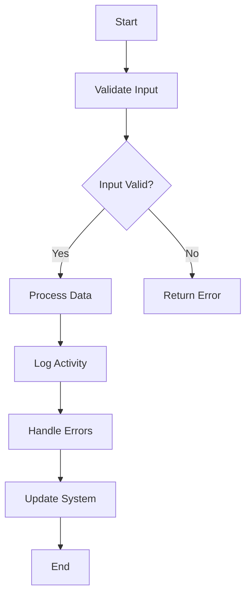

## 9.8 Secure Coding Practices in SQL Development

In the realm of SQL development, secure coding practices are paramount to safeguarding databases from vulnerabilities and ensuring robust data security. As expert software engineers and architects, we must be vigilant in implementing these practices to protect sensitive information and maintain the integrity of our systems. This section will delve into various secure coding practices, including data validation, error handling, auditing, and regular updates, providing comprehensive guidance to fortify your SQL applications.

### Understanding Secure Coding Practices

Secure coding practices in SQL development involve a set of guidelines and techniques aimed at minimizing security risks and vulnerabilities. These practices are essential for preventing unauthorized access, data breaches, and other malicious activities that could compromise the integrity and confidentiality of your database systems.

#### Key Concepts

- **Data Validation**: Ensuring that input data is correctly formatted and within expected parameters.
- **Error Handling**: Managing errors gracefully without exposing sensitive system details.
- **Auditing**: Keeping track of database access and changes for security reviews.
- **Regular Updates**: Applying patches and updates to databases and systems to address known vulnerabilities.

### Data Validation

Data validation is the process of ensuring that input data is accurate, complete, and secure before it is processed by the database. Proper data validation helps prevent SQL injection attacks and other forms of data corruption.

#### Techniques for Data Validation

1. **Input Sanitization**: Cleanse input data by removing or encoding potentially harmful characters. This prevents malicious code from being executed.

   ```sql
   -- Example of input sanitization using parameterized queries
   PREPARE stmt FROM 'SELECT * FROM users WHERE username = ?';
   SET @username = 'user_input';
   EXECUTE stmt USING @username;
   ```

2. **Data Type Validation**: Ensure that input data matches the expected data type. This prevents type-related vulnerabilities.

   ```sql
   -- Example of data type validation
   CREATE TABLE orders (
       order_id INT,
       order_date DATE,
       amount DECIMAL(10, 2)
   );
   ```

3. **Length and Format Checks**: Validate the length and format of input data to prevent buffer overflow and format string vulnerabilities.

   ```sql
   -- Example of length and format checks
   IF LENGTH(@username) > 50 THEN
       SIGNAL SQLSTATE '45000' SET MESSAGE_TEXT = 'Username too long';
   END IF;
   ```

4. **Whitelist Validation**: Use whitelists to allow only known good data. This is more secure than blacklisting known bad data.

   ```sql
   -- Example of whitelist validation
   IF @input NOT IN ('value1', 'value2', 'value3') THEN
       SIGNAL SQLSTATE '45000' SET MESSAGE_TEXT = 'Invalid input';
   END IF;
   ```

### Error Handling

Proper error handling is crucial for maintaining the security and stability of your SQL applications. It involves managing errors gracefully and ensuring that sensitive system details are not exposed to users.

#### Best Practices for Error Handling

1. **Generic Error Messages**: Avoid exposing detailed error messages to end-users. Instead, provide generic messages that do not reveal system information.

   ```sql
   -- Example of generic error message
   BEGIN
       -- Some SQL operation
   EXCEPTION
       WHEN OTHERS THEN
           SIGNAL SQLSTATE '45000' SET MESSAGE_TEXT = 'An error occurred. Please try again later.';
   END;
   ```

2. **Logging Errors**: Log detailed error information for internal review and debugging. Ensure that logs are stored securely and access is restricted.

   ```sql
   -- Example of logging errors
   BEGIN
       -- Some SQL operation
   EXCEPTION
       WHEN OTHERS THEN
           INSERT INTO error_log (error_message, error_time) VALUES (SQLERRM, CURRENT_TIMESTAMP);
   END;
   ```

3. **Graceful Degradation**: Design your application to continue functioning in a limited capacity even when errors occur. This improves user experience and system resilience.

   ```sql
   -- Example of graceful degradation
   BEGIN
       -- Primary operation
   EXCEPTION
       WHEN OTHERS THEN
           -- Fallback operation
   END;
   ```

### Auditing

Auditing involves tracking database access and changes to ensure accountability and facilitate security reviews. It is a critical component of secure coding practices.

#### Implementing Auditing

1. **Access Logs**: Maintain logs of all database access attempts, including successful and failed login attempts.

   ```sql
   -- Example of access logging
   CREATE TABLE access_log (
       user_id INT,
       access_time TIMESTAMP,
       success BOOLEAN
   );

   INSERT INTO access_log (user_id, access_time, success) VALUES (@user_id, CURRENT_TIMESTAMP, TRUE);
   ```

2. **Change Tracking**: Record changes to critical data, including who made the change and when it occurred.

   ```sql
   -- Example of change tracking
   CREATE TABLE change_log (
       table_name VARCHAR(255),
       change_time TIMESTAMP,
       changed_by VARCHAR(255),
       change_description TEXT
   );

   INSERT INTO change_log (table_name, change_time, changed_by, change_description)
   VALUES ('orders', CURRENT_TIMESTAMP, @username, 'Updated order amount');
   ```

3. **Regular Reviews**: Conduct regular reviews of audit logs to identify suspicious activities and ensure compliance with security policies.

### Regular Updates

Regularly updating your database systems and applications is essential for addressing known vulnerabilities and maintaining security.

#### Strategies for Regular Updates

1. **Patch Management**: Implement a patch management process to ensure that all systems are up-to-date with the latest security patches.

2. **Automated Updates**: Use automated tools to apply updates and patches to your database systems. This reduces the risk of human error and ensures timely updates.

3. **Testing Updates**: Test updates in a controlled environment before applying them to production systems. This helps identify potential issues and minimize downtime.

### Secure Coding Practices in Action

Let's explore a practical example of implementing secure coding practices in an SQL application.

#### Scenario: Secure User Registration

In this scenario, we will implement secure coding practices for a user registration feature in an SQL application.

1. **Data Validation**: Validate user input to ensure it meets the required criteria.

   ```sql
   -- Validate username and password
   IF LENGTH(@username) < 5 OR LENGTH(@username) > 20 THEN
       SIGNAL SQLSTATE '45000' SET MESSAGE_TEXT = 'Username must be between 5 and 20 characters';
   END IF;

   IF LENGTH(@password) < 8 THEN
       SIGNAL SQLSTATE '45000' SET MESSAGE_TEXT = 'Password must be at least 8 characters';
   END IF;
   ```

2. **Error Handling**: Handle errors gracefully and log them for review.

   ```sql
   -- Handle registration errors
   BEGIN
       -- Registration logic
   EXCEPTION
       WHEN OTHERS THEN
           INSERT INTO error_log (error_message, error_time) VALUES (SQLERRM, CURRENT_TIMESTAMP);
           SIGNAL SQLSTATE '45000' SET MESSAGE_TEXT = 'Registration failed. Please try again later.';
   END;
   ```

3. **Auditing**: Log successful and failed registration attempts for security reviews.

   ```sql
   -- Log registration attempts
   INSERT INTO registration_log (username, registration_time, success)
   VALUES (@username, CURRENT_TIMESTAMP, TRUE);
   ```

4. **Regular Updates**: Ensure that the application and database are regularly updated with the latest security patches.

### Visualizing Secure Coding Practices

To better understand the flow of secure coding practices, let's visualize the process using a Mermaid.js flowchart.



**Figure 1**: Flowchart illustrating the secure coding practices process.

### Try It Yourself

To reinforce your understanding of secure coding practices, try modifying the code examples provided. Experiment with different validation rules, error messages, and logging mechanisms to see how they affect the security and functionality of the application.

### References and Further Reading

- [OWASP SQL Injection Prevention Cheat Sheet](https://cheatsheetseries.owasp.org/cheatsheets/SQL_Injection_Prevention_Cheat_Sheet.html)
- [SQL Security Best Practices](https://www.microsoft.com/en-us/sql-server/sql-security)
- [Database Security: What You Need to Know](https://www.oracle.com/database/technologies/security.html)

### Knowledge Check

To test your understanding of secure coding practices, consider the following questions:

1. What is the primary purpose of data validation in SQL development?
2. How can error handling improve the security of an SQL application?
3. Why is auditing important for database security?
4. What are some strategies for ensuring regular updates to database systems?

### Embrace the Journey

Remember, mastering secure coding practices is an ongoing journey. As you continue to develop your skills, you'll build more secure and resilient SQL applications. Keep experimenting, stay curious, and enjoy the process of learning and improving your craft.

## Quiz Time!



### What is the primary purpose of data validation in SQL development?

- [x] To ensure input data is accurate and secure
- [ ] To improve database performance
- [ ] To simplify database queries
- [ ] To enhance user interface design

> **Explanation:** Data validation ensures that input data is accurate, complete, and secure, preventing SQL injection attacks and data corruption.


### How can error handling improve the security of an SQL application?

- [x] By preventing exposure of sensitive system details
- [ ] By increasing query execution speed
- [ ] By reducing database storage requirements
- [ ] By enhancing user interface aesthetics

> **Explanation:** Proper error handling prevents the exposure of sensitive system details to end-users, reducing security risks.


### Why is auditing important for database security?

- [x] It tracks database access and changes for security reviews
- [ ] It improves database query performance
- [ ] It simplifies database schema design
- [ ] It enhances user experience

> **Explanation:** Auditing tracks database access and changes, ensuring accountability and facilitating security reviews.


### What is a key benefit of regular updates in database systems?

- [x] Addressing known vulnerabilities
- [ ] Reducing database size
- [ ] Simplifying data queries
- [ ] Enhancing user interface design

> **Explanation:** Regular updates address known vulnerabilities, maintaining the security and integrity of database systems.


### Which technique is used to cleanse input data by removing harmful characters?

- [x] Input Sanitization
- [ ] Data Encryption
- [ ] Data Compression
- [ ] Data Replication

> **Explanation:** Input sanitization cleanses input data by removing or encoding potentially harmful characters, preventing malicious code execution.


### What is the purpose of logging errors in SQL applications?

- [x] To provide detailed error information for internal review
- [ ] To improve database query performance
- [ ] To reduce database storage requirements
- [ ] To enhance user interface aesthetics

> **Explanation:** Logging errors provides detailed error information for internal review and debugging, ensuring system stability.


### How can automated updates benefit database systems?

- [x] By reducing the risk of human error
- [ ] By increasing database storage capacity
- [ ] By simplifying database schema design
- [ ] By enhancing user interface design

> **Explanation:** Automated updates reduce the risk of human error and ensure timely application of security patches.


### What is the role of access logs in database security?

- [x] To maintain records of database access attempts
- [ ] To improve database query performance
- [ ] To simplify data queries
- [ ] To enhance user interface design

> **Explanation:** Access logs maintain records of database access attempts, ensuring accountability and facilitating security reviews.


### Which practice involves recording changes to critical data?

- [x] Change Tracking
- [ ] Data Encryption
- [ ] Data Compression
- [ ] Data Replication

> **Explanation:** Change tracking records changes to critical data, including who made the change and when it occurred, ensuring accountability.


### True or False: Secure coding practices are only necessary for large-scale database systems.

- [ ] True
- [x] False

> **Explanation:** Secure coding practices are essential for all database systems, regardless of size, to protect against vulnerabilities and ensure data security.




