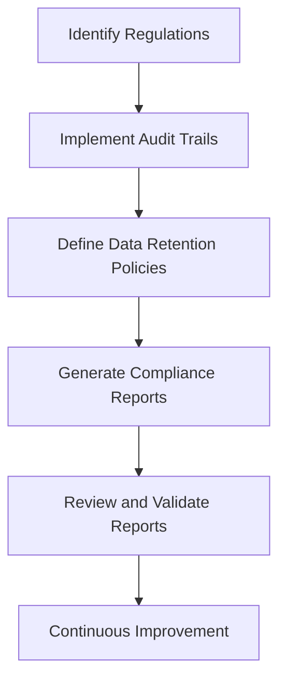

## 9.9 Auditing and Compliance Requirements

In today's data-driven world, ensuring that your SQL databases comply with various regulatory requirements is crucial. This section delves into the auditing and compliance requirements that expert software engineers and architects must consider when designing and managing SQL databases. We will explore key regulations such as GDPR, HIPAA, and SOX, discuss the importance of audit trails, data retention policies, and reporting, and provide practical guidance on implementing these requirements in your SQL systems.

### Understanding Key Regulations

#### General Data Protection Regulation (GDPR)

The GDPR is a comprehensive data protection regulation that applies to organizations operating within the European Union (EU) or handling the personal data of EU citizens. It emphasizes the protection of personal data and privacy, requiring organizations to implement robust data protection measures.

- **Key Requirements**: Data minimization, consent, data subject rights, breach notification, and data protection by design and by default.
- **Impact on SQL Databases**: Organizations must ensure that personal data stored in SQL databases is secure, access is controlled, and data processing activities are logged.

#### Health Insurance Portability and Accountability Act (HIPAA)

HIPAA is a U.S. regulation that sets standards for protecting sensitive patient health information. It applies to healthcare providers, health plans, and healthcare clearinghouses.

- **Key Requirements**: Privacy Rule, Security Rule, and Breach Notification Rule.
- **Impact on SQL Databases**: SQL databases storing protected health information (PHI) must implement access controls, audit controls, and data integrity measures.

#### Sarbanes-Oxley Act (SOX)

SOX is a U.S. law that aims to protect investors by improving the accuracy and reliability of corporate disclosures. It applies to publicly traded companies.

- **Key Requirements**: Internal controls, financial reporting, and audit trails.
- **Impact on SQL Databases**: SQL databases used for financial reporting must maintain accurate audit trails and ensure data integrity.

### Audit Trails: Maintaining Logs of Data Access and Modifications

Audit trails are essential for tracking data access and modifications in SQL databases. They provide a historical record of who accessed or modified data, when it occurred, and what changes were made. This is crucial for compliance with regulations like GDPR, HIPAA, and SOX.

#### Implementing Audit Trails in SQL

1. **Database Triggers**: Use triggers to automatically log changes to data. For example, a trigger can record changes to a table in an audit log table.

   ```sql
   CREATE TRIGGER audit_log_trigger
   AFTER INSERT OR UPDATE OR DELETE ON sensitive_data
   FOR EACH ROW
   BEGIN
       INSERT INTO audit_log (user_id, operation, timestamp, old_data, new_data)
       VALUES (USER(), 'INSERT', NOW(), OLD.data, NEW.data);
   END;
   ```

   > **Explanation**: This trigger logs every insert, update, or delete operation on the `sensitive_data` table, capturing the user, operation type, timestamp, and data changes.

2. **Change Data Capture (CDC)**: Use CDC features provided by some SQL databases to track changes to data in real-time.

3. **Database Logs**: Configure database logging to capture detailed information about data access and modifications.

#### Best Practices for Audit Trails

- **Granularity**: Determine the appropriate level of detail for audit logs based on compliance requirements and system performance considerations.
- **Security**: Protect audit logs from unauthorized access and tampering.
- **Retention**: Define retention policies for audit logs to comply with legal requirements and manage storage costs.

### Data Retention Policies: Complying with Legal Requirements for Data Storage

Data retention policies define how long data should be stored and when it should be deleted. Compliance with regulations like GDPR and HIPAA often requires organizations to implement specific data retention policies.

#### Designing Data Retention Policies

1. **Identify Data Types**: Classify data based on its sensitivity and regulatory requirements.

2. **Define Retention Periods**: Establish retention periods for each data type based on legal, business, and operational requirements.

3. **Automate Data Deletion**: Use SQL scripts or database features to automate the deletion of data that has exceeded its retention period.

   ```sql
   DELETE FROM user_data
   WHERE created_at < NOW() - INTERVAL '2 years';
   ```

   > **Explanation**: This SQL statement deletes user data that is older than two years, in accordance with a defined retention policy.

4. **Document Policies**: Clearly document data retention policies and communicate them to relevant stakeholders.

#### Challenges and Considerations

- **Balancing Compliance and Business Needs**: Ensure that data retention policies align with both compliance requirements and business needs.
- **Data Archiving**: Consider archiving data that is no longer needed for operational purposes but must be retained for compliance reasons.

### Reporting: Generating Compliance Reports for Auditors

Compliance reporting involves generating reports that demonstrate adherence to regulatory requirements. These reports are often required by auditors to verify compliance with regulations like GDPR, HIPAA, and SOX.

#### Creating Compliance Reports

1. **Identify Reporting Requirements**: Understand the specific reporting requirements for each regulation applicable to your organization.

2. **Design Report Templates**: Create standardized report templates that capture the necessary information for compliance verification.

3. **Automate Report Generation**: Use SQL queries and reporting tools to automate the generation of compliance reports.

   ```sql
   SELECT user_id, operation, timestamp
   FROM audit_log
   WHERE timestamp > NOW() - INTERVAL '1 month';
   ```

   > **Explanation**: This SQL query retrieves audit log entries from the past month, which can be used to generate a compliance report.

4. **Review and Validate Reports**: Regularly review and validate compliance reports to ensure accuracy and completeness.

#### Tools and Technologies for Compliance Reporting

- **SQL Reporting Tools**: Use SQL-based reporting tools like SQL Server Reporting Services (SSRS) or Oracle BI Publisher to create and distribute compliance reports.
- **Business Intelligence (BI) Tools**: Leverage BI tools like Tableau or Power BI to visualize compliance data and generate interactive reports.

### Visualizing Compliance Processes

To better understand the compliance processes, let's visualize the workflow of implementing auditing and compliance requirements in SQL databases.



> **Description**: This diagram illustrates the workflow for implementing auditing and compliance requirements in SQL databases, starting with identifying regulations and ending with continuous improvement.

### Try It Yourself

To deepen your understanding of auditing and compliance requirements, try modifying the code examples provided in this section. Experiment with different audit trail configurations, data retention policies, and compliance report templates to see how they impact your SQL database.

### References and Links

- [GDPR Overview](https://gdpr-info.eu/)
- [HIPAA Compliance](https://www.hhs.gov/hipaa/index.html)
- [SOX Compliance](https://www.sec.gov/spotlight/sarbanes-oxley.htm)
- [SQL Server Auditing](https://docs.microsoft.com/en-us/sql/relational-databases/security/auditing/sql-server-audit-database-engine)
- [Oracle Database Auditing](https://docs.oracle.com/en/database/oracle/oracle-database/19/dbseg/auditing-database-activity.html)

### Knowledge Check

- What are the key requirements of GDPR, HIPAA, and SOX?
- How can audit trails be implemented in SQL databases?
- What are the best practices for maintaining audit logs?
- How do data retention policies impact SQL database design?
- What tools can be used for generating compliance reports?

### Embrace the Journey

Remember, mastering auditing and compliance requirements is an ongoing journey. As regulations evolve and new technologies emerge, stay curious and continue to enhance your skills. By implementing robust auditing and compliance measures, you can ensure that your SQL databases remain secure and compliant with the latest regulations.

## Quiz Time!



### What is the primary purpose of GDPR?

- [x] To protect personal data and privacy of EU citizens
- [ ] To regulate financial reporting for publicly traded companies
- [ ] To set standards for protecting patient health information
- [ ] To improve corporate disclosures for investors

> **Explanation:** GDPR is focused on protecting personal data and privacy of EU citizens.

### Which regulation applies to healthcare providers in the U.S.?

- [ ] GDPR
- [x] HIPAA
- [ ] SOX
- [ ] CCPA

> **Explanation:** HIPAA sets standards for protecting sensitive patient health information in the U.S.

### What is a key feature of audit trails in SQL databases?

- [x] Tracking data access and modifications
- [ ] Encrypting data at rest
- [ ] Automating data deletion
- [ ] Generating financial reports

> **Explanation:** Audit trails track data access and modifications, providing a historical record of changes.

### How can data retention policies be automated in SQL?

- [ ] By encrypting data
- [ ] By using database triggers
- [x] By using SQL scripts to delete old data
- [ ] By generating compliance reports

> **Explanation:** SQL scripts can automate the deletion of data that has exceeded its retention period.

### What is the purpose of compliance reporting?

- [ ] To encrypt sensitive data
- [x] To demonstrate adherence to regulatory requirements
- [ ] To automate data deletion
- [ ] To track data access and modifications

> **Explanation:** Compliance reporting demonstrates adherence to regulatory requirements.

### Which tool can be used for SQL-based reporting?

- [x] SQL Server Reporting Services (SSRS)
- [ ] Tableau
- [ ] Power BI
- [ ] Excel

> **Explanation:** SQL Server Reporting Services (SSRS) is a SQL-based reporting tool.

### What is a challenge in designing data retention policies?

- [ ] Encrypting data at rest
- [ ] Generating compliance reports
- [x] Balancing compliance and business needs
- [ ] Tracking data access and modifications

> **Explanation:** Balancing compliance and business needs is a challenge in designing data retention policies.

### What is a best practice for maintaining audit logs?

- [ ] Encrypting data at rest
- [x] Protecting logs from unauthorized access
- [ ] Automating data deletion
- [ ] Generating compliance reports

> **Explanation:** Protecting audit logs from unauthorized access is a best practice.

### Which regulation requires maintaining accurate audit trails for financial reporting?

- [ ] GDPR
- [ ] HIPAA
- [x] SOX
- [ ] CCPA

> **Explanation:** SOX requires maintaining accurate audit trails for financial reporting.

### True or False: GDPR applies only to organizations within the EU.

- [ ] True
- [x] False

> **Explanation:** GDPR applies to any organization handling the personal data of EU citizens, regardless of location.


