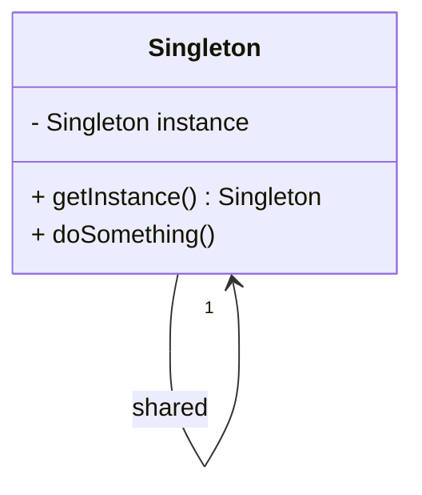

## 1.1 What Are Design Patterns in Swift?

Design patterns are a crucial part of software engineering, offering time-tested solutions to common problems encountered during software development. They provide a shared language for developers, allowing for more efficient communication and collaboration. In this section, we will delve into the definition of design patterns, their relevance in Swift, and their purpose in creating clean, efficient, and maintainable code.

### Definition of Design Patterns

Design patterns are reusable solutions to common problems in software design. They are not finished designs that can be directly transformed into code but rather templates for how to solve a problem in various situations. Design patterns help streamline the development process by providing a proven approach to solving recurring issues, thereby improving code readability and reducing errors.

#### Key Characteristics of Design Patterns

1. **Reusability**: Patterns can be applied to different problems across various projects, enhancing code reuse.
2. **Scalability**: They offer solutions that can be scaled up or down depending on the complexity of the application.
3. **Maintainability**: Patterns promote clean and organized code, making it easier to maintain and update.
4. **Understandability**: They provide a common vocabulary for developers, facilitating better communication and understanding.

### Relevance in Swift

Swift, Apple's powerful and intuitive programming language, has its unique set of features that influence how design patterns are implemented. Swift's type safety, optionals, and protocol-oriented programming (POP) paradigm can both simplify and complicate the implementation of classic design patterns.

#### Swift's Unique Features Impacting Design Patterns

- **Type Safety and Optionals**: Swift's type system and optionals ensure that code is safe and less prone to runtime errors. This influences how patterns like Singleton and Factory are implemented, as they can leverage Swift's strong type-checking.
  
- **Protocol-Oriented Programming**: Swift's emphasis on protocols over inheritance changes how patterns like Strategy and Observer are implemented, often leading to more flexible and reusable code.

- **Value Types and Reference Types**: Understanding when to use structs (value types) versus classes (reference types) is crucial in implementing patterns effectively in Swift.

#### Example: Singleton Pattern in Swift

The Singleton pattern ensures a class has only one instance and provides a global point of access to it. In Swift, the Singleton pattern is implemented using a static constant, leveraging Swift's lazy initialization of static properties.

```swift
class Singleton {
    static let shared = Singleton()

    private init() {
        // Private initialization to ensure just one instance is created.
    }

    func doSomething() {
        print("Singleton instance is doing something!")
    }
}

// Usage
Singleton.shared.doSomething()
```

### Purpose of Design Patterns in Swift

Understanding and utilizing design patterns in Swift is essential for writing clean, efficient, and maintainable code. Design patterns help developers anticipate and solve complex problems by providing a structured approach to software design. They also promote best practices and standardization across projects.

#### Benefits of Using Design Patterns in Swift

1. **Improved Code Quality**: Patterns lead to cleaner and more organized code, making it easier to read and understand.
2. **Enhanced Collaboration**: A shared understanding of design patterns allows teams to communicate more effectively and work together seamlessly.
3. **Faster Development**: By using proven solutions, developers can save time and reduce the risk of introducing errors.
4. **Scalability and Flexibility**: Patterns provide a foundation for building scalable and flexible applications that can adapt to changing requirements.

### Visualizing Design Patterns

To better understand how design patterns function, let's visualize the Singleton pattern using a class diagram. This will help illustrate the relationship between the Singleton class and its instance.



**Diagram Explanation**: This class diagram represents the Singleton pattern. The `Singleton` class has a private static instance and a public method `getInstance()` that returns this instance. The `doSomething()` method is a placeholder for any functionality the Singleton might provide.

### Try It Yourself

To deepen your understanding, try modifying the Singleton pattern example. For instance, add a method that tracks how many times the Singleton instance has been accessed. This will give you hands-on experience with how the pattern works in Swift.

### References and Further Reading

For more in-depth information on design patterns, consider exploring the following resources:

- [Design Patterns: Elements of Reusable Object-Oriented Software](https://www.amazon.com/Design-Patterns-Elements-Reusable-Object-Oriented/dp/0201633612) by Erich Gamma, Richard Helm, Ralph Johnson, and John Vlissides.
- [Swift.org](https://swift.org/) for official Swift documentation and resources.
- [Apple Developer Documentation](https://developer.apple.com/documentation/) for insights into Swift and iOS development.

### Knowledge Check

Before we wrap up, let's pose a few questions to reinforce your understanding:

- What are the main benefits of using design patterns in Swift?
- How does Swift's protocol-oriented programming influence design patterns?
- Can you describe how the Singleton pattern is implemented in Swift?

### Embrace the Journey

Remember, mastering design patterns is a journey. As you progress, you'll find that these patterns become second nature, allowing you to build more complex and robust applications. Keep experimenting, stay curious, and enjoy the journey!

## Quiz Time!



### What is the primary purpose of design patterns in software development?

- [x] To provide reusable solutions to common problems
- [ ] To increase the complexity of code
- [ ] To replace the need for documentation
- [ ] To ensure code runs faster

> **Explanation:** Design patterns offer reusable solutions to common problems, improving code quality and maintainability.

### How does Swift's protocol-oriented programming paradigm affect design patterns?

- [x] It encourages the use of protocols over inheritance
- [ ] It makes patterns less relevant
- [ ] It complicates pattern implementation
- [ ] It has no effect on patterns

> **Explanation:** Swift's protocol-oriented programming encourages using protocols over inheritance, affecting how patterns like Strategy and Observer are implemented.

### What is a key characteristic of the Singleton pattern?

- [x] It ensures a class has only one instance
- [ ] It allows multiple instances of a class
- [ ] It is used for database connections
- [ ] It is a form of inheritance

> **Explanation:** The Singleton pattern ensures a class has only one instance and provides a global point of access to it.

### In Swift, how is the Singleton pattern typically implemented?

- [x] Using a static constant
- [ ] Using a global variable
- [ ] Through inheritance
- [ ] With a protocol

> **Explanation:** In Swift, the Singleton pattern is implemented using a static constant, which leverages lazy initialization.

### Which Swift feature enhances the safety of design pattern implementations?

- [x] Type safety and optionals
- [ ] Dynamic typing
- [ ] Lack of memory management
- [ ] Weak typing

> **Explanation:** Swift's type safety and optionals enhance the safety of design pattern implementations by reducing runtime errors.

### What is a benefit of using design patterns in Swift?

- [x] Improved code quality
- [ ] Increased code complexity
- [ ] Reduced code readability
- [ ] Longer development time

> **Explanation:** Design patterns improve code quality by promoting clean and organized code.

### What does the Singleton pattern provide in terms of access?

- [x] A global point of access to a single instance
- [ ] Multiple access points to different instances
- [ ] No access to the instance
- [ ] Access to multiple instances

> **Explanation:** The Singleton pattern provides a global point of access to a single instance of a class.

### Why is protocol-oriented programming significant in Swift?

- [x] It promotes flexibility and reusability
- [ ] It limits code reuse
- [ ] It discourages the use of protocols
- [ ] It enforces inheritance

> **Explanation:** Protocol-oriented programming in Swift promotes flexibility and reusability, influencing how design patterns are implemented.

### What is the role of design patterns in software architecture?

- [x] They provide a structured approach to solving problems
- [ ] They replace the need for architecture
- [ ] They complicate architectural decisions
- [ ] They are irrelevant to architecture

> **Explanation:** Design patterns provide a structured approach to solving common software design problems, aiding in architectural decisions.

### True or False: Design patterns can be directly transformed into code.

- [ ] True
- [x] False

> **Explanation:** Design patterns are templates for solving problems and cannot be directly transformed into code; they guide the design process.


