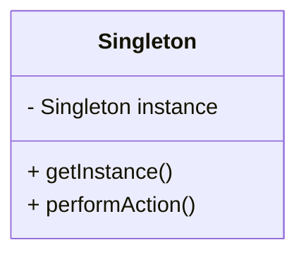
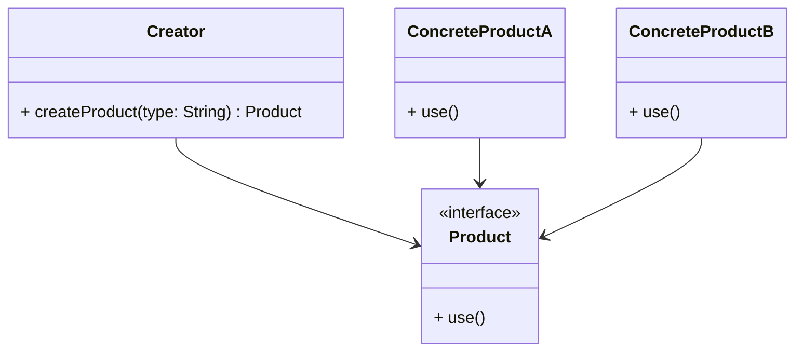
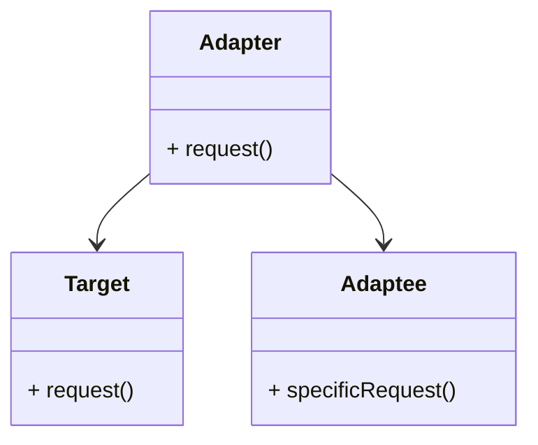

## 1.2 Types of Design Patterns in Swift

In the realm of software development, design patterns serve as indispensable tools for creating robust, scalable, and maintainable applications. Swift, Apple's powerful programming language, provides a unique landscape for implementing these patterns, thanks to its modern syntax and features. In this section, we will delve into the different types of design patterns in Swift, categorized into Creational, Structural, Behavioral, and Swift-Specific patterns. Each category addresses distinct challenges in software design, offering solutions that streamline development processes.

### Creational Patterns

Creational design patterns are concerned with the process of object creation. They abstract the instantiation process, making it more adaptable and scalable. Let's explore some of the key creational patterns in Swift:

#### Singleton Pattern

- **Intent**: Ensure a class has only one instance and provide a global point of access to it.
- **Key Participants**: Singleton class, global access point.
- **Applicability**: Use when exactly one instance of a class is needed, such as a shared resource manager or configuration handler.

```swift
class Singleton {
    static let shared = Singleton()
    
    private init() {
        // Private initialization to ensure just one instance is created.
    }
    
    func performAction() {
        print("Singleton action performed.")
    }
}

// Usage
Singleton.shared.performAction()
```

#### Factory Method Pattern

- **Intent**: Define an interface for creating an object, but let subclasses alter the type of objects that will be created.
- **Key Participants**: Creator, ConcreteCreator, Product, ConcreteProduct.
- **Applicability**: Use when a class cannot anticipate the class of objects it must create.

```swift
protocol Product {
    func use()
}

class ConcreteProductA: Product {
    func use() {
        print("Using Product A")
    }
}

class ConcreteProductB: Product {
    func use() {
        print("Using Product B")
    }
}

class Creator {
    func createProduct(type: String) -> Product {
        switch type {
        case "A":
            return ConcreteProductA()
        case "B":
            return ConcreteProductB()
        default:
            fatalError("Unknown product type")
        }
    }
}

// Usage
let creator = Creator()
let product = creator.createProduct(type: "A")
product.use()
```

#### Abstract Factory Pattern

- **Intent**: Provide an interface for creating families of related or dependent objects without specifying their concrete classes.
- **Key Participants**: AbstractFactory, ConcreteFactory, AbstractProduct, ConcreteProduct.
- **Applicability**: Use when a system should be independent of how its products are created, composed, and represented.

```swift
protocol Button {
    func click()
}

class WindowsButton: Button {
    func click() {
        print("Windows Button clicked")
    }
}

class MacButton: Button {
    func click() {
        print("Mac Button clicked")
    }
}

protocol GUIFactory {
    func createButton() -> Button
}

class WindowsFactory: GUIFactory {
    func createButton() -> Button {
        return WindowsButton()
    }
}

class MacFactory: GUIFactory {
    func createButton() -> Button {
        return MacButton()
    }
}

// Usage
let factory: GUIFactory = MacFactory()
let button = factory.createButton()
button.click()
```

### Structural Patterns

Structural design patterns are concerned with object composition and the relationships between objects. They help ensure that if one part of a system changes, the entire system doesn't need to change. Let's examine some of the key structural patterns in Swift:

#### Adapter Pattern

- **Intent**: Convert the interface of a class into another interface clients expect. Adapter lets classes work together that couldn't otherwise because of incompatible interfaces.
- **Key Participants**: Target, Adapter, Adaptee, Client.
- **Applicability**: Use when you want to use an existing class, and its interface does not match the one you need.

```swift
protocol Target {
    func request()
}

class Adaptee {
    func specificRequest() {
        print("Specific request")
    }
}

class Adapter: Target {
    private var adaptee: Adaptee
    
    init(adaptee: Adaptee) {
        self.adaptee = adaptee
    }
    
    func request() {
        adaptee.specificRequest()
    }
}

// Usage
let adaptee = Adaptee()
let adapter = Adapter(adaptee: adaptee)
adapter.request()
```

#### Composite Pattern

- **Intent**: Compose objects into tree structures to represent part-whole hierarchies. Composite lets clients treat individual objects and compositions of objects uniformly.
- **Key Participants**: Component, Leaf, Composite.
- **Applicability**: Use when you want to represent part-whole hierarchies of objects.

```swift
protocol Component {
    func operation()
}

class Leaf: Component {
    func operation() {
        print("Leaf operation")
    }
}

class Composite: Component {
    private var children = [Component]()
    
    func add(component: Component) {
        children.append(component)
    }
    
    func operation() {
        print("Composite operation")
        for child in children {
            child.operation()
        }
    }
}

// Usage
let leaf1 = Leaf()
let leaf2 = Leaf()
let composite = Composite()
composite.add(component: leaf1)
composite.add(component: leaf2)
composite.operation()
```

### Behavioral Patterns

Behavioral design patterns are concerned with algorithms and the assignment of responsibilities between objects. They help in defining how objects interact in a system. Let's dive into some of the key behavioral patterns in Swift:

#### Observer Pattern

- **Intent**: Define a one-to-many dependency between objects so that when one object changes state, all its dependents are notified and updated automatically.
- **Key Participants**: Subject, Observer.
- **Applicability**: Use when a change to one object requires changing others, and you don't know how many objects need to be changed.

```swift
protocol Observer: AnyObject {
    func update(subject: Subject)
}

class Subject {
    private lazy var observers = [Observer]()
    
    func attach(_ observer: Observer) {
        observers.append(observer)
    }
    
    func detach(_ observer: Observer) {
        observers = observers.filter { $0 !== observer }
    }
    
    func notify() {
        observers.forEach { $0.update(subject: self) }
    }
    
    var state: Int = { didSet { notify() } }()
}

class ConcreteObserver: Observer {
    func update(subject: Subject) {
        print("Observer: Subject's state is now \\(subject.state)")
    }
}

// Usage
let subject = Subject()
let observer = ConcreteObserver()

subject.attach(observer)
subject.state = 10
```

#### Strategy Pattern

- **Intent**: Define a family of algorithms, encapsulate each one, and make them interchangeable. Strategy lets the algorithm vary independently from clients that use it.
- **Key Participants**: Context, Strategy, ConcreteStrategy.
- **Applicability**: Use when you want to define a class that can change its behavior dynamically.

```swift
protocol Strategy {
    func execute()
}

class ConcreteStrategyA: Strategy {
    func execute() {
        print("Executing strategy A")
    }
}

class ConcreteStrategyB: Strategy {
    func execute() {
        print("Executing strategy B")
    }
}

class Context {
    private var strategy: Strategy
    
    init(strategy: Strategy) {
        self.strategy = strategy
    }
    
    func setStrategy(strategy: Strategy) {
        self.strategy = strategy
    }
    
    func executeStrategy() {
        strategy.execute()
    }
}

// Usage
let context = Context(strategy: ConcreteStrategyA())
context.executeStrategy()

context.setStrategy(strategy: ConcreteStrategyB())
context.executeStrategy()
```

### Swift-Specific Patterns

Swift's unique features, such as its type system and protocol-oriented programming, allow for the creation of patterns specific to Swift. These patterns leverage Swift's strengths to solve common problems in a more idiomatic way.

#### Protocol-Oriented Programming

- **Intent**: Use protocols to define blueprints of methods, properties, and other requirements that suit a particular task or piece of functionality.
- **Key Participants**: Protocols, Extensions.
- **Applicability**: Use when you want to define shared behavior across multiple types.

```swift
protocol Drivable {
    func drive()
}

extension Drivable {
    func drive() {
        print("Driving...")
    }
}

struct Car: Drivable {}
struct Bike: Drivable {}

// Usage
let car = Car()
car.drive()

let bike = Bike()
bike.drive()
```

#### Value Semantics with Structs

- **Intent**: Use structs to take advantage of value semantics, ensuring that data is copied rather than referenced.
- **Key Participants**: Structs.
- **Applicability**: Use when you want to ensure that data is immutable and copied on assignment.

```swift
struct Point {
    var x: Int
    var y: Int
}

// Usage
var point1 = Point(x: 0, y: 0)
var point2 = point1

point2.x = 10

print(point1.x) // Outputs: 0
print(point2.x) // Outputs: 10
```

### Visualizing Design Patterns

To better understand the relationships and interactions between these design patterns, let's visualize them using Mermaid.js diagrams.

#### Singleton Pattern Diagram



#### Factory Method Pattern Diagram



#### Adapter Pattern Diagram



### Try It Yourself

Now that we've explored these patterns, try modifying the code examples to better understand their flexibility and power. For instance, in the Strategy pattern, create a new strategy and see how the `Context` class adapts to it. Experiment with adding new methods to the `Drivable` protocol and observe how it affects the conforming types.

### References and Links

For further reading on design patterns in Swift, consider exploring the following resources:

- [Swift.org](https://swift.org/documentation/)
- [Apple Developer Documentation](https://developer.apple.com/documentation/swift)
- [Design Patterns: Elements of Reusable Object-Oriented Software](https://en.wikipedia.org/wiki/Design_Patterns)

### Knowledge Check

To reinforce your understanding, consider the following questions:

- How does the Singleton pattern ensure only one instance of a class is created?
- What are the benefits of using the Factory Method pattern?
- When would you use the Adapter pattern in a project?
- How do protocols in Swift enable protocol-oriented programming?

### Embrace the Journey

Remember, mastering design patterns in Swift is a journey. As you continue to explore and implement these patterns, you'll find your development skills growing stronger. Keep experimenting, stay curious, and enjoy the process of building robust applications.

## Quiz Time!



### What is the primary intent of creational design patterns?

- [x] To abstract the instantiation process of objects.
- [ ] To define the communication between objects.
- [ ] To manage the composition of objects.
- [ ] To handle object destruction.

> **Explanation:** Creational design patterns focus on abstracting the process of object creation, making it more adaptable and scalable.

### Which pattern ensures that a class has only one instance?

- [x] Singleton
- [ ] Factory Method
- [ ] Adapter
- [ ] Observer

> **Explanation:** The Singleton pattern ensures that a class has only one instance and provides a global point of access to it.

### In which scenario would you use the Adapter pattern?

- [x] When you want to use an existing class with an incompatible interface.
- [ ] When you need to create a new family of related objects.
- [ ] When you want to define a class that can change its behavior dynamically.
- [ ] When you need to notify multiple objects about a change in state.

> **Explanation:** The Adapter pattern is used to convert the interface of a class into another interface that clients expect, allowing incompatible interfaces to work together.

### What is the role of the ConcreteFactory in the Abstract Factory pattern?

- [x] To implement the operations to create concrete products.
- [ ] To define the interface for creating objects.
- [ ] To manage the lifecycle of a single instance.
- [ ] To encapsulate a family of algorithms.

> **Explanation:** In the Abstract Factory pattern, the ConcreteFactory implements the operations to create concrete products.

### How do protocols in Swift enable protocol-oriented programming?

- [x] By defining blueprints of methods and properties that can be adopted by classes, structs, and enums.
- [ ] By providing a single instance of a class.
- [ ] By managing the composition of objects.
- [ ] By encapsulating a family of algorithms.

> **Explanation:** Protocols in Swift define blueprints of methods, properties, and other requirements that can be adopted by classes, structs, and enums, enabling protocol-oriented programming.

### Which pattern is concerned with the assignment of responsibilities between objects?

- [ ] Creational Patterns
- [ ] Structural Patterns
- [x] Behavioral Patterns
- [ ] Swift-Specific Patterns

> **Explanation:** Behavioral patterns are concerned with algorithms and the assignment of responsibilities between objects.

### What is the primary benefit of using the Composite pattern?

- [x] It allows clients to treat individual objects and compositions of objects uniformly.
- [ ] It ensures a class has only one instance.
- [ ] It defines a family of algorithms.
- [ ] It converts the interface of a class into another interface.

> **Explanation:** The Composite pattern allows clients to treat individual objects and compositions of objects uniformly, representing part-whole hierarchies.

### What is the purpose of the Strategy pattern?

- [x] To define a family of algorithms and make them interchangeable.
- [ ] To notify multiple objects about a change in state.
- [ ] To convert the interface of a class into another interface.
- [ ] To ensure a class has only one instance.

> **Explanation:** The Strategy pattern defines a family of algorithms, encapsulates each one, and makes them interchangeable, allowing the algorithm to vary independently from clients that use it.

### What is a key feature of Swift's value semantics?

- [x] Data is copied rather than referenced.
- [ ] Data is referenced rather than copied.
- [ ] Objects are created using a factory method.
- [ ] Interfaces are converted using an adapter.

> **Explanation:** Swift's value semantics ensure that data is copied rather than referenced, promoting immutability and safety.

### True or False: The Factory Method pattern is used to ensure a class has only one instance.

- [ ] True
- [x] False

> **Explanation:** False. The Factory Method pattern is used to define an interface for creating an object, allowing subclasses to alter the type of objects that will be created. The Singleton pattern is used to ensure a class has only one instance.






