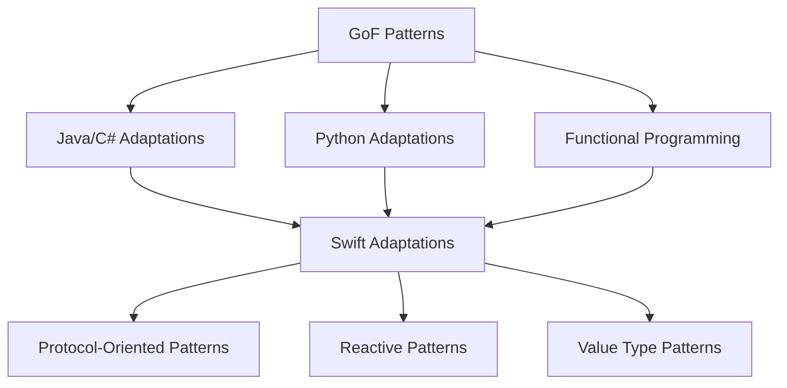

## 1.3 History and Evolution of Design Patterns

Design patterns have become a cornerstone in software engineering, providing solutions to common problems and promoting best practices. Let's delve into the history and evolution of design patterns, from their origins with the "Gang of Four" to their current adaptations in Swift programming.

### Origins: Introduction of Design Patterns by the "Gang of Four" (GoF)

The concept of design patterns was popularized by the seminal work of Erich Gamma, Richard Helm, Ralph Johnson, and John Vlissides, collectively known as the "Gang of Four" (GoF). Their book, *Design Patterns: Elements of Reusable Object-Oriented Software*, published in 1994, introduced 23 classic design patterns that addressed recurring design problems in object-oriented software development.

#### Key Contributions of the GoF

1. **Standardization of Terminology**: The GoF established a common vocabulary for software designers, enabling clearer communication and understanding of design solutions.

2. **Pattern Structure**: Each pattern was described in terms of its intent, applicability, structure, participants, collaborations, consequences, and implementation. This structured approach made it easier for developers to understand and apply patterns.

3. **Focus on Reusability**: The GoF emphasized creating reusable solutions that could be adapted to different contexts, promoting software modularity and maintainability.

4. **Object-Oriented Design**: The patterns were grounded in object-oriented principles, focusing on class and object composition, inheritance, and polymorphism.

### Evolution in Programming Languages

As programming languages have evolved, so too have design patterns. The principles outlined by the GoF have been adapted and extended to fit the paradigms and features of modern languages.

#### Adapting Patterns to New Paradigms

1. **Functional Programming**: With the rise of functional programming languages like Haskell and Scala, patterns have been reinterpreted to fit functional paradigms. For instance, the Strategy pattern can be implemented using higher-order functions.

2. **Concurrent and Parallel Programming**: Patterns have been adapted to address the challenges of concurrent and parallel programming, such as the Actor model in languages like Erlang and Akka.

3. **Reactive Programming**: The Observer pattern has evolved into more sophisticated reactive programming models, as seen in frameworks like RxJava and Swift's Combine.

#### Language-Specific Adaptations

1. **Java**: Java's strong typing and object-oriented nature made it a natural fit for GoF patterns, leading to widespread adoption and further development of patterns like Singleton and Factory.

2. **C#**: With its support for delegates and events, C# introduced new ways to implement patterns, enhancing flexibility and reducing boilerplate code.

3. **Python**: Python's dynamic typing and metaprogramming capabilities have allowed for more concise and expressive pattern implementations, often using decorators and context managers.

### Design Patterns in Swift

Swift, as a modern programming language, brings its own set of features and paradigms that influence how design patterns are implemented and utilized.

#### Swift's Unique Features

1. **Protocol-Oriented Programming (POP)**: Swift emphasizes protocols over inheritance, leading to a shift from class-based patterns to protocol-based patterns. This aligns with Swift's goal of promoting flexibility and composability.

2. **Value Types**: Swift's preference for value types (structs and enums) over reference types (classes) affects patterns like Singleton and Observer, which traditionally rely on shared state.

3. **Optionals and Type Safety**: Swift's strong type system and use of optionals encourage safer and more predictable pattern implementations, reducing runtime errors.

4. **Functional Programming Elements**: Swift's support for closures and higher-order functions enables functional approaches to patterns like Strategy and Command.

#### Integration and Adaptation in Swift Development

1. **Singleton Pattern**: In Swift, Singletons are often implemented using static properties, ensuring thread safety and lazy initialization.

   ```swift
   class Logger {
       static let shared = Logger()
       private init() {} // Private initializer to prevent multiple instances
   }
   ```

2. **Observer Pattern**: Swift's Combine framework provides a modern approach to the Observer pattern, allowing for reactive programming with publishers and subscribers.

   ```swift
   import Combine

   class WeatherStation {
       @Published var temperature: Double = 0.0
   }

   let station = WeatherStation()
   let cancellable = station.$temperature.sink { newTemperature in
       print("Temperature changed to \\(newTemperature)")
   }
   ```

3. **Factory Pattern**: Swift's use of protocols and generics allows for flexible and type-safe factory implementations.

   ```swift
   protocol Animal {
       func makeSound()
   }

   class Dog: Animal {
       func makeSound() {
           print("Woof!")
       }
   }

   class Cat: Animal {
       func makeSound() {
           print("Meow!")
       }
   }

   class AnimalFactory {
       static func createAnimal(ofType type: String) -> Animal? {
           switch type {
           case "Dog":
               return Dog()
           case "Cat":
               return Cat()
           default:
               return nil
           }
       }
   }
   ```

4. **Decorator Pattern**: Swift's extensions and protocol extensions provide a natural way to implement the Decorator pattern, enhancing functionality without altering existing code.

   ```swift
   protocol Coffee {
       func cost() -> Double
       func description() -> String
   }

   class SimpleCoffee: Coffee {
       func cost() -> Double { return 2.0 }
       func description() -> String { return "Simple Coffee" }
   }

   class MilkDecorator: Coffee {
       private let decoratedCoffee: Coffee

       init(decoratedCoffee: Coffee) {
           self.decoratedCoffee = decoratedCoffee
       }

       func cost() -> Double {
           return decoratedCoffee.cost() + 0.5
       }

       func description() -> String {
           return decoratedCoffee.description() + ", Milk"
       }
   }

   let coffee = SimpleCoffee()
   let milkCoffee = MilkDecorator(decoratedCoffee: coffee)
   print(milkCoffee.description()) // Simple Coffee, Milk
   print(milkCoffee.cost()) // 2.5
   ```

### Visualizing the Evolution of Design Patterns

To better understand the evolution of design patterns, let's visualize the transition from GoF patterns to their modern adaptations in Swift.



**Diagram Description**: This diagram illustrates the flow of design pattern evolution from the original GoF patterns to their adaptations in various languages and paradigms, culminating in the unique adaptations found in Swift.

### Knowledge Check

Let's reinforce our understanding with some key takeaways:

- The "Gang of Four" laid the foundation for design patterns, providing a structured approach to solving common design problems.
- As programming languages evolved, design patterns were adapted to fit new paradigms, such as functional and reactive programming.
- Swift's unique features, such as protocol-oriented programming and value types, have influenced the way design patterns are implemented and utilized.
- Modern Swift development often involves integrating classic patterns with Swift's language features to create flexible and efficient solutions.

### Try It Yourself

Experiment with the code examples provided. Try modifying the `AnimalFactory` to include a new animal type, or extend the `MilkDecorator` to add more features like `SugarDecorator`. This hands-on approach will help solidify your understanding of how design patterns can be adapted and extended in Swift.

### References and Further Reading

For further exploration, consider the following resources:

- [Design Patterns: Elements of Reusable Object-Oriented Software](https://en.wikipedia.org/wiki/Design_Patterns) by the Gang of Four
- [Swift.org](https://swift.org) for official Swift documentation
- [Combine Framework Documentation](https://developer.apple.com/documentation/combine) for insights into reactive programming in Swift

### Embrace the Journey

Remember, mastering design patterns is a journey. As you continue to explore and experiment with these patterns in Swift, you'll gain deeper insights into their power and flexibility. Stay curious, keep experimenting, and enjoy the process of becoming a more proficient Swift developer.

## Quiz Time!



### Who are the "Gang of Four"?

- [x] Erich Gamma, Richard Helm, Ralph Johnson, John Vlissides
- [ ] Alan Turing, Ada Lovelace, Grace Hopper, Tim Berners-Lee
- [ ] Steve Jobs, Bill Gates, Mark Zuckerberg, Elon Musk
- [ ] Linus Torvalds, Guido van Rossum, James Gosling, Bjarne Stroustrup

> **Explanation:** The "Gang of Four" refers to Erich Gamma, Richard Helm, Ralph Johnson, and John Vlissides, who authored the book on design patterns.

### What is a key feature of Swift that influences design patterns?

- [x] Protocol-Oriented Programming
- [ ] Dynamic Typing
- [ ] Manual Memory Management
- [ ] Lack of Generics

> **Explanation:** Swift emphasizes Protocol-Oriented Programming, which significantly influences how design patterns are implemented.

### Which pattern is commonly adapted for reactive programming in Swift?

- [x] Observer Pattern
- [ ] Singleton Pattern
- [ ] Factory Pattern
- [ ] Decorator Pattern

> **Explanation:** The Observer Pattern is commonly adapted for reactive programming using frameworks like Combine in Swift.

### How does Swift's use of value types affect design patterns?

- [x] It promotes the use of patterns that avoid shared state.
- [ ] It requires all patterns to be implemented using classes.
- [ ] It eliminates the need for design patterns.
- [ ] It complicates the implementation of all design patterns.

> **Explanation:** Swift's preference for value types encourages patterns that avoid shared state, promoting immutability and safety.

### In which year was the GoF book published?

- [x] 1994
- [ ] 1984
- [ ] 2004
- [ ] 2014

> **Explanation:** The GoF book, *Design Patterns: Elements of Reusable Object-Oriented Software*, was published in 1994.

### What is a common adaptation of the Singleton pattern in Swift?

- [x] Using static properties for thread safety and lazy initialization
- [ ] Implementing it with global variables
- [ ] Using dynamic typing to create instances
- [ ] Avoiding its use entirely

> **Explanation:** In Swift, Singletons are often implemented using static properties to ensure thread safety and lazy initialization.

### Which Swift feature allows for functional approaches to design patterns?

- [x] Closures and Higher-Order Functions
- [ ] Manual Memory Management
- [ ] Lack of Type Safety
- [ ] Dynamic Typing

> **Explanation:** Swift's support for closures and higher-order functions enables functional approaches to design patterns.

### What does the Decorator pattern in Swift typically use?

- [x] Extensions and Protocol Extensions
- [ ] Global Variables
- [ ] Dynamic Typing
- [ ] Manual Memory Management

> **Explanation:** Swift's extensions and protocol extensions provide a natural way to implement the Decorator pattern.

### What is the focus of the GoF book?

- [x] Reusable solutions to common design problems
- [ ] Specific language syntax and features
- [ ] Database optimization techniques
- [ ] Front-end development practices

> **Explanation:** The GoF book focuses on providing reusable solutions to common design problems in software development.

### True or False: Design patterns eliminate the need for understanding the underlying language features.

- [ ] True
- [x] False

> **Explanation:** Understanding the underlying language features is crucial for effectively implementing and adapting design patterns.




