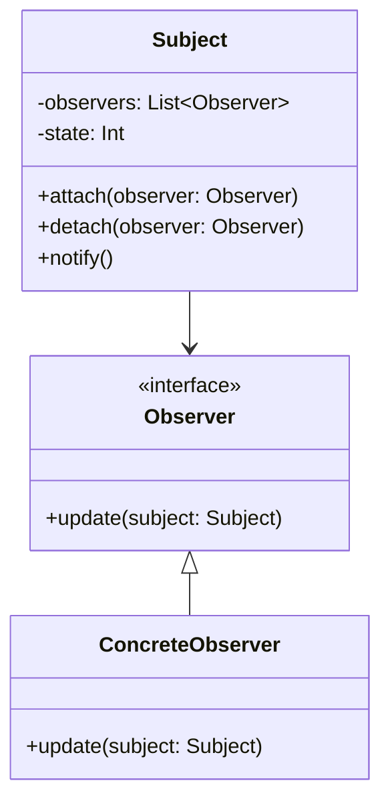

## 1.4 Importance of Design Patterns in iOS, macOS, and Server-Side Development

Design patterns are essential in the realm of software development, offering a blueprint for solving common design problems. They play a pivotal role in iOS, macOS, and server-side development, particularly when using Swift. Let's explore how design patterns enhance code reusability, improve maintainability, facilitate team collaboration, and are applied in real-world applications.

### Enhancing Code Reusability

Design patterns embody the DRY (Don't Repeat Yourself) principle, which is a cornerstone of efficient software development. By encapsulating best practices and proven solutions, design patterns allow developers to reuse code across different parts of an application or even across different projects. This not only saves time but also reduces the likelihood of introducing errors.

#### Example: Singleton Pattern in iOS

The Singleton pattern ensures that a class has only one instance and provides a global point of access to it. This is particularly useful in iOS development for managing shared resources such as network managers or database connections.

```swift
class NetworkManager {
    static let shared = NetworkManager()
    
    private init() {
        // Private initialization to ensure just one instance is created.
    }
    
    func fetchData(from url: URL) {
        // Implementation for fetching data
    }
}

// Usage
let networkManager = NetworkManager.shared
networkManager.fetchData(from: URL(string: "https://example.com")!)
```

In this example, the Singleton pattern ensures that there is only one instance of `NetworkManager`, which can be accessed globally. This promotes code reusability by preventing the need to create multiple instances of the same manager.

### Improving Maintainability

Design patterns simplify the process of updating and fixing bugs in an application. By following a structured approach, patterns help in isolating changes to specific parts of the code, making it easier to maintain.

#### Example: Observer Pattern in macOS

The Observer pattern defines a one-to-many dependency between objects, so when one object changes state, all its dependents are notified and updated automatically. This pattern is widely used in macOS applications for implementing event-driven systems.

```swift
protocol Observer: AnyObject {
    func update(subject: Subject)
}

class Subject {
    private var observers = [Observer]()
    
    func attach(observer: Observer) {
        observers.append(observer)
    }
    
    func detach(observer: Observer) {
        observers = observers.filter { $0 !== observer }
    }
    
    func notify() {
        observers.forEach { $0.update(subject: self) }
    }
    
    // Subject's state
    var state: Int = { didSet { notify() } }()
}

class ConcreteObserver: Observer {
    func update(subject: Subject) {
        print("Observer: Subject's state is now \\(subject.state)")
    }
}

// Usage
let subject = Subject()
let observer = ConcreteObserver()

subject.attach(observer: observer)
subject.state = 10
```

This pattern enhances maintainability by decoupling the subject from its observers, allowing changes to be made to either without affecting the other.

### Facilitating Team Collaboration

Design patterns establish a common vocabulary among developers, which facilitates communication and collaboration within teams. By using well-known patterns, developers can quickly understand the design of a system and contribute more effectively.

#### Example: MVC Pattern in iOS

The Model-View-Controller (MVC) pattern is a design pattern for implementing user interfaces. It divides an application into three interconnected components: Model, View, and Controller.

```swift
// Model
struct User {
    var name: String
    var age: Int
}

// View
class UserView {
    func displayUserInfo(name: String, age: Int) {
        print("User: \\(name), Age: \\(age)")
    }
}

// Controller
class UserController {
    private var user: User
    private var userView: UserView
    
    init(user: User, userView: UserView) {
        self.user = user
        self.userView = userView
    }
    
    func updateUser(name: String, age: Int) {
        user.name = name
        user.age = age
        userView.displayUserInfo(name: user.name, age: user.age)
    }
}

// Usage
let user = User(name: "John Doe", age: 30)
let userView = UserView()
let userController = UserController(user: user, userView: userView)

userController.updateUser(name: "Jane Doe", age: 25)
```

By adhering to the MVC pattern, teams can easily separate concerns within the application, making it easier for multiple developers to work on the same project without interfering with each other's code.

### Real-World Applications

Design patterns are not just theoretical concepts; they are applied in real-world applications to solve complex problems. Let's look at some examples of how design patterns are used in popular apps.

#### Example: Using Patterns in Popular Apps

- **Instagram**: Utilizes the Observer pattern to update the user interface when new data is received from the server.
- **Uber**: Implements the Strategy pattern to calculate fares based on different algorithms depending on the location and time.
- **Slack**: Uses the Command pattern to execute user commands and maintain a history of executed commands for undo functionality.

These examples illustrate how design patterns can be leveraged to build scalable and maintainable applications.

### Visualizing Design Patterns

To better understand the relationships and interactions between different components in design patterns, we can use visual diagrams. Below is a class diagram for the Observer pattern:



This diagram shows how the `Subject` maintains a list of `Observers` and notifies them of any state changes.

### Try It Yourself

Experiment with the code examples provided by modifying them to suit your needs. For instance, you can extend the Observer pattern example by adding more observers or changing the state to trigger different notifications. This hands-on approach will deepen your understanding of how design patterns work in practice.

### References and Links

For further reading on design patterns, consider the following resources:

- [Design Patterns: Elements of Reusable Object-Oriented Software](https://en.wikipedia.org/wiki/Design_Patterns) by Erich Gamma, Richard Helm, Ralph Johnson, and John Vlissides.
- [Apple Developer Documentation](https://developer.apple.com/documentation/)
- [Swift.org](https://swift.org/)

### Knowledge Check

- What is the primary benefit of using design patterns in software development?
- How does the Singleton pattern enhance code reusability?
- What is the role of the Observer pattern in macOS applications?
- How does the MVC pattern facilitate team collaboration?

### Embrace the Journey

Remember, mastering design patterns is a journey. As you continue to explore and apply these patterns, you'll develop a deeper understanding of their power and versatility. Keep experimenting, stay curious, and enjoy the journey!

### Summary

Design patterns are indispensable tools in iOS, macOS, and server-side development. They enhance code reusability, improve maintainability, facilitate team collaboration, and are widely used in real-world applications. By understanding and applying these patterns, you can build robust and scalable software solutions.

## Quiz Time!



### What principle do design patterns embody to enhance code reusability?

- [x] DRY (Don't Repeat Yourself)
- [ ] KISS (Keep It Simple, Stupid)
- [ ] YAGNI (You Aren't Gonna Need It)
- [ ] SOLID

> **Explanation:** Design patterns embody the DRY principle, which helps in reducing code duplication and enhancing reusability.

### Which pattern ensures a class has only one instance?

- [x] Singleton
- [ ] Observer
- [ ] Factory
- [ ] Decorator

> **Explanation:** The Singleton pattern ensures that a class has only one instance and provides a global point of access to it.

### How does the Observer pattern improve maintainability?

- [x] By decoupling the subject from its observers
- [ ] By ensuring only one instance of a class
- [ ] By providing a global point of access
- [ ] By encapsulating object creation

> **Explanation:** The Observer pattern improves maintainability by decoupling the subject from its observers, allowing changes to either without affecting the other.

### What does MVC stand for?

- [x] Model-View-Controller
- [ ] Model-View-Component
- [ ] Module-View-Controller
- [ ] Model-Variable-Controller

> **Explanation:** MVC stands for Model-View-Controller, a design pattern for implementing user interfaces.

### Which pattern is used in Uber to calculate fares?

- [x] Strategy
- [ ] Observer
- [ ] Command
- [ ] Singleton

> **Explanation:** Uber uses the Strategy pattern to calculate fares based on different algorithms depending on the location and time.

### What is the main advantage of using design patterns in team collaboration?

- [x] Establishing a common vocabulary
- [ ] Reducing code size
- [ ] Increasing execution speed
- [ ] Simplifying algorithms

> **Explanation:** Design patterns establish a common vocabulary among developers, facilitating communication and collaboration within teams.

### Which design pattern is commonly used for event-driven systems in macOS?

- [x] Observer
- [ ] Singleton
- [ ] Factory
- [ ] Adapter

> **Explanation:** The Observer pattern is commonly used for implementing event-driven systems in macOS applications.

### How does the Singleton pattern promote code reusability?

- [x] By providing a single global instance
- [ ] By decoupling components
- [ ] By encapsulating object creation
- [ ] By defining a clear interface

> **Explanation:** The Singleton pattern promotes code reusability by providing a single global instance that can be accessed throughout the application.

### What is a key benefit of using the MVC pattern?

- [x] Separation of concerns
- [ ] Reducing memory usage
- [ ] Increasing processing speed
- [ ] Simplifying user interfaces

> **Explanation:** A key benefit of the MVC pattern is the separation of concerns, which allows different parts of the application to be developed and maintained independently.

### True or False: Design patterns are only theoretical concepts and are not used in real-world applications.

- [ ] True
- [x] False

> **Explanation:** False. Design patterns are widely used in real-world applications to solve complex problems and build scalable systems.




