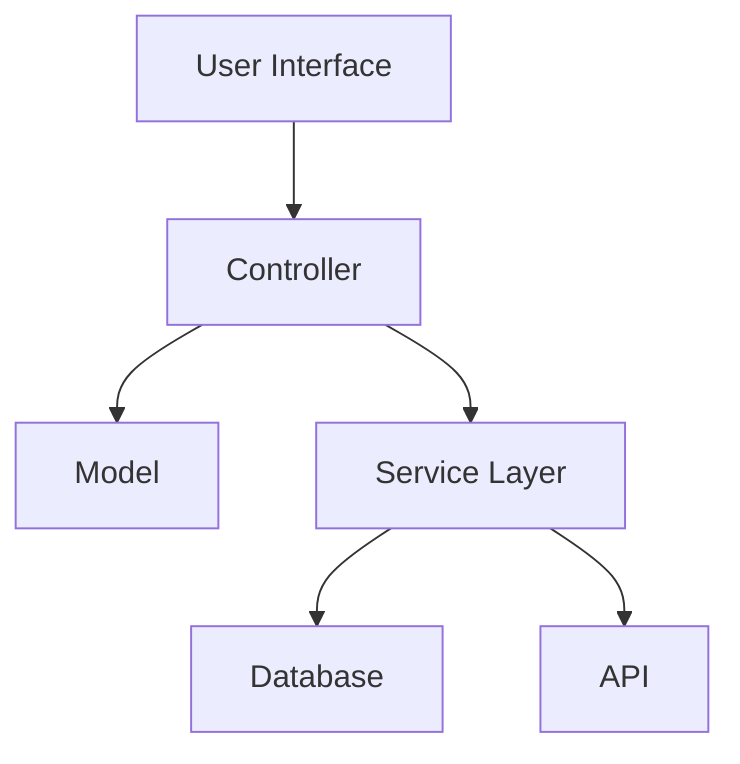
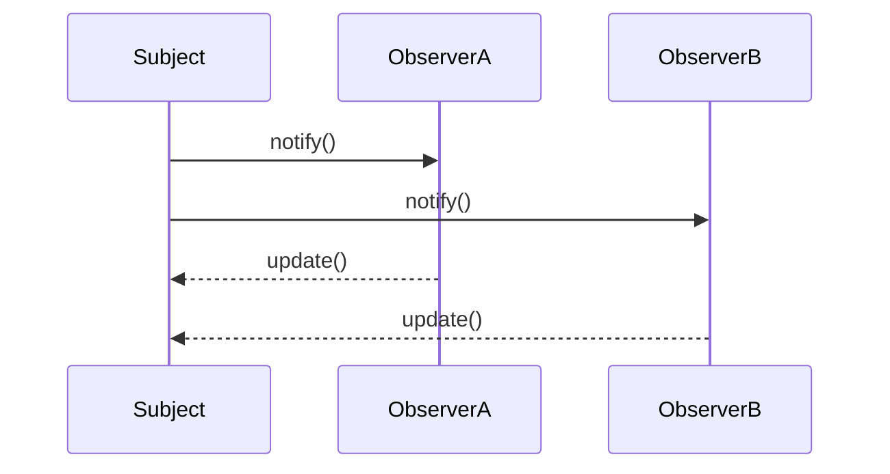

## 1.5 Benefits of Using Design Patterns in Swift

In the realm of software development, particularly in Swift, design patterns serve as invaluable tools that streamline the process of creating efficient, scalable, and maintainable applications. By leveraging these patterns, developers can solve common problems more effectively, ensure their applications are prepared for future growth, adapt to changing requirements with ease, and maintain high standards of quality. Let us delve into the myriad benefits of using design patterns in Swift.

### Efficient Problem-Solving

Design patterns provide a proven solution to recurring problems, allowing developers to tackle complex issues with confidence. By employing these patterns, we can significantly reduce the time spent on designing and implementing solutions, as they offer a clear blueprint for addressing specific challenges.

#### Code Example: Singleton Pattern in Swift

The Singleton pattern ensures a class has only one instance and provides a global point of access to it. This is particularly useful for managing shared resources, such as a network manager or a database connection.

```swift
class NetworkManager {
    static let shared = NetworkManager()
    
    private init() {
        // Private initialization to ensure just one instance is created.
    }
    
    func fetchData() {
        // Implementation for fetching data from a server.
    }
}

// Usage
NetworkManager.shared.fetchData()
```

In this example, the Singleton pattern provides a straightforward solution for managing network requests, ensuring that only one instance of `NetworkManager` exists throughout the application's lifecycle.

### Scalability

Scalability is a critical aspect of modern software development, as applications must be able to grow and evolve with new requirements. Design patterns help achieve scalability by promoting modular architecture and clear separation of concerns, making it easier to add new features without disrupting existing functionality.

#### Diagram: Visualizing the Scalability with Design Patterns



This diagram illustrates how design patterns such as MVC (Model-View-Controller) facilitate scalability by organizing code into distinct layers, each responsible for a specific aspect of the application.

#### Code Example: Factory Method Pattern

The Factory Method pattern provides a way to create objects without specifying the exact class of object that will be created. This is particularly useful for applications that need to support multiple types of objects with similar characteristics.

```swift
protocol Product {
    func use()
}

class ConcreteProductA: Product {
    func use() {
        print("Using Product A")
    }
}

class ConcreteProductB: Product {
    func use() {
        print("Using Product B")
    }
}

class Creator {
    func factoryMethod() -> Product {
        // Default implementation
        return ConcreteProductA()
    }
}

// Usage
let creator = Creator()
let product = creator.factoryMethod()
product.use()
```

By using the Factory Method pattern, we can easily introduce new product types without altering the existing codebase, thus enhancing scalability.

### Flexibility

Flexibility in software development refers to the ability to adapt to changes in requirements or technology. Design patterns promote flexibility by decoupling components and encouraging the use of interfaces and abstract classes, which makes it easier to modify or replace parts of the system without affecting others.

#### Code Example: Strategy Pattern

The Strategy pattern defines a family of algorithms, encapsulates each one, and makes them interchangeable. This pattern allows the algorithm to vary independently from clients that use it.

```swift
protocol Strategy {
    func execute() -> String
}

class ConcreteStrategyA: Strategy {
    func execute() -> String {
        return "Strategy A"
    }
}

class ConcreteStrategyB: Strategy {
    func execute() -> String {
        return "Strategy B"
    }
}

class Context {
    private var strategy: Strategy
    
    init(strategy: Strategy) {
        self.strategy = strategy
    }
    
    func setStrategy(strategy: Strategy) {
        self.strategy = strategy
    }
    
    func executeStrategy() -> String {
        return strategy.execute()
    }
}

// Usage
let context = Context(strategy: ConcreteStrategyA())
print(context.executeStrategy()) // Output: Strategy A

context.setStrategy(strategy: ConcreteStrategyB())
print(context.executeStrategy()) // Output: Strategy B
```

In this example, the Strategy pattern allows us to switch between different strategies at runtime, providing flexibility in how operations are performed.

### Quality Assurance

Design patterns contribute to quality assurance by offering well-tested solutions that have been refined over time. By adhering to these patterns, developers can reduce the likelihood of errors and ensure their code is robust and reliable.

#### Code Example: Observer Pattern

The Observer pattern defines a one-to-many dependency between objects so that when one object changes state, all its dependents are notified and updated automatically.

```swift
protocol Observer: AnyObject {
    func update(subject: Subject)
}

class Subject {
    private var observers = [Observer]()
    
    func attach(observer: Observer) {
        observers.append(observer)
    }
    
    func detach(observer: Observer) {
        observers.removeAll { $0 === observer }
    }
    
    func notify() {
        observers.forEach { $0.update(subject: self) }
    }
    
    // Subject-specific logic
    func changeState() {
        // Change state logic
        notify()
    }
}

class ConcreteObserver: Observer {
    func update(subject: Subject) {
        print("Observer notified of state change")
    }
}

// Usage
let subject = Subject()
let observer = ConcreteObserver()

subject.attach(observer: observer)
subject.changeState() // Output: Observer notified of state change
```

The Observer pattern ensures that changes in the subject's state are automatically communicated to all observers, reducing the risk of inconsistent states and improving overall quality.

### Try It Yourself

To deepen your understanding of design patterns in Swift, try modifying the code examples provided above. For instance, experiment with creating additional products in the Factory Method pattern or implementing a new strategy in the Strategy pattern. By engaging with the code, you'll gain a more intuitive grasp of how these patterns work and how they can be applied to your projects.

### Visualizing Design Patterns in Action

To further illustrate the benefits of design patterns, let's visualize how they interact within an application using a sequence diagram.

#### Diagram: Sequence Diagram for Observer Pattern



This sequence diagram shows the interaction between a subject and its observers, highlighting how notifications are sent and received, ensuring all observers are kept in sync with the subject's state.

### References and Links

For further reading on design patterns and their implementation in Swift, consider exploring the following resources:

- [Apple's Swift Documentation](https://developer.apple.com/documentation/swift)
- [Design Patterns: Elements of Reusable Object-Oriented Software](https://en.wikipedia.org/wiki/Design_Patterns)
- [Ray Wenderlich's Swift Design Patterns](https://www.raywenderlich.com/)

### Knowledge Check

Before moving on, take a moment to reflect on what you've learned about the benefits of using design patterns in Swift. Consider how these patterns can be applied to your own projects to enhance efficiency, scalability, flexibility, and quality.

### Embrace the Journey

Remember, mastering design patterns is a journey. As you continue to explore and experiment with these patterns, you'll develop a deeper understanding of how they can transform your Swift development process. Keep experimenting, stay curious, and enjoy the journey!

### Summary

In summary, design patterns in Swift offer numerous benefits, including efficient problem-solving, scalability, flexibility, and quality assurance. By incorporating these patterns into your development process, you can create robust, maintainable, and adaptable applications that stand the test of time.

---

## Quiz Time!



### What is the primary benefit of using the Singleton pattern in Swift?

- [x] Ensures a class has only one instance
- [ ] Allows multiple instances of a class
- [ ] Facilitates object pooling
- [ ] Enhances polymorphism

> **Explanation:** The Singleton pattern ensures a class has only one instance and provides a global point of access to it.

### How does the Factory Method pattern enhance scalability?

- [x] By allowing the creation of new product types without altering existing code
- [ ] By enforcing a single instance of a class
- [ ] By decoupling the interface from implementation
- [ ] By defining a family of algorithms

> **Explanation:** The Factory Method pattern allows the creation of new product types without altering existing code, enhancing scalability.

### Which design pattern allows the algorithm to vary independently from clients that use it?

- [ ] Singleton
- [ ] Factory Method
- [x] Strategy
- [ ] Observer

> **Explanation:** The Strategy pattern defines a family of algorithms, encapsulates each one, and makes them interchangeable, allowing the algorithm to vary independently from clients that use it.

### What is a key advantage of using the Observer pattern?

- [x] It ensures that changes in the subject's state are automatically communicated to all observers.
- [ ] It allows for multiple instances of a class.
- [ ] It simplifies the creation of complex objects.
- [ ] It enforces a single instance of a class.

> **Explanation:** The Observer pattern ensures that changes in the subject's state are automatically communicated to all observers, reducing the risk of inconsistent states.

### In the context of design patterns, what does flexibility refer to?

- [x] The ability to adapt to changes in requirements or technology
- [ ] The ability to enforce a single instance of a class
- [ ] The ability to create multiple instances of a class
- [ ] The ability to simplify complex algorithms

> **Explanation:** Flexibility refers to the ability to adapt to changes in requirements or technology, often achieved through decoupling components and using interfaces.

### Which pattern is illustrated by the following code snippet?

```swift
protocol Strategy {
    func execute() -> String
}

class ConcreteStrategyA: Strategy {
    func execute() -> String {
        return "Strategy A"
    }
}
```

- [x] Strategy
- [ ] Singleton
- [ ] Factory Method
- [ ] Observer

> **Explanation:** The code snippet defines a Strategy pattern, where a family of algorithms is encapsulated, allowing them to be interchangeable.

### What is the purpose of the `notify()` method in the Observer pattern?

- [x] To update all observers of a state change
- [ ] To enforce a single instance of a class
- [ ] To create new product types
- [ ] To encapsulate algorithms

> **Explanation:** The `notify()` method in the Observer pattern is used to update all observers of a state change, ensuring consistency.

### How does the Strategy pattern provide flexibility?

- [x] By allowing different strategies to be switched at runtime
- [ ] By enforcing a single instance of a class
- [ ] By simplifying the creation of complex objects
- [ ] By decoupling the interface from implementation

> **Explanation:** The Strategy pattern provides flexibility by allowing different strategies to be switched at runtime, enabling dynamic behavior changes.

### True or False: Design patterns can reduce the likelihood of errors in code.

- [x] True
- [ ] False

> **Explanation:** Design patterns offer well-tested solutions that have been refined over time, reducing the likelihood of errors and ensuring robust code.

### Which pattern is most suitable for managing shared resources like a database connection?

- [x] Singleton
- [ ] Strategy
- [ ] Factory Method
- [ ] Observer

> **Explanation:** The Singleton pattern is most suitable for managing shared resources like a database connection, ensuring only one instance is used.


