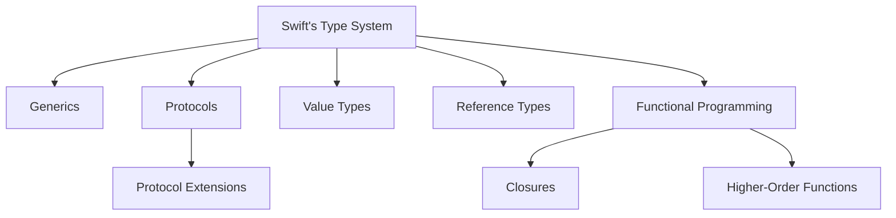

## 1.6 Overview of Swift Features Relevant to Design Patterns

Swift, Apple's powerful and intuitive programming language, is designed to give developers more freedom than ever. It is a language that combines the best features of modern programming languages with the power of Objective-C, without the constraints of C compatibility. In this section, we will delve into the Swift features that are particularly relevant to implementing design patterns effectively. These features include Swift's strong type system, the distinction between value and reference types, protocol extensions, and functional programming capabilities.

### Swift's Strong Type System

Swift's type system is one of its most compelling features. It is designed to be safe and expressive, allowing developers to write code that is both clear and concise. Let's explore how Swift's type system can be leveraged in design patterns.

#### Leveraging Generics

Generics are a powerful feature in Swift that allows you to write flexible and reusable code. By using generics, you can create functions and types that can work with any type, subject to requirements that you define. This is particularly useful in design patterns like the Factory Method or the Composite pattern, where the type of objects being created or managed can vary.

```swift
// Example of a generic function in Swift
func swapValues<T>(_ a: inout T, _ b: inout T) {
    let temp = a
    a = b
    b = temp
}

// Usage
var x = 5
var y = 10
swapValues(&x, &y)
print(x, y) // Output: 10 5
```

In the above code, the `swapValues` function is generic, meaning it can swap values of any type. This flexibility is a hallmark of Swift's type system.

#### Protocols and Protocol-Oriented Programming

Protocols in Swift define a blueprint of methods, properties, and other requirements that suit a particular task or piece of functionality. They are a cornerstone of Swift's protocol-oriented programming paradigm, which emphasizes the use of protocols over inheritance. This approach is particularly useful in implementing design patterns like the Strategy or Observer patterns.

```swift
protocol Drawable {
    func draw()
}

struct Circle: Drawable {
    func draw() {
        print("Drawing a circle")
    }
}

struct Square: Drawable {
    func draw() {
        print("Drawing a square")
    }
}

// Usage
let shapes: [Drawable] = [Circle(), Square()]
shapes.forEach { $0.draw() }
```

In this example, the `Drawable` protocol defines a `draw` method. Both `Circle` and `Square` conform to this protocol, allowing them to be treated polymorphically.

### Value vs. Reference Types

Understanding the distinction between value and reference types is crucial in Swift. This distinction affects how data is managed in memory and how it behaves when passed around in your application.

#### Value Types: Structs and Enums

Value types, such as structs and enums, are copied when they are assigned to a variable or constant, or when they are passed to a function. This behavior can be advantageous in certain design patterns, such as the Flyweight pattern, where you want to avoid shared state.

```swift
struct Point {
    var x: Int
    var y: Int
}

var pointA = Point(x: 0, y: 0)
var pointB = pointA
pointB.x = 10

print(pointA.x) // Output: 0
print(pointB.x) // Output: 10
```

In the above code, `pointB` is a copy of `pointA`, and changes to `pointB` do not affect `pointA`.

#### Reference Types: Classes

Reference types, such as classes, are not copied when they are assigned or passed around. Instead, they are referenced, meaning changes to one instance will affect all references to that instance. This behavior is useful in design patterns like the Singleton or Observer patterns, where shared state is required.

```swift
class Counter {
    var count: Int = 0
}

let counterA = Counter()
let counterB = counterA
counterB.count = 10

print(counterA.count) // Output: 10
```

Here, `counterB` is a reference to the same instance as `counterA`, so changes to `counterB` affect `counterA`.

### Protocol Extensions and Default Implementations

Swift allows you to extend protocols to provide default implementations of methods and properties. This feature enables you to add behavior to existing types without modifying their source code, making it an essential tool for implementing design patterns.

```swift
protocol Vehicle {
    var numberOfWheels: Int { get }
    func drive()
}

extension Vehicle {
    func drive() {
        print("Driving a vehicle with \\(numberOfWheels) wheels")
    }
}

struct Car: Vehicle {
    var numberOfWheels: Int { return 4 }
}

let car = Car()
car.drive() // Output: Driving a vehicle with 4 wheels
```

In this example, the `Vehicle` protocol provides a default implementation for the `drive` method. The `Car` struct conforms to `Vehicle` and inherits this default behavior.

### Functional Programming Features

Swift incorporates several functional programming features that can simplify the implementation of design patterns. These include closures, higher-order functions, and immutability.

#### Utilizing Closures

Closures are self-contained blocks of functionality that can be passed around and used in your code. They are similar to lambdas in other languages and are a powerful tool in Swift's arsenal.

```swift
let numbers = [1, 2, 3, 4, 5]
let squaredNumbers = numbers.map { $0 * $0 }
print(squaredNumbers) // Output: [1, 4, 9, 16, 25]
```

In this example, the `map` function takes a closure that squares each element in the `numbers` array.

#### Higher-Order Functions

Higher-order functions are functions that take other functions as arguments or return them as results. They are a key feature of functional programming and are used extensively in Swift.

```swift
func applyOperation(_ a: Int, _ b: Int, operation: (Int, Int) -> Int) -> Int {
    return operation(a, b)
}

let sum = applyOperation(3, 4, operation: +)
print(sum) // Output: 7
```

Here, `applyOperation` is a higher-order function that takes an operation closure as a parameter.

### Visualizing Swift's Features

To better understand how these features interact, let's visualize the relationship between Swift's type system, protocols, and functional programming features.



This diagram illustrates how Swift's type system is the foundation for generics, protocols, and functional programming features, all of which are integral to implementing design patterns.

### Try It Yourself

Experiment with the code examples provided in this section. Try modifying the generic function to swap values of different types, or extend the `Drawable` protocol to include more shapes. Explore how changes to value and reference types affect your code. By experimenting, you'll gain a deeper understanding of how Swift's features can be leveraged in design patterns.

### References and Links

For further reading on Swift's type system and protocol-oriented programming, consider visiting the following resources:

- [Swift Programming Language Guide](https://docs.swift.org/swift-book/LanguageGuide/TheBasics.html)
- [Apple's Swift Documentation](https://developer.apple.com/documentation/swift)
- [Protocol-Oriented Programming in Swift](https://developer.apple.com/videos/play/wwdc2015/408/)

### Knowledge Check

Before moving on to the next section, reflect on the following questions:

- How do generics enhance the flexibility of design patterns in Swift?
- What is the difference between value and reference types, and how does this affect design patterns?
- How can protocol extensions be used to provide default implementations in Swift?
- What role do closures and higher-order functions play in functional programming within Swift?

### Embrace the Journey

Remember, mastering Swift's features is a journey, not a destination. As you continue to explore and experiment with these features, you'll become more adept at implementing design patterns in Swift. Keep pushing the boundaries of what you can create, and enjoy the process of learning and discovery.

## Quiz Time!



### What is the primary benefit of using generics in Swift?

- [x] They allow for flexible and reusable code.
- [ ] They enforce strict type checking.
- [ ] They simplify memory management.
- [ ] They enhance code readability.

> **Explanation:** Generics enable you to write flexible and reusable code by allowing functions and types to work with any type, subject to constraints.

### How do value types differ from reference types in Swift?

- [x] Value types are copied when assigned, while reference types are not.
- [ ] Reference types are copied when assigned, while value types are not.
- [ ] Both value and reference types are copied when assigned.
- [ ] Neither value nor reference types are copied when assigned.

> **Explanation:** Value types, such as structs, are copied when assigned, whereas reference types, such as classes, are not copied but referenced.

### What feature allows Swift protocols to provide default method implementations?

- [x] Protocol extensions
- [ ] Generics
- [ ] Closures
- [ ] Inheritance

> **Explanation:** Protocol extensions in Swift allow you to provide default implementations for methods and properties.

### Which of the following is a higher-order function in Swift?

- [x] map
- [ ] if-else
- [ ] switch
- [ ] for-in

> **Explanation:** The `map` function is a higher-order function because it takes a closure as an argument and applies it to each element in a collection.

### What is the role of closures in Swift's functional programming?

- [x] They are self-contained blocks of functionality that can be passed around.
- [ ] They enforce strict type checking.
- [ ] They simplify memory management.
- [ ] They enhance code readability.

> **Explanation:** Closures are self-contained blocks of functionality that can be passed around and used in your code, similar to lambdas in other languages.

### How can protocol-oriented programming be beneficial in design patterns?

- [x] It emphasizes the use of protocols over inheritance.
- [ ] It simplifies memory management.
- [ ] It enforces strict type checking.
- [ ] It enhances code readability.

> **Explanation:** Protocol-oriented programming emphasizes the use of protocols over inheritance, providing flexibility and promoting code reuse.

### Which Swift feature allows you to create functions that can work with any type?

- [x] Generics
- [ ] Protocols
- [ ] Closures
- [ ] Inheritance

> **Explanation:** Generics allow you to create functions and types that can work with any type, subject to constraints.

### What is a key advantage of using protocol extensions in Swift?

- [x] They allow for default method implementations.
- [ ] They simplify memory management.
- [ ] They enforce strict type checking.
- [ ] They enhance code readability.

> **Explanation:** Protocol extensions allow you to provide default implementations for methods and properties, reducing code duplication and promoting reuse.

### Which of the following is an example of a value type in Swift?

- [x] Struct
- [ ] Class
- [ ] Protocol
- [ ] Closure

> **Explanation:** Structs are value types in Swift, meaning they are copied when assigned or passed to a function.

### True or False: In Swift, closures can capture and store references to variables and constants from the surrounding context.

- [x] True
- [ ] False

> **Explanation:** True. Closures in Swift can capture and store references to variables and constants from the surrounding context, allowing them to access and modify those values.




