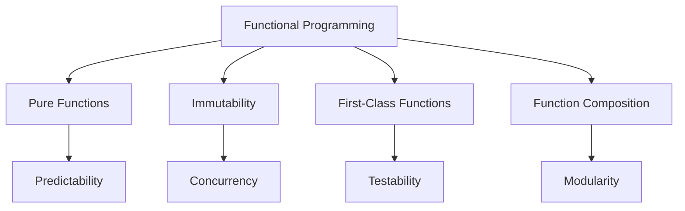

## 10.1 Introduction to Functional Programming in Swift

Functional programming is a programming paradigm that treats computation as the evaluation of mathematical functions and avoids changing state or mutable data. In Swift, functional programming principles can be leveraged to write more predictable, maintainable, and testable code. This section introduces the core concepts of functional programming in Swift and demonstrates how to apply them effectively.

### Intent

The intent of this section is to provide an overview of functional programming principles and how to apply them in Swift to write clear and maintainable code.

### Core Concepts

#### Pure Functions

Pure functions are a fundamental concept in functional programming. A pure function is a function where the output value is determined only by its input values, without observable side effects. This means that calling a pure function with the same arguments will always produce the same result.

**Characteristics of Pure Functions:**

- **Deterministic**: Always produces the same output for the same input.
- **No Side Effects**: Does not modify any external state or interact with external systems.

**Example of a Pure Function in Swift:**

```swift
// A pure function that calculates the square of a number
func square(_ number: Int) -> Int {
    return number * number
}

// Usage
let result = square(4) // Always returns 16
```

In this example, the `square` function is pure because it performs a calculation based solely on its input and does not modify any external state.

#### Immutability

Immutability is another core principle of functional programming. It involves using data structures that cannot be modified after they are created. Instead of changing an object, you create a new one with the desired changes.

**Benefits of Immutability:**

- **Predictability**: Easier to reason about code behavior.
- **Concurrency**: Reduces state-related bugs in concurrent environments.
- **Testability**: Immutable data structures are easier to test.

**Example of Immutability in Swift:**

```swift
// Immutable struct
struct Point {
    let x: Int
    let y: Int
}

// Creating an immutable instance
let point = Point(x: 1, y: 2)

// Attempting to modify will result in a compile-time error
// point.x = 3 // Error: Cannot assign to property: 'x' is a 'let' constant
```

In Swift, you can achieve immutability by using `let` to declare constants and using immutable data structures like structs.

#### First-Class Functions

In Swift, functions are first-class citizens, meaning they can be assigned to variables, passed as arguments, and returned from other functions. This allows for higher-order functions and function composition.

**Example of First-Class Functions in Swift:**

```swift
// Function that takes another function as a parameter
func applyOperation(_ a: Int, _ b: Int, operation: (Int, Int) -> Int) -> Int {
    return operation(a, b)
}

// Usage with a closure
let sum = applyOperation(3, 4, operation: { $0 + $1 }) // Returns 7
```

In this example, `applyOperation` is a higher-order function that takes another function as an argument, demonstrating the first-class nature of functions in Swift.

#### Function Composition

Function composition is the process of combining two or more functions to produce a new function. This allows for building complex operations from simpler ones, leading to more modular and reusable code.

**Example of Function Composition in Swift:**

```swift
// Define simple functions
func add(_ x: Int, _ y: Int) -> Int {
    return x + y
}

func multiply(_ x: Int, _ y: Int) -> Int {
    return x * y
}

// Compose functions
func addThenMultiply(_ a: Int, _ b: Int, _ c: Int) -> Int {
    let sum = add(a, b)
    return multiply(sum, c)
}

// Usage
let result = addThenMultiply(2, 3, 4) // Returns 20
```

In this example, `addThenMultiply` composes the `add` and `multiply` functions to create a new function that first adds two numbers and then multiplies the result by a third number.

### Use Cases and Examples

Functional programming in Swift is not just theoretical; it has practical applications that can significantly improve your code.

#### Predictability

By using pure functions and immutability, you can make your code more predictable. This predictability makes it easier to understand and reason about, which is particularly valuable in large codebases.

**Example:**

Consider a function that calculates the total price of items in a shopping cart. By ensuring the function is pure and the cart is immutable, you can guarantee consistent results.

```swift
struct Item {
    let price: Double
}

func totalPrice(of items: [Item]) -> Double {
    return items.reduce(0) { $0 + $1.price }
}

// Usage
let items = [Item(price: 10.0), Item(price: 20.0)]
let total = totalPrice(of: items) // Always returns 30.0
```

#### Concurrency

Functional programming principles help reduce state-related bugs in concurrent environments. By minimizing shared mutable state, you can write safer concurrent code.

**Example:**

When working with concurrent tasks, using immutable data structures ensures that tasks do not interfere with each other.

```swift
import Foundation

let queue = DispatchQueue(label: "com.example.myqueue", attributes: .concurrent)

struct Counter {
    let count: Int
}

func increment(counter: Counter) -> Counter {
    return Counter(count: counter.count + 1)
}

var counter = Counter(count: 0)

queue.async {
    counter = increment(counter: counter)
}

queue.async {
    counter = increment(counter: counter)
}

// Wait for tasks to complete
queue.sync(flags: .barrier) {}

// Counter is safely incremented
print(counter.count)
```

#### Testability

Pure functions and immutable data structures are inherently easier to test because they do not depend on or alter external state.

**Example:**

Testing a pure function involves simply asserting that it returns the expected output for given inputs.

```swift
import XCTest

class MathTests: XCTestCase {
    func testSquare() {
        XCTAssertEqual(square(2), 4)
        XCTAssertEqual(square(-2), 4)
        XCTAssertEqual(square(0), 0)
    }
}
```

In this example, the `testSquare` function tests the `square` function, verifying that it produces the correct output for various inputs.

### Visualizing Functional Programming Concepts

To better understand how functional programming concepts fit together, let's visualize the relationships between them using a diagram.



**Diagram Description:** This diagram illustrates the core concepts of functional programming and their relationships. Pure functions lead to predictability, immutability aids concurrency, first-class functions enhance testability, and function composition promotes modularity.

### Try It Yourself

To truly grasp functional programming in Swift, try experimenting with the examples provided. Modify the code to see how changes affect the behavior. For instance, try creating your own pure functions or use immutable data structures in a small project. This hands-on approach will solidify your understanding.

### References and Links

For further reading on functional programming in Swift, consider exploring the following resources:

- [Swift.org Documentation](https://swift.org/documentation/)
- [Apple's Swift Programming Language Guide](https://developer.apple.com/documentation/swift)
- [Functional Programming in Swift by Chris Eidhof, Florian Kugler, and Wouter Swierstra](https://www.objc.io/books/functional-swift/)

### Knowledge Check

Before moving on, let's review some key points:

- Pure functions are deterministic and have no side effects.
- Immutability involves using unchangeable data structures.
- Functions in Swift are first-class citizens, allowing for higher-order functions and function composition.
- Functional programming principles enhance predictability, concurrency, and testability.

### Embrace the Journey

Remember, mastering functional programming in Swift is a journey. As you progress, you'll find new ways to apply these principles to write cleaner and more efficient code. Keep experimenting, stay curious, and enjoy the process!

## Quiz Time!



### What is a pure function?

- [x] A function that always produces the same output for the same input and has no side effects.
- [ ] A function that modifies external state.
- [ ] A function that always returns an integer.
- [ ] A function that takes no arguments.

> **Explanation:** A pure function is deterministic and has no side effects, meaning it doesn't modify external state or rely on it.

### Why is immutability important in functional programming?

- [x] It makes the code more predictable and easier to reason about.
- [ ] It allows functions to modify data structures.
- [ ] It prevents functions from returning values.
- [ ] It makes the code run faster.

> **Explanation:** Immutability ensures that data structures do not change, making the code more predictable and reducing bugs.

### What does it mean for functions to be first-class citizens in Swift?

- [x] Functions can be assigned to variables, passed as arguments, and returned from other functions.
- [ ] Functions can only be used as arguments.
- [ ] Functions cannot be stored in variables.
- [ ] Functions must always return a value.

> **Explanation:** First-class functions can be used like any other value, allowing for more flexible and reusable code.

### What is function composition?

- [x] The process of combining two or more functions to produce a new function.
- [ ] Writing functions in a sequence.
- [ ] A function that calls itself.
- [ ] A function with multiple return statements.

> **Explanation:** Function composition involves creating new functions by combining existing ones, enhancing modularity and reuse.

### How does functional programming improve testability?

- [x] Pure functions are easier to test because they do not depend on or alter external state.
- [ ] By allowing functions to modify global variables.
- [ ] By making functions return random values.
- [ ] By using mutable data structures.

> **Explanation:** Pure functions have no side effects, making them easier to test as they rely solely on input values.

### What is an example of a higher-order function in Swift?

- [x] A function that takes another function as a parameter or returns a function.
- [ ] A function that always returns a string.
- [ ] A function that takes no parameters.
- [ ] A function that modifies a global variable.

> **Explanation:** Higher-order functions operate on other functions, either by taking them as arguments or returning them.

### What is a benefit of using immutable data structures in concurrent environments?

- [x] Reduces state-related bugs.
- [ ] Increases the complexity of code.
- [ ] Allows for more mutable state.
- [ ] Requires more memory.

> **Explanation:** Immutable data structures prevent state changes, reducing the likelihood of bugs in concurrent code.

### What is the result of the following Swift code: `let result = applyOperation(3, 4, operation: { $0 + $1 })`?

- [x] 7
- [ ] 12
- [ ] 34
- [ ] 1

> **Explanation:** The `applyOperation` function adds 3 and 4, resulting in 7.

### Which of the following is NOT a characteristic of a pure function?

- [ ] Deterministic
- [ ] No side effects
- [x] Modifies external state
- [ ] Always produces the same output for the same input

> **Explanation:** A pure function does not modify external state; it is deterministic and has no side effects.

### True or False: Functional programming principles can only be applied in functional programming languages.

- [ ] True
- [x] False

> **Explanation:** Functional programming principles can be applied in many languages, including Swift, even if they are not purely functional.




