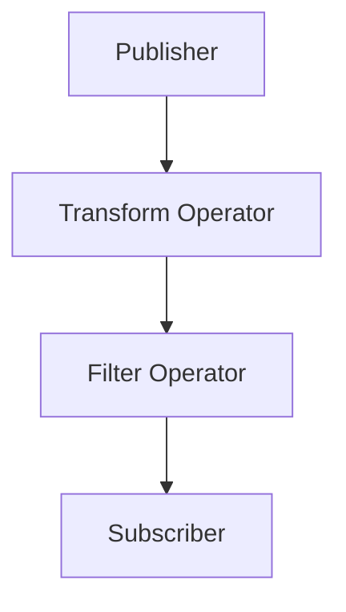

## 10.10 Functional Reactive Programming with Combine

Functional Reactive Programming (FRP) is a paradigm that combines functional programming and reactive programming to model dynamic systems. In Swift, Apple's Combine framework provides a robust set of tools for implementing FRP, allowing developers to handle asynchronous events and data streams seamlessly. In this section, we will delve into the core concepts of FRP with Combine, explore its components, and demonstrate its practical applications.

### Intent

The intent of Functional Reactive Programming with Combine is to model applications as streams of data that can be observed and transformed reactively. By leveraging Combine, developers can create more responsive and efficient applications that react to changes in data or user inputs in real-time.

### Implementing FRP with Combine

#### Publishers and Subscribers

In Combine, a **Publisher** is a source of data that can emit a sequence of values over time. A **Subscriber** listens to these values and reacts accordingly. The relationship between Publishers and Subscribers is at the heart of Combine's architecture.

- **Publisher**: Defines how values and errors are produced. Publishers can emit zero or more values and may complete with or without an error.
- **Subscriber**: Receives values from a Publisher and performs actions based on those values.

**Example Code:**

```swift
import Combine

// Define a simple publisher that emits integer values
let numbersPublisher = [1, 2, 3, 4, 5].publisher

// Define a subscriber that prints each received value
let subscription = numbersPublisher.sink(receiveCompletion: { completion in
    switch completion {
    case .finished:
        print("Finished receiving values.")
    case .failure(let error):
        print("Received error: \\(error)")
    }
}, receiveValue: { value in
    print("Received value: \\(value)")
})
```

In this example, `numbersPublisher` is a publisher that emits a sequence of integers. The `sink` method is used to create a subscriber that prints each value it receives.

#### Operators

Operators in Combine are used to transform, filter, and combine data streams. They provide a declarative way to manipulate data as it flows through the pipeline.

- **Transforming Operators**: Modify the data as it passes through the stream.
- **Filtering Operators**: Allow only certain values to pass through.
- **Combining Operators**: Merge multiple streams into a single stream.

**Example Code:**

```swift
import Combine

let numbers = [1, 2, 3, 4, 5].publisher

// Use map operator to transform values
let transformed = numbers.map { $0 * 2 }

// Use filter operator to allow only even numbers
let filtered = transformed.filter { $0 % 2 == 0 }

// Subscribe to the filtered publisher
let subscription = filtered.sink(receiveCompletion: { completion in
    print("Stream completed.")
}, receiveValue: { value in
    print("Filtered value: \\(value)")
})
```

In this example, the `map` operator is used to double each value, and the `filter` operator allows only even numbers to pass through.

#### Backpressure Management

Backpressure refers to the challenge of managing data flow between fast producers and slow consumers. Combine provides mechanisms to handle backpressure effectively, ensuring that the system remains responsive and efficient.

- **Demand**: Subscribers can request a specific number of values from a Publisher, allowing them to control the rate of data flow.
- **Buffering**: Combine can buffer values to handle bursts of data.

**Example Code:**

```swift
import Combine

let publisher = (1...100).publisher

// Use a buffer to handle backpressure
let buffered = publisher.buffer(size: 10, prefetch: .byRequest, whenFull: .dropOldest)

// Subscribe to the buffered publisher
let subscription = buffered.sink(receiveCompletion: { completion in
    print("Completed with buffering.")
}, receiveValue: { value in
    print("Buffered value: \\(value)")
})
```

In this example, the `buffer` operator is used to manage backpressure by buffering up to 10 values.

### Use Cases and Examples

#### UI Updates

Combine is particularly useful for updating user interfaces in response to data changes. By observing data streams, UI components can react immediately to changes, providing a smooth and responsive experience.

**Example Code:**

```swift
import Combine
import SwiftUI

class ViewModel: ObservableObject {
    @Published var text: String = ""
    private var cancellables = Set<AnyCancellable>()

    init() {
        // Simulate a data stream that updates the text
        Timer.publish(every: 1.0, on: .main, in: .common)
            .autoconnect()
            .map { _ in "Updated at \\(Date())" }
            .assign(to: \.text, on: self)
            .store(in: &cancellables)
    }
}

struct ContentView: View {
    @ObservedObject var viewModel = ViewModel()

    var body: some View {
        Text(viewModel.text)
            .padding()
    }
}
```

In this SwiftUI example, a `ViewModel` class uses Combine to update a text property every second. The `ContentView` observes this property and updates the displayed text accordingly.

#### Network Requests

Combine simplifies the process of chaining asynchronous network requests, allowing developers to handle complex workflows with ease.

**Example Code:**

```swift
import Combine
import Foundation

struct Post: Decodable {
    let id: Int
    let title: String
}

func fetchPosts() -> AnyPublisher<[Post], Error> {
    let url = URL(string: "https://jsonplaceholder.typicode.com/posts")!
    return URLSession.shared.dataTaskPublisher(for: url)
        .map(\.data)
        .decode(type: [Post].self, decoder: JSONDecoder())
        .eraseToAnyPublisher()
}

let cancellable = fetchPosts()
    .sink(receiveCompletion: { completion in
        switch completion {
        case .finished:
            print("Finished fetching posts.")
        case .failure(let error):
            print("Error fetching posts: \\(error)")
        }
    }, receiveValue: { posts in
        print("Received posts: \\(posts)")
    })
```

This example demonstrates how to fetch and decode JSON data from a remote server using Combine.

#### Event Handling

Combine can be used to respond to user inputs and system events, making it a powerful tool for event-driven programming.

**Example Code:**

```swift
import Combine
import UIKit

class ButtonViewController: UIViewController {
    private var cancellables = Set<AnyCancellable>()
    private let button = UIButton()

    override func viewDidLoad() {
        super.viewDidLoad()

        button.setTitle("Tap Me", for: .normal)
        button.addTarget(self, action: #selector(buttonTapped), for: .touchUpInside)
        view.addSubview(button)

        // Use Combine to handle button tap events
        NotificationCenter.default.publisher(for: UIButton.touchUpInsideNotification, object: button)
            .sink { _ in
                print("Button was tapped!")
            }
            .store(in: &cancellables)
    }

    @objc private func buttonTapped() {
        // Additional logic for button tap
    }
}
```

In this UIKit example, Combine is used to handle button tap events, allowing for a clean and reactive event handling mechanism.

### Visualizing Data Streams with Combine

To better understand how data flows through a Combine pipeline, let's visualize the process using a flowchart.



**Description**: This diagram illustrates a simple Combine pipeline where a Publisher emits data that is transformed and filtered before being received by a Subscriber.

### Swift Unique Features

Combine leverages Swift's strong type system and functional programming features, making it a natural fit for Swift developers. Key features include:

- **Type Safety**: Combine's use of generics ensures type safety throughout the data pipeline.
- **Functional Composition**: Swift's support for closures and higher-order functions makes it easy to compose complex data transformations.
- **Integration with SwiftUI**: Combine works seamlessly with SwiftUI, providing a unified approach to handling data and UI updates.

### Design Considerations

When using Combine, consider the following:

- **Performance**: While Combine is efficient, excessive use of operators can impact performance. Use operators judiciously.
- **Error Handling**: Combine provides robust error handling mechanisms, but it's important to handle errors gracefully to ensure a smooth user experience.
- **Memory Management**: Use `AnyCancellable` to manage subscriptions and prevent memory leaks.

### Differences and Similarities

Combine shares similarities with other reactive frameworks like RxSwift but is designed specifically for Swift, offering tighter integration with Apple's ecosystem. Unlike RxSwift, Combine is a native framework, which can lead to better performance and easier integration with SwiftUI.

### Try It Yourself

To deepen your understanding of Combine, try modifying the code examples provided. Experiment with different operators, create custom publishers, and explore how Combine interacts with SwiftUI and UIKit. By doing so, you'll gain practical experience and a deeper appreciation for the power of Functional Reactive Programming in Swift.

### Knowledge Check

- Explain the role of Publishers and Subscribers in Combine.
- Demonstrate how to use operators to transform data streams.
- Describe how Combine handles backpressure management.
- Provide examples of how Combine can be used for UI updates and network requests.

### Embrace the Journey

Remember, mastering Combine is a journey. As you explore its capabilities, you'll discover new ways to build responsive and efficient applications. Stay curious, keep experimenting, and enjoy the process of learning and growing as a Swift developer.

## Quiz Time!



### What is the primary role of a Publisher in Combine?

- [x] To emit a sequence of values over time
- [ ] To receive and react to values
- [ ] To transform data streams
- [ ] To manage backpressure

> **Explanation:** A Publisher in Combine is responsible for emitting a sequence of values over time, which can be consumed by Subscribers.

### Which operator would you use to transform each value emitted by a Publisher?

- [x] map
- [ ] filter
- [ ] combineLatest
- [ ] debounce

> **Explanation:** The `map` operator is used to transform each value emitted by a Publisher.

### How does Combine handle backpressure?

- [x] By allowing Subscribers to request a specific number of values
- [ ] By using the `map` operator
- [ ] By automatically dropping values
- [ ] By using the `merge` operator

> **Explanation:** Combine handles backpressure by allowing Subscribers to request a specific number of values, controlling the rate of data flow.

### What is a common use case for Combine in UI development?

- [x] Updating the UI in response to data changes
- [ ] Encrypting data
- [ ] Sorting arrays
- [ ] Compiling code

> **Explanation:** A common use case for Combine in UI development is updating the UI in response to data changes.

### Which of the following is a benefit of using Combine with SwiftUI?

- [x] Seamless integration for handling data and UI updates
- [ ] Improved network speed
- [ ] Enhanced security features
- [ ] Automatic code generation

> **Explanation:** Combine offers seamless integration with SwiftUI, providing a unified approach to handling data and UI updates.

### What is the purpose of the `sink` method in Combine?

- [x] To create a Subscriber that receives values from a Publisher
- [ ] To transform data streams
- [ ] To manage memory
- [ ] To handle errors

> **Explanation:** The `sink` method in Combine is used to create a Subscriber that receives values from a Publisher.

### How can you prevent memory leaks when using Combine?

- [x] By using `AnyCancellable` to manage subscriptions
- [ ] By using the `map` operator
- [ ] By avoiding the use of Publishers
- [ ] By using the `filter` operator

> **Explanation:** Using `AnyCancellable` to manage subscriptions helps prevent memory leaks in Combine.

### What is the role of the `buffer` operator in Combine?

- [x] To manage backpressure by buffering values
- [ ] To transform data streams
- [ ] To filter values
- [ ] To combine multiple streams

> **Explanation:** The `buffer` operator in Combine is used to manage backpressure by buffering values.

### Which of the following is a key feature of Combine?

- [x] Type safety through the use of generics
- [ ] Automatic code generation
- [ ] Built-in encryption
- [ ] Cross-platform compatibility

> **Explanation:** Combine's use of generics ensures type safety throughout the data pipeline.

### True or False: Combine can be used to handle asynchronous network requests.

- [x] True
- [ ] False

> **Explanation:** True. Combine can be used to handle asynchronous network requests, making it a powerful tool for managing data streams.




