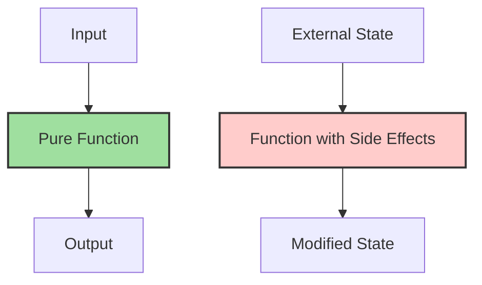

## 10.11 Pure Functions and Side Effects

In the world of software development, writing code that is predictable, testable, and maintainable is crucial. Pure functions are a fundamental concept in functional programming that help achieve these goals. In this section, we'll explore the concept of pure functions, their benefits, and how to implement them in Swift. We'll also discuss side effects, why they should be avoided, and how to identify them in your code.

### Understanding Pure Functions

A pure function is a function that, given the same input, will always return the same output and does not produce any side effects. This means that the function's behavior is entirely predictable and does not depend on any external state or interaction with the outside world.

#### Key Characteristics of Pure Functions

1. **Determinism**: A pure function always produces the same result when given the same input. This makes them highly predictable and easy to reason about.

2. **No Side Effects**: Pure functions do not modify any state outside their scope. They do not change the values of their input parameters, global variables, or any other external state.

3. **Immutability**: Pure functions do not alter the data they receive as input. Instead, they create and return new data structures, ensuring that the original data remains unchanged.

### Benefits of Pure Functions

- **Predictability**: Since pure functions always produce the same output for the same input, they are easy to understand and predict.

- **Testability**: Pure functions are straightforward to test because they do not rely on external state. You can test them in isolation by simply providing input and verifying the output.

- **Concurrency**: Pure functions can be executed concurrently without the risk of race conditions or data corruption, as they do not modify shared state.

- **Reusability**: Pure functions are self-contained and do not depend on external state, making them highly reusable across different parts of an application.

### Implementing Pure Functions in Swift

Let's explore how to implement pure functions in Swift with practical examples.

#### Example 1: Mathematical Computations

Mathematical computations are a classic example of pure functions. Consider a function that calculates the square of a number:

```swift
func square(_ number: Int) -> Int {
    return number * number
}
```

- **Determinism**: The `square` function will always return the same result for the same input.
- **No Side Effects**: The function does not modify any external state.
- **Immutability**: The input parameter `number` is not altered.

#### Example 2: Data Transformation

Data transformation functions are another excellent use case for pure functions. Let's look at a function that converts an array of integers to an array of their string representations:

```swift
func convertToStringArray(_ numbers: [Int]) -> [String] {
    return numbers.map { String($0) }
}
```

- **Determinism**: The output is consistent for the same input array.
- **No Side Effects**: The function does not modify the original array.
- **Immutability**: The function returns a new array without altering the input.

### Avoiding Side Effects

Side effects occur when a function interacts with external state or causes observable changes outside its scope. Common side effects include modifying global variables, altering input parameters, performing I/O operations, and interacting with databases.

#### Identifying Side Effects

To identify side effects in your code, ask yourself the following questions:

- Does the function modify any global or external variables?
- Does the function perform any I/O operations, such as reading or writing files?
- Does the function change the input parameters?
- Does the function interact with a database or network?

If the answer to any of these questions is yes, the function likely has side effects.

#### Example of a Function with Side Effects

Consider a function that appends a value to a global array:

```swift
var globalArray: [Int] = []

func appendToGlobalArray(_ value: Int) {
    globalArray.append(value)
}
```

This function has a side effect because it modifies the `globalArray` outside its scope. To make this function pure, you can return a new array with the appended value:

```swift
func appendToArray(_ array: [Int], value: Int) -> [Int] {
    return array + [value]
}
```

### Embracing Immutability

Immutability is a core principle of pure functions. By ensuring that data structures are not modified, you can prevent unintended side effects and make your code more predictable.

#### Example of Immutability in Swift

Swift provides several features to support immutability, such as `let` for declaring constants and value types like structs and enums. Here's an example using a struct:

```swift
struct Point {
    let x: Int
    let y: Int
}

func movePoint(_ point: Point, byX dx: Int, byY dy: Int) -> Point {
    return Point(x: point.x + dx, y: point.y + dy)
}
```

In this example, the `Point` struct is immutable, and the `movePoint` function returns a new `Point` without modifying the original.

### Try It Yourself

To deepen your understanding of pure functions and side effects, try modifying the following code examples:

1. **Modify the `square` function** to handle negative numbers differently, such as returning their absolute value before squaring.

2. **Extend the `convertToStringArray` function** to handle optional integers by filtering out `nil` values before conversion.

3. **Refactor the `appendToGlobalArray` function** to avoid using global state and return a new array instead.

### Visualizing Pure Functions and Side Effects

To better understand the concept of pure functions and side effects, let's visualize the flow of data and state changes using a diagram.



**Diagram Description**: The diagram illustrates the flow of data through a pure function and a function with side effects. The pure function (green) transforms the input into the output without affecting external state. In contrast, the function with side effects (red) modifies the external state.

### Knowledge Check

Before we conclude, let's reinforce what we've learned:

- **What are the key characteristics of pure functions?**
- **How can you identify side effects in a function?**
- **Why is immutability important in functional programming?**

### Summary

In this section, we've explored the concept of pure functions and side effects in Swift. By embracing pure functions, you can write code that is predictable, testable, and maintainable. Remember to avoid side effects by ensuring that your functions do not interact with external state and embrace immutability to prevent unintended changes.

### Further Reading

For more information on pure functions and functional programming in Swift, consider exploring the following resources:

- [Swift.org - The Swift Programming Language](https://swift.org/documentation/)
- [Functional Programming in Swift](https://www.objc.io/books/functional-swift/)

## Quiz Time!



### What is a pure function?

- [x] A function that returns the same output for the same input and has no side effects.
- [ ] A function that modifies global variables.
- [ ] A function that performs I/O operations.
- [ ] A function that depends on external state.

> **Explanation:** A pure function is deterministic and does not produce side effects.

### Which of the following is a side effect?

- [ ] Returning a value from a function.
- [ ] Performing a calculation within a function.
- [x] Modifying a global variable within a function.
- [ ] Using constants within a function.

> **Explanation:** Modifying a global variable is a side effect because it changes external state.

### Why is immutability important in functional programming?

- [x] It prevents unintended changes to data.
- [ ] It allows functions to modify input parameters.
- [ ] It makes code less predictable.
- [ ] It reduces code readability.

> **Explanation:** Immutability ensures data remains unchanged, preventing unintended modifications.

### How can you identify a function with side effects?

- [x] The function modifies external state or performs I/O operations.
- [ ] The function only returns a value.
- [ ] The function uses local variables.
- [ ] The function calls other functions.

> **Explanation:** Functions with side effects interact with external state or perform observable actions.

### What is determinism in the context of pure functions?

- [x] The property of producing the same output for the same input.
- [ ] The ability to modify external state.
- [ ] The ability to perform I/O operations.
- [ ] The property of having side effects.

> **Explanation:** Determinism ensures consistent output for given input.

### Which Swift feature supports immutability?

- [x] `let` for declaring constants.
- [ ] `var` for declaring variables.
- [ ] Global variables.
- [ ] Mutable structs.

> **Explanation:** `let` is used for immutable constants in Swift.

### What is a benefit of using pure functions?

- [x] They are easy to test.
- [ ] They modify global state.
- [ ] They perform I/O operations.
- [ ] They are unpredictable.

> **Explanation:** Pure functions are easy to test due to their predictability and lack of side effects.

### What does a pure function return?

- [x] A consistent output for the same input.
- [ ] A modified global variable.
- [ ] An I/O operation result.
- [ ] An unpredictable value.

> **Explanation:** Pure functions return consistent output for the same input.

### True or False: Pure functions can safely be executed concurrently.

- [x] True
- [ ] False

> **Explanation:** Pure functions can be executed concurrently as they do not modify shared state.

### Which of the following is NOT a characteristic of a pure function?

- [ ] Determinism
- [ ] No side effects
- [ ] Immutability
- [x] Modifying input parameters

> **Explanation:** Pure functions do not modify input parameters; they are immutable.



Remember, mastering pure functions and understanding side effects is just the beginning. As you continue your journey in Swift development, keep exploring and experimenting with these concepts to build robust and maintainable applications. Happy coding!
