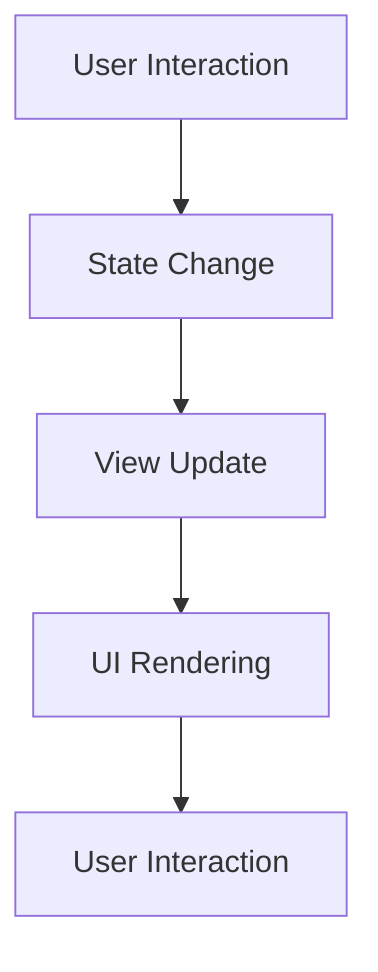

## 10.13 Functional Design Patterns in SwiftUI

SwiftUI revolutionizes UI development by embracing functional programming principles, allowing developers to create dynamic, efficient, and reusable user interfaces. This section delves into the core functional design patterns in SwiftUI, focusing on declarative syntax, view composition, and state management.

### Intent

The primary intent of functional design patterns in SwiftUI is to leverage functional programming concepts to build robust and scalable user interfaces. By adopting a declarative syntax, developers can define UI components in terms of state and behavior, making the code more predictable and easier to maintain.

### Implementing Functional Patterns

#### Declarative Syntax

SwiftUI's declarative syntax allows developers to describe the UI's appearance and behavior in a straightforward manner. This approach contrasts with imperative UI frameworks, where developers must explicitly manage the UI state and updates.

- **Defining Views**: In SwiftUI, views are defined as functions of their state. This means that the UI is automatically updated whenever the state changes, reducing the need for manual updates.

```swift
import SwiftUI

struct ContentView: View {
    @State private var isToggled: Bool = false

    var body: some View {
        VStack {
            Toggle(isOn: $isToggled) {
                Text("Toggle Switch")
            }
            .padding()

            if isToggled {
                Text("Switch is ON")
                    .font(.largeTitle)
                    .foregroundColor(.green)
            } else {
                Text("Switch is OFF")
                    .font(.largeTitle)
                    .foregroundColor(.red)
            }
        }
    }
}
```

In this example, the `ContentView` uses a `Toggle` to switch between two states. The UI updates automatically based on the `isToggled` state.

#### View Composition

View composition in SwiftUI involves building complex UIs by combining simple, reusable views. This pattern encourages modular design, where each component can be developed and tested independently.

- **Composing Views**: SwiftUI makes it easy to compose views by nesting them within each other. This hierarchical structure allows for clear separation of concerns and code reusability.

```swift
struct CustomButton: View {
    var title: String
    var action: () -> Void

    var body: some View {
        Button(action: action) {
            Text(title)
                .padding()
                .background(Color.blue)
                .foregroundColor(.white)
                .cornerRadius(8)
        }
    }
}

struct ContentView: View {
    var body: some View {
        VStack {
            CustomButton(title: "Press Me", action: {
                print("Button Pressed")
            })
            CustomButton(title: "Another Button", action: {
                print("Another Button Pressed")
            })
        }
    }
}
```

In this example, `CustomButton` is a reusable component that can be used throughout the app, promoting code reuse and consistency.

#### State Management

State management is a critical aspect of functional programming in SwiftUI. SwiftUI provides several property wrappers to manage state effectively:

- **@State**: Used for local state management within a view.
- **@Binding**: Allows a child view to read and write a value owned by a parent view.
- **@ObservedObject**: Used for state that is shared across multiple views.
- **@EnvironmentObject**: Provides a shared data source for a view hierarchy.

```swift
class CounterModel: ObservableObject {
    @Published var count: Int = 0
}

struct CounterView: View {
    @ObservedObject var model: CounterModel

    var body: some View {
        VStack {
            Text("Count: \\(model.count)")
                .font(.largeTitle)

            Button(action: {
                model.count += 1
            }) {
                Text("Increment")
                    .padding()
                    .background(Color.green)
                    .foregroundColor(.white)
                    .cornerRadius(8)
            }
        }
    }
}

struct ContentView: View {
    @StateObject private var counterModel = CounterModel()

    var body: some View {
        CounterView(model: counterModel)
    }
}
```

In this example, `CounterModel` is an `ObservableObject` that holds the count state. The `CounterView` observes this model and updates the UI whenever the count changes.

### Use Cases and Examples

#### Dynamic Interfaces

Functional design patterns in SwiftUI enable the creation of dynamic interfaces that automatically respond to state changes. This capability is essential for building interactive and responsive applications.

```swift
struct DynamicListView: View {
    @State private var items: [String] = ["Item 1", "Item 2", "Item 3"]

    var body: some View {
        VStack {
            List(items, id: \.self) { item in
                Text(item)
            }

            Button(action: {
                items.append("Item \\(items.count + 1)")
            }) {
                Text("Add Item")
                    .padding()
                    .background(Color.blue)
                    .foregroundColor(.white)
                    .cornerRadius(8)
            }
        }
    }
}
```

In this example, the `DynamicListView` updates the list dynamically as new items are added, demonstrating the power of SwiftUI's state-driven UI updates.

#### Reusable Components

Creating reusable components is a hallmark of functional design patterns. SwiftUI's composable architecture allows developers to build generic views that can be customized for different use cases.

```swift
struct ReusableCard: View {
    var title: String
    var description: String

    var body: some View {
        VStack(alignment: .leading) {
            Text(title)
                .font(.headline)
            Text(description)
                .font(.subheadline)
        }
        .padding()
        .background(Color.gray.opacity(0.1))
        .cornerRadius(10)
    }
}

struct ContentView: View {
    var body: some View {
        VStack {
            ReusableCard(title: "Card 1", description: "This is the first card.")
            ReusableCard(title: "Card 2", description: "This is the second card.")
        }
    }
}
```

Here, `ReusableCard` is a generic component that can be used to display different content, promoting code reuse and consistency.

#### Animations

SwiftUI allows developers to define animations declaratively, making it easy to add motion and transitions to the UI.

```swift
struct AnimatedView: View {
    @State private var isExpanded: Bool = false

    var body: some View {
        VStack {
            Rectangle()
                .fill(isExpanded ? Color.green : Color.blue)
                .frame(width: 100, height: isExpanded ? 200 : 100)
                .animation(.easeInOut)

            Button(action: {
                isExpanded.toggle()
            }) {
                Text("Toggle Animation")
                    .padding()
                    .background(Color.orange)
                    .foregroundColor(.white)
                    .cornerRadius(8)
            }
        }
    }
}
```

In this example, the rectangle's size and color change with an animation when the button is pressed, showcasing SwiftUI's declarative animation capabilities.

### Visualizing Functional Design Patterns

To better understand how functional design patterns work in SwiftUI, let's visualize the process of state-driven UI updates and view composition.



**Diagram Description**: This flowchart illustrates the cycle of user interaction leading to a state change, which triggers a view update and subsequent UI rendering. The cycle continues as the user interacts with the updated UI.

### Swift Unique Features

SwiftUI leverages several unique features of the Swift programming language to enhance functional programming patterns:

- **Type Safety**: Swift's strong type system ensures that UI components are used correctly, reducing runtime errors.
- **Generics**: Swift's support for generics allows developers to create flexible and reusable components.
- **Protocol Extensions**: Swift's protocol extensions enable the addition of functionality to existing types, facilitating code reuse and modular design.

### Design Considerations

When implementing functional design patterns in SwiftUI, consider the following:

- **Performance**: SwiftUI optimizes UI updates by re-rendering only the parts of the view hierarchy that have changed. However, excessive state changes can still impact performance.
- **Complexity**: While functional patterns promote simplicity, overusing them can lead to overly complex code. Strive for a balance between functional and imperative approaches.
- **State Management**: Choose the appropriate state management technique based on the scope and lifecycle of the state.

### Differences and Similarities

Functional design patterns in SwiftUI can be confused with traditional object-oriented patterns. The key difference lies in the declarative nature of SwiftUI, which focuses on what the UI should look like rather than how to achieve it. However, both paradigms can coexist, allowing developers to leverage the strengths of each.

### Try It Yourself

Experiment with the code examples provided by:

- Modifying the `Toggle` example to include additional UI elements that respond to state changes.
- Creating a new reusable component that can be customized with different styles and behaviors.
- Adding more complex animations to the `AnimatedView` example, such as rotation or scaling effects.

### Knowledge Check

- Explain the benefits of using declarative syntax in SwiftUI.
- Describe how view composition promotes code reuse and modularity.
- Discuss the role of state management in functional design patterns.

### Embrace the Journey

Remember, mastering functional design patterns in SwiftUI is a journey. As you explore these patterns, you'll discover new ways to create dynamic and efficient user interfaces. Keep experimenting, stay curious, and enjoy the process!

## Quiz Time!



### What is the primary intent of functional design patterns in SwiftUI?

- [x] To leverage functional programming concepts for building robust UIs.
- [ ] To replace all object-oriented patterns in SwiftUI.
- [ ] To make SwiftUI compatible with UIKit.
- [ ] To simplify animations only.

> **Explanation:** The primary intent is to leverage functional programming concepts to build robust and scalable user interfaces.

### Which property wrapper is used for local state management within a view in SwiftUI?

- [x] @State
- [ ] @Binding
- [ ] @ObservedObject
- [ ] @EnvironmentObject

> **Explanation:** `@State` is used for local state management within a view.

### What is the benefit of using view composition in SwiftUI?

- [x] It promotes code reuse and modularity.
- [ ] It makes the UI code more complex.
- [ ] It requires less memory.
- [ ] It eliminates the need for state management.

> **Explanation:** View composition promotes code reuse and modularity by allowing developers to build complex UIs from simple, reusable components.

### How does SwiftUI handle UI updates?

- [x] Automatically updates the UI in response to state changes.
- [ ] Requires manual updates for every state change.
- [ ] Uses a separate thread for UI updates.
- [ ] Does not support dynamic UI updates.

> **Explanation:** SwiftUI automatically updates the UI in response to state changes, reducing the need for manual updates.

### What is a key feature of Swift that enhances functional programming in SwiftUI?

- [x] Type Safety
- [ ] Dynamic Typing
- [ ] Manual Memory Management
- [ ] Lack of Generics

> **Explanation:** Swift's type safety ensures that UI components are used correctly, reducing runtime errors.

### Which property wrapper allows a child view to read and write a value owned by a parent view?

- [ ] @State
- [x] @Binding
- [ ] @ObservedObject
- [ ] @EnvironmentObject

> **Explanation:** `@Binding` allows a child view to read and write a value owned by a parent view.

### What is the role of animations in functional design patterns in SwiftUI?

- [x] To define animations declaratively.
- [ ] To replace all state management techniques.
- [ ] To make the UI code imperative.
- [ ] To eliminate the need for view composition.

> **Explanation:** Animations in SwiftUI are defined declaratively, making it easy to add motion and transitions to the UI.

### Which of the following is NOT a state management technique in SwiftUI?

- [ ] @State
- [ ] @Binding
- [ ] @ObservedObject
- [x] @Stateful

> **Explanation:** `@Stateful` is not a state management technique in SwiftUI.

### How does SwiftUI's declarative syntax differ from imperative UI frameworks?

- [x] It describes the UI's appearance and behavior in a straightforward manner.
- [ ] It requires more code to achieve the same functionality.
- [ ] It does not support dynamic interfaces.
- [ ] It is not compatible with Swift.

> **Explanation:** SwiftUI's declarative syntax describes the UI's appearance and behavior in a straightforward manner, contrasting with imperative UI frameworks.

### True or False: SwiftUI's functional design patterns can coexist with traditional object-oriented patterns.

- [x] True
- [ ] False

> **Explanation:** SwiftUI's functional design patterns can coexist with traditional object-oriented patterns, allowing developers to leverage the strengths of each.




