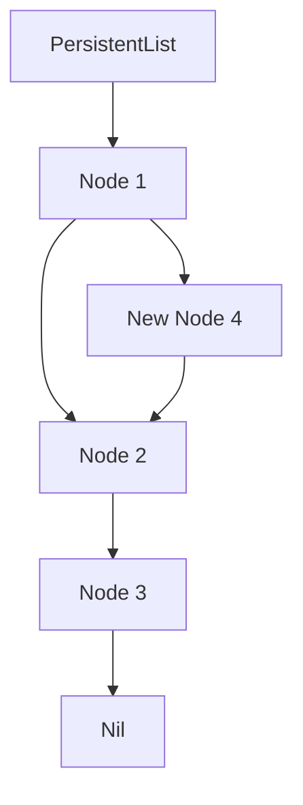

## 10.14 Functional Data Structures

In the realm of functional programming, data structures play a pivotal role in ensuring that applications are efficient, scalable, and maintainable. Functional data structures emphasize immutability and persistence, allowing developers to build applications that are easier to reason about and less prone to errors. In this section, we will delve into the world of functional data structures in Swift, exploring concepts such as persistent collections, immutable structures, and Swift's copy-on-write optimization.

### Intent

The primary intent of functional data structures is to leverage immutability and persistence to create robust and efficient applications. By using these structures, developers can:

- **Preserve Previous Versions**: Functional data structures allow you to maintain previous versions of data, making it easy to implement features like undo/redo and version control.
- **Avoid Mutable State**: Immutability reduces the risk of side effects and makes code easier to reason about.
- **Optimize Performance**: Swift's copy-on-write mechanism ensures that data is only copied when necessary, optimizing memory usage and performance.

### Implementing Functional Data Structures

#### Persistent Collections

Persistent collections are data structures that preserve previous versions of themselves when modified. This characteristic is particularly useful in scenarios where you need to track changes over time, such as in versioning systems or collaborative applications.

##### Example: Persistent List

A persistent list is a classic example of a functional data structure. Let's implement a simple persistent list in Swift:

```swift
// Define a Node class to represent each element in the list
class Node<T> {
    let value: T
    let next: Node<T>?

    init(value: T, next: Node<T>? = nil) {
        self.value = value
        self.next = next
    }
}

// Define a PersistentList class
class PersistentList<T> {
    private let head: Node<T>?

    init() {
        self.head = nil
    }

    private init(head: Node<T>?) {
        self.head = head
    }

    // Add a new element to the list
    func add(_ value: T) -> PersistentList<T> {
        return PersistentList(head: Node(value: value, next: head))
    }

    // Retrieve all elements as an array
    func toArray() -> [T] {
        var array: [T] = []
        var current = head
        while let node = current {
            array.append(node.value)
            current = node.next
        }
        return array
    }
}

// Usage
let list = PersistentList<Int>()
let list1 = list.add(1)
let list2 = list1.add(2)
let list3 = list2.add(3)

print(list.toArray())   // []
print(list1.toArray())  // [1]
print(list2.toArray())  // [2, 1]
print(list3.toArray())  // [3, 2, 1]
```

In this example, each `add` operation creates a new version of the list without modifying the original list, preserving its previous state.

#### Immutable Structures

Immutable structures are fundamental to functional programming as they prevent accidental changes to data, making your code more predictable and easier to debug.

##### Example: Immutable Point

Let's create an immutable `Point` structure in Swift:

```swift
struct Point {
    let x: Int
    let y: Int

    // Method to move the point
    func move(dx: Int, dy: Int) -> Point {
        return Point(x: x + dx, y: y + dy)
    }
}

// Usage
let point = Point(x: 0, y: 0)
let newPoint = point.move(dx: 5, dy: 10)

print("Original Point: (\\(point.x), \\(point.y))") // (0, 0)
print("New Point: (\\(newPoint.x), \\(newPoint.y))") // (5, 10)
```

In this example, the `Point` structure is immutable. The `move` method returns a new `Point` instance, leaving the original point unchanged.

#### Copy-on-Write

Swift's copy-on-write (COW) optimization allows value types to share storage until a mutation occurs, at which point a copy is made. This optimization is particularly useful for functional data structures as it combines immutability with efficiency.

##### Example: Copy-on-Write with Arrays

Let's explore how Swift's arrays use copy-on-write:

```swift
var array1 = [1, 2, 3]
var array2 = array1 // array2 shares storage with array1

array2.append(4) // array2 makes a copy before mutation

print("Array1: \\(array1)") // [1, 2, 3]
print("Array2: \\(array2)") // [1, 2, 3, 4]
```

In this example, `array2` shares storage with `array1` until it is modified. When `array2` is appended with `4`, a copy is made, ensuring that `array1` remains unchanged.

### Use Cases and Examples

Functional data structures are well-suited for a variety of use cases, including:

#### Versioning Systems

Functional data structures are ideal for implementing versioning systems, where you need to keep track of changes over time. By preserving previous versions of data, you can easily implement features like undo/redo.

#### Concurrency

In concurrent programming, sharing mutable state across threads can lead to race conditions and bugs. Functional data structures, with their immutable nature, allow data to be shared across threads without the need for locks, simplifying concurrency management.

#### Undo/Redo Functionality

Functional data structures make it easy to implement undo/redo functionality. By maintaining a history of states, you can easily revert to previous states without complex state management logic.

### Visualizing Functional Data Structures

To better understand how functional data structures work, let's visualize a persistent list using a diagram:



In this diagram, we see a persistent list with nodes 1, 2, and 3. When a new node 4 is added, it creates a new version of the list, preserving the original structure.

### Swift Unique Features

Swift offers several unique features that make it an excellent choice for implementing functional data structures:

- **Value Semantics**: Swift's value types, such as structs and enums, naturally support immutability and copy-on-write, making them well-suited for functional programming.
- **Protocol-Oriented Programming**: Swift's protocol-oriented programming model allows you to define flexible and reusable functional data structures.
- **Generics**: Swift's powerful generics system enables you to create type-safe and reusable data structures.

### Differences and Similarities

Functional data structures are often compared to traditional data structures. Here are some key differences and similarities:

- **Immutability**: Functional data structures are immutable, whereas traditional data structures often rely on mutable state.
- **Persistence**: Functional data structures preserve previous versions, while traditional data structures typically do not.
- **Performance**: Functional data structures may have different performance characteristics due to their immutability and persistence.

### Design Considerations

When implementing functional data structures in Swift, consider the following:

- **Use Value Types**: Leverage Swift's value types and copy-on-write optimization to implement efficient functional data structures.
- **Optimize for Immutability**: Design your data structures to be immutable, reducing the risk of side effects.
- **Consider Performance**: Be mindful of performance trade-offs when using functional data structures, especially in performance-critical applications.

### Try It Yourself

To deepen your understanding of functional data structures, try modifying the code examples provided. Experiment with different data structures, such as trees or graphs, and implement features like undo/redo or versioning. Remember, the key to mastering functional data structures is practice and experimentation.

### Knowledge Check

Before we wrap up, let's pose some questions to reinforce your understanding of functional data structures:

- What are the benefits of using functional data structures?
- How does Swift's copy-on-write optimization work?
- What are some common use cases for functional data structures?

### Embrace the Journey

Exploring functional data structures in Swift is a rewarding journey that will enhance your programming skills and enable you to build more robust and efficient applications. Remember, this is just the beginning. As you progress, you'll discover new patterns and techniques that will further enrich your understanding of functional programming. Keep experimenting, stay curious, and enjoy the journey!

## Quiz Time!



### Which of the following is a key characteristic of functional data structures?

- [x] Immutability
- [ ] Mutability
- [ ] Volatility
- [ ] Instability

> **Explanation:** Functional data structures are characterized by their immutability, meaning they do not change state once created.

### What does Swift's copy-on-write optimization do?

- [x] Shares storage until a mutation occurs
- [ ] Always copies data immediately
- [ ] Prevents any data copying
- [ ] Forces data to be immutable

> **Explanation:** Swift's copy-on-write optimization shares storage between instances until a mutation occurs, at which point a copy is made.

### Which data structure is commonly used in versioning systems?

- [x] Persistent collections
- [ ] Mutable arrays
- [ ] Volatile lists
- [ ] Dynamic stacks

> **Explanation:** Persistent collections are commonly used in versioning systems because they preserve previous versions of data.

### How can functional data structures improve concurrency?

- [x] By sharing data across threads without locks
- [ ] By increasing mutable state
- [ ] By requiring more locks
- [ ] By reducing thread safety

> **Explanation:** Functional data structures, being immutable, allow data to be shared across threads without the need for locks, improving concurrency.

### What is a benefit of using immutable structures?

- [x] Easier to reason about code
- [ ] Increased complexity
- [x] Reduced risk of side effects
- [ ] More mutable state

> **Explanation:** Immutable structures make code easier to reason about and reduce the risk of side effects.

### Which Swift feature is particularly useful for functional data structures?

- [x] Value semantics
- [ ] Reference semantics
- [ ] Dynamic typing
- [ ] Global variables

> **Explanation:** Swift's value semantics, which include structs and enums, are particularly useful for functional data structures due to their immutability and copy-on-write behavior.

### What is a common use case for functional data structures?

- [x] Undo/redo functionality
- [ ] Increasing mutable state
- [x] Versioning systems
- [ ] Reducing performance

> **Explanation:** Functional data structures are commonly used in undo/redo functionality and versioning systems because they preserve previous states.

### What is a potential trade-off when using functional data structures?

- [x] Performance
- [ ] Increased mutability
- [ ] Reduced immutability
- [ ] More side effects

> **Explanation:** Functional data structures may have different performance characteristics due to their immutability and persistence.

### Which Swift feature supports protocol-oriented programming?

- [x] Protocols
- [ ] Classes
- [ ] Global variables
- [ ] Dynamic typing

> **Explanation:** Swift's protocol-oriented programming model supports the use of protocols to define flexible and reusable functional data structures.

### True or False: Functional data structures are always mutable.

- [ ] True
- [x] False

> **Explanation:** Functional data structures are typically immutable, meaning they do not change state once created.




