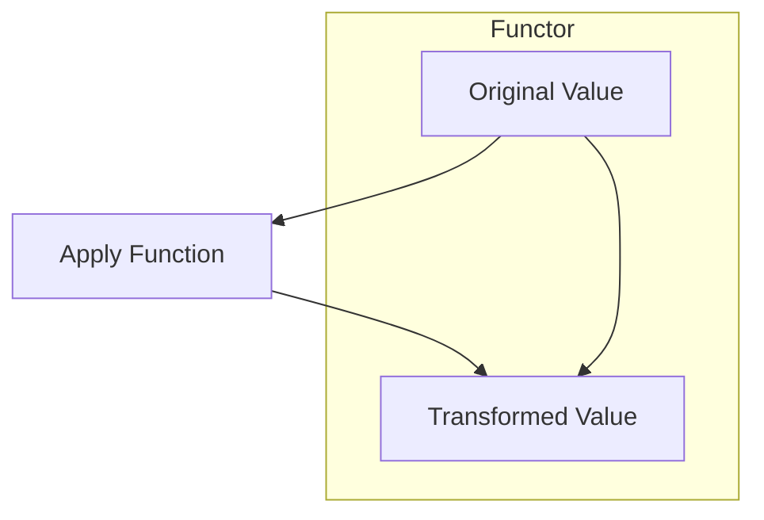
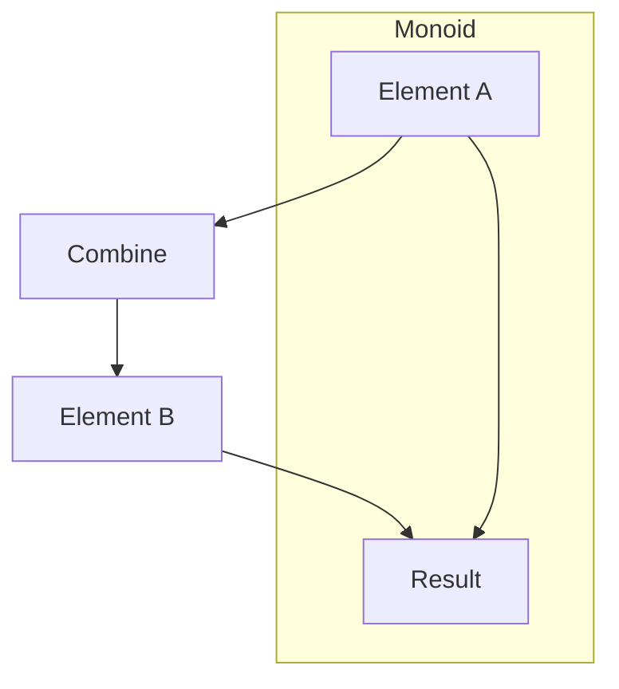
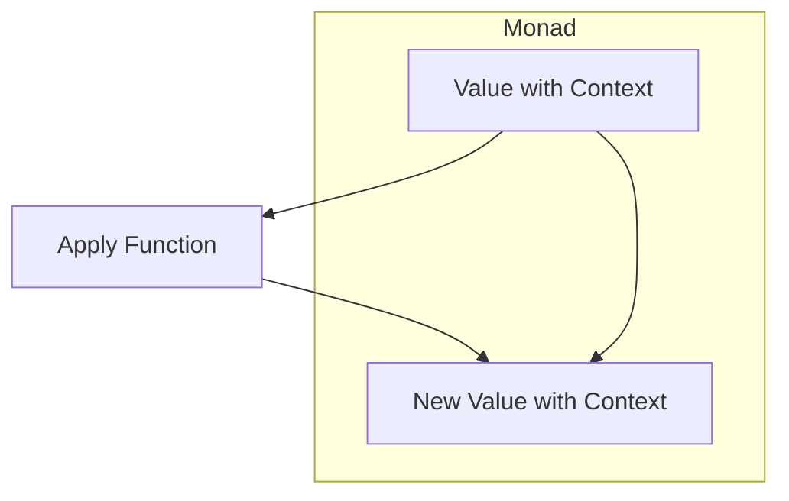

## 10.15 Applying Category Theory Concepts

As Swift developers, we constantly seek ways to enhance code abstraction and composability. Category theory, a branch of mathematics, provides a robust framework for structuring and organizing code in a way that promotes reusability and maintainability. In this section, we'll delve into some key concepts from category theory—functors, monoids, and monads—and explore how they can be applied in Swift to elevate your programming skills.

### Understanding Category Theory in Programming

Category theory offers a high-level abstraction that can be particularly useful in functional programming. Let's break down some of its core concepts and see how they relate to programming.

#### Functors

**Intent**: Functors map between categories while preserving the structure of the data. In programming, they allow us to apply a function over a wrapped value.

**Definition**: A functor is a type that implements the `map` function, which applies a given function to the wrapped value.

**Example**: In Swift, the `Array` and `Optional` types are functors because they implement the `map` method.

```swift
let numbers = [1, 2, 3, 4]
let squaredNumbers = numbers.map { $0 * $0 }
print(squaredNumbers) // Output: [1, 4, 9, 16]

let optionalValue: Int? = 5
let squaredOptional = optionalValue.map { $0 * $0 }
print(squaredOptional) // Output: Optional(25)
```

**Visualization**:



#### Monoids

**Intent**: Monoids are structures with an associative binary operation and an identity element, providing a way to combine values.

**Definition**: A monoid consists of a set equipped with a binary operation (e.g., addition) that is associative and an identity element (e.g., zero for addition).

**Example**: In Swift, strings can be considered monoids with concatenation as the operation and an empty string as the identity element.

```swift
let strings = ["Hello", " ", "World"]
let concatenatedString = strings.reduce("") { $0 + $1 }
print(concatenatedString) // Output: "Hello World"
```

**Visualization**:



#### Applicatives and Monads

**Intent**: Applicatives and monads are abstractions for sequencing computations, providing a way to handle operations that involve context, such as optionality or asynchronous tasks.

**Definition**: 
- **Applicatives** allow functions that take multiple arguments to be applied to wrapped values.
- **Monads** extend applicatives by providing the `flatMap` (or `bind`) function, enabling chaining of operations.

**Example**: Swift's `Optional` and `Array` types are monads because they implement `flatMap`.

```swift
let optionalValue1: Int? = 5
let optionalValue2: Int? = nil

let result = optionalValue1.flatMap { value1 in
    optionalValue2.map { value2 in
        value1 + value2
    }
}
print(result) // Output: nil
```

**Visualization**:



### Applying Concepts in Swift

Now that we have a basic understanding of these concepts, let's explore how they can be applied in Swift.

#### Implementing Protocols

**Intent**: Define abstractions that encapsulate category theory concepts to enhance code modularity and reusability.

**Example**: Create a `Functor` protocol in Swift.

```swift
protocol Functor {
    associatedtype A
    associatedtype B
    func fmap(_ transform: (A) -> B) -> Self
}

extension Array: Functor {
    func fmap<T>(_ transform: (Element) -> T) -> [T] {
        return self.map(transform)
    }
}
```

#### Using Standard Types

**Intent**: Recognize standard Swift types like `Optional` and `Array` as monads to leverage their powerful abstractions.

**Example**: Use `Optional` as a monad for error handling.

```swift
func divide(_ numerator: Int, by denominator: Int) -> Int? {
    guard denominator != 0 else { return nil }
    return numerator / denominator
}

let result = divide(10, by: 2).flatMap { divide($0, by: 2) }
print(result) // Output: Optional(2)
```

### Use Cases and Examples

#### Complex Data Flows

**Intent**: Model and compose transformations using category theory concepts to handle complex data flows elegantly.

**Example**: Use `map` and `flatMap` to transform and filter data in a pipeline.

```swift
let data = [1, 2, 3, 4, 5]
let transformedData = data.map { $0 * 2 }.flatMap { $0 % 2 == 0 ? Optional($0) : nil }
print(transformedData) // Output: [4, 8]
```

#### Error Handling

**Intent**: Use monadic patterns to manage errors elegantly without cluttering the code with error checks.

**Example**: Chain operations using `Optional` to handle potential errors.

```swift
func fetchData() -> String? {
    return "Data"
}

func processData(_ data: String) -> String? {
    return data.isEmpty ? nil : "Processed \\(data)"
}

let finalResult = fetchData().flatMap(processData)
print(finalResult) // Output: Optional("Processed Data")
```

#### Composable APIs

**Intent**: Design libraries that are highly modular and composable using category theory concepts.

**Example**: Create a composable API for data transformation.

```swift
struct Transformer<Input, Output> {
    let transform: (Input) -> Output
    
    func compose<NewOutput>(_ other: Transformer<Output, NewOutput>) -> Transformer<Input, NewOutput> {
        return Transformer<Input, NewOutput> { input in
            other.transform(self.transform(input))
        }
    }
}

let stringToInt = Transformer<String, Int> { Int($0) ?? 0 }
let intToString = Transformer<Int, String> { "\\($0)" }

let composedTransformer = stringToInt.compose(intToString)
let result = composedTransformer.transform("123")
print(result) // Output: "123"
```

### Swift Unique Features

Swift's type system and protocol-oriented programming paradigm make it particularly well-suited for applying category theory concepts. Here are some unique features of Swift that facilitate this:

- **Generics**: Swift's powerful generics system allows us to define highly abstract and reusable components.
- **Protocol Extensions**: Enable us to provide default implementations for protocols, making it easier to define functors, monoids, and monads.
- **Value Semantics**: Swift's emphasis on value types (structs and enums) aligns well with the immutability often emphasized in functional programming.

### Differences and Similarities

Category theory concepts like functors, monoids, and monads can sometimes be confused with one another. Here's a quick comparison:

- **Functors vs. Monads**: While both functors and monads allow for mapping over wrapped values, monads provide additional capabilities for chaining operations through `flatMap`.
- **Monoids vs. Functors**: Monoids focus on combining values with an associative operation, while functors focus on applying functions to values within a context.

### Design Considerations

When applying category theory concepts in Swift, consider the following:

- **When to Use**: These concepts are particularly useful in scenarios involving complex data transformations, error handling, and API design.
- **Pitfalls**: Overuse or misuse of these abstractions can lead to overly complex code. Use them judiciously and ensure they add value to your codebase.

### Try It Yourself

To solidify your understanding, try modifying the code examples provided. For instance, experiment with creating your own functor or monad by implementing the necessary protocols and methods. Consider how you might use these concepts to simplify a complex data flow in your own projects.

### Embrace the Journey

Remember, mastering category theory concepts in Swift is a journey. As you continue to explore and experiment, you'll find new ways to apply these powerful abstractions to create more elegant and maintainable code. Keep experimenting, stay curious, and enjoy the journey!

## Quiz Time!



### What is a functor in programming?

- [x] A type that implements the `map` function
- [ ] A type that implements the `flatMap` function
- [ ] A type that implements the `reduce` function
- [ ] A type that implements the `filter` function

> **Explanation:** A functor is a type that implements the `map` function, allowing a function to be applied over a wrapped value.

### What is the identity element in a monoid?

- [x] An element that does not change other elements when combined
- [ ] An element that changes other elements when combined
- [ ] An element that is always zero
- [ ] An element that is always one

> **Explanation:** The identity element in a monoid is an element that does not change other elements when combined with them.

### Which Swift type is an example of a monad?

- [x] Optional
- [ ] String
- [ ] Int
- [ ] Bool

> **Explanation:** The `Optional` type in Swift is an example of a monad because it implements the `flatMap` function.

### What is the purpose of the `flatMap` function in a monad?

- [x] To chain operations by unwrapping and re-wrapping values
- [ ] To apply a function to each element in a collection
- [ ] To combine multiple values into one
- [ ] To filter values based on a condition

> **Explanation:** The `flatMap` function in a monad is used to chain operations by unwrapping and re-wrapping values.

### How can category theory concepts enhance Swift code?

- [x] By improving code abstraction and composability
- [ ] By making code more verbose
- [ ] By reducing code readability
- [ ] By complicating error handling

> **Explanation:** Category theory concepts enhance Swift code by improving abstraction and composability, making it more modular and maintainable.

### What is a key feature of Swift that supports category theory concepts?

- [x] Generics
- [ ] Inheritance
- [ ] Pointers
- [ ] Macros

> **Explanation:** Swift's powerful generics system supports the implementation of category theory concepts by allowing highly abstract and reusable components.

### Which concept allows functions to be applied over multiple wrapped values?

- [x] Applicatives
- [ ] Functors
- [ ] Monoids
- [ ] Strings

> **Explanation:** Applicatives allow functions that take multiple arguments to be applied to wrapped values.

### What is a common pitfall when using category theory concepts in Swift?

- [x] Overuse or misuse leading to complex code
- [ ] Making code too simple
- [ ] Eliminating all errors
- [ ] Increasing code verbosity

> **Explanation:** Overuse or misuse of category theory concepts can lead to overly complex code, so they should be used judiciously.

### What type of semantics does Swift emphasize that aligns with functional programming?

- [x] Value semantics
- [ ] Reference semantics
- [ ] Pointer semantics
- [ ] Object semantics

> **Explanation:** Swift emphasizes value semantics, which aligns well with the immutability often emphasized in functional programming.

### True or False: Functors and monads are the same.

- [ ] True
- [x] False

> **Explanation:** Functors and monads are not the same. While both allow for mapping over wrapped values, monads provide additional capabilities for chaining operations through `flatMap`.



---


